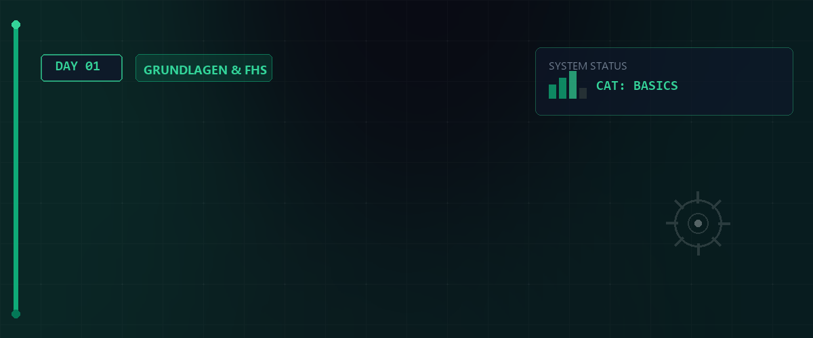

# 🐧 Linux Essentials - Tag 01



Willkommen zum ersten Tag der Linux Essentials. Heute legen wir das Fundament für die Arbeit mit Linux-Systemen, erkunden die Shell und lernen die grundlegende Dateisystemstruktur kennen.

---

## 📑 Inhaltsverzeichnis

- [🐧 Linux Essentials - Tag 01](#-linux-essentials---tag-01)
  - [📑 Inhaltsverzeichnis](#-inhaltsverzeichnis)
  - [📜 Hintergrund & Historie](#-hintergrund--historie)
    - [Philosophie & Open Source](#philosophie--open-source)
    - [Detaillierte Meilensteine](#detaillierte-meilensteine)
    - [Die Linux-Hauptfamilien](#die-linux-hauptfamilien)
    - [Enterprise-Systeme & Marktanteil](#enterprise-systeme--marktanteil)
    - [Der Fokus: Rocky Linux (Red Hat Familie)](#der-fokus-rocky-linux-red-hat-familie)
  - [🐚 Einführung in die Shell](#-einführung-in-die-shell)
    - [Die Ebenen des Systems](#die-ebenen-des-systems)
    - [Bekannte Shell-Varianten](#bekannte-shell-varianten)
    - [Systemarchitektur & Philosophie](#systemarchitektur--philosophie)
    - [Erste Schritte](#erste-schritte)
  - [📂 Navigation \& Dateisystem](#-navigation--dateisystem)
    - [Wichtige Konzepte](#wichtige-konzepte)
    - [Befehle zur Navigation](#befehle-zur-navigation)
  - [🏗 Filesystem Hierarchy Standard (FHS)](#-filesystem-hierarchy-standard-fhs)
  - [👤 Benutzeridentität \& Berechtigungen](#-benutzeridentität--berechtigungen)
  - [🛠 Hilfreiche Utilities & Pipelining](#-hilfreiche-utilities--pipelining)
    - [Die drei Standard-Datenströme](#die-drei-standard-datenströme)
    - [Pipelining & Redirection](#pipelining--redirection)
    - [Logische Operatoren (Befehlsketten)](#logische-operatoren-befehlsketten)
    - [Fortgeschrittene Redirection](#fortgeschrittene-redirection)
    - [Text-Utilities](#text-utilities)
  - [⚙ Systempflege \& Befehlsübersicht](#-systempflege--befehlsübersicht)
    - [System-Updates (DNF / Rocky Linux)](#system-updates-dnf--rocky-linux)
    - [Hilfe \& Information](#hilfe--information)
    - [Überprüfung \& Sicherheit](#überprüfung--sicherheit)
  - [📚 Ressourcen \& Dokumente](#-ressourcen--dokumente)

---

## 📜 Hintergrund & Historie

Linux ist weit mehr als nur ein Betriebssystem; es ist das Ergebnis einer jahrzehntelangen Entwicklung, die auf der Unix-Philosophie basiert.

### Philosophie & Open Source

- **GNU-Projekt (1983):** Richard Stallman startete das GNU-Projekt, um eine freie Alternative zu Unix zu schaffen. "GNU" steht rekursiv für "GNU's Not Unix".
- **GPL (General Public License):** Die Lizenz nutzt das "Copyleft"-Prinzip: Jeder, der Software verändert oder verbreitet, muss diese unter denselben freien Bedingungen weitergeben.
- **Der Linux-Kernel (1991):** Linus Torvalds, ein finnischer Student, schrieb den Kernel als Hobbyprojekt. Er entschied sich später für die GPL, was den entscheidenden Durchbruch für die Zusammenarbeit bedeutete.
- **Die Naming-Kontroverse:** Da das System aus dem Linux-Kernel und den GNU-Systemwerkzeugen besteht, plädiert die Free Software Foundation (FSF) für den Namen **GNU/Linux**.
- **Entwicklungsmodell (Bazaar vs. Cathedral):** Linux ist das Paradebeispiel für das "Bazaar"-Modell: Offene, dezentrale Entwicklung durch Tausende Freiwillige weltweit, im Gegensatz zum geschlossenen "Cathedral"-Modell klassischer Software.
- **Unix-Wars & POSIX:** In den 80ern/90ern bekriegten sich Hersteller (Sun, HP, IBM) mit eigenen Unix-Derivaten. Linux bot eine stabile, kostenlose und POSIX-konforme Alternative, die diesen Streit beendete.

> [!IMPORTANT]  
> **LPIC-1 RELEVANTES PRÜFUNGSWISSEN - POSIX Standards:**  
> **POSIX (Portable Operating System Interface)** standardisiert Betriebssystemschnittstellen (Systemaufrufe, Shell, Utilities). LPIC-Fragen zielen oft darauf ab, warum POSIX-Konformität wichtig ist: Sie garantiert die **Portabilität** von C-Programmen und Shell-Skripten über verschiedene Unix-Derivate (Linux, BSD, macOS) hinweg.  

> [!NOTE]  
> Richard Stallmans GPL-Philosophie verlangt das **Copyleft**-Prinzip: Jede veränderte Version einer unter GPL stehenden Software muss ebenfalls unter der GPL (freier Quellcode) veröffentlicht werden. Dies verhindert eine proprietäre Verwertung freier Software.

### Detaillierte Meilensteine

| Jahr | Ereignis | Bedeutung |
| :--- | :--- | :--- |
| **1969** | Entstehung von **Unix** | Entwickelt bei AT&T (Bell Labs) durch Dennis Ritchie und Ken Thompson. |
| **1972** | Sprache **C** | Veröffentlichung durch Ritchie & Kernighan; Basis für die Portabilität von Unix. |
| **1983** | **GNU** Projekt | Startschuss für freie Software durch Richard Stallman ("GNU's Not Unix"). |
| **1991** | **Linux-Kernel** | Linus Torvalds veröffentlicht die erste Version des Kernels via Usenet. |
| **1993** | Debian & Slackware | Gründung der ersten großen Distributionen, die das Fundament für heutige Systeme legten. |
| **1994** | Red Hat Linux | Start der kommerziell erfolgreichsten Enterprise-Distribution. |
| **2004** | Ubuntu | Markteintritt der Distribution, die Linux durch Benutzerfreundlichkeit massentauglich machte. |
| **2005** | **Git** | Linus Torvalds entwickelt Git innerhalb von zwei Wochen zur Verwaltung des Kernels. |
| **2007** | **Android** | Google stellt Android vor – Linux erobert den mobilen Sektor und wird das meistgenutzte OS. |
| **2013** | **Docker** | Start der Container-Revolution; Linux wird zur Basis moderner Cloud-Native Anwendungen. |
| **2014** | **Systemd** | Großflächige Einführung des neuen Init-Systems (RHEL 7), was die Boot-Architektur modernisierte. |
| **2021** | **Rocky Linux** | Nach dem Ende von CentOS (Stable) füllt Rocky die Lücke für freien Enterprise-Ersatz. |
| **Heute** | Cloud & KI | Linux ist der Motor hinter AWS, Azure und fast allen KI-Infrastrukturen weltweit. |

### Die Linux-Hauptfamilien

Linux-Systeme werden in "Familien" unterteilt, die sich primär durch ihren Paketmanager und ihre Philosophie unterscheiden:

| Familie | Fokus | Paketmanager | Bekannte Vertreter |
| :--- | :--- | :--- | :--- |
| **Debian** | Stabilität & Community | APT, dpkg | Debian, Ubuntu, Linux Mint, Kali Linux |
| **Red Hat** | Enterprise & Support | DNF, rpm | RHEL, Fedora, **Rocky Linux**, AlmaLinux |
| **Arch** | Minimalismus (KISS) | Pacman | Arch Linux, Manjaro, EndeavourOS |
| **SUSE** | Business & Tools | Zypper, rpm | openSUSE, SUSE Enterprise |
| **Slackware** | Tradition (Unix-nah) | pkgtools | Slackware |
| **Independent** | Spezialisierung | Variiert | Gentoo (Source-based), Alpine, NixOS |

### Enterprise-Systeme & Marktanteil

Linux ist das absolute Fundament moderner IT-Infrastruktur:

- **Cloud Computing:** Basis für AWS, Azure und Google Cloud.
- **Supercomputing:** Betreibt exakt 500 der 500 leistungsstärksten Rechner der Welt.
- **Embedded & Mobile:** Grundlage für Android, Smart-Home-Geräte und IoT.
- **Stabilität:** Enterprise-Systeme garantieren Sicherheitsupdates für bis zu 10 Jahre.

### Der Fokus: Rocky Linux (Red Hat Familie)

In diesem Kurs nutzen wir **Rocky Linux**, einen direkten Nachfolger des klassischen CentOS.

- **Binary Compatible:** 1:1 kompatibel mit Red Hat Enterprise Linux (RHEL).
- **DNF Paketmanager:** Modernes Werkzeug zur Softwareverwaltung.
- **Sicherheit:** Fokus auf gehärtete Umgebungen (SELinux) und Langzeitstabilität.

---

## 🐚 Einführung in die Shell

Die Shell ist das primäre Interface für die Interaktion mit dem Linux-Kern. Wir nutzen standardmäßig die `bash`.

### Die Ebenen des Systems

Linux ist wie eine Zwiebel aufgebaut. Jede Ebene baut auf der anderen auf:

1. **Hardware:** Die physischen Komponenten (CPU, RAM, HDD).
2. **Kernel:** Der Kern, der die Hardware verwaltet und den Programmen Zugriff darauf gewährt.
3. **Shell:** Der Kommandozeileninterpreter (Interface zwischen User und Kernel).
4. **Applikationen:** Browser, Editoren, Dateimanager etc.

### Bekannte Shell-Varianten

| Shell | Name | Merkmale |
| :--- | :--- | :--- |
| **sh** | Bourne Shell | Die klassische Unix-Shell. Schnell, aber wenig Komfort. |
| **bash** | Bourne Again Shell | Der Standard unter fast allen Linux-Systemen. |
| **zsh** | Z-Shell | Sehr mächtig, viele Plugins (Oh My Zsh), Standard unter macOS. |
| **fish** | Friendly Interactive Shell | Fokus auf Benutzerfreundlichkeit und Auto-Vorschläge. |

### Systemarchitektur & Philosophie

- **Monolithischer Kernel:** Im Gegensatz zu Micro-Kernels laufen Treiber und Dateisysteme bei Linux direkt im Kernel-Adressraum, was eine extrem hohe Performance ermöglicht.
- **Alles ist eine Datei (Everything is a file):** Eines der wichtigsten Konzepte. Ob Festplatte (`/dev/sda`), Tastatur oder ein Verzeichnis – für das System ist alles ein Datenstrom, der gelesen oder beschrieben werden kann.
- **Shell-Konfiguration:** Die Shell wird über versteckte Dateien (Dotfiles) gesteuert:
  - `.bashrc`: Konfiguration für interaktive Shells (Aliase, Prompt).
  - `.bash_profile`: Wird beim Login ausgeführt.
- **Aliase:** Abkürzungen für lange Befehle (z.B. `alias ll='ls -al'`).
- **Umgebungsvariablen:** Speichern wichtige Systempfade, z.B. `$PATH` (Wo das System nach Befehlen sucht) oder `$HOME`.

**Wichtige Systemvariablen:**

| Variable | Bedeutung |
| :--- | :--- |
| `$PATH` | Liste von Verzeichnissen mit ausführbaren Programmen. |
| `$USER` | Der aktuell angemeldeter Benutzername. |
| `$SHELL` | Der Pfad zur aktuell verwendeten Shell. |
| `$PWD` | Das aktuelle Arbeitsverzeichnis. |

### Erste Schritte

| Befehl | Funktion |
| :--- | :--- |
| `echo $0` | Zeigt die aktuell verwendete Shell an. |
| `echo 'Text'` | Gibt Text auf der Konsole aus. |
| `history` | Zeigt den Verlauf der bisher eingegebenen Befehle an. |
| `clear` | Leert die Konsolenausgabe. |
| `uname -a` | Zeigt alle wichtigen Systeminformationen an (Kernel-Version, Hostname). |

> [!TIP]
> Nutzen Sie `history | less`, um bequem durch eine lange Liste von Befehlen zu blättern.

---

## 📂 Navigation & Dateisystem

Das Verständnis der Verzeichnisstruktur ist essenziell für die Arbeit unter Linux.

### Wichtige Konzepte

| Konzept | Beschreibung |
| :--- | :--- |
| **Absolute Pfade** | Beginnen immer bei der Wurzel `/` (z.B. `/home/user/Dokumente`). |
| **Relative Pfade** | Beziehen sich auf das aktuelle Verzeichnis (z.B. `./Neu` oder `../`). |
| **Home-Verzeichnis** | Abgekürzt durch die Tilde `~`. |

### Befehle zur Navigation

| Befehl | Funktion |
| :--- | :--- |
| `pwd` | Print Working Directory. Zeigt den absoluten Pfad des aktuellen Verzeichnisses an. |
| `ls -al` | Zeigt alle Dateien (auch versteckte) mit detaillierten Rechten an. |
| `cd ~` | Wechselt in das eigene Home-Verzeichnis. |
| `cd /` | Wurzelverzeichnis (Root). |
| `cd ..` | Wechselt eine Verzeichnisebene nach oben. |
| `mkdir` | Erstellt ein neues Verzeichnis. |
| `stat <Datei>` | Zeigt detaillierte Informationen über eine Datei oder ein Verzeichnis. |

---

## 🏗 Filesystem Hierarchy Standard (FHS)

Linux folgt dem **Filesystem Hierarchy Standard (FHS)**. Jedes Verzeichnis hat eine spezifische Aufgabe:

| Verzeichnis | Inhalt und Funktion |
| :--- | :--- |
| `/` | Wurzelverzeichnis. Die höchste Ebene im Dateisystem. Alle anderen Verzeichnisse sind diesem untergeordnet. |
| `/bin` | Wichtige ausführbare Programme und grundlegende Befehle für alle Benutzer. |
| `/boot` | Statische Dateien des Bootloaders und der kompilierte Linux Kernel. |
| `/dev` | Gerätedateien. Physische und virtuelle Hardwarekomponenten werden hier als Dateien repräsentiert. |
| `/etc` | Systemweite Konfigurationsdateien und lokale Skripte für den Systemstart. |
| `/home` | Benutzerverzeichnisse. Speichert persönliche Dokumente und benutzerspezifische Programmeinstellungen. |
| `/lib` | Essenzielle Systembibliotheken und Kernelmodule. Diese werden von Binärdateien in `/bin` und `/sbin` zwingend benötigt. |
| `/lib32` | 32 Bit Systembibliotheken. |
| `/lib64` | 64 Bit Systembibliotheken. |
| `/media` | Automatische Einhängepunkte für erkannte Wechseldatenträger wie USB Sticks oder externe Festplatten. |
| `/mnt` | Temporäre Einhängepunkte für manuell verbundene Dateisysteme durch den Administrator. |
| `/opt` | Zusätzliche Anwendungsprogramme und Softwarepakete von Drittanbietern. |
| `/proc` | Virtuelles Dateisystem. Beinhaltet Laufzeitinformationen über aktive Systemprozesse und den Kernel. |
| `/root` | Eigenes Home Verzeichnis des Systemadministrators Root. |
| `/run` | Temporäre Laufzeitdaten aktiver Prozesse. Dieses Verzeichnis wird bei jedem Systemstart vollständig geleert. |
| `/sbin` | Administrative Systemprogramme für die Systemverwaltung. Primär für den Administrator ausführbar. |
| `/srv` | Spezifische Daten für vom System bereitgestellte Dienste wie Webserver oder FTP Server. |
| `/sys` | Virtuelles Dateisystem zur Interaktion mit Hardwareinformationen und Treibereinstellungen des Kernels. |
| `/tmp` | Speicherort für temporäre Dateien. Von Programmen erstellt und periodisch oder beim Systemstart bereinigt. |
| `/usr` | Sekundäre Hierarchie für schreibgeschützte Anwenderdaten. Beinhaltet Benutzerprogramme, Bibliotheken und Dokumentationen. |
| `/usr/local` | Speicherort für lokale Softwareinstallationen durch den Systemadministrator zum Schutz vor Überschreibungen bei Systemupdates. |
| `/var` | Variable Systemdaten. Umfasst Systemprotokolle, Cache Dateien, Datenbanken und Spool Daten für Drucker. |

> [!NOTE]  
> Details zum FHS finden Sie in den bereitgestellten Dokumenten im [Assets](./assets)-Ordner.  

> [!IMPORTANT]  
> **LPIC-1 RELEVANTES PRÜFUNGSWISSEN - Virtuelle und Variable Verzeichnisse:**  
> 1. **`/proc` und `/sys`** sind virtuelle Dateisysteme (procfs & sysfs). Sie liegen ausschließlich im Arbeitsspeicher (RAM) und belegen keinen Speicherplatz auf der Festplatte. Sie dienen als Schnittstelle zum Kernel und zur Hardware (z.B. `/proc/cpuinfo` oder `/proc/meminfo`).  
> 2. **`/var`** enthält volatile (variable) Daten wie Logfiles (`/var/log`), Spool-Dienste (`/var/spool`) und Mailboxen. Wenn Sie ein System härten, sollte `/var` oft auf einer separaten Partition liegen, damit überlaufende Logs nicht das `/` (Root-Dateisystem) blockieren.  
> 3. **`/etc`** ist ausschließlich für statische, systemweite Konfigurationsdateien reserviert (keine ausführbaren Programme!).  

> [!WARNING]  
> Das Verzeichnis `/tmp` wird auf vielen modernen Distributionen als `tmpfs` (im Arbeitsspeicher) gemountet oder beim Systemstart gelöscht. Speichern Sie hier niemals permanente Daten!

---

## 👤 Benutzeridentität & Berechtigungen

Linux ist ein Mehrbenutzersystem. Sicherheit und Identität spielen eine zentrale Rolle.

| Befehl / Datei | Funktion |
| :--- | :--- |
| `id` | Zeigt die Benutzer-ID (UID) und Gruppenzugehörigkeiten an. |
| `su -` | Switch User. Wechselt den Benutzer (meist zu Root) inkl. Umgebung. |
| `sudo` | Führt Befehle mit Administratorrechten aus. |
| `/etc/passwd` | Enthält Informationen zu den Benutzerkonten. |
| `/etc/shadow` | Speichert die gehashten (verschlüsselten) Passwörter. |
| `users` | Zeigt alle aktuell angemeldeten Benutzer an. |

---

## 🛠 Hilfreiche Utilities & Pipelining

Befehle lassen sich kombinieren, um komplexe Aufgaben zu lösen. Dies basiert auf dem concept der **Standard-Datenströme**.

### Die drei Standard-Datenströme

| ID | Name | Beschreibung |
| :---: | :--- | :--- |
| **0** | **stdin** | Standard-Eingabe (Tastatur). |
| **1** | **stdout** | Standard-Ausgabe (Terminal). |
| **2** | **stderr** | Standard-Fehlerausgabe (Terminal). |

### Pipelining & Redirection

| Operator | Funktion | Beispiel |
| :---: | :--- | :--- |
| `\|` | **Pipe**: Übergibt stdout von Befehl A als stdin an Befehl B. | `ls \| wc -l` |
| `>` | **Redirection**: Schreibt stdout in eine Datei (überschreibt Inhalt). | `date > zeit.txt` |
| `>>` | **Append**: Hängt stdout an eine Datei an. | `uptime >> log.txt` |
| `<` | **Input**: Liest stdin aus einer Datei statt von der Tastatur. | `wc -l < liste.txt` |
| `2>` | **Error Redirect**: Leitet nur Fehlermeldungen (stderr) in eine Datei. | `ls /root 2> error.log` |
| `&>` | **All Redirect**: Leitet sowohl stdout als auch stderr um. | `cmd &> all.log` |

### Logische Operatoren (Befehlsketten)

Operatoren ermöglichen es, Befehle abhängig vom Erfolg des vorherigen Befehls auszuführen. Ein Befehl gilt als erfolgreich, wenn sein **Exit-Code** `0` ist.

| Operator | Logik | Beschreibung |
| :---: | :--- | :--- |
| `;` | **Sequenz** | Führt Befehle nacheinander aus, egal ob der erste klappt. |
| `&&` | **Logisches UND** | Führt den zweiten Befehl nur aus, wenn der erste **erfolgreich** (Exit-Code 0) war. |
| `\|\|` | **Logisches ODER** | Führt den zweiten Befehl nur aus, wenn der erste **fehlgeschlagen** ist. |

### Fortgeschrittene Redirection

Manchmal möchte man Ausgaben komplett unterdrücken oder Ströme zusammenführen.

- `2>&1`: Leitet stderr (File Descriptor 2) in den stdout-Kanal (File Descriptor 1) um (beide landen im selben Terminal/File).
- `&>`: Moderne Kurzform in der Bash für die Umleitung von stdout und stderr in ein gemeinsames Ziel.

> [!IMPORTANT]  
> **LPIC-1 RELEVANTES PRÜFUNGSWISSEN - I/O Umleitungen:**  
> * **Standard-Kanäle und FDs:** `0` = stdin, `1` = stdout, `2` = stderr.  
> * **Reihenfolge der Umleitung:** Die klassische Umleitung `> datei.log 2>&1` funktioniert, weil zuerst stdout in `datei.log` geleitet wird und danach stderr auf denselben Stream wie stdout gelegt wird. Ein `2>&1 > datei.log` funktioniert **nicht** wie gewünscht (stderr landet weiterhin auf dem Terminal!).  
> * **Das Bit-Loch `/dev/null`:** Ein virtuelles Null-Device. Alles, was dorthin gesendet wird, wird gelöscht. Beispiel: `befehl > /dev/null 2>&1` (unterdrückt jegliche Ausgabe, sowohl Erfolg als auch Fehler).  

> [!TIP]  
> Nutzen Sie den logischen Operator `&&`, um Befehle nur bei Erfolg auszuführen (z.B. `make && make install`), und `||` für Fehlerbehandlungen (z.B. `ping -c 1 host || echo "Host offline"`). Der Rückgabewert (Exit-Status) eines erfolgreichen Befehls ist immer `0`. Jeder Wert ungleich `0` (1-255) signalisiert einen Fehler.
- `/dev/null`: Das "schwarze Loch" von Linux. Alles, was hierher geleitet wird, wird gelöscht.
  - Beispiel: `ls /root 2> /dev/null` (Fehlermeldungen werden ignoriert).

**Praxisbeispiele:**

```bash
# Erstellt Ordner und wechselt nur hinein, wenn mkdir geklappt hat
mkdir Test && cd Test       

# Prüft Verbindung und gibt Fehler aus, falls Ping fehlschlägt
ping -c 1 google.com || echo "Netzwerkfehler" 

# Sucht nach einem Text und ignoriert alle Fehlermeldungen (z.B. "Permission Denied")
grep -r "Geheim" /etc 2> /dev/null
```

### Text-Utilities

- `cat`: Zeigt den Inhalt einer Datei an.
- `less`: Ein Pager, der das seitenweise Lesen von Texten ermöglicht.
- `wc` (Word Count): Zählt Zeilen (`-l`), Wörter (`-w`) oder Zeichen (`-m`).

---

## ⚙ Systempflege & Befehlsübersicht

Zum Abschluss haben wir uns mit der Aktualisierung des Systems und Datumsformaten beschäftigt.

### System-Updates (DNF / Rocky Linux)

```bash
sudo dnf update   # Paketquellen aktualisieren
sudo dnf upgrade  # Installierte Pakete aktualisieren
reboot            # System neu starten
```

### Hilfe & Information

| Befehl | Funktion |
| :--- | :--- |
| `man <Befehl>` | Öffnet das Handbuch (Manual) für einen Befehl. |
| `whatis <Befehl>` | Zeigt eine Kurzbeschreibung des Kommandos an. |
| `whereis <Befehl>` | Zeigt den Pfad zur Binärdatei, Source und Man-Page an. |
| `date +%F` | Gibt das aktuelle Datum im vollständigen Format aus. |

### Überprüfung & Sicherheit

Zur Validierung von Dateien (z.B. ISO-Images) nutzen wir Prüfsummen:

- `sha256sum -c <Datei>`: Überprüft eine Datei anhand einer SHA-256 Prüfsumme.

---

## 📚 Ressourcen & Dokumente

Im [Assets](./assets)-Verzeichnis finden Sie weiterführende Informationen:

- [FHS Linux Deutsch (PDF)](./assets/FHS-LinuxDeutsch.pdf)
- [FHS 3.0 Spezifikation (PDF)](./assets/fhs-3.0.pdf)
- [Linux Einführung & Infos (PDF)](./assets/LinuxEinf_Infos.pdf)

---

## 🔑 Keywords

| Keyword / Befehl | Erklärung |
| :--- | :--- |
| `sh` | Bourne Shell: Die klassische Unix-Shell. Schnell, aber mit geringem Komfort. |
| `bash` | Bourne Again Shell: Der Standard-Kommandozeileninterpreter unter fast allen Linux-Systemen. |
| `zsh` | Z-Shell: Sehr mächtige Shell mit weitreichenden Erweiterungsmöglichkeiten (z.B. Oh My Zsh). |
| `POSIX` | Portable Operating System Interface: Standardisierungs-Richtlinie für die Portabilität von Software über Unix-Systeme. |
| `Copyleft` | GPL-Lizenzprinzip, das verlangt, dass modifizierter Code freier Software ebenfalls Open Source bleiben muss. |

---

## 🧠 LPIC-1 Relevanz & Wissenstest

<details>
<summary><b>Fragen zu Einführung & Installation (Klicken zum Ausklappen)</b></summary>

1. **Wer startete das GNU-Projekt und wofür steht GNU?**
   <details><summary>Antwort</summary>Richard Stallman startete das GNU-Projekt 1983. GNU steht rekursiv für "GNU's Not Unix".</details>

2. **Welches Lizenzprinzip schützt GPL-Software vor proprietärer Verwertung?**
   <details><summary>Antwort</summary>Das **Copyleft**-Prinzip. Es verlangt, dass abgeänderte Versionen der Software unter denselben freien Lizenzbedingungen stehen.</details>

3. **Was ist der Unterschied zwischen einem LTS- und einem Rolling-Release-Modell?**
   <details><summary>Antwort</summary>**LTS (Long Term Support)** setzt auf Langzeitstabilität mit stabilen Paketversionen und rückportierten Sicherheitsfixes. **Rolling Release** aktualisiert Pakete kontinuierlich und bietet stets die neueste Software.</details>

4. **Was besagt die POSIX-Konformität?**
   <details><summary>Antwort</summary>Sie definiert eine standardisierte Schnittstelle zwischen Betriebssystem und Anwendungssoftware. Dies garantiert die Portabilität von Programmen und Shell-Skripten über verschiedene Unix-Derivate hinweg.</details>

5. **In welchem virtuellen Verzeichnis im RAM liegen Informationen zur CPU?**
   <details><summary>Antwort</summary>In `/proc/cpuinfo`.</details>

</details>

---

## 🔗 Zurück zur Übersicht

* **Tag 02 (Die Linux-Philosophie & FHS):** [➡️ Tag 02](../Day_02/README.md)
* **Master-Repository:** [🌌 Zurück zum Master-Repository](../README.md)

---
*Erstellt & gepflegt von Tobias Boyke, Juni 2026.*
