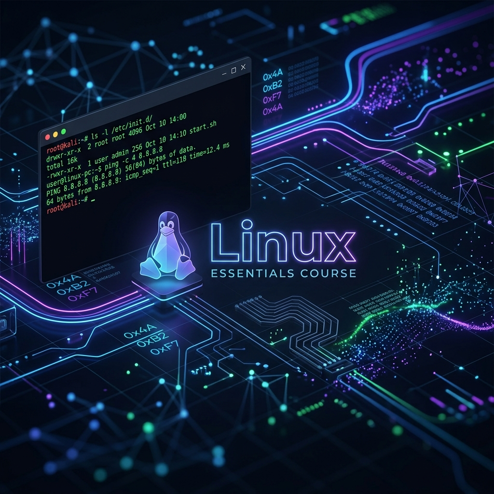

# 🐧 Linux Essentials - Tag 01



Willkommen zum ersten Tag der Linux Essentials. Heute legen wir das Fundament für die Arbeit mit Linux-Systemen, erkunden die Shell und lernen die grundlegende Dateisystemstruktur kennen.

---

## 📑 Inhaltsverzeichnis
- [🐧 Linux Essentials - Tag 01](#-linux-essentials---tag-01)
  - [📑 Inhaltsverzeichnis](#-inhaltsverzeichnis)
  - [📜 Hintergrund & Historie](#-hintergrund--historie)
    - [Philosophie & Open Source](#philosophie--open-source)
    - [Detaillierte Meilensteine](#detaillierte-meilensteine)
    - [Die Linux-Hauptfamilien](#die-linux-hauptfamilien)
    - [Enterprise-Systeme & Marktanteil](#enterprise-systeme--marktanteil)
    - [Der Fokus: Rocky Linux (Red Hat Familie)](#der-fokus-rocky-linux-red-hat-familie)
  - [🐚 Einführung in die Shell](#-einführung-in-die-shell)
    - [Systemarchitektur](#systemarchitektur)
    - [Erste Schritte](#erste-schritte)
  - [📂 Navigation \& Dateisystem](#-navigation--dateisystem)
    - [Wichtige Konzepte](#wichtige-konzepte)
    - [Befehle zur Navigation](#befehle-zur-navigation)
  - [🏗 Filesystem Hierarchy Standard (FHS)](#-filesystem-hierarchy-standard-fhs)
  - [👤 Benutzeridentität \& Berechtigungen](#-benutzeridentität--berechtigungen)
  - [🛠 Hilfreiche Utilities \& Pipelining](#-hilfreiche-utilities--pipelining)
    - [Pipelining \& Redirection](#pipelining--redirection)
    - [Text-Utilities](#text-utilities)
  - [⚙ Systempflege \& Befehlsübersicht](#-systempflege--befehlsübersicht)
    - [System-Updates (DNF / Rocky Linux)](#system-updates-dnf--rocky-linux)
    - [Hilfe \& Information](#hilfe--information)
    - [Überprüfung \& Sicherheit](#überprüfung--sicherheit)
  - [📚 Ressourcen \& Dokumente](#-ressourcen--dokumente)

---

## 📜 Hintergrund & Historie
Linux ist weit mehr als nur ein Betriebssystem; es ist das Ergebnis einer jahrzehntelangen Entwicklung, die auf der Unix-Philosophie basiert.

### Philosophie & Open Source
* **GNU-Projekt (1983):** Gegründet von Richard Stallman mit dem Ziel, ein freies, Unix-ähnliches Betriebssystem zu schaffen.
* **Open Source:** Der Quellcode ist unter der **GPL (General Public License)** frei einsehbar, auditierbar und modifizierbar.
* **Unix-Philosophie:** "Do one thing and do it well." – Komplexe Aufgaben werden durch das Kombinieren kleiner, spezialisierter Werkzeuge gelöst.

### Detaillierte Meilensteine
| Jahr | Ereignis | Bedeutung |
| :--- | :--- | :--- |
| **1969** | Entstehung von **Unix** | Entwickelt bei AT&T (Bell Labs) durch Dennis Ritchie und Ken Thompson. |
| **1972** | Sprache **C** | Veröffentlichung durch Ritchie & Kernighan; Basis für die Portabilität von Unix. |
| **1983** | **GNU** Projekt | Startschuss für freie Software durch Richard Stallman. |
| **1991** | **Linux-Kernel** | Linus Torvalds veröffentlicht die erste Version des Kernels. |
| **1993** | Debian & Slackware | Gründung der ersten großen Distributionen, die bis heute aktiv sind. |
| **1994** | Red Hat Linux | Start der kommerziell erfolgreichsten Enterprise-Distribution. |
| **2004** | Ubuntu | Markteintritt der Distribution, die Linux auf dem Desktop populär machte. |
| **Heute** | Cloud & Supercomputer | Linux betreibt 100% der Top-500 Supercomputer und das Gros der Cloud-Infrastruktur. |

### Die Linux-Hauptfamilien
Linux-Systeme werden in "Familien" unterteilt, die sich primär durch ihren Paketmanager und ihre Philosophie unterscheiden:

| Familie | Fokus | Paketmanager | Bekannte Vertreter |
| :--- | :--- | :--- | :--- |
| **Debian** | Stabilität & Community | APT, dpkg | Debian, Ubuntu, Linux Mint, Kali Linux |
| **Red Hat** | Enterprise & Support | DNF, rpm | RHEL, Fedora, **Rocky Linux**, AlmaLinux |
| **Arch** | Minimalismus (KISS) | Pacman | Arch Linux, Manjaro, EndeavourOS |
| **SUSE** | Business & Tools | Zypper, rpm | openSUSE, SUSE Enterprise |
| **Slackware** | Tradition (Unix-nah) | pkgtools | Slackware |
| **Independent** | Spezialisierung | Variiert | Gentoo (Source-based), Alpine, NixOS |

### Enterprise-Systeme & Marktanteil
Linux ist das absolute Fundament moderner IT-Infrastruktur:
* **Cloud Computing:** Basis für AWS, Azure und Google Cloud.
* **Supercomputing:** Betreibt exakt 500 der 500 leistungsstärksten Rechner der Welt.
* **Embedded & Mobile:** Grundlage für Android, Smart-Home-Geräte und IoT.
* **Stabilität:** Enterprise-Systeme garantieren Sicherheitsupdates für bis zu 10 Jahre.

### Der Fokus: Rocky Linux (Red Hat Familie)
In diesem Kurs nutzen wir **Rocky Linux**, einen direkten Nachfolger des klassischen CentOS.
* **Binary Compatible:** 1:1 kompatibel mit Red Hat Enterprise Linux (RHEL).
* **DNF Paketmanager:** Modernes Werkzeug zur Softwareverwaltung.
* **Sicherheit:** Fokus auf gehärtete Umgebungen (SELinux) und Langzeitstabilität.

---

## 🐚 Einführung in die Shell
Die Shell ist das primäre Interface für die Interaktion mit dem Linux-Kern. Wir nutzen standardmäßig die `bash`.

### Systemarchitektur
* **Monolithischer Kernel:** Linux nutzt eine Architektur mit dynamisch ladbaren Modulen.
* **Open Source:** Der Quellcode ist unter der GPL (General Public License) frei einsehbar und modifizierbar.

### Erste Schritte
| Befehl | Funktion |
| :--- | :--- |
| `echo $0` | Zeigt die aktuell verwendete Shell an. |
| `echo 'Text'` | Gibt Text auf der Konsole aus. |
| `history` | Zeigt den Verlauf der bisher eingegebenen Befehle an. |
| `clear` | Leert die Konsolenausgabe. |
| `uname -a` | Zeigt alle wichtigen Systeminformationen an (Kernel-Version, Hostname). |

> [!TIP]
> Nutzen Sie `history | less`, um bequem durch eine lange Liste von Befehlen zu blättern.

---

## 📂 Navigation & Dateisystem
Das Verständnis der Verzeichnisstruktur ist essenziell für die Arbeit unter Linux.

### Wichtige Konzepte
| Konzept | Beschreibung |
| :--- | :--- |
| **Absolute Pfade** | Beginnen immer bei der Wurzel `/` (z.B. `/home/user/Dokumente`). |
| **Relative Pfade** | Beziehen sich auf das aktuelle Verzeichnis (z.B. `./Neu` oder `../`). |
| **Home-Verzeichnis** | Abgekürzt durch die Tilde `~`. |

### Befehle zur Navigation
| Befehl | Funktion |
| :--- | :--- |
| `pwd` | Print Working Directory. Zeigt den absoluten Pfad des aktuellen Verzeichnisses an. |
| `ls -al` | Zeigt alle Dateien (auch versteckte) mit detaillierten Rechten an. |
| `cd ~` | Wechselt in das eigene Home-Verzeichnis. |
| `cd /` | Wechselt in das Wurzelverzeichnis (Root). |
| `cd ..` | Wechselt eine Verzeichnisebene nach oben. |
| `mkdir` | Erstellt ein neues Verzeichnis. |
| `stat <Datei>` | Zeigt detaillierte Informationen über eine Datei oder ein Verzeichnis. |

---

## 🏗 Filesystem Hierarchy Standard (FHS)
Linux folgt dem **Filesystem Hierarchy Standard (FHS)**. Jedes Verzeichnis hat eine spezifische Aufgabe:

| Verzeichnis | Inhalt und Funktion |
| :--- | :--- |
| `/` | Wurzelverzeichnis. Die höchste Ebene im Dateisystem. Alle anderen Verzeichnisse sind diesem untergeordnet. |
| `/bin` | Wichtige ausführbare Programme und grundlegende Befehle für alle Benutzer. |
| `/boot` | Statische Dateien des Bootloaders und der kompilierte Linux Kernel. |
| `/dev` | Gerätedateien. Physische und virtuelle Hardwarekomponenten werden hier als Dateien repräsentiert. |
| `/etc` | Systemweite Konfigurationsdateien und lokale Skripte für den Systemstart. |
| `/home` | Benutzerverzeichnisse. Speichert persönliche Dokumente und benutzerspezifische Programmeinstellungen. |
| `/lib` | Essenzielle Systembibliotheken und Kernelmodule. Diese werden von Binärdateien in `/bin` und `/sbin` zwingend benötigt. |
| `/lib32` | 32 Bit Systembibliotheken. |
| `/lib64` | 64 Bit Systembibliotheken. |
| `/media` | Automatische Einhängepunkte für erkannte Wechseldatenträger wie USB Sticks oder externe Festplatten. |
| `/mnt` | Temporäre Einhängepunkte für manuell verbundene Dateisysteme durch den Administrator. |
| `/opt` | Zusätzliche Anwendungsprogramme und Softwarepakete von Drittanbietern. |
| `/proc` | Virtuelles Dateisystem. Beinhaltet Laufzeitinformationen über aktive Systemprozesse und den Kernel. |
| `/root` | Eigenes Home Verzeichnis des Systemadministrators Root. |
| `/run` | Temporäre Laufzeitdaten aktiver Prozesse. Dieses Verzeichnis wird bei jedem Systemstart vollständig geleert. |
| `/sbin` | Administrative Systemprogramme für die Systemverwaltung. Primär für den Administrator ausführbar. |
| `/srv` | Spezifische Daten für vom System bereitgestellte Dienste wie Webserver oder FTP Server. |
| `/sys` | Virtuelles Dateisystem zur Interaktion mit Hardwareinformationen und Treibereinstellungen des Kernels. |
| `/tmp` | Speicherort für temporäre Dateien. Von Programmen erstellt und periodisch oder beim Systemstart bereinigt. |
| `/usr` | Sekundäre Hierarchie für schreibgeschützte Anwenderdaten. Beinhaltet Benutzerprogramme, Bibliotheken und Dokumentationen. |
| `/usr/local` | Speicherort für lokale Softwareinstallationen durch den Systemadministrator zum Schutz vor Überschreibungen bei Systemupdates. |
| `/var` | Variable Systemdaten. Umfasst Systemprotokolle, Cache Dateien, Datenbanken und Spool Daten für Drucker. |

> [!NOTE]
> Details zum FHS finden Sie in den bereitgestellten Dokumenten im [Assets](./assets)-Ordner.

---

## 👤 Benutzeridentität & Berechtigungen
Linux ist ein Mehrbenutzersystem. Sicherheit und Identität spielen eine zentrale Rolle.

| Befehl / Datei | Funktion |
| :--- | :--- |
| `id` | Zeigt die Benutzer-ID (UID) und Gruppenzugehörigkeiten an. |
| `su -` | Switch User. Wechselt den Benutzer (meist zu Root) inkl. Umgebung. |
| `sudo` | Führt Befehle mit Administratorrechten aus. |
| `/etc/passwd` | Enthält Informationen zu den Benutzerkonten. |
| `/etc/shadow` | Speichert die gehashten (verschlüsselten) Passwörter. |
| `users` | Zeigt alle aktuell angemeldeten Benutzer an. |

---

## 🛠 Hilfreiche Utilities & Pipelining
Befehle lassen sich kombinieren, um komplexe Aufgaben zu lösen.

### Pipelining & Redirection
- `|` (Pipe): Übergibt die Ausgabe eines Befehls als Eingabe an den nächsten.
- `>` (Redirection): Schreibt die Ausgabe eines Befehls in eine Datei (z.B. `history > log.txt`).

### Text-Utilities
- `cat`: Zeigt den Inhalt einer Datei an.
- `less`: Ein Pager, der das seitenweise Lesen von Texten ermöglicht.
- `wc` (Word Count): Zählt Zeilen (`-l`), Wörter (`-w`) oder Zeichen (`-m`).

---

## ⚙ Systempflege & Befehlsübersicht
Zum Abschluss haben wir uns mit der Aktualisierung des Systems und Datumsformaten beschäftigt.

### System-Updates (DNF / Rocky Linux)
```bash
sudo dnf update   # Paketquellen aktualisieren
sudo dnf upgrade  # Installierte Pakete aktualisieren
reboot            # System neu starten
```

### Hilfe & Information
| Befehl | Funktion |
| :--- | :--- |
| `man <Befehl>` | Öffnet das Handbuch (Manual) für einen Befehl. |
| `whatis <Befehl>` | Zeigt eine Kurzbeschreibung des Kommandos an. |
| `whereis <Befehl>` | Zeigt den Pfad zur Binärdatei, Source und Man-Page an. |
| `date +%F` | Gibt das aktuelle Datum im vollständigen Format aus. |

### Überprüfung & Sicherheit
Zur Validierung von Dateien (z.B. ISO-Images) nutzen wir Prüfsummen:
- `sha256sum -c <Datei>`: Überprüft eine Datei anhand einer SHA-256 Prüfsumme.

---

## 📚 Ressourcen & Dokumente
Im [Assets](./assets)-Verzeichnis finden Sie weiterführende Informationen:

- [FHS Linux Deutsch (PDF)](./assets/FHS-LinuxDeutsch.pdf)
- [FHS 3.0 Spezifikation (PDF)](./assets/fhs-3.0.pdf)
- [Linux Einführung & Infos (PDF)](./assets/LinuxEinf_Infos.pdf)

---

*Erstellt am 06. Mai 2026 für den Linux-Essentials Kurs.*
