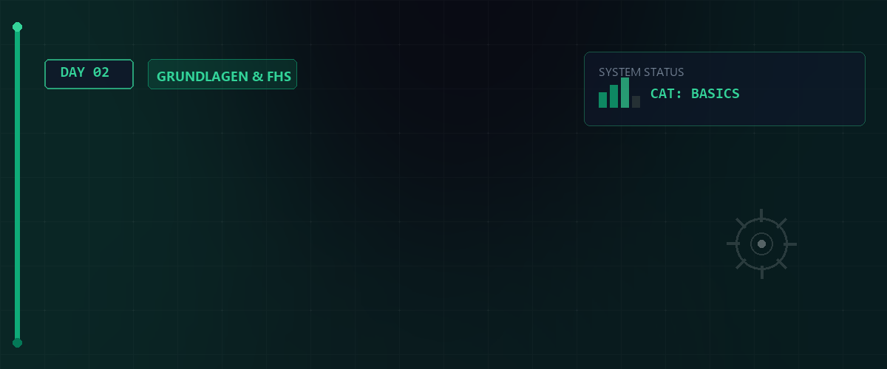

# 🐧 Linux Essentials - Tag 02



Am zweiten Tag vertiefen wir unsere Kenntnisse in der Shell. Wir schauen uns an, wie man Hilfe-Systeme effektiv nutzt, analysieren die Systemhardware und führen fortgeschrittene Dateioperationen durch. Zusätzlich richten wir eine moderne Arbeitsumgebung mit Oh My Zsh ein.

---

## 📑 Inhaltsverzeichnis
- [Hilfe & Dokumentation](#-hilfe--dokumentation)
- [Systeminformationen & Hardware](#-systeminformationen--hardware)
- [Fortgeschrittene Dateioperationen](#-fortgeschrittene-dateioperationen)
- [Dateiinspektion & Metadaten](#-dateiinspektion--metadaten)
- [Benutzer & Umgebung](#-benutzer--umgebung)
- [Advanced Shell Setup: Oh My Zsh](#-advanced-shell-setup-oh-my-zsh)
- [Ressourcen & Dokumente](#-ressourcen--dokumente)

---

## 📖 Hilfe & Dokumentation
Linux bietet mächtige eingebaute Dokumentationssysteme. Das Verständnis der Handbuchseiten (Manpages) ist der Schlüssel zur Meisterschaft.

### Dokumentations-Werkzeuge
| Befehl | Funktion |
| :--- | :--- |
| `man <Befehl>` | Öffnet das ausführliche Handbuch. |
| `whatis <Befehl>` | Zeigt eine kurze Einzeiler-Beschreibung an. |
| `info <Befehl>` | Ein moderneres, meist detaillierteres Hypertext-Hilfesystem. |
| `<Befehl> --help` | Zeigt eine Kurzübersicht der Optionen direkt im Terminal. |
| `sudo mandb` | Aktualisiert die Datenbank der Manual-Seiten. |

### Die Sektionen der Manpages
Manpages sind in Sektionen unterteilt. Manchmal hat ein Name Einträge in verschiedenen Sektionen (z.B. ein Befehl und ein Systemaufruf).
- `man 1`: Benutzerbefehle (Standard).
- `man 2`: Systemaufrufe (Kernel-Funktionen).
- `man 5`: Dateiformate und Konfigurationen.

> [!TIP]  
> Nutzen Sie `man 2 mount`, um spezifische Informationen zum Systemaufruf statt zum Befehl zu erhalten.  

> [!IMPORTANT]  
> **LPIC-1 RELEVANTES PRÜFUNGSWISSEN - Hilfe-Systeme:**  
> * **Manpage-Suche:** Wenn Sie den genauen Befehl nicht wissen, nutzen Sie **`man -k <Begriff>`** oder **`apropos <Begriff>`**. Beide suchen in den Kurzbeschreibungen der Handbuchseiten. Damit dies funktioniert, muss die Datenbank mit **`mandb`** (bzw. älter `makewhatis`) aktuell sein.  
> * **Sektionen der Manpages:**  
>   * **Sektion 1:** Benutzerbefehle (z.B. `passwd`, `ls`).  
>   * **Sektion 5:** Dateiformate und Konfigurationen (z.B. `/etc/passwd`, `/etc/exports`).  
>   * **Sektion 8:** Systemverwaltungsbefehle (z.B. `fdisk`, `ifconfig`, `route`).  
>   * Beispiel: `man 5 passwd` zeigt das Dateiformat von `/etc/passwd`. `man 1 passwd` zeigt die Bedienung des Befehls `passwd`.

---

## 🖥 Systeminformationen & Hardware
Bevor man an einem System arbeitet, muss man wissen, womit man es zu tun hat.

### Hardware & Kernel
- `uname -a`: Zeigt alle Systeminformationen (Kernel-Version, Hostname, CPU-Architektur).
- `lscpu`: Detaillierte Informationen zur CPU-Architektur (Kerne, Cache, etc.).
- `free -h`: Zeigt den freien und belegten Arbeitsspeicher in lesbarem Format (Human-readable).
- `df -h`: Zeigt die Belegung der Dateisysteme (Festplattenplatz) an.

> [!IMPORTANT]  
> **LPIC-1 RELEVANTES PRÜFUNGSWISSEN - Hardware-Erkennung & Kernel-Module:**  
> * **Hardware-Dateien in `/proc`:**  
>   * `/proc/cpuinfo` - Detaillierte CPU-Daten (Hersteller, Modell, Takt).  
>   * `/proc/meminfo` - Detaillierte RAM-Daten (Gesamt, Frei, Cache).  
>   * `/proc/ioports` & `/proc/dma` - Reservierte I/O-Adressbereiche und Direct-Memory-Access Kanäle.  
>   * `/proc/pci` / `/proc/bus/pci` - PCI-Bus Informationen.  
> * **Hardware-Befehle:**  
>   * **`lspci`**: Listet alle PCI-Geräte auf.  
>   * **`lsusb`**: Listet alle USB-Geräte auf.  
>   * **`lsmod`**: Listet alle aktuell geladenen Kernel-Module auf (liest `/proc/modules`).  
>   * **`modinfo <Modul>`**: Zeigt Informationen über ein Kernel-Modul an (Autor, Lizenz, Abhängigkeiten).

### Aktive Benutzer
| Befehl | Funktion |
| :--- | :--- |
| `whoami` | Zeigt den Namen des aktuellen Benutzers an. |
| `who` | Listet alle aktuell am System angemeldeten Benutzer auf. |
| `w` | Zeigt an, wer angemeldet ist und was sie gerade tun (inkl. Systemlast). |
| `loginctl` | Verwaltung des Systemd-Login-Managers. |

---

## 📂 Fortgeschrittene Dateioperationen
Heute haben wir gelernt, wie man effizient mit Verzeichnisstrukturen arbeitet.

- `mkdir -p <Pfad>`: Erstellt verschachtelte Verzeichnisse in einem Schritt (z.B. `mkdir -p Europa/Italien`).
- `tree`: Visualisiert die Verzeichnisstruktur als Baum (sehr nützlich zur Übersicht).
- `cp -r <Quelle> <Ziel>`: Kopiert Verzeichnisse rekursiv.
- `rm -rf <Pfad>`: Löscht Verzeichnisse rekursiv und ohne Nachfrage (Vorsicht geboten!).
- `mv <Quelle> <Ziel>`: Verschiebt oder benennt Dateien und Verzeichnisse um.

> [!IMPORTANT]  
> **LPIC-1 RELEVANTES PRÜFUNGSWISSEN - cp & rm Optionen:**  
> * **`cp -a` (Archive):** Eines der wichtigsten Flags. Es kopiert rekursiv und behält alle Attribute wie Berechtigungen, Besitzer, Gruppe, symbolische Links und Zeitstempel bei. Es entspricht der Kombination **`-dpR`**.  
> * **`cp -p` (Preserve):** Kopiert die Datei und erhält Eigentümer, Gruppe, Zugriffsrechte und Zeitstempel der Originaldatei.  
> * **`rm -r` (Recursive):** Löscht ein Verzeichnis und dessen gesamten Inhalt.  
> * **`rm -f` (Force):** Ignoriert nicht existierende Dateien und fragt niemals nach einer Bestätigung.

> [!CAUTION]
> `rm -rf` ist ein mächtiges Werkzeug. Nutzen Sie `rm -ri` (interaktiv), wenn Sie unsicher sind, was genau gelöscht wird.

---

## 🔍 Dateiinspektion & Metadaten
Dateien sind unter Linux mehr als nur ihr Inhalt.

### Inhalte betrachten
- `cat -n <Datei>`: Zeigt den Inhalt mit Zeilennummern an.
- `tac <Datei>`: Zeigt den Inhalt in umgekehrter Reihenfolge an (von unten nach oben).
- `diff <Datei1> <Datei2>`: Vergleicht zwei Dateien und zeigt die Unterschiede an.

### Metadaten & Pfade
- `file <Datei>`: Bestimmt den Dateityp (unabhängig von der Endung).
- `stat <Datei>`: Zeigt detaillierte Statusinformationen (Inodes, Zeitstempel, Rechte).
- `which <Befehl>`: Zeigt den Pfad zur ausführbaren Datei eines Befehls an.
- `whereis <Befehl>`: Findet Binärdateien, Quellcode und Manpages.

---

## 🚀 Advanced Shell Setup: Oh My Zsh
Für eine produktivere Umgebung haben wir **Oh My Zsh** eingerichtet.

### 1. Installation
```bash
sh -c "$(wget -O- https://raw.githubusercontent.com/ohmyzsh/ohmyzsh/master/tools/install.sh)"
```

### 2. Design & Plugins
Wir nutzen das **Agnoster-Theme** und essentielle Plugins für Vorschläge und Highlighting.

| Komponente | Zweck |
| :--- | :--- |
| **Agnoster Theme** | Powerline-basiertes Design für bessere Übersicht. |
| **zsh-autosuggestions** | Schlägt Befehle basierend auf der Historie vor. |
| **zsh-syntax-highlighting** | Markiert gültige/ungültige Befehle farblich. |

### 3. Konfiguration (`~/.zshrc`)
Aktivieren Sie das Theme und die Plugins in Ihrer Konfigurationsdatei:
```bash
ZSH_THEME="agnoster"
plugins=(git zsh-autosuggestions zsh-syntax-highlighting)
```
Wenden Sie die Änderungen mit `source ~/.zshrc` an.

> [!IMPORTANT]
> Für das Agnoster-Theme müssen Powerline-Fonts (z.B. "Noto Mono Powerline") im Terminal eingestellt sein.

## 🧠 LPIC-1 Relevanz & Wissenstest
Hier sind typische Kontrollfragen zu den Themen des zweiten Tages:

<details>
<summary><b>Fragen zu Hilfesystemen & Hardware-Informationen</b> (Klicken zum Ausklappen)</summary>

1. **Was ist der Unterschied zwischen `man 1 passwd` und `man 5 passwd`?**
   <details><summary>Antwort</summary>**`man 1 passwd`** öffnet das Handbuch für den Benutzerbefehl `passwd` zum Ändern von Passwörtern. **`man 5 passwd`** öffnet das Handbuch für das Dateiformat der Konfigurationsdatei `/etc/passwd`.</details>

2. **Mit welchen Befehlen lässt sich die CPU-Architektur und die Auslastung des RAM anzeigen?**
   <details><summary>Antwort</summary>Die CPU-Architektur wird mit **`lscpu`** angezeigt. Die Arbeitsspeicherauslastung prüft man am besten mit **`free -h`** (die Option `-h` steht für "human-readable", z. B. in GB).</details>

</details>

<details>
<summary><b>Fragen zu Dateioperationen & Metadaten</b> (Klicken zum Ausklappen)</summary>

3. **Was bewirkt die Option `-p` beim Befehl `mkdir`?**
   <details><summary>Antwort</summary>Die Option **`-p`** (parents) erstellt verschachtelte Verzeichnispfade in einem Schritt (z. B. `mkdir -p A/B/C`) und wirft keinen Fehler, wenn die Ordner bereits existieren.</details>

4. **Was ist der Unterschied zwischen `which` und `whereis`?**
   <details><summary>Antwort</summary>**`which`** sucht nur in den Verzeichnissen der Umgebungsvariable `$PATH` nach der ausführbaren Datei des Befehls. **`whereis`** sucht breiter im System und liefert zusätzlich die Pfade zur Binärdatei, den Quellcodedateien und den zugehörigen Manual-Seiten.</details>

5. **Wie unterscheidet sich `cat` von `tac`?**
   <details><summary>Antwort</summary>**`cat`** gibt den Dateiinhalt von oben nach unten (normal) aus. **`tac`** (rückwärts geschrieben) gibt den Dateiinhalt von unten nach oben (in umgekehrter Reihenfolge) aus – das ist sehr nützlich, um die neuesten Einträge in Protokolldateien zu sehen.</details>

</details>

---

## 📚 Ressourcen & Dokumente
Im [Assets](./assets)-Verzeichnis finden Sie weiterführende Informationen:

- [Befehle & Datenverarbeitung (PDF)](./assets/LinuxBS_info_Commands_DatVerz.pdf)
- [Historie Tag 02 (TXT)](./assets/rockyHis20260505-1457.txt)
- [Praxis-Historie (Navigation & FHS 1) (TXT)](./assets/history-semus-20260512-0938)
- [Praxis-Historie (Navigation & FHS 2) (TXT)](./assets/history-semus-20260512-0941)

---
## 🔗 Zurück zur Übersicht

* **Tag 01 (Einführung & Installation):** [⬅️ Tag 01](../Day_01/README.md)
* **Tag 03 (Navigation & Dateiverwaltung):** [➡️ Tag 03](../Day_03/README.md)
* **Master-Repository:** [🌌 Zurück zum Master-Repository](../README.md)

---
*Erstellt & gepflegt von Tobias Boyke, Juni 2026.*
