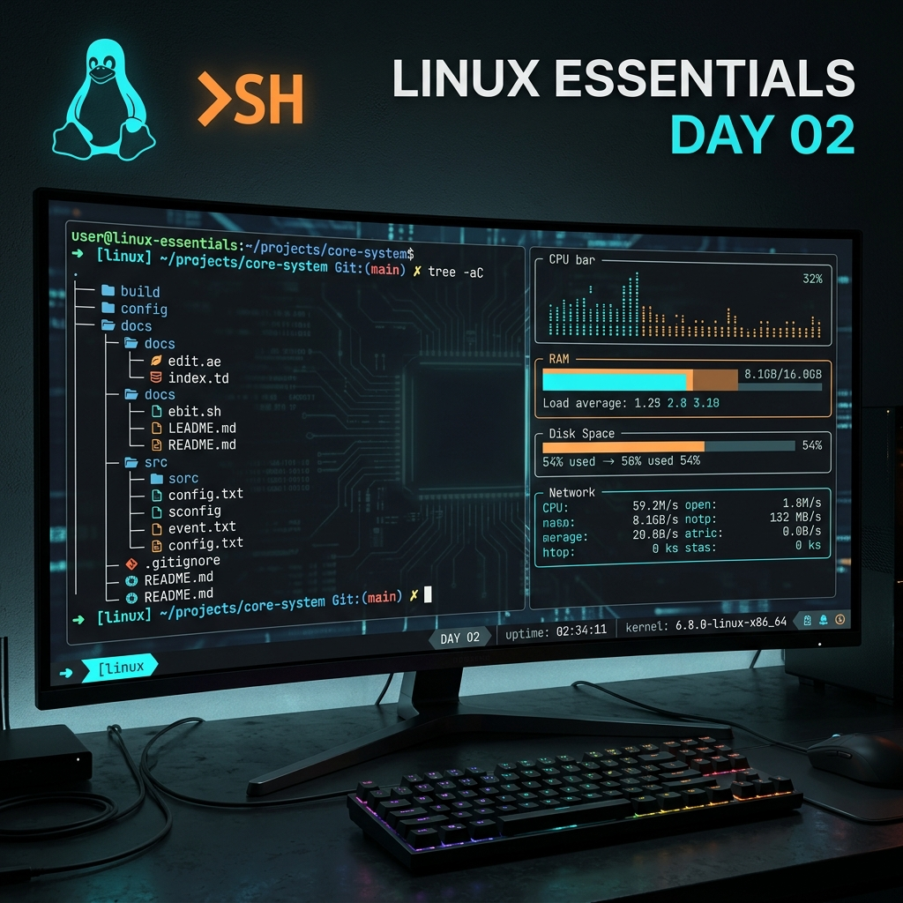

# 🐧 Linux Essentials - Tag 02



Am zweiten Tag vertiefen wir unsere Kenntnisse in der Shell. Wir schauen uns an, wie man Hilfe-Systeme effektiv nutzt, analysieren die Systemhardware und führen fortgeschrittene Dateioperationen durch. Zusätzlich richten wir eine moderne Arbeitsumgebung mit Oh My Zsh ein.

---

## 📑 Inhaltsverzeichnis
- [Hilfe & Dokumentation](#-hilfe--dokumentation)
- [Systeminformationen & Hardware](#-systeminformationen--hardware)
- [Fortgeschrittene Dateioperationen](#-fortgeschrittene-dateioperationen)
- [Dateiinspektion & Metadaten](#-dateiinspektion--metadaten)
- [Benutzer & Umgebung](#-benutzer--umgebung)
- [Advanced Shell Setup: Oh My Zsh](#-advanced-shell-setup-oh-my-zsh)
- [Ressourcen & Dokumente](#-ressourcen--dokumente)

---

## 📖 Hilfe & Dokumentation
Linux bietet mächtige eingebaute Dokumentationssysteme. Das Verständnis der Handbuchseiten (Manpages) ist der Schlüssel zur Meisterschaft.

### Dokumentations-Werkzeuge
| Befehl | Funktion |
| :--- | :--- |
| `man <Befehl>` | Öffnet das ausführliche Handbuch. |
| `whatis <Befehl>` | Zeigt eine kurze Einzeiler-Beschreibung an. |
| `info <Befehl>` | Ein moderneres, meist detaillierteres Hypertext-Hilfesystem. |
| `<Befehl> --help` | Zeigt eine Kurzübersicht der Optionen direkt im Terminal. |
| `sudo mandb` | Aktualisiert die Datenbank der Manual-Seiten. |

### Die Sektionen der Manpages
Manpages sind in Sektionen unterteilt. Manchmal hat ein Name Einträge in verschiedenen Sektionen (z.B. ein Befehl und ein Systemaufruf).
- `man 1`: Benutzerbefehle (Standard).
- `man 2`: Systemaufrufe (Kernel-Funktionen).
- `man 5`: Dateiformate und Konfigurationen.

> [!TIP]
> Nutzen Sie `man 2 mount`, um spezifische Informationen zum Systemaufruf statt zum Befehl zu erhalten.

---

## 🖥 Systeminformationen & Hardware
Bevor man an einem System arbeitet, muss man wissen, womit man es zu tun hat.

### Hardware & Kernel
- `uname -a`: Zeigt alle Systeminformationen (Kernel-Version, Architektur).
- `lscpu`: Detaillierte Informationen zur CPU-Architektur.
- `free -h`: Zeigt den freien und belegten Arbeitsspeicher in lesbarem Format (Human-readable).
- `df -h`: Zeigt die Belegung der Dateisysteme (Festplattenplatz) an.

### Aktive Benutzer
| Befehl | Funktion |
| :--- | :--- |
| `whoami` | Zeigt den Namen des aktuellen Benutzers an. |
| `who` | Listet alle aktuell am System angemeldeten Benutzer auf. |
| `w` | Zeigt an, wer angemeldet ist und was sie gerade tun (inkl. Systemlast). |
| `loginctl` | Verwaltung des Systemd-Login-Managers. |

---

## 📂 Fortgeschrittene Dateioperationen
Heute haben wir gelernt, wie man effizient mit Verzeichnisstrukturen arbeitet.

- `mkdir -p <Pfad>`: Erstellt verschachtelte Verzeichnisse in einem Schritt (z.B. `mkdir -p Europa/Italien`).
- `tree`: Visualisiert die Verzeichnisstruktur als Baum (sehr nützlich zur Übersicht).
- `cp -r <Quelle> <Ziel>`: Kopiert Verzeichnisse rekursiv.
- `rm -rf <Pfad>`: Löscht Verzeichnisse rekursiv und ohne Nachfrage (Vorsicht geboten!).
- `mv <Quelle> <Ziel>`: Verschiebt oder benennt Dateien und Verzeichnisse um.

> [!CAUTION]
> `rm -rf` ist ein mächtiges Werkzeug. Nutzen Sie `rm -ri` (interaktiv), wenn Sie unsicher sind, was genau gelöscht wird.

---

## 🔍 Dateiinspektion & Metadaten
Dateien sind unter Linux mehr als nur ihr Inhalt.

### Inhalte betrachten
- `cat -n <Datei>`: Zeigt den Inhalt mit Zeilennummern an.
- `tac <Datei>`: Zeigt den Inhalt in umgekehrter Reihenfolge an (von unten nach oben).
- `diff <Datei1> <Datei2>`: Vergleicht zwei Dateien und zeigt die Unterschiede an.

### Metadaten & Pfade
- `file <Datei>`: Bestimmt den Dateityp (unabhängig von der Endung).
- `stat <Datei>`: Zeigt detaillierte Statusinformationen (Inodes, Zeitstempel, Rechte).
- `which <Befehl>`: Zeigt den Pfad zur ausführbaren Datei eines Befehls an.
- `whereis <Befehl>`: Findet Binärdateien, Quellcode und Manpages.

---

## 🚀 Advanced Shell Setup: Oh My Zsh
Für eine produktivere Umgebung haben wir **Oh My Zsh** eingerichtet.

### 1. Installation
```bash
sh -c "$(wget -O- https://raw.githubusercontent.com/ohmyzsh/ohmyzsh/master/tools/install.sh)"
```

### 2. Design & Plugins
Wir nutzen das **Agnoster-Theme** und essentielle Plugins für Vorschläge und Highlighting.

| Komponente | Zweck |
| :--- | :--- |
| **Agnoster Theme** | Powerline-basiertes Design für bessere Übersicht. |
| **zsh-autosuggestions** | Schlägt Befehle basierend auf der Historie vor. |
| **zsh-syntax-highlighting** | Markiert gültige/ungültige Befehle farblich. |

### 3. Konfiguration (`~/.zshrc`)
Aktivieren Sie das Theme und die Plugins in Ihrer Konfigurationsdatei:
```bash
ZSH_THEME="agnoster"
plugins=(git zsh-autosuggestions zsh-syntax-highlighting)
```
Wenden Sie die Änderungen mit `source ~/.zshrc` an.

> [!IMPORTANT]
> Für das Agnoster-Theme müssen Powerline-Fonts (z.B. "Noto Mono Powerline") im Terminal eingestellt sein.

---

## 📚 Ressourcen & Dokumente
Im [Assets](./assets)-Verzeichnis finden Sie weiterführende Informationen:

- [Befehle & Datenverarbeitung (PDF)](./assets/LinuxBS_info_Commands_DatVerz.pdf)
- [Historie Tag 02 (TXT)](./assets/rockyHis20260505-1457.txt)

---

*Erstellt am 06. Mai 2026 für den Linux-Essentials Kurs.*
