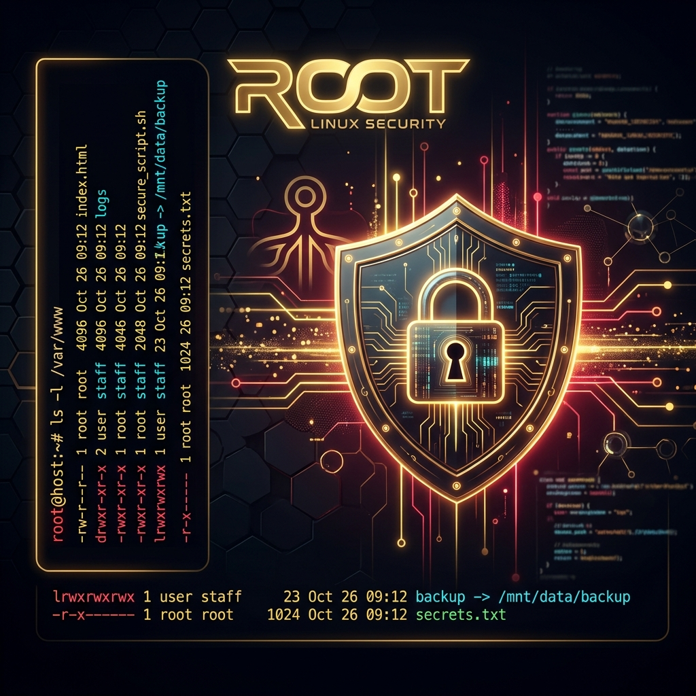

# 🔐 Linux Essentials - Tag 03



Am dritten Tag dreht sich alles um die Sicherheit: **Dateirechte und Besitzverhältnisse**. Wir lernen, wie Linux den Zugriff auf Dateien steuert, was hinter dem Oktalsystem steckt und wie man administrative Rechte sicher einsetzt.

---

## 📑 Inhaltsverzeichnis
- [Das Linux-Rechtesystem](#-das-linux-rechtesystem)
- [Das Oktalsystem](#-das-oktalsystem)
- [chmod: Zugriffsrechte ändern](#-chmod-zugriffsrechte-ändern)
- [chown: Besitzverhältnisse ändern](#-chown-besitzverhältnisse-ändern)
- [Spezielle Berechtigungen (SUID, SGID, Sticky)](#-spezielle-berechtigungen-suid-sgid-sticky)
- [Best Practices für Sicherheit](#-best-practices-für-sicherheit)
- [Zurück zum Hauptmenü](#-zurück-zum-hauptmenü)

---

## 🛡 Das Linux-Rechtesystem
Jede Datei und jedes Verzeichnis in Linux gehört einem bestimmten **Besitzer** und einer **Gruppe**. Die Rechte werden in drei Kategorien unterteilt:

| Kürzel | Kategorie | Beschreibung |
| :---: | :--- | :--- |
| **u** | **User** | Der Besitzer der Datei. |
| **g** | **Group** | Mitglieder der Gruppe, der die Datei gehört. |
| **o** | **Others** | Alle anderen Benutzer auf dem System. |

### Die drei Grundrechte
- **r (Read):** Lesen der Datei / Auflisten eines Verzeichnisses.
- **w (Write):** Ändern der Datei / Erstellen & Löschen im Verzeichnis.
- **x (Execute):** Ausführen der Datei / Betreten eines Verzeichnisses.

---

## 🔢 Das Oktalsystem
Anstatt Buchstaben nutzt Linux oft Zahlen zur Darstellung von Rechten. Diese basieren auf einem einfachen Binärsystem:

| Wert | Recht | Bedeutung |
| :---: | :---: | :--- |
| **4** | **r** | Read (Lesen) |
| **2** | **w** | Write (Schreiben) |
| **1** | **x** | Execute (Ausführen) |
| **0** | **-** | Keine Rechte |

**Beispiel:** 
- `7` (4+2+1) = `rwx` (Vollzugriff)
- `5` (4+0+1) = `r-x` (Lesen & Ausführen)
- `644` = Besitzer (6=rw-), Gruppe (4=r--), Andere (4=r--)

---

## 🔧 chmod: Zugriffsrechte ändern
Der Befehl `chmod` (Change Mode) wird verwendet, um die Berechtigungen anzupassen.

### Numerische Methode
```bash
chmod 755 script.sh  # rwxr-xr-x (Besitzer darf alles, Rest nur Lesen/Ausführen)
chmod 600 private.txt # rw------- (Nur Besitzer darf Lesen/Schreiben)
```

### Symbolische Methode
| Befehl | Aktion |
| :--- | :--- |
| `chmod u+x <Datei>` | Fügt dem Besitzer das Ausführrecht hinzu. |
| `chmod g-w <Datei>` | Entfernt der Gruppe das Schreibrecht. |
| `chmod a+r <Datei>` | Gibt allen (all) das Leserecht. |

> [!TIP]
> Nutzen Sie `chmod -R`, um Rechte rekursiv für einen ganzen Ordnerbaum zu ändern.

---

## 👤 chown: Besitzverhältnisse ändern
Mit `chown` (Change Owner) können Sie festlegen, wem eine Datei gehört.

```bash
sudo chown user1 datei.txt           # Ändert den Besitzer auf 'user1'
sudo chown user1:gruppe1 datei.txt    # Ändert Besitzer und Gruppe gleichzeitig
sudo chown :gruppe1 datei.txt         # Ändert nur die Gruppe (Alternative zu chgrp)
```

---

## 🏗 Spezielle Berechtigungen (SUID, SGID, Sticky)
Für fortgeschrittene Szenarien gibt es drei "Special Bits":

| Bit | Name | Funktion |
| :--- | :--- | :--- |
| **SUID** | Set User ID | Datei wird mit den Rechten des Besitzers (oft Root) ausgeführt. |
| **SGID** | Set Group ID | Datei wird mit den Rechten der Gruppe ausgeführt / Neue Dateien erben die Gruppe des Ordners. |
| **Sticky Bit** | Sticky Bit | In einem Ordner dürfen nur die Besitzer ihre eigenen Dateien löschen (typisch für `/tmp`). |

---

## 🔒 Best Practices für Sicherheit
- **Prinzip der minimalen Rechte:** Geben Sie nur so viel Zugriff wie unbedingt nötig.
- **Root vermeiden:** Arbeiten Sie als normaler Benutzer und nutzen Sie `sudo` nur für administrative Aufgaben.
- **Sichere Verzeichnisse:** Sensible Daten (z.B. SSH-Keys) sollten immer auf `600` oder `700` gesetzt sein.

---

## 🔗 Zurück zum Hauptmenü
[⬅ Zurück zur Übersicht](../README.md)

---

*Erstellt am 06. Mai 2026 für den Linux-Essentials Kurs.*
