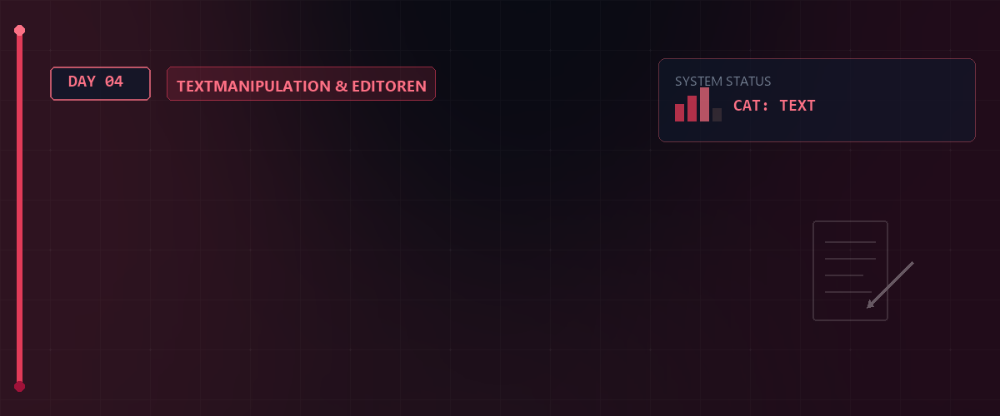

# 🛠️ Linux Essentials - Tag 04



Am vierten Tag vertiefen wir unser Wissen über die Shell-Logik, lernen mächtige Werkzeuge zur Textverarbeitung kennen und meistern den Einsatz von Wildcards für effiziente Suchoperationen.

---

## 📑 Inhaltsverzeichnis
- [Wildcards & Globbing](#-wildcards--globbing)
- [Textverarbeitung (tr, cut, sort)](#-textverarbeitung-tr-cut-sort)
- [Shell-Operatoren & Logik](#-shell-operatoren--logik)
- [Subshells & Befehlssubstitution](#-subshells--befehlssubstitution)
- [Systempflege (DNF)](#-systempflege-dnf)
- [Ressourcen & Dokumente](#-ressourcen--dokumente)

---

## 🔍 Wildcards & Globbing
Wildcards (Platzhalter) ermöglichen es, Dateimuster zu beschreiben, statt jede Datei einzeln zu benennen.

| Zeichen | Bedeutung | Beispiel |
| :---: | :--- | :--- |
| `*` | Beliebig viele Zeichen (auch keine). | `ls *.txt` |
| `?` | Genau ein beliebiges Zeichen. | `find -name "hall?*"` |
| `[abc]` | Genau eines der Zeichen in der Klammer. | `ls tty[02]` |
| `[0-9]` | Ein Zeichen aus dem angegebenen Bereich. | `ls tty[0-4]` |
| `[^0-9]` | Ein Zeichen, das **nicht** im Bereich liegt. | `ls tty[^0-4]` |
| `{a,b}` | **Brace Expansion**: Erzeugt eine Liste von Strings. | `ls /etc/{a*,d*}` |

---

## 📝 Textverarbeitung (tr, cut, sort)
Linux bietet spezialisierte Werkzeuge, um Textströme in Echtzeit zu manipulieren.

### 🔄 tr (Translate)
Dient zum Ersetzen oder Löschen von Zeichen.
```bash
echo "Bärenhöhle" | tr 'a-zäöü' 'A-Z?'   # Ersetzt Klein- durch Großbuchstaben & Umlaute
echo "Bären--Höhle" | tr -s '-'          # "Squeeze": Mehrfache Bindestriche zu einem
echo "Bärenhöhle" | tr -d 'äöü'          # Löscht alle Umlaute
```

### ✂️ cut (Spalten extrahieren)
Extrahiert gezielt Felder aus einer Datei (ideal für CSV-ähnliche Daten wie `/etc/passwd`).
```bash
cut -d: -f1,2 /etc/passwd       # Nutzt ':' als Trenner und gibt Feld 1 & 2 aus
cat data | cut -d ' ' -f1,6     # Nutzt Leerzeichen als Trenner
```

### 📊 sort (Sortieren)
Sortiert die Eingabe alphabetisch oder numerisch.
```bash
cat /etc/passwd | sort -n       # Numerische Sortierung
cat /etc/passwd | sort -r       # Reverse (umgekehrte) Sortierung
```

---

## ⚡ Shell-Operatoren & Logik
Operatoren steuern den Ablauf von Befehlsketten basierend auf Erfolg oder Misserfolg.

| Operator | Logik | Beschreibung |
| :---: | :--- | :--- |
| `;` | **Sequenz** | Führt Befehle nacheinander aus. |
| `&&` | **UND** | Führt den nächsten Befehl nur aus, wenn der vorherige **erfolgreich** war. |
| `||` | **ODER** | Führt den nächsten Befehl nur aus, wenn der vorherige **fehlgeschlagen** ist. |

**Beispiel:**
```bash
mkdir Test && touch ./Test/file || echo "Fehler beim Erstellen"
```

---

## 🐚 Subshells & Befehlssubstitution
Manchmal muss ein Befehl in einer isolierten Umgebung laufen oder sein Ergebnis als Argument dienen.

- **Subshell `( )`**: Befehle in Klammern laufen in einem eigenen Prozess. Änderungen am Verzeichnis (`cd`) oder Variablen betreffen die Haupt-Shell nicht.
  - `(cd /etc; echo "Aktuelle Shell: $(pwd)")`
- **Befehlssubstitution `$( )`**: Nutzt die Ausgabe eines Befehls als Teil eines anderen Befehls.
  - `history > history_$(date +%F).txt`

---

## ⚙️ Systempflege (DNF)
Die Verwaltung von Paketen und System-Updates ist eine Kernaufgabe.

```bash
sudo dnf update      # Aktualisiert die Paketdatenbank
sudo dnf upgrade     # Installiert die neuesten Versionen aller Pakete
```

## 🧠 Wissenstest: Wildcards, Textwerkzeuge & Logik
Hier sind typische Fragen zur Überprüfung Ihres Wissens:

<details>
<summary><b>Fragen zu Wildcards & Textwerkzeugen</b> (Klicken zum Ausklappen)</summary>

1. **Was ist der Unterschied zwischen den Wildcards `*` und `?`?**
   <details><summary>Antwort</summary>**`*`** steht für beliebig viele (auch null) Zeichen. **`?`** steht für exakt ein beliebiges Zeichen.</details>

2. **Wie löscht man mit dem Befehl `tr` alle Vorkommen bestimmter Zeichen?**
   <details><summary>Antwort</summary>Mit der Option **`-d`** (delete) (z. B. `echo "Linux" | tr -d 'i'`).</details>

3. **Wie extrahiert man das erste Feld aus einer Datei, die durch Doppelpunkte getrennt ist (wie `/etc/passwd`)?**
   <details><summary>Antwort</summary>Mit dem Befehl **`cut -d: -f1 <Datei>`** (wobei `-d:` den Doppelpunkt als Trenner definiert und `-f1` das erste Feld auswählt).</details>

</details>

<details>
<summary><b>Fragen zu logischen Operatoren & Subshells</b> (Klicken zum Ausklappen)</summary>

4. **Wie verhält sich die Befehlskette `Befehl A && Befehl B || Befehl C`?**
   <details><summary>Antwort</summary>**`Befehl B`** wird nur ausgeführt, wenn **`Befehl A`** erfolgreich war (Exit-Code 0). Falls **`Befehl A`** ODER **`Befehl B`** scheitert, wird **`Befehl C`** ausgeführt.</details>

5. **Welche Auswirkungen haben Änderungen (wie `cd`) in einer Subshell `( ... )` auf die Haupt-Shell?**
   <details><summary>Antwort</summary>**Keine.** Da eine Subshell in einem isolierten Kindprozess ausgeführt wird, bleiben das aktuelle Arbeitsverzeichnis und Variablenänderungen der übergeordneten Shell unberührt, sobald die Klammern geschlossen sind.</details>

</details>

---

## 📚 Ressourcen & Dokumente
Im [Assets](./assets)-Verzeichnis finden Sie die Mitschriften und Unterlagen zu diesem Tag:

- [Linux Sonderzeichen & Kommando-Endezeichen (PDF)](./assets/LinuxSonder-KommandoEndeZeichen.pdf)
- [Shell-Historie Tag 04 (TXT)](./assets/rockyHis20260507-1447.txt)

---

## 🔗 Zurück zum Hauptmenü
[⬅ Zurück zur Übersicht](../README.md)

---

*Erstellt am 07. Mai 2026 für den Linux-Essentials Kurs.*


