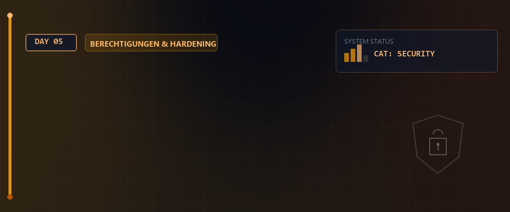

# 🐧 Linux Essentials - Tag 05



Heute vertiefen wir unser Wissen über die Sicherheit und Verwaltung von Dateien. Wir schauen uns an, wie man präzise Berechtigungen setzt, Standardvorgaben mit `umask` anpasst, die Shell-Historie optimiert und wie Links (Hard & Soft) unter Linux funktionieren.

---

## 📑 Inhaltsverzeichnis

- [🐧 Linux Essentials - Tag 05](#-linux-essentials---tag-05)
  - [📑 Inhaltsverzeichnis](#-inhaltsverzeichnis)
  - [🔐 Dateirechte & Berechtigungen](#-dateirechte--berechtigungen)
    - [Die drei Säulen der Berechtigung](#die-drei-säulen-der-berechtigung)
    - [chmod: Symbolischer vs. Numerischer Modus](#chmod-symbolischer-vs-numerischer-modus)
  - [📁 Verzeichnis-Berechtigungen](#-verzeichnis-berechtigungen)
  - [🕵️‍♂️ Fortgeschrittene Rechte (ACL & umask)](#️️-fortgeschrittene-rechte-acl--umask)
    - [umask: Standard-Berechtigungen](#umask-standard-berechtigungen)
    - [ACL: Access Control Lists](#acl-access-control-lists)
  - [📜 Shell-Historie Optimierung](#-shell-historie-optimierung)
  - [🔗 Links: Hardlinks & Softlinks](#-links-hardlinks--softlinks)
    - [Vergleich: Hard vs. Soft](#vergleich-hard-vs-soft)
  - [🧠 Wissenstest: Linux Grundlagen](#-wissenstest-linux-grundlagen)
  - [📚 Ressourcen & Dokumente](#-ressourcen--dokumente)

---

## 🔐 Dateirechte & Berechtigungen

In Linux ist jede Datei und jedes Verzeichnis mit einem Set von Berechtigungen verknüpft, die festlegen, wer lesen, schreiben oder ausführen darf.

### Die drei Säulen der Berechtigung

| Ebene | Symbol | Beschreibung |
| :--- | :---: | :--- |
| **User** | `u` | Der Besitzer der Datei. |
| **Group** | `g` | Mitglieder der Gruppe, der die Datei gehört. |
| **Others** | `o` | Alle anderen Benutzer im System. |

### chmod: Symbolischer vs. Numerischer Modus

Mit `chmod` (change mode) werden diese Rechte angepasst.

**1. Symbolischer Modus:**

- `chmod u+x <Datei>`: Fügt dem Besitzer das Ausführrecht hinzu.
- `chmod g-w <Datei>`: Entfernt der Gruppe das Schreibrecht.
- `chmod o=r <Datei>`: Setzt für andere exklusiv das Leserecht.

**2. Numerischer Modus (Oktal):**

> [!EXAMPLE]
> `chmod 755 script.sh` setzt `rwxr-xr-x` (Besitzer alles, Rest nur Lesen/Ausführen).

> [!IMPORTANT]  
> **LPIC-1 RELEVANTES PRÜFUNGSWISSEN - Rekursive Rechte & chown:**  
> * **Rekursives Setzen (`-R`):** Um Berechtigungen oder Besitzverhältnisse für einen gesamten Verzeichnisbaum (inkl. aller Unterordner und Dateien) zu ändern, nutzen Sie die Option **`-R`** (großes R!).  
>   * `chmod -R 755 /ordner`  
>   * `chown -R student:users /ordner`  
> * **Besitz ändern:** Der Befehl **`chown`** ändert den Besitzer und optional die Gruppe (`chown besitzer:gruppe datei`). Der Befehl **`chgrp`** ändert ausschließlich die Gruppe einer Datei (`chgrp gruppe datei`).  
>   > [!WARNING]  
>   > **Sicherheits-Regel:** Nur der Systemadministrator **root** darf den Besitzer (`chown`) einer Datei ändern! Normale Benutzer können den Besitz ihrer eigenen Dateien nicht auf andere Benutzer übertragen.

---

## 📁 Verzeichnis-Berechtigungen

Berechtigungen verhalten sich bei Verzeichnissen etwas anders als bei Dateien:

- **r (Read):** Erlaubt das Auflisten des Inhalts (`ls`).
- **w (Write):** Erlaubt das Erstellen oder Löschen von Dateien im Verzeichnis.
- **x (Execute):** Erlaubt das "Betreten" des Verzeichnisses (`cd`). Ohne `x` kann man keine Informationen über die Dateien darin abrufen, selbst wenn man `r` hat.

---

## 🕵️‍♂️ Fortgeschrittene Rechte (ACL & umask)

### umask: Standard-Berechtigungen

Die `umask` definiert, welche Rechte bei der Erstellung einer neuen Datei **maskiert** (entzogen) werden.

- **Maximum für Dateien (ohne Execute):** `666` (rw-rw-rw-).
- **Maximum für Ordner:** `777` (rwxrwxrwx).

**Berechnungs-Formel:**  
`Maximal-Rechte` AND-NOT `umask` (oktales Subtrahieren ohne Übertrag).  

| umask | Datei-Rechte (666 - umask) | Ordner-Rechte (777 - umask) | Beschreibung |
| :---: | :---: | :---: | :--- |
| `0022` | **644** (`rw-r--r--`) | **755** (`rwxr-xr-x`) | Standard für Root (andere dürfen nur lesen). |
| `0002` | **664** (`rw-rw-r--`) | **775** (`rwxrwxr-x`) | Standard für normale Benutzer (Gruppe darf schreiben). |
| `0077` | **600** (`rw-------`) | **700** (`rwx------`) | Hochgradig gesichert (keine Rechte für Gruppe/Andere). |

> [!IMPORTANT]  
> **LPIC-1 RELEVANTES PRÜFUNGSWISSEN - umask & umask -S:**  
> * **Symbolische Anzeige:** Mit **`umask -S`** wird die Maske symbolisch im Klartext angezeigt (z.B. `u=rwx,g=rx,o=rx`). Dies ist extrem hilfreich, um zu prüfen, was *erlaubt* ist, statt was abgezogen wird.  
> * **Berechnung im Kopf:** Eine Datei kann durch umask **nie** Ausführrechte (`x`) erhalten, da die Ausgangsbasis für Dateien immer `666` ist!  

### Spezialrechte (SUID, SGID, Sticky Bit)

Den standardmäßigen 3 Oktalstellen wird im numerischen Modus eine 4. Stelle vorangestellt:  
* **4 (SUID - Set User ID):** `chmod 4755 datei`. Führt die Datei mit Rechten des Dateibesitzers aus (z.B. `/usr/bin/passwd` läuft als `root`). Symbolisch: `rwsr-xr-x`.
* **2 (SGID - Set Group ID):** `chmod 2755 datei` / `chmod 2775 ordner`. Führt die Datei mit Rechten der Gruppe aus. Auf Ordnern angewendet erben neue Dateien automatisch die Gruppe des Ordners. Symbolisch: `rwxr-sr-x`.
* **1 (Sticky Bit):** `chmod 1777 /ordner`. In diesem Ordner dürfen Benutzer nur ihre eigenen Dateien löschen. Typisches Beispiel: `/tmp`. Symbolisch: `rwxrwxrwt`.

> [!CAUTION]  
> **LPIC-Prüfungsschwerpunkt (Groß vs. Kleinschreibung):**  
> Achten Sie auf die Darstellung in `ls -l`:  
> * Ein **kleines `s`** (User/Group) bzw. **kleines `t`** (Others) bedeutet, dass das darunterliegende Ausführrecht **`x` gesetzt** ist (z.B. `rws` = SUID + Execute).  
> * Ein **großes `S`** bzw. **großes `T`** bedeutet, dass das darunterliegende Ausführrecht **`x` NICHT gesetzt** ist (z.B. `rwS` = SUID ohne Execute). Dies ist oft ein Konfigurationsfehler!  

#### 📊 Die 8 Oktal-Kombinationen der Spezialrechte
Die erste Ziffer der vierstelligen Oktalnotation repräsentiert die Summe der gesetzten Bits: **4 (SUID)** + **2 (SGID)** + **1 (Sticky Bit)**.

| Oktalwert (1. Stelle) | Aktivierte Spezialrechte | Symbolisch (rwx-Bereich) | Auswirkung / Funktion | Typisches Praxisbeispiel |
| :---: | :--- | :---: | :--- | :--- |
| **0** | Keine Spezialrechte | `---` | Standardzugriffsrechte gelten. Keine Erhöhung. | Normale Dateien/Verzeichnisse (`chmod 0755` / `0644`) |
| **1** | **Sticky Bit** | `--t` / `--T` | Löschschutz: Nur Besitzer darf eigene Dateien löschen. | Gemeinsame temporäre Ordner (`chmod 1777 /tmp`) |
| **2** | **SGID** (Set Group ID) | `-s-` / `-S-` | Ausführung als Gruppe / Gruppenvererbung in Ordnern. | Gemeinsame Projektverzeichnisse (`chmod 2770 /srv/projekte`) |
| **3** | SGID + Sticky Bit | `-st` / `-ST` | Gruppenvererbung aktiv + Löschschutz für andere User. | Freigaben mit Gruppenrechten und Löschschutz |
| **4** | **SUID** (Set User ID) | `s--` / `S--` | Ausführung mit Rechten des Dateibesitzers (meist root). | Passwortänderungstool (`chmod 4755 /usr/bin/passwd`) |
| **5** | SUID + Sticky Bit | `s-t` / `S-T` | Ausführung als Dateibesitzer + Löschschutz im Ordner. | Extrem seltene Spezialkombinationen |
| **6** | SUID + SGID | `ss-` / `SS-` | Ausführung als Besitzer **und** als Gruppe. | Hochprivilegierte administrative Tools |
| **7** | SUID + SGID + Sticky Bit | `sst` / `SST` | Alle drei Spezialrechte gleichzeitig aktiv. | Komplexe kollaborative Systemumgebungen |

### ACL: Access Control Lists

Wenn die klassischen Rechte nicht ausreichen (z.B. Zugriff für einen zweiten, spezifischen User), nutzen wir ACLs.

- `getfacl <Datei>`: Zeigt die detaillierten Zugriffskontrolllisten an.
- `setfacl -m u:benutzer:rwx <Datei>`: Gewährt einem spezifischen Benutzer Rechte.

---

## 📜 Shell-Historie Optimierung

Die Bash speichert standardmäßig die letzten Befehle. Dies lässt sich konfigurieren:

- `$HISTSIZE`: Anzahl der Befehle, die im Arbeitsspeicher gehalten werden.
- `$HISTFILESIZE`: Anzahl der Befehle, die in der Datei `.bash_history` gespeichert werden.

**Dauerhafte Konfiguration in `.bashrc`:**

```bash
export HISTSIZE=10000
export HISTFILESIZE=20000
```

Anschließend die Konfiguration mit `source ~/.bashrc` neu laden.

---
## 🔗 Zurück zur Übersicht

* **Tag 04 (Textmanipulation & Filter):** [⬅️ Tag 04](../Day_04/README.md)
* **Tag 06 (Prozessmanagement & Spezialrechte):** [➡️ Tag 06](../Day_06/README.md)
* **Master-Repository:** [🌌 Zurück zum Master-Repository](../README.md)

---
*Erstellt & gepflegt von Tobias Boyke, Juni 2026.*
