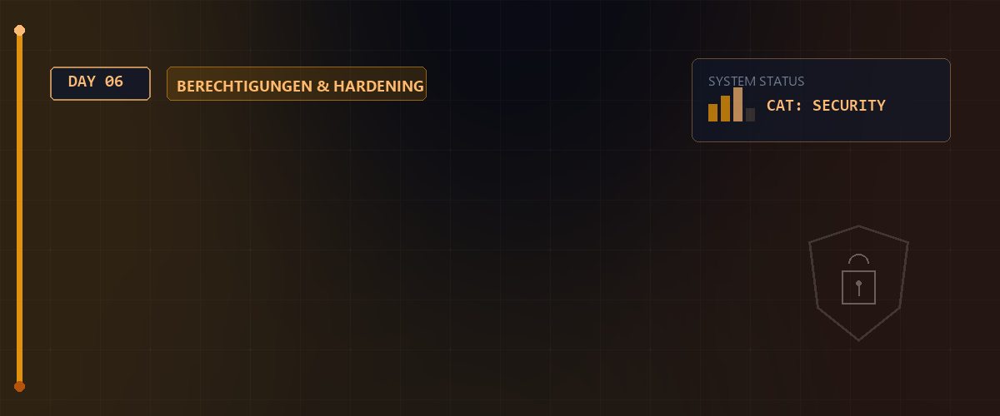

# 🐧 Linux Essentials - Tag 06



Heute lernen wir das Linux-Prozessmodell kennen, wie man Prozesse überwacht, steuert und priorisiert sowie die drei kritischen Spezialrechte (SUID, SGID, Sticky Bit) zur Härtung von Systemen anwendet.

---

## 📑 Inhaltsverzeichnis
- [🎯 Lernziele für heute](#-lernziele-für-heute)
- [🛠 1. Prozess-Monitoring & Identifikation](#-1-prozess-monitoring--identifikation)
  - [Wichtige Werkzeuge](#wichtige-werkzeuge)
- [🚦 2. Job Control: Prozesse im Griff](#-2-job-control-prozesse-im-griff)
- [💀 3. Signale & Priorisierung](#-3-signale--priorisierung)
  - [Signale senden mit kill](#signale-senden-mit-kill)
  - [Prioritäten (nice & renice)](#prioritäten-nice--renice)
- [🔒 4. Spezialrechte (Special Permissions)](#-4-spezialrechte-special-permissions)
  - [Suchen & Setzen von Spezialrechten](#suchen--setzen-von spezialrechten)
- [📝 Praktische Übungen (Day 06)](#-praktische-übungen-day-06)
- [🧠 Wissenstest: Administration & Prozesse](#-wissenstest-administration--prozesse)

---

## 🎯 Lernziele für heute
* Verstehen des Linux-Prozessmodells und der Prozess-Hierarchie.
* Beherrschen von Monitoring-Tools (`top`, `htop`, `pstree`).
* Steuern von Prozessen via Signale und Job-Control.
* Grundlagen der Prozess-Priorisierung (`nice`, `renice`).
* Verständnis und Identifikation von Spezialrechten (SUID, SGID, Sticky Bit).

---

## 🛠 1. Prozess-Monitoring & Identifikation

Linux verwaltet Aufgaben in Form von **Prozessen**. Jeder Prozess hat eine eindeutige **PID** (Process ID) und eine **PPID** (Parent Process ID).

### Wichtige Werkzeuge:
* `ps`: Momentaufnahme der aktuellen Prozesse.
    * `ps aux`: Umfassende Liste aller Prozesse im System (BSD-Stil). Zeigt Spalten wie `%CPU`, `%MEM` und `STAT` (Prozess-Status).
    * `ps -ef`: Standard-Format mit PPID (Parent Process ID) (System-V-Stil).
* `pstree -p`: Visualisiert die Prozess-Hierarchie als Baumstruktur (inkl. PIDs).
* `top`: Interaktiver Echtzeit-Monitor.
* `htop`: Moderne, farbige Alternative zu `top`.
* `btop`: Hochgradig visuelle und informative Monitor-Alternative.

> [!IMPORTANT]  
> **LPIC-1 RELEVANTES PRÜFUNGSWISSEN - Prozess-Zustände (STAT Spalte in ps):**  
> * **`R` (Running/Runnable):** Der Prozess läuft gerade auf der CPU oder wartet in der Run-Queue auf Zuweisung.  
> * **`S` (Interruptible Sleep):** Der Prozess schläft (wartet auf ein Ereignis oder eine Eingabe) und kann durch Signale geweckt/beendet werden.  
> * **`D` (Uninterruptible Sleep):** Der Prozess wartet meist auf ein Hardware-Ereignis (z.B. Festplatten-I/O).  
>   > [!WARNING]  
>   > **Kritische LPIC-Falle:** Ein Prozess im Zustand `D` kann durch **kein** Signal (selbst `SIGKILL -9`) beendet oder geweckt werden, solange die Hardware-Ressource blockiert!  
> * **`T` (Stopped):** Der Prozess wurde gestoppt/pausiert (z.B. durch Signal `SIGSTOP` oder `Strg + Z`).  
> * **`Z` (Zombie):** Der Prozess ist beendet, existiert aber noch in der Prozesstabelle, da der Elternprozess seinen Exit-Status (über den Systemaufruf `wait()`) noch nicht abgefragt hat. Er verbraucht keine CPU oder RAM mehr, belegt aber eine PID.  
> * **`+` (in STAT):** Der Prozess läuft in der Vordergrund-Prozessgruppe des Terminals (z.B. `S+`).  
> * **`<` (in STAT):** Der Prozess hat eine hohe Priorität (nicht nett).  
> * **`N` (in STAT):** Der Prozess hat eine niedrige Priorität (sehr nett).

> [!TIP]
> In `htop` und `btop` kannst du mit den Pfeiltasten navigieren und Prozesse direkt per Funktionstasten (z.B. F9 für Kill) verwalten.

---

## 🚦 2. Job Control: Prozesse im Griff

Prozesse können im Vordergrund (**Foreground**) oder Hintergrund (**Background**) laufen.

| Befehl / Kürzel | Wirkung |
| :--- | :--- |
| `befehl &` | Startet den Befehl direkt im Hintergrund. |
| `Strg + Z` | Pausiert den aktuellen Vordergrund-Prozess (Signal: SIGSTOP). |
| `jobs` | Listet alle aktiven Jobs der aktuellen Shell auf. |
| `fg %1` | Holt Job Nr. 1 in den Vordergrund. |
| `bg %1` | Lässt einen pausierten Job im Hintergrund weiterlaufen. |

---

## 💀 3. Signale & Priorisierung

### Signale senden mit `kill`
Mit `kill` werden Signale an Prozesse gesendet (nicht immer zum "Töten").

> [!IMPORTANT]  
> **LPIC-1 RELEVANTES PRÜFUNGSWISSEN - Essenzielle Signale & Befehle:**  
> Sie müssen sowohl die **Signalnummer** als auch den **Signalnamen** auswendig wissen!  
> 
> | Nummer | Name | Beschreibung / Verwendung |
> | :---: | :--- | :--- |
> | **1** | `SIGHUP` | Hangup. Trennung des Terminals oder **Neuladen von Konfigurationsdateien** (ohne Dienst-Neustart). |
> | **2** | `SIGINT` | Interrupt. Tastatur-Unterbrechung per **`Strg + C`**. |
> | **3** | `SIGQUIT` | Quit. Beendet den Prozess und erzeugt einen Core Dump zur Fehleranalyse. |
> | **9** | `SIGKILL` | Kill. Sofortige, erzwungene Beendigung durch den Kernel. **Kann vom Prozess weder abgefangen noch ignoriert werden.** |
> | **15** | `SIGTERM` | Terminate. Standard-Terminierungssignal. Ermöglicht dem Prozess sauberes Beenden (Dateien schließen, Temp-Daten löschen). |
> | **18** | `SIGCONT` | Continue. Setzt einen zuvor gestoppten (pausierten) Prozess fort. |
> | **19** | `SIGSTOP` | Stop. Pausiert den Prozess sofort. **Kann vom Prozess weder abgefangen noch ignoriert werden** (`Strg + Z`). |
> 
> * **Prozess-Such- & Kill-Befehle:**  
>   * **`pgrep <Muster>`**: Sucht nach Prozessen anhand ihres Namens und gibt deren PIDs aus.  
>   * **`pkill <Muster>`**: Sendet ein Signal an Prozesse basierend auf deren Namen (z.B. `pkill -9 apache`).  
>   * **`killall <Name>`**: Sendet ein Signal an alle Prozesse mit dem exakten Prozessnamen.  

### Prioritäten (`nice` & `renice`)
Der Kernel entscheidet, wie viel CPU-Zeit ein Prozess erhält. Dies wird über den **Nice-Wert** gesteuert.
* **Bereich:** **`-20`** (höchste Priorität, am wenigsten nett) bis **`19`** (niedrigste Priorität, am nettesten). Der Standardwert für neue Prozesse ist **`0`**.  
* **`nice`**: Startet einen *neuen* Prozess mit angepasstem Wert. (z.B. `nice -n 10 befehl`).  
* **`renice`**: Ändert die Priorität eines *bereits laufenden* Prozesses nachträglich über dessen PID (z.B. `renice -n -5 -p 1234`).  

> [!WARNING]  
> **Kritische LPIC-Sicherheitsregel:** Normale Benutzer dürfen den Nice-Wert ihrer eigenen Prozesse **nur erhöhen** (also sich selbst benachteiligen, um netter zu sein). **Nur root** darf negative Werte vergeben oder die Priorität eines Prozesses erhöhen (Nice-Wert senken)!

---

## 🔒 4. Spezialrechte (Special Permissions)

Zusätzlich zu `rwx` gibt es drei Spezialbits, die für die Systemsicherheit kritisch sind.

| Bit | Symbol | Wirkung | Beispiel |
| :--- | :--- | :--- | :--- |
| **SUID** | `s` (User) | Führt Datei mit Rechten des Besitzers aus. | `/usr/bin/passwd` |
| **SGID** | `s` (Group) | Führt Datei mit Rechten der Gruppe aus / Vererbung bei Verzeichnissen. | Kollaborations-Ordner |
| **Sticky Bit** | `t` (Others) | Nur der Besitzer darf seine eigenen Dateien löschen. | `/tmp` |

### Suchen & Setzen von Spezialrechten:
* **Suchen:**
  ```bash
  find / -perm -4000 2>/dev/null # Findet SUID-Dateien
  find / -perm -2000 2>/dev/null # Findet SGID-Dateien
  find / -perm -1000 2>/dev/null # Findet Sticky-Bit-Verzeichnisse
  ```
* **Setzen (Oktal):**
  Den Standard-Rechten wird eine vierte Ziffer vorangestellt:
  * `chmod 4755 datei` -> SUID
  * `chmod 2775 ordner` -> SGID
  * `chmod 1777 ordner` -> Sticky Bit

---

## 📝 Praktische Übungen (Day 06)

1. **Software-Installation:** Installiere das EPEL-Repository und danach `htop` sowie `btop`.
   ```bash
   sudo dnf install epel-release
   sudo dnf install htop btop
   ```
2. **Hintergrund-Management:** Starte `sleep 100 &`, schicke es in den Vordergrund und beende es.
3. **Prioritäten:** Starte einen Prozess mit `nice` und ändere die Priorität nachträglich mit `renice`.
4. **Sicherheits-Check:** Identifiziere alle Dateien im System, die das SUID-Bit gesetzt haben.

---

## 🧠 LPIC-1 Relevanz & Wissenstest
Hier sind Kontrollfragen zum Selbststudium:

<details>
<summary><b>Fragen zu Prozessen & Signalen</b> (Klicken zum Ausklappen)</summary>

1. **Was ist der Unterschied zwischen `ps aux` und `ps -ef`?**
   <details><summary>Antwort</summary>**`ps aux`** verwendet das BSD-Syntaxformat und zeigt zusätzliche Details wie CPU- und Speicherauslastung. **`ps -ef`** verwendet den System-V-Standard und liefert die Parent Process ID (PPID), die für die Verfolgung von Prozessketten wichtig ist.</details>

2. **Wie holt man einen im Hintergrund laufenden Job wieder in den Vordergrund?**
   <details><summary>Antwort</summary>Mit dem Befehl `jobs` ermittelt man die Job-ID (z. B. `[1]`). Danach holt man ihn mit `fg %1` in den Vordergrund.</details>

3. **Welches Signal sendet `kill -9` und warum sollte es nur als letztes Mittel genutzt werden?**
   <details><summary>Antwort</summary>Es sendet **SIGKILL**. Dieses Signal kann vom Prozess weder abgefangen noch ignoriert werden; der Kernel beendet ihn sofort. Dadurch können offene Dateien nicht geschlossen, temporäre Daten nicht gelöscht und keine geordneten Cleanup-Routinen ausgeführt werden (Gefahr von Datenverlust).</details>

</details>

<details>
<summary><b>Fragen zu Spezialrechten</b> (Klicken zum Ausklappen)</summary>

4. **Warum ist das SUID-Bit auf `/usr/bin/passwd` notwendig?**
   <details><summary>Antwort</summary>Da normale Benutzer ihr eigenes Passwort ändern dürfen, dies aber das Schreiben in die geschützte Datei `/etc/shadow` erfordert (auf die nur Root Zugriff hat), sorgt das SUID-Bit dafür, dass `passwd` während der Ausführung mit den Rechten des Besitzers (Root) läuft.</details>

5. **Was bewirkt das SGID-Bit auf einem Verzeichnis?**
   <details><summary>Antwort</summary>Jede neu erstellte Datei in diesem Verzeichnis erbt automatisch die Gruppenzugehörigkeit des Verzeichnisses statt der primären Gruppe des erstellenden Benutzers. Das ist extrem nützlich für gemeinsame Projektordner.</details>

6. **Welchen numerischen Wert hat das Sticky Bit und wie wird es gesetzt?**
   <details><summary>Antwort</summary>Das Sticky Bit hat den oktalen Wert `1000`. Es wird z. B. mit `chmod 1777 /ordner` oder symbolisch mit `chmod +t /ordner` gesetzt.</details>

</details>

---

*Letztes Update: 26. Mai 2026 für den Linux-Essentials Kurs.*
## 🔗 Zurück zur Übersicht

* **Tag 05 (Berechtigungen & Eigentümer):** [⬅️ Tag 05](../Day_05/README.md)
* **Tag 07 (Archivierung & Software-Builds):** [➡️ Tag 07](../Day_07/README.md)
* **Master-Repository:** [🌌 Zurück zum Master-Repository](../README.md)

---
*Erstellt & gepflegt von Tobias Boyke, Juni 2026.*
