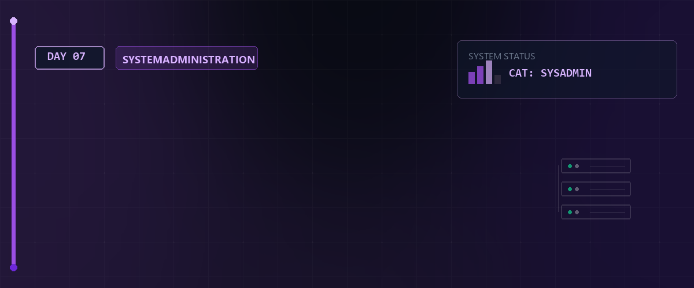

# 📦 Linux Essentials - Tag 07: Archivierung, Kompression & Software-Builds (LPIC-1 Fokus)



Dieses Modul deckt zentrale Themen der LPIC-1 Prüfung (LPI-101) ab, insbesondere die Lernziele 103.3 (Archivierung/Kompression) und 103.5 (Prozess-Management).

---

## 📑 Inhaltsverzeichnis

- [🎯 Lernziele (LPIC-1 relevant)](#-lernziele-lpic-1-relevant)
- [📂 1. Archivierung: tar, cpio & dd](#-1-archivierung-tar-cpio--dd)
  - [A. Der Standard: tar (Tape Archiver)](#a-der-standard-tar-tape-archiver)
  - [B. Die Alternative: cpio](#b-die-alternative-cpio)
  - [C. Bit-für-Bit: dd (Data Duplicator)](#c-bit-für-bit-dd-data-duplicator)
- [🗜 2. Kompression & Transparenter Zugriff](#-2-kompression--transparenter-zugriff)
- [🛠 3. Software-Builds & Shared Libraries](#-3-software-builds--shared-libraries)
  - [Der Build-Workflow (Modern vs. Klassisch)](#der-build-workflow-modern-vs-klassisch)
  - [Shared Libraries prüfen (ldd)](#shared-libraries-prüfen-ldd)
- [🚦 4. Prozess-Management & Signal-Referenz](#-4-prozess-management--signal-referenz)
  - [Die essenzielle Signal-Tabelle](#die-essenzielle-signal-tabelle)
  - [Zombies & Exit-Status](#zombies--exit-status)
- [📝 LPIC-Übungsszenarien (Day 07)](#-lpic-übungsszenarien-day-07)
- [🧠 Wissenstest: Archivierung, Kompression & Builds](#-wissenstest-archivierung-kompression--builds)

---

## 🎯 Lernziele (LPIC-1 relevant)

- **Archivierung:** `tar`, `cpio` und `dd` sicher beherrschen.
- **Kompression:** Algorithmen-Vergleich und die `*cat`-Werkzeuge.
- **Build-Management:** Kompilierung von Quellcode und Umgang mit Shared Libraries (`ldd`).
- **Signale & Prioritäten:** Vollständige Signal-Tabelle und Prozess-Hierarchien (Zombies).

---

## 📂 1. Archivierung: tar, cpio & dd

### A. Der Standard: `tar` (Tape Archiver)

LPIC verlangt das Verständnis der Flags ohne führendes Bindestrich (BSD-Stil) und mit Bindestrich (GNU-Stil).

| Flag | Langform | Beschreibung |
| :--- | :--- | :--- |
| `c` | `--create` | Neues Archiv erstellen. |
| `x` | `--extract` | Archiv entpacken. |
| `t` | `--list` | Inhalt auflisten. |
| `u` | `--update` | Nur Dateien hinzufügen, die neuer als im Archiv sind. |
| `r` | `--append` | Dateien bedingungslos anhängen. |
| `v` | `--verbose` | Fortschritt anzeigen. |
| `f` | `--file` | Dateiname (muss zwingend als letztes Flag stehen). |
| `p` | `--preserve-permissions` | Erhält die ursprünglichen Dateirechte (Standard für Root). |

**Profi-Befehle:**

```bash
# Archiv inkrementell aktualisieren
tar -uf backup.tar ./Dokumente

# Nur Dateien extrahieren, die nach einem Datum geändert wurden
tar -N '2026-05-01' -xf backup.tar
```

> [!IMPORTANT]  
> **LPIC-1 RELEVANTES PRÜFUNGSWISSEN - tar & Kompression:**  
> `tar` kann Archive direkt bei der Erstellung komprimieren. Merken Sie sich diese Flags gut:  
> * **`-z` / `--gzip`:** Komprimiert mit **gzip** (Ergebnis: `.tar.gz` oder `.tgz`).  
> * **`-j` / `--bzip2`:** Komprimiert mit **bzip2** (Ergebnis: `.tar.bz2` oder `.tbz2`).  
> * **`-J` / `--xz`:** Komprimiert mit **xz** (Ergebnis: `.tar.xz`).  
> * **`-C <Ordner>`:** Wechselt vor dem Entpacken in das angegebene Verzeichnis (z.B. `tar -xf archiv.tar -C /opt`).  
> * **Optionen-Reihenfolge:** Das Flag `-f` (File) **muss immer als letztes** direkt vor dem Archiv-Dateinamen stehen (z.B. `tar -czvf backup.tar.gz /home` ist richtig; `tar -czfv backup.tar.gz` schlägt fehl!).  

### B. Die Alternative: `cpio`

`cpio` (Copy In/Out) liest Dateilisten von `stdin` (meist geliefert von `find`).

- **Copy-out (Archiv erstellen):** `find . -name "*.txt" | cpio -o -H newc > archiv.cpio`
- **Copy-in (Entpacken):** `cpio -id < archiv.cpio`
- **Inhalt auflisten:** `cpio -it < archiv.cpio`

> [!IMPORTANT]  
> **LPIC-1 RELEVANTES PRÜFUNGSWISSEN - cpio Flags:**  
> * **`-o` (output):** Erstellt ein Archiv (Copy-out).  
> * **`-i` (input):** Extrahiert ein Archiv (Copy-in).  
> * **`-t` (table of contents):** Zeigt den Inhalt des Archivs an.  
> * **`-d` (directories):** Erstellt Unterordner bei Bedarf automatisch während des Entpackens.  
> * **`-H newc`:** Legt das Format fest. `newc` ist das moderne SVR4-Format (mit Header), das für Boot-Images (initramfs) verwendet wird.  

### C. Bit-für-Bit: `dd` (Data Duplicator)

Wird für Backups ganzer Partitionen oder zum Erstellen von ISO-Abbildern genutzt.

```bash
dd if=/dev/sda of=/pfad/zu/disk.img bs=4M conv=noerror,sync
```

> [!IMPORTANT]  
> **LPIC-1 RELEVANTES PRÜFUNGSWISSEN - dd Parameter:**  
> * **`if=`** (input file): Datenquelle (z.B. Partition `/dev/sdb1` oder Zero-Device `/dev/zero`).  
> * **`of=`** (output file): Ziel (z.B. Image-Datei oder Festplatte).  
> * **`bs=`** (block size): Blockgröße für den Transfer (z.B. `bs=1k` oder `bs=4M`).  
> * **`count=`**: Anzahl der zu kopierenden Blöcke.  
> * **`skip=`**: Überspringt eine Anzahl an Blöcken am Anfang der *Eingabe*.  
> * **`seek=`**: Überspringt eine Anzahl an Blöcken am Anfang der *Ausgabe*.

---

## 🗜 2. Kompression & Transparenter Zugriff

LPIC legt Wert auf die Werkzeuge, die den Inhalt komprimierter Dateien anzeigen, ohne sie permanent zu entpacken.

| Algorithmus | Tool | Decompress | View Content |
| :--- | :--- | :--- | :--- |
| **Gzip** | `gzip` | `gunzip` | `zcat`, `zless` |
| **Bzip2** | `bzip2` | `bunzip2` | `bzcat`, `bzless` |
| **XZ** | `xz` | `unxz` | `xzcat`, `xzless` |

**Beispiel für LPIC:**
"Wie lesen Sie eine `.gz`-Logdatei, ohne sie zu entpacken?"
👉 `zcat /var/log/syslog.gz | less`

---

## 🛠 3. Software-Builds & Shared Libraries

Wenn Software gebaut wird (`meson`, `make`), müssen auch die Bibliotheks-Abhängigkeiten stimmen.

### Der Build-Workflow (Modern vs. Klassisch)

1. **Meson (Modern):** `meson setup build` -> `meson compile -C build`
2. **Autotools (Klassisch):** `./configure` -> `make` -> `sudo make install`

### Shared Libraries prüfen (`ldd`)

Jedes Binary benötigt Bibliotheken. LPIC-Thema: "Was tun, wenn ein Programm nicht startet?"

```bash
ldd /usr/local/bin/glmark2
```

- Zeigt alle geladenen `.so`-Dateien (Shared Objects).
- Falls eine fehlt: "not found".

> [!IMPORTANT]  
> **LPIC-1 RELEVANTES PRÜFUNGSWISSEN - Shared Libraries & Cache:**  
> * **`/etc/ld.so.conf`**: Diese Konfigurationsdatei listet alle Verzeichnisse auf, in denen das System nach Shared Libraries suchen soll.  
> * **`/etc/ld.so.cache`**: Enthält ein vorkompiliertes Binär-Verzeichnis aller gefundenen Bibliotheken für schnellen Zugriff.  
> * **`ldconfig`**: Aktualisiert die Cache-Datei `/etc/ld.so.cache` auf Basis der Pfade in `/etc/ld.so.conf`. Dies **muss** immer als root ausgeführt werden, wenn neue Bibliotheken installiert oder Pfade hinzugefügt wurden!  
>   * Option `-v` zeigt alle durchsuchten Verzeichnisse und Bibliotheken an.  
>   * Option `-p` gibt den Inhalt des aktuellen Caches `/etc/ld.so.cache` aus.  
> * **`LD_LIBRARY_PATH`**: Eine Umgebungsvariable, in der Benutzer alternative Suchpfade für Bibliotheken eintragen können. Diese Pfade überschreiben temporär die Pfade aus `/etc/ld.so.conf` (z.B. `export LD_LIBRARY_PATH=/home/student/libs`).

---

## 🚦 4. Prozess-Management & Signal-Referenz

### Die essenzielle Signal-Tabelle

| ID | Name | Beschreibung |
| :--- | :--- | :--- |
| **1** | `SIGHUP` | Hangup (Reload von Konfigurationsdateien). |
| **2** | `SIGINT` | Interrupt (Strg+C). |
| **9** | `SIGKILL` | Sofortiges Beenden (nicht abfangbar). |
| **15** | `SIGTERM` | Terminierung (sauberes Beenden, Standard). |
| **17** | `SIGCHLD` | Kind-Prozess beendet oder pausiert (relevant für Zombies). |
| **18** | `SIGCONT` | Pausierten Prozess fortsetzen. |
| **19** | `SIGSTOP` | Prozess pausieren (nicht abfangbar). |

### Zombies & Exit-Status

Ein Zombie entsteht, wenn der Parent das Signal `SIGCHLD` nicht korrekt verarbeitet (kein `wait()` System-Call).

- **Exit Status:** Mit `echo $?` kann der Exit-Status des letzten Kommandos geprüft werden (0 = Erfolg).

---

## 📝 LPIC-Übungsszenarien (Day 07)

1. **Szenario Archivierung:** Erstellen Sie ein mit `bzip2` komprimiertes Archiv des Verzeichnisses `/etc`, aber schließen Sie alle Dateien aus, die auf `.conf` enden (`--exclude`).
2. **Szenario Filter:** Nutzen Sie `find` und `cpio`, um alle Dateien in `/home`, die dem User `student` gehören, in ein Archiv zu kopieren.
3. **Szenario Troubleshooting:** Ein selbst kompiliertes Programm startet nicht. Nutzen Sie `ldd`, um herauszufinden, welche Bibliothek fehlt.
4. **Szenario Signale:** Schicken Sie einem Prozess erst das Signal 19 (`SIGSTOP`) und reaktivieren Sie ihn anschließend mit Signal 18 (`SIGCONT`).

---

## 🧠 LPIC-1 Relevanz & Wissenstest

Hier sind typische Prüfungsfragen und Szenarien zum LPIC-1 Fokus:

<details>
<summary><b>Fragen zu Archivierung & Kompression</b> (Klicken zum Ausklappen)</summary>

1. **Was ist der Unterschied zwischen `tar -czf` und `tar -cjf`?**
   <details><summary>Antwort</summary>**`-czf`** komprimiert das Archiv mit **gzip** (schneller, aber größere Datei). **`-cjf`** komprimiert das Archiv mit **bzip2** (langsamer, aber bessere Kompressionsrate).</details>

2. **Wie kann man mit `tar` ein Archiv entpacken, ohne dessen relative Struktur zu verändern?**
   <details><summary>Antwort</summary>Standardmäßig entpackt `tar -xf` die Dateien in das aktuelle Arbeitsverzeichnis unter Beibehaltung der relativen Pfade des Archivs.</details>

3. **Wie unterscheidet sich `xz` von `gzip` und `bzip2`?**
   <details><summary>Antwort</summary>`xz` basiert auf dem LZMA-Algorithmus. Es bietet die mit Abstand beste Kompressionsrate (sehr kleine Dateien) und schnelles Entpacken, benötigt beim Komprimieren jedoch deutlich mehr Arbeitsspeicher und Rechenzeit.</details>

</details>

<details>
<summary><b>Fragen zu Shared Libraries & Builds</b> (Klicken zum Ausklappen)</summary>

1. **Welche Aufgabe hat der Befehl `ldd`?**
   <details><summary>Antwort</summary>Er analysiert ein ausführbares Programm (oder eine andere Bibliothek) und listet alle dynamisch gelinkten Shared Libraries (`.so`-Dateien) auf, die das Programm zur Ausführung benötigt.</details>

2. **Welche klassischen Schritte gehören zu einem Autotools-basierten Software-Build?**
   <details><summary>Antwort</summary>1. **`./configure`** (prüft das System auf Abhängigkeiten und erstellt das Makefile).  
   2. **`make`** (kompiliert den Quellcode zu Binaries).  
   3. **`sudo make install`** (kopiert die Binaries und Ressourcen in die Systemverzeichnisse).</details>

</details>

---

*Letztes Update: 26. Mai 2026 für den Linux-Essentials Kurs.*
## 🔗 Zurück zur Übersicht

* **Tag 06 (Prozessmanagement & Spezialrechte):** [⬅️ Tag 06](../Day_06/README.md)
* **Tag 08 (Shell Scripting & Automatisierung):** [➡️ Tag 08](../Day_08/README.md)
* **Master-Repository:** [🌌 Zurück zum Master-Repository](../README.md)

---
*Erstellt & gepflegt von Tobias Boyke, Juni 2026.*
