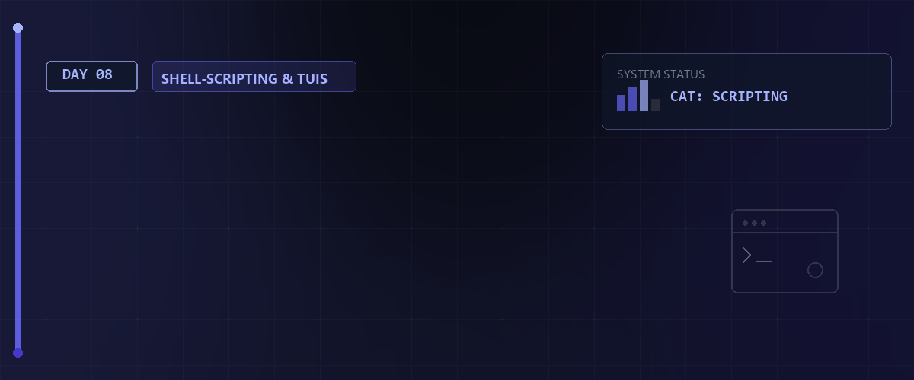

# 🐚 Linux Essentials - Tag 08: Shell Scripting & Automatisierung



Dieses Modul vertieft die Bash-Programmierung und bereitet gezielt auf die LPIC-1 Prüfungsziele 105.1 (Shell-Umgebung) und 105.2 (Skripte schreiben) vor.

---

## 📑 Inhaltsverzeichnis

- [🎯 Lernziele (LPIC-1 relevant)](#-lernziele-lpic-1-relevant)
- [🏗 1. Variablen & Parameter-Handling](#-1-variablen--parameter-handling)
  - [Shell- vs. Environment-Variablen](#shell--vs-environment-variablen)
  - [Skript-Argumente (Positional Parameters)](#skript-argumente-positional-parameters)
- [🔢 2. Arithmetik & Vergleiche](#-2-arithmetik--vergleiche)
  - [Rechnen in der Bash](#rechnen-in-der-bash)
  - [Die "Modernen" Tests: \[\[ ... \]\]](#die-modernen-tests---)
- [🔄 3. Kontrollstrukturen für Profis](#-3-kontrollstrukturen-für-profis)
  - [Case-Statements](#case-statements)
  - [While-Loops](#while-loops)
- [🔍 4. Expansion & Debugging](#-4-expansion--debugging)
  - [Parameter-Expansion (LPIC-Highlight)](#parameter-expansion-lpic-highlight)
  - [Debugging-Modus](#debugging-modus)
- [📝 LPIC-Übungsszenarien (Day 08)](#-lpic-übungsszenarien-day-08)
- [🧠 Wissenstest: Bash & Scripting](#-wissenstest-bash--scripting)

---

## 🎯 Lernziele (LPIC-1 relevant)

- **Variable Mastery:** Environment vs. Shell-Variablen, Argumente (`$1`, `$#`).
- **Advanced Logic:** `case`-Statements und komplexe Tests (`[[ ... ]]`).
- **Arithmetic:** Berechnungen direkt in der Shell mit `$(( ... ))`.
- **Expansion:** Parameter-Substitution (Default-Werte, String-Manipulation).
- **Debugging:** Fehleranalyse mit `set -x` und Exit-Codes.

---

## 🏗 1. Variablen & Parameter-Handling

In der LPIC-Prüfung ist der Unterschied zwischen Variablen-Typen und deren Übergabe essenziell.

### Shell- vs. Environment-Variablen

- **Shell-Variable:** Nur in der aktuellen Instanz verfügbar (`VAR=wert`).
- **Environment-Variable:** Wird an Kindprozesse vererbt (`export VAR=wert`).

### Skript-Argumente (Positional Parameters)

Skripte können beim Aufruf Daten übernehmen:

| Parameter | Bedeutung |
| :--- | :--- |
| `$0` | Name des Skripts bzw. der aufrufenden Shell. |
| `$1` - `$9` | Das erste bis neunte Argument. |
| `${10}` - `${N}` | Das zehnte bis *n*-te Argument (geschweifte Klammern sind zwingend erforderlich!). |
| `$#` | Anzahl der übergebenen Argumente (ohne `$0`). |
| `$*` | Alle Argumente als eine einzige zusammenhängende Zeichenkette. |
| `$@` | Alle Argumente als Liste von separaten Zeichenketten. |
| `$$` | PID des aktuellen Skripts. |
| `$?` | Exit-Status des zuletzt ausgeführten Befehls (0 = Erfolg, >0 = Fehler). |

> [!IMPORTANT]  
> **LPIC-1 RELEVANTES PRÜFUNGSWISSEN - Parameter-Verarbeitung:**  
> * **`shift` (Parameterverschiebung):** Der Befehl **`shift`** verschiebt alle Positionsparameter um eine Stelle nach links: `$1` fällt weg, `$2` wird zu `$1`, `$3` wird zu `$2` usw. Gleichzeitig verringert sich die Anzahl in `$#` um 1. Dies wird häufig in Schleifen zur sequenziellen Abarbeitung einer unbestimmten Anzahl von Argumenten genutzt (z.B. `while [ $# -gt 0 ]; do echo $1; shift; done`).  
> * **`"$*"` vs. `"$@"`:** Verwenden Sie unter Anführungszeichen fast immer **`"$@"`**. Denn `"$*"` fasst alle Argumente zu einem String `"arg1 arg2 arg3"` zusammen, wodurch Dateinamen mit Leerzeichen zerreißen. `"$@"` expandiert korrekt zu `"arg1"` `"arg2"` `"arg3"`.

---

## 🔢 2. Arithmetik & Vergleiche

### Rechnen in der Bash

Die Bash kann nativ nur Ganzzahl-Arithmetik (Integers):

```bash
ERGEBNIS=$(( 5 + 3 * 2 )) # Ergebnis: 11
(( ZAHLER++ ))            # Inkrement
```

### Die "Modernen" Tests: `[[ ... ]]`

Verwende in Bash-Skripten bevorzugt `[[ ]]` statt `[ ]`, da es weniger fehleranfällig ist (z.B. kein Quoting bei Variablen nötig).

| Test | Bedeutung |
| :--- | :--- |
| `-z $VAR` | String ist leer. |
| `-n $VAR` | String ist NICHT leer. |
| `-e $FILE` | Datei/Ordner existiert. |
| `$A -eq $B` | Vergleich von Zahlen (equal). |
| `$A == $B` | Vergleich von Strings. |

---

## 🔄 3. Kontrollstrukturen für Profis

### Case-Statements

Ideal für Menüs oder das Verarbeiten von Argumenten (Alternative zu vielen `if`-Blöcken).

```bash
case "$1" in
    start)
        echo "Dienst startet..." ;;
    stop)
        echo "Dienst stoppt..." ;;
    *)
        echo "Usage: $0 {start|stop}" ;;
esac
```

### While-Loops

Läuft so lange, wie eine Bedingung wahr ist.

```bash
while read -r line; do
    echo "Verarbeite: $line"
done < datei.txt
```

---

## 🔍 4. Expansion & Debugging

### Parameter-Expansion (LPIC-Highlight)

Manipulation von Variablen ohne externe Tools wie `sed` oder `cut`:

- `${VAR:-default}`: Nutze "default", falls `VAR` leer oder nicht definiert ist.
- `${VAR%suffix}`: Entfernt den kürzesten Suffix von hinten.
- `${VAR#prefix}`: Entfernt den kürzesten Präfix von vorne.
- `${#VAR}`: Zeigt die Anzahl der Zeichen (Länge) des Variableninhalts an.

> [!IMPORTANT]  
> **LPIC-1 RELEVANTES PRÜFUNGSWISSEN - Dateitests in Bash:**  
> Bei Abfragen mit `if [ ... ]` oder `[[ ... ]]` sind diese Dateitests hochgradig relevant:  
> * **`-f <Pfad>`**: Wahr, wenn der Pfad existiert und eine **reguläre Datei** ist.  
> * **`-d <Pfad>`**: Wahr, wenn der Pfad ein **Verzeichnis** ist.  
> * **`-e <Pfad>`**: Wahr, wenn der Pfad **existiert** (egal ob Datei, Ordner, Link oder Device).  
> * **`-s <Pfad>`**: Wahr, wenn die Datei existiert und eine **Größe > 0 Bytes** hat (nicht leer ist).  
> * **`-L <Pfad>`** (oder `-h`): Wahr, wenn der Pfad ein **symbolischer Link** (Symlink) ist.  
> * **`-r` / `-w` / `-x <Pfad>`**: Wahr, wenn der Pfad für den aktuellen Benutzer lesbar / schreibbar / ausführbar ist.  

### Debugging-Modus

Wenn ein Skript nicht tut, was es soll:

- `set -x` (oder Aufruf mit `bash -x skript.sh`): Gibt jeden Befehl vor der Ausführung mit einem führenden `+` aus (Tracing).
- `set -e`: Bricht das Skript sofort ab, wenn ein Fehler auftritt (Exit-Status > 0).
- `exit <wert>`: Beendet ein Skript manuell und liefert den Wert an den aufrufenden Prozess (Standard-Exitcodes: 0 = Erfolg, 1-255 = Fehlerwert).

---

## 📝 LPIC-Übungsszenarien (Day 08)

1. **Argument-Check:** Schreibe ein Skript, das prüft, ob genau zwei Argumente übergeben wurden. Falls nicht, gib eine Fehlermeldung aus und beende mit `exit 1`.
2. **Case-Menü:** Erstelle ein Skript, das die System-Informationen (`uname`, `uptime`, `free`) basierend auf einer Benutzereingabe ausgibt.
3. **Arithmetic-Loop:** Nutze eine `while`-Schleife und `$(( ))`, um die Zahlen von 1 bis 10 zu addieren.
4. **Expansion-Trick:** Erstelle eine Variable `DATEI="backup_2026.tar.gz"`. Nutze Parameter-Expansion, um nur `backup_2026` auszugeben.

---

## 🔑 Keywords

| Keyword / Befehl | Erklärung |
| :--- | :--- |
| `#!/bin/bash` | Shebang: Erste Zeile im Skript, die dem Kernel mitteilt, mit welchem Interpreter das Skript auszuführen ist. |
| `read -r` | Liest eine Tastatureingabe des Benutzers zeilenweise ein; verhindert die Interpretation von Backslashes. |
| `if [ ... ]` | Kontrollstruktur zur bedingten Ausführung von Codeblöcken basierend auf Testergebnissen. |
| `$1, $2` | Positionsparameter: Repräsentieren das erste, zweite usw. Argument, das dem Skript übergeben wurde. |
| `exit` | Beendet ein Shell-Skript sofort und gibt einen numerischen Statuscode (0 = Erfolg, 1-255 = Fehler) an den Aufrufer zurück. |

---

## 🧠 LPIC-1 Relevanz & Wissenstest

Hier sind typische Fragen rund um Shell Scripting:

<details>
<summary><b>Fragen zu Variablen & Parametern</b> (Klicken zum Ausklappen)</summary>

1. **Was ist der Unterschied zwischen `VAR=Wert` und `export VAR=Wert`?**
   <details><summary>Antwort</summary>`VAR=Wert` definiert eine lokale Shell-Variable, die nur in der aktuellen Shell-Instanz sichtbar ist. `export VAR=Wert` macht daraus eine Umgebungsvariable (Environment Variable), die auch an alle von dieser Shell gestarteten Programme (Kindprozesse, Subshells) vererbt wird.</details>

2. **Wie greift man in einem Bash-Skript auf das 11. Argument zu?**
   <details><summary>Antwort</summary>Ab dem 10. Argument müssen geschweifte Klammern verwendet werden: **`${11}`**. Würde man `$11` schreiben, interpretiert die Bash dies als das erste Argument `$1` gefolgt von einer statischen Ziffer `1`.</details>

3. **Was ist der Unterschied zwischen `"$*"` und `"$@"`?**
   <details><summary>Antwort</summary>Unter doppelten Anführungszeichen expandiert **`"$*"`** zu einer einzigen Zeichenkette, in der alle Parameter durch das erste Zeichen der IFS-Variable (standardmäßig ein Leerzeichen) getrennt sind (z. B. `"arg1 arg2 arg3"`). **`"$@"`** hingegen expandiert zu einer Liste von separaten Zeichenketten (z. B. `"arg1"` `"arg2"` `"arg3"`), wodurch Leerzeichen in den einzelnen Argumenten erhalten bleiben. Letzteres ist fast immer die sicherere Variante.</details>

</details>

<details>
<summary><b>Fragen zu Kontrollstrukturen & Debugging</b> (Klicken zum Ausklappen)</summary>

1. **Wie lautet die Syntax für eine native mathematische Berechnung in der Bash?**
   <details><summary>Antwort</summary>Berechnungen werden in doppelten runden Klammern mit einem führenden Dollarzeichen ausgeführt: **`$(( 3 + 4 ))`**. Die Bash unterstützt dabei nativ nur Ganzzahlen (Integers).</details>

2. **Welche nützliche Funktion hat `set -e` am Anfang eines Skripts?**
   <details><summary>Antwort</summary>Es sorgt dafür, dass das Skript sofort abgebrochen wird, sobald ein darin aufgerufener Befehl fehlschlägt (also einen Exit-Code ungleich `0` liefert). Dies verhindert Folgeschäden bei Fehlern.</details>

</details>

## 📚 Ressourcen & Dokumente
Im [Assets](./assets)-Verzeichnis finden Sie die Unterlagen zu diesem Tag:

- [Praxis-Skript (Umask Check) (SH)](./assets/umask_script.sh)
- [Praxis-Historie (Variablen, Export & Funktionen) (TXT)](./assets/history-function-set-env-202605291048)

---

*Letztes Update: 26. Mai 2026 für den Linux-Essentials Kurs.*
## 🔗 Zurück zur Übersicht

* **Tag 07 (Archivierung & Software-Builds):** [⬅️ Tag 07](../Day_07/README.md)
* **Tag 09 (Reguläre Ausdrücke (Regex)):** [➡️ Tag 09](../Day_09/README.md)
* **Master-Repository:** [🌌 Zurück zum Master-Repository](../README.md)

---
*Erstellt & gepflegt von Tobias Boyke, Juni 2026.*
