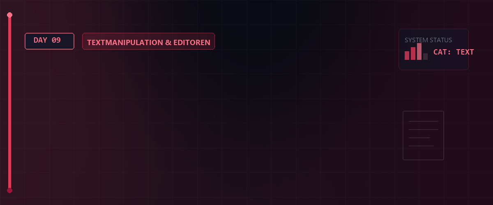

# 🔍 Linux Essentials - Tag 09



Dieses Modul widmet sich der mächtigen Welt der **Regulären Ausdrücke (Regular Expressions / Regex)** in Linux. Es bereitet gezielt auf die LPIC-1 Prüfungen vor, in denen das Suchen, Filtern und Manipulieren von Textströmen mit `grep`, `sed` und `awk` eine zentrale Rolle spielt.

---

## 📑 Inhaltsverzeichnis

* [Lernziele (LPIC-1 relevant)](#-lernziele-lpic-1-relevant)
* [BRE vs. ERE (Basic vs. Extended Regular Expressions)](#️-1-bre-vs-ere-basic-vs-extended-regular-expressions)
* [Die wichtigsten Regex-Bausteine](#-2-die-wichtigsten-regex-bausteine)
* [Das Praxisprojekt: StartEx.sh Task Manager](#️-3-das-praxisprojekt-startexsh-task-manager)
* [Deep Dive: Der IPv4-Filter (Lehrer-Bug behoben!)](#-4-deep-dive-der-ipv4-filter-lehrer-bug-behoben)
* [Übersicht der Aufgaben und Lösungen](#-5-übersicht-der-aufgaben-und-lösungen)
* [Ausführung des Projekts](#-ausführung-des-projekts)
* [Ressourcen & Dokumente](#-ressourcen--dokumente)
* [Zurück zur Übersicht](#-zurück-zur-übersicht)

---

## 🎯 Lernziele (LPIC-1 relevant)

* **BRE vs. ERE Mastery:** Verständnis des Unterschieds zwischen Basic und Extended Regular Expressions.
* **Anker & Wortgrenzen:** Zeilenanfänge (`^`), Zeilenenden (`$`) und Wortgrenzen (`\b`) exakt setzen.
* **Zeichenklassen & Quantifizierer:** Eigene Mengen definieren (`[a-z]`, `[^:]`) und Wiederholungen steuern (`{n}`, `+`, `?`).
* **Mathematisch exakte Filterung:** Komplexe Muster wie IPv4- und IPv6-Adressen fehlerfrei filtern und Validierungen durchführen.
* **Modulare Automatisierung (TUI):** Erstellung eines zentralen interaktiven Steuerungsmenüs für Bash-Skripte.

---

## 🏗️ 1. BRE vs. ERE (Basic vs. Extended Regular Expressions)

In der Linux-Welt (und den LPIC-Prüfungen) wird streng zwischen zwei Regex-Dialekten unterschieden:

| Feature | BRE (Basic Regular Expressions) | ERE (Extended Regular Expressions) |
| :--- | :--- | :--- |
| **Standard-Tools** | `grep`, `sed` | `grep -E` (oder `egrep`), `awk`, `sed -E` |
| **Metazeichen** | Müssen für Sonderfunktion escaped werden: `\( \)`, `\{ \}`, `\|` | Haben direkt ihre Sonderfunktion: `( )`, `{ }`, `\|` |
| **Quantifizierer** | `*` (0 oder mehr), `\+` (1 oder mehr), `\?` (0 oder 1) | `*` (0 oder mehr), `+` (1 oder mehr), `?` (0 oder 1) |
| **Oder-Operator** | `\|` | `\|` |

> [!IMPORTANT]
> Für mathematisch exakte und komplexe Filterungen (wie IPs oder Port-Längen) ist **ERE (`grep -E` bzw. `sed -E`)** immer die bevorzugte Wahl, da es den Code übersichtlicher hält und Schachtelungen einfacher macht.

---

## 🔢 2. Die wichtigsten Regex-Bausteine

Für die Lösung der heutigen Aufgaben nutzen wir ein präzises Set an Regex-Metazeichen:

| Metazeichen | Bedeutung | Praxisbeispiel |
| :--- | :--- | :--- |
| `^` | Zeilenanfang | `^root` (Zeilen, die mit "root" beginnen) |
| `$` | Zeilenende | `/bin/bash$` (Zeilen, die auf "/bin/bash" enden) |
| `\b` | Wortgrenze (Schnittstelle Wort/Nicht-Wort) | `\b100\b` (findet "100", aber nicht "1000") |
| `.` | Beliebiges Zeichen (außer Zeilenumbruch) | `a.b` (findet "axb", "a2b", "a#b") |
| `[abc]` | Zeichenklasse (eines der Zeichen in den Klammern) | `[0-9]` (beliebige Ziffer) |
| `[^abc]` | Negierte Zeichenklasse (keines der Zeichen) | `[^:]+` (beliebige Zeichenfolge ohne Doppelpunkt) |
| `*` | 0 oder mehr Wiederholungen | `a*` (findet "", "a", "aa", "aaa") |
| `+` | 1 oder mehr Wiederholungen | `a+` (findet "a", "aa", "aaa", aber nicht "") |
| `?` | 0 oder 1 Wiederholung (optional) | `[1-9]?\d` (findet ein- oder zweistellige Zahlen) |
| `{n}` | Exakt *n* Wiederholungen | `[0-9]{3}` (exakt dreistellige Zahl) |
| `(a\|b)` | Alternation (Gruppierung & ODER-Auswahl) | `(tcp\|udp)` (matcht entweder "tcp" oder "udp") |

---

## 🛠️ 3. Das Praxisprojekt: StartEx.sh Task Manager

Um die Aufgaben von Karsten Matz optimal zu bearbeiten, wurde eine **vollständig modulare und hochgradig robuste Skript-Architektur** entwickelt.

### Die Architektur im Überblick

* **Zentrales TUI-Skript (`StartEx.sh`):** Bietet ein interaktives Terminal-Menü mit farbiger Menüführung, klaren Beschreibungen und sauberem Loop-Handling.
* **Modulare Aufgaben-Skripte (`scripts/task_*.sh`):** Jede Aufgabe wird von einem eigenen, hochgradig kommentierten Bash-Skript gelöst.
* **Fehlertoleranz & Cross-Kompatibilität:** Da Befehle wie `ifconfig`, `ip addr` oder `nmcli` in einigen Umgebungen (z.B. Windows/WSL ohne Netzwerkkarten-Rechte oder Minimal-Installationen) nicht verfügbar sind, prüfen alle Skripte automatisch, ob lokale Backup-Dateien (z.B. `nmcliDat`, `passwdDat`, `servicesDat`) existieren. Findet das Skript kein Backup, versucht es automatisch die **Live-Befehle** des Systems auszuführen!

---

## 🔍 4. Deep Dive: Der IPv4-Filter (Lehrer-Bug behoben!)

> [!WARNING]
> **Achtung bei dem in der Aufgabe vorgegebenen Regex:**
> `\b((([0-2]\d[0-5])|(\d{2})|(\d))\.){3}(([0-2]\d[0-5])|(\d{2})|(\d))\b`
>
> Dieser Regex weist zwei gravierende Mängel auf:
>
> 1. **Er lässt mathematisch ungültige IPs durch:** Der Teil `[0-2]\d[0-5]` erlaubt z.B. das Oktett **`295`** (da `2` in `[0-2]`, `9` in `\d` und `5` in `[0-5]` liegt).
> 2. **Er schließt gültige IPs komplett aus:** Eine Standard-IP wie **`192.168.1.1`** wird blockiert! Für das Oktett `168` schlägt jeder Zweig fehl:
>    * `[0-2]\d[0-5]` scheitert, da die letzte Ziffer `8` nicht im Bereich `0-5` liegt.
>    * `\d{2}` scheitert, da `168` dreistellig ist.
>    * `\d` scheitert, da `168` dreistellig ist.

### Unsere mathematisch exakte Lösung

Ein IPv4-Oktett darf exakt Werte von `0` bis `255` annehmen. Wir zerlegen dies logisch in vier sich nicht überschneidende Bereiche:

* `25[0-5]` (250 bis 255)
* `2[0-4][0-9]` (200 bis 249)
* `1[0-9][0-9]` (100 bis 199)
* `[1-9]?[0-9]` (0 bis 99)

Zusammengefügt in eine ERE-Gruppe ergibt sich für ein Oktett:

```regex
(25[0-5]|2[0-4][0-9]|1[0-9][0-9]|[1-9]?[0-9])
```

Vierfach verkettet mit Punkten und Wortgrenzen (`\b`) entsteht unser mathematisch perfekter IPv4-Filter:

```regex
\b(25[0-5]|2[0-4]\d|1\d{2}|[1-9]?\d)\.(25[0-5]|2[0-4]\d|1\d{2}|[1-9]?\d)\.(25[0-5]|2[0-4]\d|1\d{2}|[1-9]?\d)\.(25[0-5]|2[0-4]\d|1\d{2}|[1-9]?\d)\b
```

---

## 📝 5. Übersicht der Aufgaben und Lösungen

### [1] [task_1_ipv4.sh](./scripts/task_1_ipv4.sh)

Extrahiert IPv4-Adressen aus `ifconfig`, `ip addr`, `ip route` und `nmcli`.

* **Kern-Regex:** Mathematisch exakter IPv4-Filter (siehe oben).

### [1b] [task_1b_ipv6.sh](./scripts/task_1b_ipv6.sh)

Extrahiert IPv6-Adressen (einschließlich komprimierter Schreibweisen wie `::`).

* **Kern-Regex:**

  ```regex
  (([0-9a-fA-F]{1,4}:){1,7}[0-9a-fA-F]{1,4}|([0-9a-fA-F]{1,4}:){1,7}:|::([0-9a-fA-F]{1,4}:){0,7}[0-9a-fA-F]{1,4}|...)
  ```

### [2] [task_2_interfaces.sh](./scripts/task_2_interfaces.sh)

Filtert Schnittstellennamen (z.B. `eth0`, `lo`, `wlan0`).

* **ifconfig:** `grep -E -o '^[a-zA-Z0-9_-]+:' | tr -d ':'`
* **ip addr:** `grep -E -o '^[0-9]+: [a-zA-Z0-9_-]+:'` + Spaltenextraktion.
* **ip route:** `grep -E -o '\bdev\s+[a-zA-Z0-9_-]+'` + Spaltenextraktion.

### [3] [task_3_passwd_users.sh](./scripts/task_3_passwd_users.sh)

Sucht Usernamen aus `/etc/passwd` mit einer UID >= 1000.

* **Bedeutung:** System-Accounts liegen unter 1000, reguläre Benutzer ab 1000.
* **Kern-Regex:** `^[^:]+:[^:]+:[1-9][0-9]{3,}:`

### [4] [task_4_group_names.sh](./scripts/task_4_group_names.sh)

Sucht Gruppennamen aus `/etc/group` mit einer GID >= 1000.

* **Kern-Regex:** `^[^:]+:[^:]+:[1-9][0-9]{3,}:`

### [5] [task_5_extract_services.sh](./scripts/task_5_extract_services.sh)

Filtert alle Kommentare und Leerzeilen aus `/etc/services` und extrahiert die 2. Spalte (Port/Protokoll) in die neue Datei `services_extracted.txt`.

* **Kern-Regex (sed):** `/^[[:space:]]*(#|$)/d; s/^[[:space:]]*[^[:space:]]+[[:space:]]+([^[:space:]]+).*/\1/`

### [6] [task_6_count_3digit_tcp.sh](./scripts/task_6_count_3digit_tcp.sh)

Filtert und zählt alle exakt 3-stelligen TCP-Ports (z.B. `111/tcp`, `443/tcp`).

* **Kern-Regex:** `^[0-9]{3}/tcp$`

### [7] [task_7_count_2_5digit_tcp.sh](./scripts/task_7_count_2_5digit_tcp.sh)

Filtert und zählt alle exakt 2- und 5-stelligen TCP-Ports (z.B. `80/tcp` und `32768/tcp`).

* **Kern-Regex:** `^([0-9]{2}|[0-9]{5})/tcp$`

### [8] [task_8_unique_protocols.sh](./scripts/task_8_unique_protocols.sh)

Identifiziert alle einzigartigen Transportprotokolle (wie `tcp`, `udp`, `sctp`, `ddp`) aus der extrahierten Datei.

* **Pipeline:** `grep -E -o '[a-zA-Z0-9_-]+$' | sort -u | wc -l`

### [9] [task_9_count_udp.sh](./scripts/task_9_count_udp.sh)

Analog zu Aufgabe 6 & 7 für das Protokoll `udp` (3-stellige sowie 2- und 5-stellige UDP-Ports zählen).

* **Kern-Regex:** `^[0-9]{3}/udp$` und `^([0-9]{2}|[0-9]{5})/udp$`

---

## 🚀 Ausführung des Projekts

Wechseln Sie in das Verzeichnis `Day_09` und starten Sie das interaktive Menü:

```bash
cd Day_09
bash StartEx.sh
```

---

## 📚 Ressourcen & Dokumente

Im [Assets](./assets)-Verzeichnis finden Sie weiterführende Informationen:

* [Linux RegEx Aufgaben (PDF)](./assets/LinuxRegExAufgNE4NE5.pdf)
* [RegEx Referenz (PDF)](./assets/REGEX.pdf)
* [Shell Scripting Vorlage (SH)](./assets/regexScripte.sh)
* [Regex Projekt Walkthrough (MD)](./assets/regex_project_walkthrough.md)
* [Historie Tag 09 (TXT)](./assets/rockyHis20260518-1344.txt)

---

## 🔗 Zurück zur Übersicht

[⬅ Zurück zur Übersicht](../README.md)

---

*Erstellt am 18. Mai 2026 für den Linux-Essentials Kurs.*
