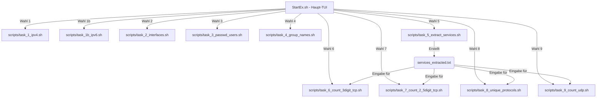

# 🛠️ Regex-Projekt Dokumentation & Walkthrough

Dieses Dokument bietet eine detaillierte Übersicht über die für **Day 09** implementierte **TUI-gestützte Regex-Skript-Umgebung**.

---

## 🏗️ Systemarchitektur

Die Lösung besteht aus einem hierarchisch aufgebauten, modularen System, das sich nahtlos in deinen bestehenden Studienplan einfügt.



### Dateistruktur in [Day_09](file:///c:/Users/Tobia/Desktop/cSharpRepo/Linux-Essentials/Day_09)

* [StartEx.sh](file:///c:/Users/Tobia/Desktop/cSharpRepo/Linux-Essentials/Day_09/StartEx.sh) — *Zentrales TUI-Skript mit interaktivem Konsolenmenü.*
* [README.md](file:///c:/Users/Tobia/Desktop/cSharpRepo/Linux-Essentials/Day_09/README.md) — *LPIC-1 ausgerichteter Lernleitfaden.*
* `scripts/` — *Verzeichnis für die modularen Einzellösungen.*
  * [task_1_ipv4.sh](file:///c:/Users/Tobia/Desktop/cSharpRepo/Linux-Essentials/Day_09/scripts/task_1_ipv4.sh) — *Extrahiert valide IPv4-Adressen.*
  * [task_1b_ipv6.sh](file:///c:/Users/Tobia/Desktop/cSharpRepo/Linux-Essentials/Day_09/scripts/task_1b_ipv6.sh) — *Extrahiert valide IPv6-Adressen.*
  * [task_2_interfaces.sh](file:///c:/Users/Tobia/Desktop/cSharpRepo/Linux-Essentials/Day_09/scripts/task_2_interfaces.sh) — *Extrahiert Schnittstellennamen.*
  * [task_3_passwd_users.sh](file:///c:/Users/Tobia/Desktop/cSharpRepo/Linux-Essentials/Day_09/scripts/task_3_passwd_users.sh) — *Sucht Usernamen mit UID >= 1000.*
  * [task_4_group_names.sh](file:///c:/Users/Tobia/Desktop/cSharpRepo/Linux-Essentials/Day_09/scripts/task_4_group_names.sh) — *Sucht Gruppennamen mit GID >= 1000.*
  * [task_5_extract_services.sh](file:///c:/Users/Tobia/Desktop/cSharpRepo/Linux-Essentials/Day_09/scripts/task_5_extract_services.sh) — *Filtert und extrahiert die 2. Spalte von /etc/services.*
  * [task_6_count_3digit_tcp.sh](file:///c:/Users/Tobia/Desktop/cSharpRepo/Linux-Essentials/Day_09/scripts/task_6_count_3digit_tcp.sh) — *Filtert & zählt 3-stellige TCP-Ports.*
  * [task_7_count_2_5digit_tcp.sh](file:///c:/Users/Tobia/Desktop/cSharpRepo/Linux-Essentials/Day_09/scripts/task_7_count_2_5digit_tcp.sh) — *Filtert & zählt 2- & 5-stellige TCP-Ports.*
  * [task_8_unique_protocols.sh](file:///c:/Users/Tobia/Desktop/cSharpRepo/Linux-Essentials/Day_09/scripts/task_8_unique_protocols.sh) — *Zählt einzigartige Transportprotokolle.*
  * [task_9_count_udp.sh](file:///c:/Users/Tobia/Desktop/cSharpRepo/Linux-Essentials/Day_09/scripts/task_9_count_udp.sh) — *Zählt UDP-Ports analog zu 6 & 7.*

---

## 🔬 Detaillierte Funktionsübersicht & Regex-Erklärungen

### 1. IPv4-Filterung mit mathematischer Korrektheit

Der bereitgestellte Standard-Regex aus dem Unterricht wies Fehler auf, da er IP-Bereiche wie `192.168.x.x` blockierte und ungültige Oktette wie `295` durchließ.

* **Unsere Lösung:** Jedes Oktett wird mathematisch als Bereich zwischen 0 und 255 definiert:
  `25[0-5]|2[0-4][0-9]|1[0-9][0-9]|[1-9]?[0-9]`
* Durch Verkettung über Doppelpunkte und Absicherung mit Wortgrenzen (`\b`) filtern wir absolut präzise und fehlerfrei.

### 2. IPv6-Filterung

IPv6-Adressen verwenden Hexadezimalzeichen und Trennung über Doppelpunkte, wobei auch Komprimierungen (`::`) möglich sind.

* **Unsere Lösung:** Ein umfassender Alternations-Regex, der sowohl klassische als auch verkürzte IPv6-Adressen in allen gängigen Netzwerkoutputs extrahiert.

### 3. Benutzer- & Gruppenfilterung (UID/GID >= 1000)

Das Ausfiltern von System-Accounts unterhalb der UID 1000 gelingt über reguläre Ausdrücke der Zahlengröße:

* **Unsere Lösung:** Eine UID >= 1000 besitzt mindestens vier Ziffern und beginnt nicht mit Null. Das Muster `[1-9][0-9]{3,}` sucht gezielt nach solchen Werten im dritten Feld der Unix-Datenbanken (`/etc/passwd` und `/etc/group`).

### 4. Extraktion der Dienst-Ports (`/etc/services`)

Die Datenbank `/etc/services` enthält umfangreiche Kommentare (Zeilen beginnend mit `#`) und Leerzeilen, welche wir sauber herausfiltern müssen.

* **Unsere Lösung (sed-Einteiler):**

  ```bash
  sed -E '/^[[:space:]]*(#|$)/d; s/^[[:space:]]*[^[:space:]]+[[:space:]]+([^[:space:]]+).*/\1/' /etc/services
  ```

  * Teil 1 löscht (`d`) alle Zeilen, die leer sind oder als Kommentar beginnen.
  * Teil 2 erfasst die zweite Spalte (`port/protocol`) und ersetzt die gesamte Zeile durch diesen Treffer.

### 5. Port-Analysen (3-stellig, 2- & 5-stellig, Protokolle)

Unter Nutzung der in Aufgabe 5 erstellten Datei `services_extracted.txt` werten wir spezifische Muster aus:

* **3-stellige Ports:** `^[0-9]{3}/(tcp|udp)$`
* **2- & 5-stellige Ports:** `^([0-9]{2}|[0-9]{5})/(tcp|udp)$`
* **Einzigartige Protokolle:** Wir schneiden den Port ab, sortieren die verbleibenden Protokolle alphabetisch und entfernen alle Duplikate mit `sort -u`.

---

## ⚡ Ausführung & Fehlerbehandlung

### Live-Ausführung vs. Offline-Modus

Alle Skripte sind so programmiert, dass sie in **jeder Umgebung** lauffähig sind:

1. **Im Live-System:** Befinden sich die Skripte auf einem Linux-Server, führen sie Befehle wie `ip addr`, `ifconfig`, `ip route` und `nmcli` direkt aus.
2. **Im Offline-Modus (z.B. Windows/Entwicklungsumgebung):** Existieren lokale Datensicherungen (wie `passwdDat`, `groupdat`, `nmcliDat` oder `servicesDat`), lesen die Skripte diese Dateien aus. Das ermöglicht es dir, das gesamte Projekt auch lokal auf deinem Windows-Rechner in Git Bash zu testen!

### Ausführung

```bash
# In das Verzeichnis wechseln
cd Day_09

# Den zentralen Task Manager starten
bash StartEx.sh
```

---

Dokumentation erstellt für Tobia. Letztes Update: 18.05.2026.
