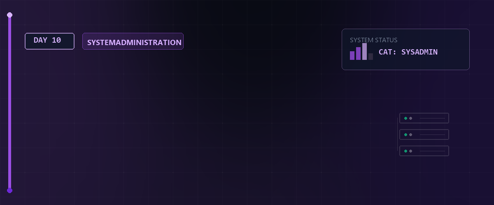

# 📊 Linux Essentials - Tag 10



Am zehnten Tag der Linux Essentials haben wir unser Wissen über reguläre Ausdrücke (Regex) weiter vertieft und in der Praxis angewendet. Der Fokus lag auf der automatisierten Auswertung und statistischen Analyse von Netzwerkdiensten und Ports unter Verwendung von Bash-Loops und fortgeschrittenen Text-Pipelines.

---

## 📑 Inhaltsverzeichnis

* [Lernziele (LPIC-1 relevant)](#-lernziele-lpic-1-relevant)
* [Fortgeschrittene Datenextraktion der Netzwerkdienste](#️-1-fortgeschrittene-datenextraktion-der-netzwerkdienste)
* [Port-Zählung nach Ziffernlänge (Grob- bis Feinanalyse)](#-2-port-zählung-nach-ziffernlänge-grob--bis-feinanalyse)
* [Bash-Automatisierung mit For-Loops](#-3-bash-automatisierung-mit-for-loops)
* [Protokoll-Diversität & statistische Auswertung](#-4-protokoll-diversität--statistische-auswertung)
* [Ressourcen & Dokumente](#-ressourcen--dokumente)
* [Zurück zur Übersicht](#-zurück-zur-übersicht)

---

## 🎯 Lernziele (LPIC-1 relevant)

* **Pipeline-Kombination:** Komplexe Filterketten mit `grep`, `cut`, `sort` und `wc` aufbauen.
* **Muster-Extraktion:** Gezielte Verwendung von `grep -oE`, um ausschließlich Treffer ohne Restzeile zu isolieren.
* **Automatisierung:** Skripting von Schleifen direkt in der interaktiven Shell zur iterativen Datenauswertung.
* **Dienst-Analyse:** Verständnis der Struktur von `/etc/services` und Zuordnung von standardisierten Ports.

---

## 🛠️ 1. Fortgeschrittene Datenextraktion der Netzwerkdienste

Die Datei `/etc/services` ist die zentrale Zuordnungsdatenbank für Netzwerkschnittstellen und standardisierte Dienste. Sie enthält Tausende Zeilen mit Kommentaren und Formatierungen.

### Der Extraktionsprozess

Um eine saubere Datenbasis für statistische Auswertungen zu erhalten, haben wir die Datei bereinigt und nur Port- und Protokolldaten im Format `Port/Protokoll` isoliert:

```bash
cat servicesDat | grep -Eo '[0-9]{1,5}/[a-z]{3,4}' > serviceNeu
```

* **`grep -o` (only-matching):** Gibt nur den passenden Textteil aus, nicht die ganze Zeile.
* **`[0-9]{1,5}`:** Matcht Ports von 1 bis 5 Ziffern (0 bis 99999).
* **`/[a-z]{3,4}`:** Matcht den Schrägstrich gefolgt vom Protokollnamen (wie `tcp` oder `udp` mit 3 bis 4 Zeichen).
* **`> serviceNeu`:** Schreibt die bereinigte Liste in die Zieldatei `serviceNeu` (Offline-Datenbasis).

---

## 📊 2. Port-Zählung nach Ziffernlänge (Grob- bis Feinanalyse)

Wir haben untersucht, wie viele Ports einer bestimmten Ziffernlänge (z. B. exakt 3-stellig oder exakt 5-stellig) in der bereinigten Dienstliste existieren.

### Rohdaten-Zählung vs. Eindeutigkeit

Bei der Analyse gibt es einen wesentlichen Unterschied zwischen der Gesamtzahl der Dienst-Einträge und der Anzahl der einzigartigen Ports:

> [!IMPORTANT]  
> **LPIC-1 RELEVANTES PRÜFUNGSWISSEN - Komplexe Pipelines & Datenverarbeitung:**  
> Das Kombinieren mehrerer einfacher Befehle zu einer Pipeline ist das Herzstück von Unix.  
> * **Standard-Pipeline:** `cat servicesDat | grep -Eo '[0-9]+/tcp' | sort -n | uniq | wc -l`  
> * **Bedeutung:**  
>   1. `cat` liest die Daten ein.  
>   2. `grep -Eo` extrahiert nur den Port und das Protokoll.  
>   3. `sort -n` sortiert die Ports **numerisch** (wichtig, da alphabetisch sonst `100` vor `2` stünde!).  
>   4. `uniq` entfernt alle Duplikate (funktioniert nur auf sortierten Daten!).  
>   5. `wc -l` zählt die Zeilen und liefert das Endergebnis.  
> * **Vermeidung von redundanten Pipes:** Ein `cat datei | grep muster` ist funktionell richtig, wird in der Prüfung jedoch oft als redundanter Ressourcenverbrauch bemängelt. Bevorzugen Sie `grep muster datei`.  

> [!IMPORTANT]  
> **LPIC-1 RELEVANTES PRÜFUNGSWISSEN - Interaktive Einzeiler-Schleifen:**  
> Schleifen können direkt in der interaktiven Befehlszeile eingegeben werden, um repetitive Suchen abzukürzen:  
> * Syntax: `for var in liste; do befehl $var; done`  
> * Beispiel: `for p in tcp udp; do echo "Protokoll: $p"; grep -c "/$p" /etc/services; done`  
> * Das Semikolon `;` trennt die einzelnen Abschnitte der Schleife, wenn sie in einer einzigen Zeile geschrieben werden.

* **Gesamtzahl der Vorkommen:** Zählt jeden Eintrag, der dem Muster entspricht.

  ```bash
  cat serviceNeu | grep -E '^[0-9]{3}/tcp' | wc -l
  ```

* **Einzigartige Ports:** Eliminiert mehrfach definierte Ports (z. B. wenn ein Port für mehrere alternative Dienste registriert ist) mit `sort -u`.

  ```bash
  cat serviceNeu | grep -E '^[0-9]{3}/tcp' | sort -u | wc -l
  ```

---

## 🔄 3. Bash-Automatisierung mit For-Loops

Um die Verteilung von Ports aller Längen (1-stellig bis 5-stellig) effizient auszuwerten, haben wir direkt in der Shell interaktive `for`-Schleifen programmiert. Dies spart das manuelle Eintippen für jeden Längenbereich.

### Iterative TCP-Portanalyse

Mit der folgenden Schleife haben wir die Anzahl der einzigartigen TCP-Ports für jede Ziffernlänge von 1 bis 5 ermittelt:

```bash
for k in 1 2 3 4 5; do
    echo -n "$k-stellige TCP-Ports: "
    cat serviceNeu | grep -E '^[0-9]{'$k'}/tcp' | sort -u | wc -l
done
```

### Iterative UDP-Portanalyse

Analog wurde die Analyse für das UDP-Protokoll durchgeführt:

```bash
for k in 1 2 3 4 5; do
    echo -n "$k-stellige UDP-Ports: "
    cat serviceNeu | grep -E '^[0-9]{'$k'}/udp' | sort -u | wc -l
done
```

* **`{'$k'}`:** Setzt den aktuellen Schleifenwert dynamisch in den Regex-Quantifizierer ein.
* **`sort -u`:** Stellt sicher, dass jeder Port in der Statistik nur einmal gezählt wird.

---

## 🌐 4. Protokoll-Diversität & statistische Auswertung

Zuletzt haben wir ermittelt, wie viele verschiedene Netzwerkprotokolle in `/etc/services` definiert sind und welche einzigartig vorkommen.

### Einzigartige Protokolle extrahieren & zählen

Um alle unterschiedlichen Protokollbezeichner (wie `tcp`, `udp`, `sctp`, `ddp` etc.) zu identifizieren:

```bash
cat serviceNeu | grep -oE '[a-z]{3,5}' | sort -u | wc -l
```

* **`grep -oE '[a-z]{3,5}'`:** Extrahiert nur die Buchstaben-Suffixe der Einträge.
* **`sort -u`:** Sortiert alphabetisch und filtert Duplikate heraus.
* **`wc -l`:** Zählt die Zeilen und liefert damit die Summe aller einzigartigen Protokolle im System.

---

## 📚 Ressourcen & Dokumente

Im [Assets](./assets)-Verzeichnis finden Sie weiterführende Informationen:

* [Fachbuch Linux & Programmierung (PDF)](./assets/10.1515_9781683923114.pdf)
* [Linux RegEx Leitfaden (PDF)](./assets/Linux_RegEx.pdf)
* [Historie Tag 10 (TXT)](./assets/rockyHis20260519-1601.txt)

---

## 🔗 Zurück zur Übersicht

[⬅ Zurück zur Übersicht](../README.md)

---

*Erstellt am 19. Mai 2026 für den Linux-Essentials Kurs.*
