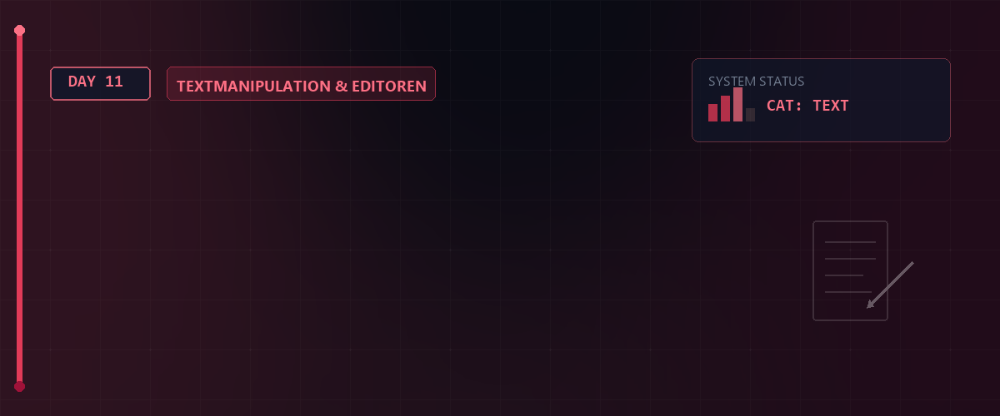
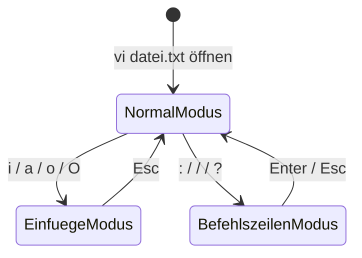

# 📝 Linux Essentials - Tag 11



Am elften Tag der Linux Essentials widmen wir uns einem der wichtigsten Werkzeuge auf jedem Unix- und Linux-System: dem Texteditor **vi** (bzw. seiner erweiterten Version **vim**). Das Beherrschen des vi ist nicht nur essenziell für die tägliche Systemadministration, sondern auch ein zentraler Bestandteil des LPIC-1 Prüfungsziels 103.8.

---

## 📑 Inhaltsverzeichnis

* [Lernziele (LPIC-1 relevant)](#-lernziele-lpic-1-relevant)
* [Die Philosophie von vi / vim](#️-1-die-philosophie-von-vi--vim)
* [Das Drei-Modi-Konzept](#-2-das-drei-modi-konzept)
* [Praktische Tastenkombinationen & Navigation](#️-3-praktische-tastenkombinationen--navigation)
* [Suchen & Ersetzen im Last-Line-Modus](#-4-suchen--ersetzen-im-last-line-modus)
* [Ressourcen & Dokumente](#-ressourcen--dokumente)
* [Zurück zur Übersicht](#-zurück-zur-übersicht)

---

## 🎯 Lernziele (LPIC-1 relevant)

* **Dateimanipulation:** Erstellen, Öffnen und Bearbeiten von Dateien mit vi.
* **Modus-Wechsel:** Fehlerfreie Navigation zwischen Normal-, Einfüge- und Befehlszeilenmodus.
* **Effizientes Editieren:** Zeilen und Wörter löschen, kopieren, verschieben und einfügen ohne Maus.
* **Suchen & Ersetzen:** Textmuster im Dokument suchen und automatisiert austauschen.
* **Dateiverwaltung:** Änderungen speichern, verwerfen und den Editor sicher verlassen.

---

## 🏗️ 1. Die Philosophie von vi / vim

Der Texteditor `vi` (Visual Editor) wurde 1976 von Bill Joy entwickelt und ist auf absolut **jedem** POSIX-kompatiblen System vorinstalliert. Auch wenn moderne Systeme oft den einfacheren Editor `nano` bieten, ist der vi der universelle Rettungsanker: Läuft ein System im Minimal- oder Rettungsmodus, ist `vi` meist der einzige verfügbare Editor.

### Warum vi lernen?

* **Überall verfügbar:** Jede Linux-Distribution besitzt `vi`.
* **Ressourcenschonend:** Läuft extrem schnell, selbst über langsame SSH-Verbindungen.
* **Mauslose Bedienung:** Alle Operationen werden ausschließlich über die Tastatur gesteuert, was das Arbeitstempo nach der Lernphase drastisch erhöht.

---

## 🔄 2. Das Drei-Modi-Konzept

Im Gegensatz zu klassischen Schreibprogrammen arbeitet vi modal. Das bedeutet, dass Tasten je nach aktivem Modus unterschiedliche Funktionen haben.



### Die drei Modi im Detail

1. **Normalmodus (Befehlsmodus):**
   * Dies ist der Standardmodus beim Start.
   * Jede eingegebene Taste wird als Tastaturbefehl interpretiert (z. B. löschen, kopieren, bewegen).
   * Hier kann **kein** Text direkt geschrieben werden.

2. **Einfügemodus (Insert-Modus):**
   * Wird zum Schreiben von Text verwendet.
   * Am unteren Bildschirmrand erscheint `-- EINFÜGEN --` (bzw. `-- INSERT --`).
   * Wechsel in diesen Modus aus dem Normalmodus durch Drücken von `i`, `a`, `o` etc.
   * Rückkehr in den Normalmodus durch Drücken der Taste `Esc`.

3. **Befehlszeilenmodus (Last-Line-Modus / Ex-Modus):**
   * Wird für systemnahe Aktionen wie Speichern, Suchen, Ersetzen oder Konfigurieren genutzt.
   * Wechsel in diesen Modus aus dem Normalmodus durch Eingabe von `:` (Doppelpunkt), `/` (Suchen vorwärts) oder `?` (Suchen rückwärts).
   * Der Cursor springt in die unterste Zeile des Terminals.

---

## ⌨️ 3. Praktische Tastenkombinationen & Navigation

Um im Normalmodus effizient zu navigieren und Text zu bearbeiten, nutzen wir folgende Befehle:

### Cursorbewegung (Navigation)

| Taste | Aktion |
| :---: | :--- |
| `h` | Cursor ein Zeichen nach links bewegen |
| `j` | Cursor eine Zeile nach unten bewegen |
| `k` | Cursor eine Zeile nach oben bewegen |
| `l` | Cursor ein Zeichen nach rechts bewegen |
| `w` | Wortweise vorwärts springen |
| `b` | Wortweise rückwärts springen |
| `0` (Null) | Zum Anfang der aktuellen Zeile springen |
| `$` | Zum Ende der aktuellen Zeile springen |
| `gg` | Zur ersten Zeile des Dokuments springen |
| `G` | Zur letzten Zeile des Dokuments springen |
| `:n` | Direkt zur Zeile *n* springen (z. B. `:42`) |

### Bearbeitungsbefehle (Editionen)

| Taste | Aktion |
| :---: | :--- |
| `x` | Zeichen unter dem Cursor löschen |
| `dw` | Wort ab Cursorposition löschen |
| `dd` | Aktuelle Zeile löschen (in die Zwischenablage ausschneiden) |
| `dG` | Text ab Cursorposition bis zum Dateiende löschen |
| `yy` | Aktuelle Zeile kopieren (Yank) |
| `p` | Zwischenablage nach dem Cursor bzw. unter der aktuellen Zeile einfügen |
| `P` | Zwischenablage vor dem Cursor bzw. über der aktuellen Zeile einfügen |
| `u` | Letzten Schritt rückgängig machen (Undo) |
| `Strg + r` | Rückgängig gemachten Schritt wiederholen (Redo) |

> [!IMPORTANT]  
> **LPIC-1 RELEVANTES PRÜFUNGSWISSEN - Zusätzliche Bearbeitungsbefehle:**  
> * **`J` (Join):** Verbindet die aktuelle Zeile und die darauf folgende Zeile zu einer einzigen Zeile (entfernt den Zeilenumbruch dazwänger).  
> * **`r` (Replace single):** Ersetzt das eine Zeichen unter dem Cursor durch ein danach eingegebenes Zeichen (ohne in den Einfügemodus zu wechseln!).  
> * **`R` (Replace mode):** Wechselt in den Überschreibmodus (Overstrike), bei dem getippte Zeichen den bestehenden Text überschreiben. Verlassen mit `Esc`.  
> * **`cw` (Change word):** Löscht das Wort ab der Cursorposition und wechselt sofort in den Einfügemodus zum Ersetzen des Wortes.  
> * **`cc` (Change line):** Löscht die komplette Zeile und wechselt in den Einfügemodus.  
> * **Zahlenpräfixe (Wiederholungen):** Sie können fast jedem Befehl eine Zahl voranstellen, um ihn mehrfach auszuführen:  
>   * `3dd` = Löscht 3 Zeilen.  
>   * `5yy` = Kopiert (yanked) 5 Zeilen.  
>   * `4w` = Springt 4 Wörter vorwärts.  

### Wechsel in den Einfügemodus

| Taste | Aktion |
| :---: | :--- |
| `i` | Einfügen direkt vor dem Cursor (Insert) |
| `I` | Einfügen am Anfang der aktuellen Zeile |
| `a` | Anfügen direkt nach dem Cursor (Append) |
| `A` | Anfügen am Ende der aktuellen Zeile |
| `o` | Neue leere Zeile unterhalb einfügen |
| `O` | Neue leere Zeile oberhalb einfügen |

---

## 💾 4. Suchen & Ersetzen im Last-Line-Modus

Der Befehlszeilenmodus ermöglicht mächtige globale Manipulationen.

### Speichern & Beenden

| Befehl | Aktion |
| :--- | :--- |
| `:w` | Änderungen in die Datei schreiben (wiederkehrendes Speichern) |
| `:q` | Editor beenden (nur wenn keine ungespeicherten Änderungen vorliegen) |
| `:q!` | Editor sofort beenden und alle Änderungen verwerfen |
| `:wq` oder `:x` | Speichern und vi beenden |

> [!CAUTION]  
> **Unwiderruflicher Datenverlust bei :q! oder ZQ:**  
> Die Befehle `:q!` (Befehlszeilenmodus) und `ZQ` (Normalmodus) beenden den Editor vi/vim sofort **ohne zu speichern**. Alle seit dem letzten Schreibvorgang (`:w`) vorgenommenen Änderungen gehen dabei **unwiederbringlich verloren**. Nutzen Sie diese Befehle nur, wenn Sie Änderungen explizit verwerfen möchten!

> [!IMPORTANT]  
> **LPIC-1 RELEVANTES PRÜFUNGSWISSEN - Beenden & Wiederherstellung:**  
> * **Tastatur-Kurzbefehle zum Beenden (Normalmodus):**  
>   * **`ZZ`**: Speichert und beendet `vi` (entspricht `:wq`).  
>   * **`ZQ`**: Beendet `vi` ohne zu speichern (entspricht `:q!`).  
> * **Dateien direkt öffnen:**  
>   * **`vi +42 datei.txt`**: Öffnet die Datei und springt direkt zur Zeile 42.  
>   * **`vi +/suchbegriff datei.txt`**: Öffnet die Datei und springt zum ersten Vorkommen des Suchbegriffs.  
> * **Absturzsicherung & Wiederherstellung:**  
>   Wenn der PC abstürzt oder die SSH-Verbindung abreißt, legt vi eine verdeckte Auslagerungsdatei `.datei.txt.swp` an.  
>   * **`vi -r datei.txt`**: Stellt die ungespeicherten Änderungen aus der `.swp`-Datei wieder her (Recover).  

### Suchen & Ersetzen

* **Suchen vorwärts:** `/Suchbegriff` eingeben und mit `Enter` bestätigen.
* **Suchen rückwärts:** `?Suchbegriff` eingeben und mit `Enter` bestätigen.
* **Weiternavigieren:**
  * `n` springt zum nächsten Treffer in Suchrichtung.
  * `N` springt zum vorherigen Treffer (entgegengesetzt).
* **Globales Ersetzen:**

  ```vim
  :%s/alt/neu/g
  ```

  Ersetzt jedes Vorkommen von `alt` im gesamten Dokument durch `neu`. Das optionale `c` am Ende (`:%s/alt/neu/gc`) fragt vor jedem Ersetzen interaktiv nach einer Bestätigung.

### Hilfreiche Anzeige-Einstellungen

* Zeilennummern einblenden: `:set number` or `:set nu`
* Zeilennummern ausblenden: `:set nonumber` or `:set nonu`

---

## 📚 Ressourcen & Dokumente

Im [Assets](./assets)-Verzeichnis finden Sie weiterführende Informationen:

* [Vim Cheatsheet (PDF)](./assets/Bitlc-vi-Editor.pdf)
* [Detaillierte vi/vim Anleitung (PDF)](./assets/Linux_vi_vim.pdf)

---

## 🔗 Zurück zur Übersicht

[⬅ Zurück zur Übersicht](../README.md)

---

*Erstellt am 20. Mai 2026 für den Linux-Essentials Kurs.*
