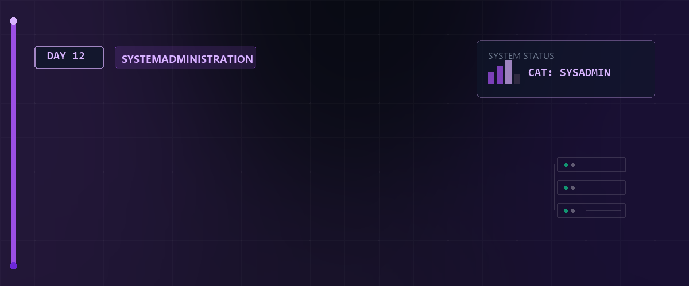

# ⏱️ Linux Essentials Tag 12



Am zwölften Tag der Linux Essentials behandeln wir die zeitgesteuerte Ausführung von Befehlen. Wir konzentrieren uns auf cron, cronjobs und die crontab. Diese Werkzeuge automatisieren wiederkehrende Aufgaben im System.

---

## 📑 Inhaltsverzeichnis

* [Lernziele LPIC-1 relevant](#-lernziele-lpic-1-relevant)
* [Grundlagen zu cron und crontab](#-1-grundlagen-zu-cron-und-crontab)
* [Aufbau einer Crontab](#-2-aufbau-einer-crontab)
* [Crontab Befehle und Editor Konfiguration](#-3-crontab-befehle-und-editor-konfiguration)
* [Ressourcen und Hilfsmittel](#-ressourcen-und-hilfsmittel)
* [Zurück zur Übersicht](#-zurück-zur-übersicht)

---

## 🎯 Lernziele LPIC-1 relevant

* Verständnis des cron Daemons.
* Aufbau und Syntax der crontab beherrschen.
* Eigene cronjobs erstellen und verwalten.
* Den Standardeditor für Systembefehle konfigurieren.

---

## ⚙️ 1. Grundlagen zu cron und crontab

Der cron Daemon läuft im Hintergrund eines Unix Systems. Er führt geplante Aufgaben zu festgelegten Zeiten aus.

* cron: Der Hintergrunddienst für die Ausführung.
* cronjob: Die einzelne geplante Aufgabe.
* crontab: Die Tabelle mit den Konfigurationen der cronjobs. Jede Zeile repräsentiert einen eigenen cronjob.

---

### 🏗️ 2. Aufbau einer Crontab

Eine crontab Zeile besteht aus fünf Zeitfeldern und dem auszuführenden Befehl. Ein Leerzeichen trennt die einzelnen Felder.

**Struktur und Wertebereiche:**

| Position | Feld | Wertebereich | Beschreibung |
| :---: | :--- | :--- | :--- |
| 1 | Minute | 0 bis 59 | Exakte Minute der Ausführung |
| 2 | Stunde | 0 bis 23 | Stunde im 24 Stunden Format |
| 3 | Tag | 1 bis 31 | Tag des Monats |
| 4 | Monat | 1 bis 12 | Monat des Jahres |
| 5 | Wochentag | 0 bis 7 | Wochentag, wobei 0 und 7 dem Sonntag entsprechen |
| 6 | Befehl | Text | Absoluter Pfad zum auszuführenden Kommando oder Skript |

**Sonderzeichen zur Zeitsteuerung:**

| Zeichen | Funktion | Anwendungsbeispiel |
| :---: | :--- | :--- |
| `*` | Jeder mögliche Wert | Ein Stern im Monatsfeld führt den Befehl jeden Monat aus |
| `,` | Trennt diskrete Einzelwerte | `1,15,30` im Tagesfeld führt zur Ausführung am ersten, fünfzehnten und dreißigsten Tag |
| `-` | Definiert einen fortlaufenden Bereich | `1-5` im Wochentagsfeld führt den Befehl von Montag bis Freitag aus |
| `/` | Definiert ein wiederkehrendes Intervall | `*/5` im Minutenfeld löst die Ausführung alle fünf Minuten aus |

### 💡 Praxisbeispiele für Zeitintervalle

Die folgenden Beispiele zeigen typische Konfigurationen für cronjobs.

| cron Syntax | Ausführungszeitpunkt |
| :--- | :--- |
| `0 8 * * 1` | Jeden Montag um 08:00 Uhr |
| `*/15 * * * *` | Alle 15 Minuten |
| `0 22 * * 1-5` | Montag bis Freitag um 22:00 Uhr |
| `0 0 1 * *` | Am ersten Tag jedes Monats um Mitternacht |
| `0 12 1,15 * *` | Am ersten und fünfzehnten Tag des Monats um 12:00 Uhr |
| `*/5 8-17 * * *` | Alle 5 Minuten zwischen 08:00 und 17:59 Uhr |
| `0 4 * * 6,7` | Samstag und Sonntag um 04:00 Uhr |

### 💡 Praxisbeispiele für komplexe Cronjobs

Die folgenden Beispiele zeigen detailliert kommentierte Cronjobs für verschiedene Anwendungsfälle. Die Kommentare entsprechen den erweiterten Vorgaben zur Code Dokumentation.

```bash
# ==============================================================================
# Skript: Systemprüfung
# Beschreibung: Führt das Skript alle 15 Minuten aus.
# Minute: */15 bedeutet alle 15 Minuten
# Stunde: * bedeutet jede Stunde
# Tag: * bedeutet jeden Tag
# Monat: * bedeutet jeden Monat
# Wochentag: * bedeutet jeden Wochentag
# ==============================================================================
*/15 * * * * /usr/local/bin/check_system.sh
```

```bash
# ==============================================================================
# Skript: Wartung
# Beschreibung: Startet das Wartungsskript jeden Werktag um 08:30 Uhr.
# Minute: 30
# Stunde: 8
# Tag: * # Monat: *
# Wochentag: 1 bis 5 bedeutet Montag bis Freitag
# ==============================================================================
30 8 * * 1-5 /opt/scripts/wartung.sh
```

```bash
# ==============================================================================
# Skript: Monatliches Backup
# Beschreibung: Erstellt ein Backup am ersten Tag jedes Monats um Mitternacht.
# Minute: 0
# Stunde: 0
# Tag: 1 bedeutet der erste Tag des Monats
# Monat: *
# Wochentag: *
# ==============================================================================
0 0 1 * * /var/backups/monthly_backup.sh
```

```bash
# ==============================================================================
# Skript: Bericht senden
# Beschreibung: Sendet einen Statusbericht jeden Sonntag um 20:45 Uhr.
# Minute: 45
# Stunde: 20
# Tag: *
# Monat: *
# Wochentag: 0 bedeutet Sonntag
# ==============================================================================
45 20 * * 0 /usr/bin/report_sender.sh
```

```bash
# ==============================================================================
# Skript: Temporäre Dateien löschen
# Beschreibung: Löscht Dateien alle zwei Stunden zwischen 09:00 und 17:00 Uhr an Wochenenden.
# Minute: 0
# Stunde: 9 bis 17 in Zweierschritten
# Tag: *
# Monat: *
# Wochentag: 6 und 0 bedeutet Samstag und Sonntag
# ==============================================================================
0 9-17/2 * * 6,0 /bin/rm_temp_files.sh
```
---

## ⌨️ 3. Crontab Befehle und Editor Konfiguration

Zur Verwaltung der eigenen cronjobs nutzt man den Befehl crontab im Terminal.

Befehle:
* `crontab -e`: Öffnet die crontab zum Bearbeiten.
* `crontab -l`: Listet alle aktiven cronjobs auf.
* `crontab -r`: Löscht die aktuelle crontab vollständig.

Standardmäßig öffnet `crontab -e` den Editor vi oder vim. Zur Nutzung von nano lässt sich die Umgebungsvariable EDITOR dauerhaft anpassen. Dies ist optional.

```bash
# Fügt den Befehl zum Setzen der EDITOR Variable an das Ende der Benutzerprofil Datei an.
# Der doppelte Pfeil >> verhindert das Überschreiben der Datei und hängt den Text unten an.
# Der logische AND Operator && sorgt dafür,
# dass der zweite Befehl nur nach erfolgreichem ersten Befehl ausgeführt wird.
# Der Befehl source liest die Datei sofort neu ein und macht nano im aktuellen Terminal aktiv.
echo "export EDITOR=nano" >> ~/.bash_profile && source ~/.bash_profile
```
---

## 📚 4. Ressourcen und Hilfsmittel
Die Definition der korrekten Zeiten ist fehleranfällig.
Die Webseite crontab.guru übersetzt die Cron Syntax in lesbaren Text und hilft bei der Erstellung komplexer Intervalle.

- Link: [crontab.guru/](https://crontab.guru/)

---

## 🔗 5. Zurück zur Übersicht
⬅ Zurück zur Übersicht

Erstellt am 20. Mai 2026 für den Linux-Essentials Kurs.
