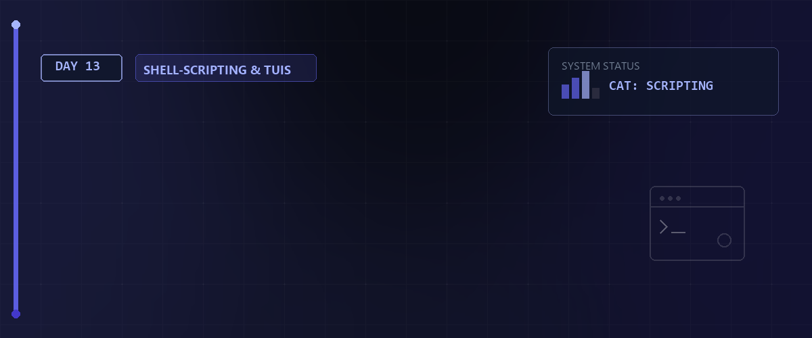

# ⏱️ Linux Essentials Tag 13



Am dreizehnten Tag der Linux Essentials behandeln wir fortgeschrittenes Shell Scripting. Wir fokussieren uns auf die Automatisierung der Benutzerverwaltung und den Aufbau interaktiver Menüs mit Standard Terminal Befehlen und Whiptail.

---

## 📑 Inhaltsverzeichnis

* [Lernziele LPIC-1 relevant](#-lernziele-lpic-1-relevant)
* [Automatisierte Benutzeranlage](#️-1-automatisierte-benutzeranlage)
* [Textbasierte Benutzeroberflächen](#️-2-textbasierte-benutzeroberflächen)
* [Grafische Dialoge mit Whiptail](#️-3-grafische-dialoge-mit-whiptail)
* [Druckersteuerung im Terminal](#️-4-druckersteuerung-im-terminal)
* [Zurück zur Übersicht](#-6-zurück-zur-übersicht)

---

## 🗂️ Übersicht der Skripte

Der Tag 13 beinhaltet vier zentrale Bash Skripte zur Systemadministration:

| Skriptname | Hauptfunktion | LPIC-1 Relevanz |
| :--- | :--- | :--- |
| `user_provisioning.sh` | Massenanlage von Benutzern aus CSV Dateien | Hoch |
| `user_deprovisioning.sh` | Standardisiertes Löschen von Benutzerkonten | Hoch |
| `user_manager.sh` | Textbasiertes Auswahlmenü für Administration | Mittel |
| `whiptail_manager.sh` | Grafisches TUI Menü mit Druckfunktion | Mittel |

---

## 🎯 Lernziele LPIC-1 relevant

* **Benutzerverwaltung:** Anwendung von `useradd`, `chpasswd` und Verständnis der Systemdateien.
* **Shell Scripting Grundlagen:** Nutzung von Schleifen `while`, Bedingungen `if` sowie `case` Verzweigungen.
* **Textverarbeitung und Filter:** Modifikation von Datenströmen mit `grep`, `tr` und `sed`.
* **Druckerkonfiguration:** Verwaltung von Druckaufträgen mit `lp` und Statusabfragen mit `lpstat`.
* **Paketverwaltung:** Automatisierte Erkennung und Installation von Softwarepaketen.

---

## ⚙️ 1. Automatisierte Benutzeranlage

Skripte übernehmen das massenhafte Anlegen von Benutzerkonten effizient und fehlerfrei. Unser Skript liest Daten aus einer unformatierten CSV Datei ein und bereinigt diese im ersten Schritt. Das Werkzeug pwgen generiert sichere Initialpasswörter für jeden neuen Account. Die Systembefehle useradd und chpasswd erstellen das Konto und weisen das generierte Systempasswort zu. Alle Vorgänge dokumentiert das Skript in einer dedizierten Protokolldatei.

Das Skript `user_provisioning.sh` demonstriert die automatisierte Verarbeitung einer unformatierten CSV Quelldatei.

**Kernfunktionen und LPIC-1 Bezüge:**

* **Textbereinigung:** Der Befehl `tr` wandelt inkompatible Zeilenumbrüche um. Der Befehl `grep` filtert valide Datenzeilen anhand regulärer Ausdrücke.
* **Datenmanipulation:** Der Befehl `sed` ersetzt Umlaute konform. Die native Bash Zeichenkettenmanipulation extrahiert Präfixe für Benutzernamen.
* **Kontoerstellung:** Der Befehl `useradd` legt Systemkonten mit Heimatverzeichnis und Standard Shell an.
* **Passwortzuweisung:** Das Werkzeug `pwgen` generiert kryptografisch sichere Zeichenketten. Der Befehl `chpasswd` verarbeitet diese direkt per Standardeingabe.
* **Sicherheitsarchitektur:** Die gesetzten Optionen `set -e` und `set -o pipefail` erzwingen einen sofortigen Skriptabbruch bei auftretenden Fehlern.

> [!IMPORTANT]  
> **LPIC-1 RELEVANTES PRÜFUNGSWISSEN - Die User- & Gruppen-Datenbanken:**  
> Sie müssen den exakten Aufbau und die Felder der Systemdateien kennen!  
> * **`/etc/passwd` (7 Felder):**  
>   `username : x : UID : GID : GECOS/Kommentar : Heimatverzeichnis : Login-Shell`  
>   *Das `x` im 2. Feld verweist darauf, dass Passwörter schattenverschlüsselt in `/etc/shadow` liegen.*  
> * **`/etc/shadow` (9 Felder):**  
>   `username : Passwort-Hash : Letzte Änderung (Tage seit 1.1.1970) : Min. Tage bis Änderung : Max. Tage Gültigkeit : Warnzeit (Tage) : Inaktivitäts-Tage : Ablaufdatum (Tage seit 1970) : Reserviert`  
> * **`/etc/group` (4 Felder):**  
>   `gruppenname : gruppenpasswort : GID : durch Kommas getrennte Mitgliederliste`  

> [!IMPORTANT]  
> **LPIC-1 RELEVANTES PRÜFUNGSWISSEN - User- & Gruppenbefehle:**  
> * **`useradd` (Konto anlegen):**  
>   * `-m`: Erstellt das Home-Verzeichnis (kopiert Vorlagen aus `/etc/skel/*`).  
>   * `-s <Shell>`: Definiert die Standard-Shell (z.B. `/bin/bash` oder `/sbin/nologin` für System-Accounts).  
>   * `-u <UID>`: Weist eine spezifische Benutzer-ID zu.  
>   * `-g <Gruppe>`: Primäre Gruppe (Name oder GID).  
>   * `-G <Gruppen>`: Komma-separierte Liste von sekundären Gruppen.  
> * **`usermod` (Konto modifizieren):**  
>   * `-d <Pfad> -m`: Ändert das Home-Verzeichnis und **verschiebt (`-m`)** alle vorhandenen Dateien dorthin.  
>   * `-aG <Gruppen>`: Fügt den User zu weiteren Gruppen hinzu.  
>     > [!WARNING]  
>     > **Kritische Prüfungsfalle:** Wenn Sie das **`-a` (append)** vergessen und nur `-G` nutzen, wird der Benutzer aus allen anderen sekundären Gruppen gelöscht!  
>   * `-L` / `-U`: Sperrt (Lock) oder entsperrt (Unlock) den Account (fügt ein `!` vor dem Passwort-Hash in `/etc/shadow` ein).  
> * **`userdel` (Konto löschen):**  
>   * **`-r`**: Löscht den Benutzer **und** entfernt sein Heimatverzeichnis sowie seine E-Mail-Spool-Datei komplett.  
> * **`chage` (Passwort-Alterung verwalten):**  
>   * `-l <user>`: Listet alle Alterungsdaten auf.  
>   * `-M <Tage>`: Maximale Gültigkeit des Passworts.  
>   * `-m <Tage>`: Mindestalter des Passworts, bevor es erneut geändert werden darf.  
>   * `-E <Datum>`: Ablaufdatum des Kontos (Format YYYY-MM-DD).

---

## ⌨️ 2. Textbasierte Benutzeroberflächen

Ein Menüskript steuert die Ausführung verschiedener Administrationsaufgaben. Eine while Schleife hält das Menü dauerhaft offen. Die case Verzweigung wertet die Benutzereingabe aus und startet die entsprechenden Unterskripte zur Provisionierung oder Deprovisionierung.

```bash
# ==============================================================================
# Skript: Interaktives Konsolenmenü
# Beschreibung: Hält eine Eingabeaufforderung über eine Endlosschleife aufrecht.
# while true: Startet eine Schleife mit dauerhafter Gültigkeit
# read: Liest die Benutzereingabe in die Variable choice ein
# case: Prüft die Variable choice gegen definierte Muster
# ==============================================================================
while true; do
    echo "1 für Provisionierung, 2 für Ende"
    read -r choice
    case "$choice" in
        1) ./user_provisioning.sh ;;
        2) exit 0 ;;
    esac
done
```

---

## 🖼️ 3. Grafische Dialoge mit Whiptail

Das Werkzeug whiptail erzeugt grafische Fenster direkt im Terminal. Es bietet Funktionen für Messageboxen, Menüs und scrollbare Textboxen. Dies erhöht den Bedienkomfort für Administratoren erheblich. Das Skript fängt die Auswahl des Benutzers ab und leitet die Ausführung entsprechend weiter.

Zwei Skripte bieten unterschiedliche Ansätze für Administrationsmenüs.

**Das Standardskript `user_manager.sh`:**
Baut auf reinen Bash Builtins auf. Eine Endlosschleife `while true` hält das Programm aktiv. Der Befehl `read` nimmt Eingaben entgegen. Die Kontrollstruktur `case` leitet in die entsprechenden Unterskripte weiter.

**Das erweiterte Skript `whiptail_manager.sh`:**
Nutzt das externe Paket `whiptail` für grafische Fenster direkt im Terminal.

* **Messageboxen:** Zeigen Warnungen und Erfolgsmeldungen an.
* **Scrolltext:** Liest die generierte Protokolldatei `userlog.md` ein und stellt sie navigierbar dar.
* **Menüs:** Bieten eine fehlerresistente Navigation per Pfeiltasten.

```bash
# ==============================================================================
# Skript: Whiptail Dialogausgabe
# Beschreibung: Erzeugt ein interaktives Auswahlmenü für den Benutzer.
# whiptail: Hauptbefehl zur Erzeugung der grafischen Oberfläche
# title: Setzt den Titel des Fensters
# menu: Definiert den Typ des Dialogs als Menüauswahl
# Parameter 15 60 6: Definieren Höhe Breite und Anzahl der sichtbaren Menüpunkte
# ==============================================================================
whiptail --title "Hauptmenü" --menu "Bitte wählen:" 15 60 6 "1" "Benutzer anlegen" "2" "Ende"
```

---

## 🖨️ 4. Druckersteuerung im Terminal

Protokolle lassen sich direkt aus dem Skript heraus auf physischen Druckern ausgeben. Der Befehl lpstat listet alle konfigurierten Drucker im System auf. Der Befehl lp sendet die gewünschte Textdatei an das gewählte Zielgerät. Im whiptail Skript integrieren wir diese Befehle für einen reibungslosen Workflow.

Das Skript `whiptail_manager.sh` integriert LPIC-1 relevante Druckfunktionen direkt in die Oberfläche.

**Verwendete Befehle:**

* `lpstat -e`: Listet alle aktiven und verfügbaren Druckerziele auf. Das Skript iteriert über diese Liste und baut daraus dynamisch ein Auswahlmenü.
* `lp -d`: Sendet die ausgewählte Protokolldatei an das spezifizierte Druckerziel. Die Standardfehlerausgabe wird abgefangen und bei Problemen transparent in einer grafischen Messagebox visualisiert.

---

## 🧠 Wissenstest: Fortgeschrittenes Scripting & TUI

Hier sind typische Fragen rund um TUI-Erstellung, Massenverwaltung und Drucksysteme:

<details>
<summary><b>Fragen zu Druckersteuerung & CSV-Verarbeitung</b> (Klicken zum Ausklappen)</summary>

1. **Mit welchen Befehlen fragt man den Druckerstatus ab und druckt eine Datei?**
   <details><summary>Antwort</summary>Mit **`lpstat -p`** (oder **`lpstat -e`** für eine reine Liste der Ziele) wird der Status abgefragt. Eine Datei druckt man mit **`lp -d <Druckername> <Datei>`**.</details>

2. **Wie liest man eine kommagetrennte CSV-Datei zeilenweise sicher in der Shell ein?**
   <details><summary>Antwort</summary>Das geschieht am besten über eine **`while`**-Schleife mit angepasstem **`IFS`** (Internal Field Separator):

```bash
while IFS=',' read -r spalte1 spalte2; do
    echo "Feld 1: $spalte1, Feld 2: $spalte2"
done < datei.csv
```

</details>

</details>

<details>
<summary><b>Fragen zu TUI & Sicherheitsflags</b> (Klicken zum Ausklappen)</summary>

1. **Welchen großen Vorteil bietet `whiptail` für systemadministrative Aufgaben?**
   <details><summary>Antwort</summary>Es ermöglicht das einfache Erzeugen von textbasierten grafischen Dialogfenstern (Menüs, Passworteingaben, Ja/Nein-Entscheidungen, Ladebalken) direkt auf der Kommandozeile. Dies minimiert Falscheingaben von Anwendern und erhöht den Komfort.</details>

2. **Was bewirkt die Kombination aus `set -e` und `set -o pipefail`?**
   <details><summary>Antwort</summary>**`set -e`** bricht das Skript sofort ab, wenn ein einzelner Befehl fehlschlägt (Exit-Code ungleich 0).  
   **`set -o pipefail`** stellt sicher, dass dies auch für Pipelines gilt. Normalerweise wird nur der Rückgabewert des *letzten* Glieds einer Pipeline ausgewertet; mit `pipefail` schlägt die gesamte Kette fehl, wenn ein beliebiges Glied fehlschlägt (z. B. `fehlerhafter_befehl | grep "test"`).</details>

</details>

## 📚 Ressourcen & Dokumente
Im [Assets](./assets)-Verzeichnis finden Sie die Unterlagen zu diesem Tag:

- [Benutzerverwaltung Leitfaden (PDF)](./assets/SkriptBenutzererwaltung.pdf)
- [Kurs-Historie Tag 13 (TXT)](./assets/rockyHis20260522-1600.txt)
- [Praxis-Aufgabe (User-Massenanlage) (TXT)](./assets/userAnlegen-admin-debian-mint)
- [Praxis-Historie (Root-User-Verwaltung) (TXT)](./assets/history-root-admin-userVerwaltung-202606091643)

---

## 🔗 6. Zurück zur Übersicht

[⬅ Zurück zur Übersicht](../README.md)

---

*Erstellt am 22. Mai 2026 für den Linux Essentials Kurs.*
