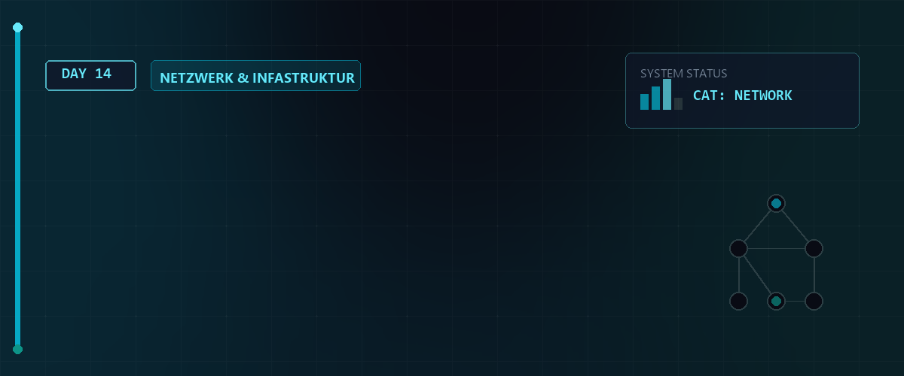

# 🧠 LPIC-1 Master-Studienführer & Leistungsabfrage — Tag 14



> **Entwickler & Administrator:** Tobias Boyke  
> **Fokus:** Umfassendes Referenzwerk für die LPIC-1 Zertifizierung (LPI-101 & LPI-102)  
> **Status:** 🚀 100% Dokumentiert & Vertieft  

---

## 📑 Inhaltsverzeichnis
- [🔐 1. Berechtigungen, Spezialrechte & umask](#-1-berechtigungen-spezialrechte--umask)
- [🚦 2. Prozess-Management, Signale & Job Control](#-2-prozess-management-signale--job-control)
- [🐚 3. Shell Scripting, Parameter & Arithmetik](#-3-shell-scripting-parameter--arithmetik)
- [📦 4. Archivierung, Kompression & dd](#-4-archivierung-kompression--dd)
- [📝 5. Text-Editoren: Der vi / vim Guide](#-5-text-editoren-der-vi--vim-guide)
- [⏰ 6. Automatisierte Aufgaben: cron, anacron & at](#-6-automatisierte-aufgaben-cron-anacron--at)
- [❓ 7. LPIC-1 Prüfungs-Simulationsfragen & Antworten](#-7-lpic-1-prüfungs-simulationsfragen--antworten)
- [🔗 Zurück zur Übersicht](#-zurück-zur-übersicht)

---

## 🔐 1. Berechtigungen, Spezialrechte & umask

Das Linux-Sicherheitsmodell basiert auf Dateizugriffsrechten. Für LPIC-1 müssen Sie die symbolische und oktale Notation im Schlaf beherrschen.

### Standardrechte & Oktalwerte
Jede Datei besitzt Rechte für den **Besitzer (User `u`)**, die **Gruppe (Group `g`)** und **Andere (Others `o`)**.

* **`r` (Read, oktal 4):** Erlaubt Lesen von Dateien / Auflisten von Verzeichnissen (`ls`).
* **`w` (Write, oktal 2):** Erlaubt Ändern von Dateien / Erstellen und Löschen von Dateien in Verzeichnissen.
* **`x` (Execute, oktal 1):** Erlaubt Ausführen von Programmen / Betreten von Verzeichnissen (`cd`).

> [!IMPORTANT]  
> **LPIC-1 RELEVANTES WISSEN - Verzeichnisrechte-Besonderheit:**  
> Wenn ein Benutzer für ein Verzeichnis Leserecht (`r`), aber **kein Ausführrecht (`x`)** besitzt, kann er den Inhalt zwar auflisten, darf aber nicht in das Verzeichnis wechseln (`cd`) und erhält keine Metadaten (wie Inode oder Größe) der darin liegenden Dateien!

### umask (User Mask)
Die `umask` maskiert (entzieht) Rechte bei der Dateierstellung.
* Standard-Ausgangsbasis für Dateien: **`666`** (Ausführrechte werden niemals standardmäßig vergeben).
* Standard-Ausgangsbasis für Verzeichnisse: **`777`**.

**Beispiel:** Eine `umask` von `022` entzieht Schreibrechte für Gruppe und Andere:
* Datei: `666 - 022 = 644` (`rw-r--r--`)
* Ordner: `777 - 022 = 755` (`rwxr-xr-x`)

> [!TIP]  
> Mit **`umask -S`** können Sie sich die aktuelle Maske in symbolischer, lesbarer Form anzeigen lassen (z.B. `u=rwx,g=rx,o=rx`).

### Spezialrechte (SUID, SGID, Sticky Bit)
* **SUID (Set User ID, oktal 4000):** Führt die Datei mit den Rechten des Besitzers aus (z.B. `/usr/bin/passwd`). Symbolisch: `rwsr-xr-x` (kleines `s` = `x` gesetzt; großes `S` = `x` nicht gesetzt).
* **SGID (Set Group ID, oktal 2000):** Führt Datei mit Rechten der Gruppe aus. Auf Ordnern vererbt es die übergeordnete Gruppe an neu erstellte Dateien. Symbolisch: `rwxr-sr-x`.
* **Sticky Bit (oktal 1000):** Verhindert, dass Benutzer Dateien anderer Benutzer im Verzeichnis löschen (z.B. `/tmp`). Symbolisch: `rwxrwxrwt` (kleines `t` = `x` gesetzt; großes `T` = `x` nicht gesetzt).

---

## 🚦 2. Prozess-Management, Signale & Job Control

Unter Linux ist jeder Task ein Prozess mit einer eindeutigen PID. 

### Prozess-Zustände (STAT in `ps aux`)
* **`R` (Running):** Aktiv auf der CPU oder bereit zur Abarbeitung.
* **`S` (Sleeping):** Wartet interruptibel auf Ereignisse.
* **`D` (Uninterruptible Sleep):** Wartet meist auf I/O. **Kann nicht durch Signale (selbst SIGKILL) beendet werden.**
* **`Z` (Zombie):** Beendeter Prozess, dessen Exit-Status nicht vom Parent abgefragt wurde. Belegt eine PID.
* **`T` (Stopped):** Durch Signal (wie `SIGSTOP`) angehalten.

### LPIC-1 Signaltabelle (Auswendig lernen!)
Signale werden mit `kill -<Signal> <PID>` gesendet.

| ID | Name | Wirkung |
| :---: | :--- | :--- |
| **1** | `SIGHUP` | Hangup. Trennung des Terminals oder **Neuladen von Konfigurationsdateien**. |
| **2** | `SIGINT` | Interrupt. Tastaturabbruch per **`Strg + C`**. |
| **3** | `SIGQUIT` | Beendet den Prozess und schreibt einen Core Dump. |
| **9** | `SIGKILL` | **Erzwungenes Beenden.** Kann vom Prozess weder abgefangen noch ignoriert werden. |
| **15** | `SIGTERM` | **Standard-Terminierung.** Erlaubt sauberes Beenden und Aufräumen (Standard bei `kill`). |
| **18** | `SIGCONT` | Setzt einen pausierten Prozess fort. |
| **19** | `SIGSTOP` | **Pausiert den Prozess.** Kann vom Prozess weder abgefangen noch ignoriert werden. |

### Job Control
* **`befehl &`**: Startet den Prozess direkt im Hintergrund.
* **`Strg + Z`**: Pausiert den laufenden Vordergrundprozess (sendet `SIGSTOP`).
* **`jobs`**: Listet alle Jobs der aktuellen Shell auf.
* **`fg %1`** / **`bg %1`**: Holt Job 1 in den Vordergrund / lässt ihn im Hintergrund fortlaufen.

### Priorisierung (`nice` & `renice`)
* **Bereich:** `-20` (höchste Prio) bis `19` (niedrigste Prio). Standardwert: `0`.
* **Regel:** Normale Benutzer dürfen den Wert nur erhöhen (weniger CPU-Zeit beanspruchen). Nur **root** darf negative Werte vergeben.

---

## 🐚 3. Shell Scripting, Parameter & Arithmetik

### Positionsparameter (Argumente)
* `$0`: Name des aufgerufenen Skripts.
* `$1` bis `$9`: Erstes bis neuntes Argument.
* `${10}`: Ab dem zehnten Argument sind geschweifte Klammern zwingend erforderlich!
* `$#`: Anzahl der übergebenen Argumente.
* `$*` vs. `$@`: `"$*"` expandiert zu einem einzelnen String. `"$@"` expandiert zu einer Liste separater, geschützter Argumente.
* `$?`: Exit-Status des letzten Befehls (0 = Erfolg, >0 = Fehler).

> [!IMPORTANT]  
> **LPIC-1 RELEVANTES WISSEN - shift:**  
> Der Befehl **`shift`** verschiebt die Positionsparameter um eine Stelle nach links: `$1` wird gelöscht, `$2` wird zu `$1`, `$#` verringert sich um 1. Sehr nützlich für Argumentschleifen.

### Dateitests in Skripten
* `-f <Pfad>`: Reguläre Datei vorhanden.
* `-d <Pfad>`: Verzeichnis vorhanden.
* `-e <Pfad>`: Existiert (egal was).
* `-s <Pfad>`: Datei ist nicht leer (Größe > 0 Bytes).
* `-L <Pfad>`: Ist ein symbolischer Link.

---

## 📦 4. Archivierung, Kompression & dd

### tar (Tape Archiver)
* **`-c` (create):** Erstellt ein Archiv.
* **`-x` (extract):** Entpackt ein Archiv.
* **`-t` (list):** Listet den Inhalt auf.
* **`-f` (file):** Gibt den Zieldateinamen an (**muss immer als letztes Flag stehen**!).
* **Kompressions-Flags:**
  * **`-z`** (`gzip` -> `.tar.gz`)
  * **`-j`** (`bzip2` -> `.tar.bz2`)
  * **`-J`** (`xz` -> `.tar.xz`)
* **`-C <Verzeichnis>`**: Wechselt vor der Operation in das Verzeichnis.

### cpio & dd
* **`cpio`**: Liest Dateilisten von stdin.
  * `-o` = copy-out (Archiv erstellen), `-i` = copy-in (entpacken), `-H newc` = SVR4 portable Format (wichtig für Boot-Images).
  * Beispiel: `find . | cpio -o -H newc > archiv.cpio`
* **`dd`**: Kopiert Rohdaten bitweise.
  * `if` (input file), `of` (output file), `bs` (block size), `count` (Anzahl Blöcke), `skip` (Eingabe überspringen), `seek` (Ausgabe überspringen).

---

## 📝 5. Text-Editoren: Der vi / vim Guide

Der Standardeditor `vi` arbeitet modal.

### Die drei Modi
1. **Normalmodus (Befehlsmodus):** Standard beim Start. Tasten sind Befehle.
2. **Einfügemodus (Insert-Modus):** Zum Schreiben. Wechsel mit `i` (Insert), `a` (Append), `o` (neue Zeile unterhalb). Zurück mit `Esc`.
3. **Befehlszeilenmodus (Last-Line-Modus):** Wechsel mit `:` oder `/` oder `?`.

### Essenzielle Tasten & Befehle (Normalmodus)
* **`h`, `j`, `k`, `l`:** Cursor nach links, unten, oben, rechts bewegen.
* **`w` / `b`:** Wortweise vorwärts / rückwärts springen.
* **`0` / `$`:** Anfang / Ende der aktuellen Zeile.
* **`gg` / `G`:** Erste / letzte Zeile des Dokuments.
* **`dd`:** Zeile löschen / ausschneiden. (`3dd` = löscht 3 Zeilen).
* **`yy`:** Zeile kopieren. (`5yy` = kopiert 5 Zeilen).
* **`p`:** Kopierten Inhalt nach dem Cursor/unter der Zeile einfügen.
* **`J` (Join):** Verbindet die aktuelle mit der nächsten Zeile.
* **`u` / `Strg + r`:** Undo / Redo.
* **`ZZ`:** Speichern und beenden (Normalmodus-Kurzbefehl).
* **`ZQ`:** Beenden ohne Speichern.

### Last-Line-Befehle (mit `:`)
* `:wq` oder `:x`: Speichern und Beenden.
* `:q!`: Sofort beenden und alle Änderungen verwerfen.
* `:%s/alt/neu/g`: Ersetzt global `alt` durch `neu` im ganzen Dokument.
* `/suchbegriff`: Sucht vorwärts nach Begriff. (`n` = nächster Treffer, `N` = vorheriger).
* **Wiederherstellung:** `vi -r datei.txt` stellt die Datei aus der verdeckten `.swp`-Auslagerungsdatei wieder her.

---

## ⏰ 6. Automatisierte Aufgaben: cron, anacron & at

### Benutzer-Crontab (via `crontab -e`)
Jeder Benutzer verwaltet seine eigene Crontab. Die Syntax besteht aus **5 Zeitfeldern** und dem Befehl:

```text
*   *   *   *   *   /pfad/zum/befehl
│   │   │   │   │
│   │   │   │   └── Wochentag (0-7, 0/7 = Sonntag)
│   │   │   └────── Monat (1-12)
│   │   └────────── Tag des Monats (1-31)
│   └────────────── Stunde (0-23)
└────────────────── Minute (0-59)
```

### System-Crontab (`/etc/crontab` & `/etc/cron.d/*`)
Verfügt über ein **zusätzliches 6. Feld** für den auszuführenden **Benutzer**:
`* * * * * root /usr/local/bin/system_backup.sh`

### anacron (Offline-Taskplaner)
Holt verpasste Aufgaben (z.B. nach Systemausfall/Herunterfahren) beim Systemstart nach.
* **Konfigurationsdatei:** `/etc/anacrontab`.
* **Syntax:** `Periode (in Tagen)   Verzögerung (in Minuten)   Job-ID   Befehl`.
* Unterstützt keine minutengenauen Planungen.

### at & batch (Einmalige Ausführung)
* **`at <Uhrzeit>`**: Planen einer Aufgabe (z.B. `at now + 2 hours`). Bestätigen mit `Strg + D`.
* **`atq`**: Zeigt alle anstehenden `at`-Jobs an.
* **`atrm <ID>`**: Entfernt den Job.
* **`batch`**: Führt einen einmaligen Job aus, sobald die Systemlast unter `0.8` (bzw. standardmäßig `1.5`) sinkt.
* **Berechtigungssteuerung:** Über `/etc/cron.allow` und `/etc/cron.deny` (bzw. `/etc/at.allow` und `/etc/at.deny`).

---

## ❓ 7. LPIC-1 Prüfungs-Simulationsfragen & Antworten

Hier sind 7 typische Prüfungsfragen zur direkten Vorbereitung:

<details>
<summary><b>Frage 1: umask Berechnung (Klicken zum Ausklappen)</b></summary>
<b>Frage:</b> Welche Zugriffsrechte (oktal und symbolisch) erhält eine neu erstellte Textdatei, wenn die aktuelle <code>umask</code> auf <code>027</code> gesetzt ist?<br>
<details>
<summary>Antwort anzeigen</summary>
<b>Antwort:</b> <b>640</b> (<code>rw-r-----</code>).<br>
<b>Erklärung:</b> Die maximale Standardberechtigung für neu erstellte Dateien beträgt <code>666</code> (keine Execute-Rechte). Die Berechnung lautet: <code>666</code> abzüglich der Maske <code>027</code> (oktal subtrahiert ohne Übertrag):
* User: 6 - 0 = 6 (`rw-`)
* Group: 6 - 2 = 4 (`r--`)
* Others: 6 - 7 -> wird auf 0 gesetzt (`---`)  
Somit ergibt sich 640.
</details>
</details>

<details>
<summary><b>Frage 2: System- vs. Benutzer-Crontab (Klicken zum Ausklappen)</b></summary>
<b>Frage:</b> Sie fügen einen Cronjob direkt in die Datei <code>/etc/crontab</code> ein. Worauf müssen Sie im Vergleich zur Eingabe über <code>crontab -e</code> zwingend achten?<br>
<details>
<summary>Antwort anzeigen</summary>
<b>Antwort:</b> Sie müssen zwischen den Zeitfeldern und dem Befehl zwingend den **Benutzernamen** angeben, unter dessen Identität der Befehl ausgeführt werden soll (z.B. <code>root</code>).<br>
<b>Erklärung:</b> Benutzer-Crontabs führen Befehle implizit als der Besitzer der Crontab aus. Die systemweite Datei <code>/etc/crontab</code> erfordert aus Sicherheitsgründen die explizite Angabe des Users im 6. Feld.
</details>
</details>

<details>
<summary><b>Frage 3: Prozess-Signale (Klicken zum Ausklappen)</b></summary>
<b>Frage:</b> Welches Signal sendet die Tastaturkombination <code>Strg + C</code> standardmäßig an den aktiven Vordergrundprozess? Nennen Sie Name und Signalnummer.<br>
<details>
<summary>Antwort anzeigen</summary>
<b>Antwort:</b> **SIGINT** (Signalnummer **2**).<br>
<b>Erklärung:</b> SIGINT unterbricht den Prozess und kann von diesem abgefangen werden, um beispielsweise geordnet herunterzufahren.
</details>
</details>

<details>
<summary><b>Frage 4: cp-Archivierung (Klicken zum Ausklappen)</b></summary>
<b>Frage:</b> Welcher <code>cp</code>-Befehl kopiert das Verzeichnis <code>/src</code> nach <code>/backup</code> und erhält dabei sämtliche Metadaten (Berechtigungen, Zeitstempel, Besitzer) und symbolische Links?<br>
<details>
<summary>Antwort anzeigen</summary>
<b>Antwort:</b> <b><code>cp -a /src /backup</code></b> (oder <code>cp -dpR /src /backup</code>).<br>
<b>Erklärung:</b> Die Option <code>-a</code> (Archive) ist eine Kombination aus <code>-d</code> (erhält symbolische Links), <code>-p</code> (erhält Attribute wie Zeitstempel und Rechte) und <code>-R</code> (kopiert rekursiv).
</details>
</details>

<details>
<summary><b>Fragen 5: cpio Format (Klicken zum Ausklappen)</b></summary>
<b>Frage:</b> Mit welchem Flag legen Sie bei der Erstellung eines <code>cpio</code>-Archivs das für initramfs-Images gebräuchliche portable Format fest?<br>
<details>
<summary>Antwort anzeigen</summary>
<b>Antwort:</b> Mit der Option **`-H newc`** (oder `--format=newc`).<br>
<b>Erklärung:</b> Das Format <code>newc</code> erzeugt ein SVR4-kompatibles, portables Archiv mit Header-Informationen, welches vom Linux-Kernel beim Booten direkt gelesen werden kann.
</details>
</details>

<details>
<summary><b>Frage 6: vi Join-Kommando (Klicken zum Ausklappen)</b></summary>
<b>Frage:</b> Welcher Ein-Tasten-Befehl verbindet im Normalmodus des Editors <code>vi</code> die aktuelle Zeile mit der direkt darunterliegenden Zeile?<br>
<details>
<summary>Antwort anzeigen</summary>
<b>Antwort:</b> **`J`** (großes J).<br>
<b>Erklärung:</b> Das Join-Kommando `J` entfernt den Zeilenumbruch und fügt stattdessen ein Leerzeichen ein, um beide Zeilen zusammenzuführen.
</details>
</details>

<details>
<summary><b>Frage 7: anacron Eigenschaften (Klicken zum Ausklappen)</b></summary>
<b>Frage:</b> Warum kann <code>anacron</code> nicht verwendet werden, um ein Skript stündlich auszuführen?<br>
<details>
<summary>Antwort anzeigen</summary>
<b>Antwort:</b> Weil die kleinste Zeiteinheit von <code>anacron</code> **Tage** sind. Intervalle im Bereich von Minuten oder Stunden werden von anacron syntaktisch nicht unterstützt.<br>
<b>Erklärung:</b> Anacron ist für unregelmäßig laufende Systeme konzipiert, um tägliche, wöchentliche oder monatliche Aufgaben nachzuholen. Stündliche Aufgaben erfordern einen permanent aktiven <code>cron</code>-Daemon.
</details>
</details>

---

---

## 🧠 LPIC-1 Relevanz & Wissenstest

<details>
<summary><b>Fragen zu Netzwerk-Grundlagen & Schnittstellen (Klicken zum Ausklappen)</b></summary>

1. **Welcher Runlevel steht traditionell für das Herunterfahren (Shutdown) des Systems?**
   <details><summary>Antwort</summary>Runlevel 0.</details>

2. **Welche systemd-Unit entspricht dem klassischen Runlevel 3 (Multi-User-Modus ohne GUI)?**
   <details><summary>Antwort</summary>`multi-user.target`.</details>

3. **Mit welchem Befehl liest man den aktuellen Kernel-Ringpuffer aus?**
   <details><summary>Antwort</summary>`dmesg`.</details>

4. **In welcher Datei werden statische Informationen zu einhängbaren Dateisystemen konfiguriert?**
   <details><summary>Antwort</summary>In `/etc/fstab`.</details>

5. **Wie prüft man die ID der aktuell geladenen Hardware-Geräte auf dem PCI-Bus?**
   <details><summary>Antwort</summary>Mit dem Befehl `lspci`.</details>

</details>

---

## 🔗 Zurück zur Übersicht

* **Tag 13 (Benutzerverwaltung & TUI-Erstellung):** [⬅️ Tag 13](../Day_13/README.md)
* **Tag 15 (VLAN-Konfiguration & Automatisierung):** [➡️ Tag 15](../Day_15/README.md)
* **Master-Repository:** [🌌 Zurück zum Master-Repository](../README.md)

---
*Erstellt & gepflegt von Tobias Boyke, Juni 2026.*
