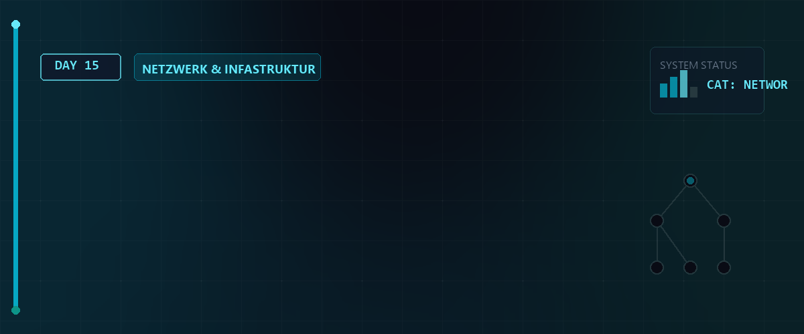

# 🌐 Netzwerk-Grundlagen, Subnetz-Arithmetik & VLANs — Tag 15



> **Entwickler & Administrator:** Tobias Boyke  
> **Status:** 🚀 Kern-Lerninhalte & LPIC-1 Vorbereitung  
> **Schwerpunkt:** Grundlegende Netzwerkadministration, Subnetz-Berechnung, VLAN-Tagging und administrative CLI-Befehle.

---

## 📑 Inhaltsverzeichnis
- [⚡ 1. OSI-Modell vs. TCP/IP-Modell](#-1-osi-modell-vs-tcpip-modell)
- [🔢 2. IP-Adressierung & Subnetz-Arithmetik (Deep Dive /27)](#-2-ip-adressierung--subnetz-arithmetik-deep-dive-27)
- [🔌 3. VLAN-Theorie (IEEE 802.1Q)](#-3-vlan-theorie-ieee-8021q)
- [📁 4. Systemkonfigurationsdateien für Netzwerke](#-4-systemkonfigurationsdateien-für-netzwerke)
- [🛠️ 5. LPIC-1 Netzwerk-Befehle (Cheat Sheet)](#-5-lpic-1-netzwerk-befehle-cheat-sheet)
- [🧠 6. Wissenstest: Netzwerke & Subnetting](#-6-wissenstest-netzwerke--subnetting)
- [🔗 Zurück zur Übersicht](#-zurück-zur-übersicht)

---

## ⚡ 1. OSI-Modell vs. TCP/IP-Modell

Für LPIC-1 müssen Sie verstehen, auf welcher Ebene Netzwerkkomponenten und Protokolle arbeiten.

| Schicht (OSI) | Name (OSI) | TCP/IP-Schicht | Protokolle (Beispiele) | Hardware / Einheit |
| :---: | :--- | :--- | :--- | :--- |
| **7** | Application (Anwendung) | **Application** | HTTP, SSH, FTP, DNS, NTP | Gateway, L7-Firewall |
| **6** | Presentation (Darstellung) | **Application** | SSL/TLS, ASCII, JPEG | - |
| **5** | Session (Sitzung) | **Application** | NetBIOS, RPC | - |
| **4** | Transport | **Transport** | TCP, UDP | Ports, Segmente |
| **3** | Network (Vermittlung) | **Internet** | IP (IPv4, IPv6), ICMP | Router, IP-Pakete |
| **2** | Data Link (Sicherung) | **Network Access** | Ethernet, Wi-Fi, VLAN (802.1Q) | Switch, MAC, Frames |
| **1** | Physical (Bitübertragung) | **Network Access** | Kabel, DSL, Bitströme | Hub, Repeater, Bits |

> [!NOTE]  
> Moderne Firewalls und Paketfilter wie `nftables` arbeiten primär auf Schicht 3 (IP-Filter) und Schicht 4 (Port-Filter), können durch Verbindungsverfolgung (Stateful Inspection) aber auch logische Schicht-5-Zustände abbilden.

---

## 🔢 2. IP-Adressierung & Subnetz-Arithmetik (Deep Dive /27)

Eine IPv4-Adresse besteht aus **32 Bits**, aufgeteilt in 4 Oktette à 8 Bits (z.B. `172.16.7.33`). Die **Subnetzmaske** bestimmt, welche Bits den **Netzwerkanteil** und welche den **Hostanteil** definieren.

### Die CIDR-Notation (Classless Inter-Domain Routing)
Anstatt Klassen (A, B, C) zu nutzen, gibt die Zahl hinter dem Schrägstrich (z.B. `/27`) die Anzahl der gesetzten Netzwerkbits an.

### 🧮 Die detaillierte Berechnung für ein /27 Subnetz (wie in Tag 16 verwendet)
Ein `/27` Subnetz bedeutet:
* **Netzwerk-Bits:** 27
* **Host-Bits:** 32 - 27 = **5**
* **Subnetzmaske oktal:** 27 Bits auf `1` gesetzt:  
  `11111111 . 11111111 . 11111111 . 11100000` -> **`255.255.255.224`**
* **Adressen pro Subnetz:** `2^5 = 32` IP-Adressen insgesamt.
* **Nutzbare IPs pro Subnetz:** `32 - 2 = 30` IPs (da die erste Adresse das Netz und die letzte den Broadcast darstellt).

#### 🌐 Analyse der Tag 16 Subnetze:
Das Skript `MiniNetzAutoBuilder.sh` teilt das Netz in zwei `/27` Subnetze auf:

##### 1. Netz A (Bereich um `172.16.7.32/27`):
* **Netzwerk-Adresse:** **`172.16.7.32`** (das 4. Oktett binär: `00100000`)
* **Erste nutzbare IP (Gateway):** **`172.16.7.33`** (wird vom Router `srv-rocky` an `ens161` belegt).
* **Host-Bereich für Clients:** `172.16.7.34` bis `172.16.7.62` (z.B. `srv-deb-01` = `172.16.7.42`).
* **Broadcast-Adresse:** **`172.16.7.63`** (das 4. Oktett binär: `00111111`).

##### 2. Netz B (Bereich um `172.16.7.96/27`):
* **Netzwerk-Adresse:** **`172.16.7.96`** (das 4. Oktett binär: `01100000`)
* **Erste nutzbare IP (Gateway):** **`172.16.7.97`** (wird vom Router `srv-rocky` an `ens256` belegt).
* **Host-Bereich für Clients:** `172.16.7.98` bis `172.16.7.126` (z.B. `srv-deb-02` = `172.16.7.111`).
* **Broadcast-Adresse:** **`172.16.7.127`** (das 4. Oktett binär: `01111111`).

> [!IMPORTANT]  
> **LPIC-1 RELEVANTES WISSEN - Subnetz-Berechnungs-Formel:**  
> * **Anzahl Subnetze:** `2^n` (wobei `n` die geliehenen Bits aus dem Host-Anteil sind).  
> * **Anzahl Hosts pro Subnetz:** `2^h - 2` (wobei `h` die verbleibenden Host-Bits sind. Die `-2` steht für die **Netzwerkadresse** und die **Broadcastadresse**, die niemals an Endgeräte vergeben werden dürfen!).

---

## 🔌 3. VLAN-Theorie (IEEE 802.1Q)

Ein **VLAN (Virtual Local Area Network)** trennt ein physisches Netzwerk auf Schicht 2 (Sicherungsschicht) in mehrere logische Broadcast-Domänen.

* **IEEE 802.1Q Tagging:** Der Ethernet-Frame wird um einen 4-Byte-VLAN-Tag erweitert, der die **VLAN ID (1 bis 4094)** enthält.
* **Access Ports (Untagged):** Verbinden Endgeräte (Server, Clients), die von VLANs nichts wissen. Der Switch entfernt den Tag beim Senden und fügt ihn beim Empfangen hinzu.
* **Trunk Ports (Tagged):** Verbinden Switches oder Router miteinander. Über ein einzelnes Kabel werden Frames für mehrere VLANs übertragen, wobei jeder Frame seinen VLAN-Tag behält.

> [!CAUTION]  
> **Netzwerk-Schleifen-Gefahr:** Ohne das Spanning Tree Protocol (STP) führen doppelte physische Verbindungen in VLANs schnell zu Broadcast-Stürmen, die das komplette Netzwerk lahmlegen!

---

## 📁 4. Systemkonfigurationsdateien für Netzwerke

Unter Linux werden Netzwerkkonfigurationen in systemspezifischen Textdateien gespeichert. LPIC-1 verlangt das Auffinden dieser Dateien.

### 1. Debian / Ubuntu (Klassisch)
* **Datei:** `/etc/network/interfaces`
* **Syntax-Beispiel:**
  ```text
  auto eth0
  iface eth0 inet static
      address 172.16.7.42
      netmask 255.255.255.224
      gateway 172.16.7.33
  ```

### 2. RHEL / Rocky Linux (Klassisch / NetworkManager)
* **Klassischer Pfad:** `/etc/sysconfig/network-scripts/ifcfg-ens161`
* **Modernes NM-Keyfile:** `/etc/NetworkManager/system-connections/ens161.nmconnection`
* **Syntax-Beispiel (ifcfg-Stil):**
  ```text
  DEVICE=ens161
  BOOTPROTO=none
  ONBOOT=yes
  IPADDR=172.16.7.33
  PREFIX=27
  ```

### 3. Globale Namens- und DNS-Dateien (Für alle Distributionen gleich!)
* **`/etc/hosts`:** Statische Zuordnung von IPs zu Hostnamen. Wird vor dem DNS-Server abgefragt.
* **`/etc/resolv.conf`:** Konfiguration der DNS-Nameserver (z.B. `nameserver 1.1.1.1`).
* **`/etc/nsswitch.conf`:** Bestimmt die Suchreihenfolge für Dienste.  
  * LPIC-relevanter Eintrag: `hosts: files dns` (sucht erst in `/etc/hosts`, danach im DNS).
* **`/etc/hostname`:** Speichert den persistenten Hostnamen des Systems.

---

## 🛠️ 5. LPIC-1 Netzwerk-Befehle (Cheat Sheet)

### Diagnose- & Konfigurations-Werkzeuge

| Befehl | Zweck | LPIC-1 Anwendungsbeispiel |
| :--- | :--- | :--- |
| `ifconfig` | Legacy Schnittstellen-Tool | `ifconfig eth0 172.16.7.42 netmask 255.255.255.224 up` |
| `ip addr` | Modernes Adress-Tool | `ip addr show` / `ip addr add 172.16.7.42/27 dev eth0` |
| `ip route` | Modernes Routing-Tool | `ip route show` / `ip route add default via 172.16.7.33` |
| `route -n` | Legacy Routing-Tabelle | Zeigt Routen mit IPs statt Namen an (schneller, da kein DNS-Reverse-Lookup). |
| `ping -c 4` | ICMP Echo Request | Prüft Layer-3 Erreichbarkeit (`-c 4` begrenzt auf 4 Pakete). |
| `netstat -tulpen` | Legacy Port- & Socket-Info | Listet lauschende TCP/UDP Sockets mit PIDs auf. |
| `ss -tulpen` | Modernes Socket-Info | Schnellere und mächtigere Alternative zu `netstat`. |
| `host <Domain>` | Einfacher DNS Lookup | `host google.de` (liefert IP-Adresse und Mailserver). |
| `dig <Domain>` | Detaillierter DNS-Query | `dig google.de` (liefert vollständigen DNS-Header und Query-Zeiten). |
| `nslookup` | Interaktiver DNS-Query | `nslookup google.de` |

---

## 🔑 Keywords

| Keyword / Befehl | Erklärung |
| :--- | :--- |
| `ip addr` | Zeigt Netzwerk-Schnittstellen, IP-Adressen (IPv4/IPv6) und Status-Flags an. |
| `nmcli` | Kommandozeilenwerkzeug zur Steuerung und Konfiguration des NetworkManagers. |
| `VLAN` | Virtual Local Area Network: Logische Unterteilung physischer Netzwerke auf Layer 2 des OSI-Modells. |
| `802.1Q` | Ethernet-Standard für VLAN-Tagging; fügt IDs in Datenrahmen ein, um Netze zu trennen. |
| `CIDR` | Classless Inter-Domain Routing: Methode zur flexiblen Zuweisung von IP-Adressbereichen mittels Subnetzmasken. |

---

## 🧠 LPIC-1 Relevanz & Wissenstest

Prüfen Sie Ihr Wissen mit diesen typischen LPIC-1 Prüfungsfragen:

<details>
<summary><b>Frage 1: Subnetzmasken-Notation (Klicken zum Ausklappen)</b></summary>
<b>Frage:</b> Wie lautet die Subnetzmaske in dotted-decimal-Schreibweise für ein <code>/27</code> Subnetz?<br>
<details>
<summary>Antwort anzeigen</summary>
<b>Antwort:</b> <b><code>255.255.255.224</code></b>.<br>
<b>Erklärung:</b> Bei 27 Netzwerkbits sind im 4. Oktett die ersten drei Bits gesetzt (`11100000` in Binär). Dies entspricht dem Dezimalwert `128 + 64 + 32 = 224`.
</details>
</details>

<details>
<summary><b>Frage 2: Suchreihenfolge konfigurieren (Klicken zum Ausklappen)</b></summary>
<b>Frage:</b> In welcher Datei legen Sie fest, dass Ihr Linux-System bei Namensauflösungen zuerst die lokale Datei <code>/etc/hosts</code> konsultiert, bevor es einen DNS-Server anfragt?<br>
<details>
<summary>Antwort anzeigen</summary>
<b>Antwort:</b> In der Datei **`/etc/nsswitch.conf`**.<br>
<b>Erklärung:</b> Der dortige Eintrag <code>hosts: files dns</code> steuert genau diese Suchreihenfolge (erst lokale "files", dann "dns").
</details>
</details>

<details>
<summary><b>Frage 3: Schnelle Routingtabelle (Klicken zum Ausklappen)</b></summary>
<b>Frage:</b> Warum sollten Sie bei der Statusabfrage von Routingtabellen via <code>route</code> oder <code>netstat</code> die Option <code>-n</code> verwenden?<br>
<details>
<summary>Antwort anzeigen</summary>
<b>Antwort:</b> Um die IP-Adressen numerisch anzuzeigen und den DNS-Reverse-Lookup zu unterbinden.<br>
<b>Erklärung:</b> Ohne <code>-n</code> versucht das System, jede IP-Adresse im Routing-Pfad in einen Hostnamen aufzulösen. Ist das DNS gestört oder offline, friert die Befehlsausgabe für mehrere Sekunden ein.
</details>
</details>

<details>
<summary><b>Frage 4: Host-Kapazität (Klicken zum Ausklappen)</b></summary>
<b>Frage:</b> Wie viele nutzbare Hosts können sich in einem <code>/27</code> Subnetz befinden?<br>
<details>
<summary>Antwort anzeigen</summary>
<b>Antwort:</b> **30** nutzbare Hosts.<br>
<b>Erklärung:</b> Formel: `2^h - 2`. Mit 5 Hostbits ergeben sich 32 IP-Adressen insgesamt. Die Netzwerk- und die Broadcastadresse werden abgezogen, was 30 nutzbare IPs ergibt.
</details>
</details>

---

## 🔗 Zurück zur Übersicht

* **Tag 14 (Netzwerk-Grundlagen & Schnittstellen):** [⬅️ Tag 14](../Day_14/README.md)
* **Tag 16 (Netzwerk-Routing & Forwarding):** [➡️ Tag 16](../Day_16/README.md)
* **Master-Repository:** [🌌 Zurück zum Master-Repository](../README.md)

---
*Erstellt & gepflegt von Tobias Boyke, Juni 2026.*
