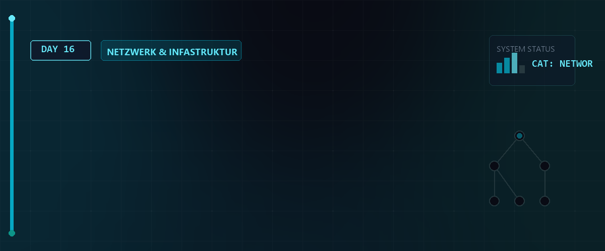

# 🐧 Linux Essentials - Tag 16: Netzwerk-Routing & Forwarding



Am sechzehnten Tag der Linux Essentials bauen wir auf den Netzwerk-Grundlagen von **Tag 14** und **Tag 15** auf, die sich mit der manuellen Schnittstellenkonfiguration und den theoretischen VLAN-Grundlagen befasst haben. Heute widmen wir uns der praktischen Umsetzung einer komplexen Routing-Infrastruktur. Wir richten ein Linux-Gateway mit persistentem **IP-Forwarding**, **NAT-Masquerading** und modernem **nftables-Paketfilter** ein, um getrennte Subnetze sicher mit dem Internet zu verbinden.

Dieses Modul zeigt den direkten Übergang von der manuellen Virtualisierungskonfiguration (VMware) hin zur vollautomatischen Bereitstellung über das Bash-Skript `MiniNetzAutoBuilder.sh`. Tag 16 dient als direkte Grundlage für die weiterführenden Sicherheits- und Firewallkonfigurationen an **Tag 17**.

---

## 📑 Inhaltsverzeichnis
- [🎯 Lernziele (LPIC-1 relevant)](#-lernziele-lpic-1-relevant)
- [🗂️ Netzwerk-Topologie & Adressierung](#️-netzwerk-topologie--adressierung)
- [🛠️ 1. VMware-Infrastruktur & Netzwerkkarten-Zuordnung](#️-1-vmware-infrastruktur--netzwerkkarten-zuordnung)
- [🔌 2. Gateway- & Router-Konfiguration (srv-rocky)](#-2-gateway---router-konfiguration-srv-rocky)
- [💻 3. Client-Konfiguration (Rocky, Debian, CachyOS, Manjaro)](#-3-client-konfiguration-rocky-debian-cachyos-manjaro)
- [🔒 4. Firewall, Routing & NAT-Masquerading (nftables)](#-4-firewall-routing--nat-masquerading-nftables)
- [🚀 5. Der Automatisierungs-Workflow (MiniNetzAutoBuilder.sh)](#-5-der-automatisierungs-workflow-mininetzautobuildersh)
- [🧠 Wissenstest: Routing & Netzwerksicherheit](#-wissenstest-routing--netzwerksicherheit)
- [🔗 Zurück zur Übersicht](#-zurück-zur-übersicht)

---

## 🎯 Lernziele (LPIC-1 relevant)
* **LPIC-1 109.1 - Grundlegende Netzwerkkonfiguration:**
  * Beherrschen von `nmcli` zur Erstellung, Modifikation und Aktivierung von Netzwerkprofilen.
  * Verständnis von statischen IP-Adressen, CIDR-Notation (`/27` Subnetzmasken) und Standard-Gateways.
  * Lokalisieren und Editieren von DNS-Auflösungen in `/etc/resolv.conf` (bzw. über den NetworkManager).
* **LPIC-1 109.2 - Netzwerk-Troubleshooting:**
  * Diagnose von Verbindungsproblemen mit `ping`, `ip route`, `ip address show` und `traceroute`.
  * Verifizieren der Routing-Tabellen und Überprüfen des Gateway-Status.
* **LPIC-1 110.1 - Grundlegende Systemsicherheit & Paketfilterung:**
  * Aktivierung des IP-Forwardings im Kernel via `/proc/sys/net/ipv4/ip_forward` und `sysctl`.
  * Grundlagen von Network Address Translation (NAT) und Masquerading.
  * Verständnis von Paketfilter-Regelwerken mit `nftables` (Ersetzen von legacy `iptables` / `firewalld`).

---

## 🗂️ Netzwerk-Topologie & Adressierung

Die folgende Tabelle zeigt die implementierte Multi-Subnetz-Architektur, bei der die Rocky-Linux-VM `srv-rocky` als Router zwischen den getrennten LAN-Segmenten (Netz A und Netz B) und dem externen Gateway (`gw-router`) fungiert.

| Hostname | Rolle / OS | Schnittstelle | Netzwerkbereich | IP-Adresse | Gateway | VLAN / LAN-Segment |
| :--- | :--- | :--- | :--- | :--- | :--- | :--- |
| `gw-router` | Ext. Gateway | - | - | `172.21.0.9` | - | VMnet / WAN |
| `rocky-host` | Physisch / Rocky | - | `172.21.0.0/16` | `172.21.1.13` | `172.21.0.9` | Lokales Hostnetz |
| **`srv-rocky`** | **Zentr. Router / Rocky** | `ens160`<br>`ens161`<br>`ens256` | WAN (DHCP)<br>Netz A (`/27`)<br>Netz B (`/27`) | `172.21.0.X` (auto)<br>`172.16.7.33`<br>`172.16.7.97` | `172.21.0.9`<br>-<br>- | VMnet (WAN)<br>`switch_net01` (Netz A)<br>`switch_net02` (Netz B) |
| `srv-deb-01` | Client / Debian 13.5 | `ens192` (dyn.) | Netz A (`/27`) | `172.16.7.42` | `172.16.7.33` | `switch_net01` (Netz A) |
| `ws-cachy` | Client / CachyOS | `ens192` (dyn.) | Netz A (`/27`) | `172.16.7.47` | `172.16.7.33` | `switch_net01` (Netz A) |
| `srv-deb-02` | Client / Debian 13.5 | `ens192` (dyn.) | Netz B (`/27`) | `172.16.7.111` | `172.16.7.97` | `switch_net02` (Netz B) |
| `ws-manjaro` | Client / Manjaro | `ens192` (dyn.) | Netz B (`/27`) | `172.16.7.106` | `172.16.7.97` | `switch_net02` (Netz B) |

---

## 🛠️ 1. VMware-Infrastruktur & Netzwerkkarten-Zuordnung

Bevor das Skript ausgeführt wird, muss die Hardware-Zuordnung in **VMware Workstation** manuell vorbereitet werden. Dies entspricht den Schritten aus `Arbeitsschritte_Gateway_Clients_Forwarding.docx`.

### Router (`srv-rocky`) Einrichtung:
1. Navigiere in VMware zu **VM -> Settings -> Add... -> Network Adapter -> Finish**. Wiederhole dies, bis der Router über **drei Netzwerkkarten** verfügt.
2. Ordne die Karten den entsprechenden Segmenten zu:
   * **Adapter 1 (ens160):** Auf **NAT** (bzw. das Standard-VMnet mit Internetzugriff) einstellen.
   * **Adapter 2 (ens161):** Auf **LAN segment** umstellen und `switch_net01` (Netz A) auswählen.
   * **Adapter 3 (ens256):** Auf **LAN segment** umstellen und `switch_net02` (Netz B) auswählen.
3. **MAC-Adressen verifizieren:** Stelle sicher, dass die in VMware generierten virtuellen MAC-Adressen mit den im Skript definierten Adressen (`00:0C:29:9E:B3:12`, `00:0C:29:9E:B3:26`, `00:0C:29:9E:B3:1C`) übereinstimmen, um eine fehlerfreie Schnittstellenzuordnung zu garantieren.

### Client-Einrichtung:
1. Öffne die Einstellungen der jeweiligen Client-VMs (Debian, CachyOS, Manjaro).
2. Stelle die Netzwerkkarte von **NAT** auf **LAN segment** um:
   * Für Clients in **Netz A** (`srv-deb-01`, `ws-cachy`): `switch_net01` wählen.
   * Für Clients in **Netz B** (`srv-deb-02`, `ws-manjaro`): `switch_net02` wählen.

---

## 🔌 2. Gateway- & Router-Konfiguration (`srv-rocky`)

Auf dem zentralen Router `srv-rocky` müssen die IP-Adressen fest zugewiesen werden. Zudem muss das Weiterleiten von Paketen (IP-Forwarding) im Kernel aktiviert werden.

### IP-Adressen setzen
Die Adressen werden manuell über `nmcli` eingerichtet. Das Gateway für das WAN-Interface `ens160` wird automatisch per DHCP bezogen, während die internen Interfaces `ens161` und `ens256` feste statische IPs erhalten:

```bash
# LAN-Schnittstelle A (ens161) konfigurieren:
sudo nmcli con modify ens161 ipv4.addresses 172.16.7.33/27 ipv4.method manual

# LAN-Schnittstelle B (ens256) konfigurieren:
sudo nmcli con modify ens256 ipv4.addresses 172.16.7.97/27 ipv4.method manual

# Schnittstellen neu starten
sudo nmcli con down ens161 && sudo nmcli con up ens161
sudo nmcli con down ens256 && sudo nmcli con up ens256
```

### IP-Forwarding aktivieren
Ohne diese Kernel-Option verwirft der Linux-Kernel Pakete, die nicht direkt an die eigene IP-Adresse gerichtet sind.

```bash
# Sofortige Aktivierung im laufenden Betrieb
sudo sysctl -w net.ipv4.ip_forward=1

# Persistente Speicherung für Neustarts
echo "net.ipv4.ip_forward = 1" | sudo tee /etc/sysctl.d/99-ip-forward.conf
```

> [!IMPORTANT]  
> **LPIC-1 RELEVANTES PRÜFUNGSWISSEN - Kernel Tuning mit sysctl:**  
> Der Befehl **`sysctl`** dient zum Auslesen und Konfigurieren von Kernel-Parametern zur Laufzeit (unter `/proc/sys/`):  
> * **`sysctl -a`**: Listet alle im laufenden System verfügbaren Kernel-Parameter auf.  
> * **`sysctl -w parameter=wert`**: Schreibt einen Wert temporär in einen Parameter (z.B. `sysctl -w net.ipv4.ip_forward=1`).  
> * **`sysctl -p <Datei>`**: Lädt Einstellungen aus einer sysctl-Konfigurationsdatei (standardmäßig `/etc/sysctl.conf` oder `/etc/sysctl.d/*`). Dies macht Änderungen ohne Neustart persistent!  
> * **Verzeichnis-Entsprechung:** Der Parameter `net.ipv4.ip_forward` entspricht direkt der virtuellen Datei `/proc/sys/net/ipv4/ip_forward`. Ein Ändern via `echo 1 > /proc/sys/net/ipv4/ip_forward` ist funktionsgleich!

---

## 💻 3. Client-Konfiguration (Rocky, Debian, CachyOS, Manjaro)

Die Clients befinden sich in vollständig isolierten LAN-Segmenten ohne DHCP-Server. Daher müssen IP, Netzmaske, Standard-Gateway (die jeweilige IP-Adresse des Routers) und DNS manuell konfiguriert werden.

### Konfigurationsschritte auf den Clients:
1. Ermittle den Schnittstellennamen (z.B. `ens192` oder `ens33`) mit `ip a`.
2. Führe die Konfiguration über `nmcli` aus:

```bash
# Beispiel für srv-deb-01 (Netz A)
sudo nmcli con modify ens192 ipv4.addresses 172.16.7.42/27 \
  ipv4.gateway 172.16.7.33 \
  ipv4.dns 1.1.1.1 \
  ipv4.method manual

# Schnittstelle aktivieren
sudo nmcli con down ens192 && sudo nmcli con up ens192
```

> [!IMPORTANT]
> Achte peinlich genau darauf, dass das **Standard-Gateway** der Clients exakt auf die IP-Adresse der dazugehörigen Router-Schnittstelle zeigt (`172.16.7.33` für Netz A, `172.16.7.97` für Netz B).

---

## 🔒 4. Firewall, Routing & NAT-Masquerading (`nftables`)

Das Skript `MiniNetzAutoBuilder.sh` deaktiviert standardmäßig `firewalld` auf Rocky Linux und setzt stattdessen auf das moderne **`nftables`**-Framework, um das Regelwerk transparent zu verwalten.

Das im Skript generierte Firewall-Regelwerk (`/etc/nftables.conf`) steuert das Routing und schützt das Netzwerk:

```nftables
flush ruleset

table inet filter {
    # Schützt das System selbst vor unerlaubten Zugriffen
    chain input {
        type filter hook input priority 0; policy drop;
        iif "lo" accept
        ct state established,related accept
        tcp dport 22 accept
        ip protocol icmp accept
    }
    
    # Steuert den Paketfluss ZWISCHEN den Schnittstellen
    chain forward {
        type filter hook forward priority 0; policy drop;
        ct state established,related accept
        iifname "ens161" accept  # Erlaubt Traffic aus Netz A
        iifname "ens256" accept  # Erlaubt Traffic aus Netz B
    }
}

# Übersetzt die privaten IP-Adressen der Clients in die WAN-IP des Routers
table ip nat {
    chain postrouting {
        type nat hook postrouting priority 100; policy accept;
        oifname "ens160" masquerade  # NAT auf dem WAN-Interface
    }
}
```

### Diagnose & Routing-Prüfung:
```bash
# Prüfen ob Forwarding im Kernel aktiv ist (Ausgabe muss 1 sein)
cat /proc/sys/net/ipv4/ip_forward

# Anzeigen des aktiven nftables Regelwerks
sudo nft list ruleset

# Routingtabelle anzeigen
ip route show

# Verbindungstest vom Client ins Internet
ping 1.1.1.1
```

> [!IMPORTANT]  
> **LPIC-1 RELEVANTES PRÜFUNGSWISSEN - Netzwerkdiagnose & Sockets:**  
> * **Socket-Analyse mit `ss` (Socket Statistics):**  
>   `ss` ersetzt das veraltete `netstat` und liest Daten direkt aus dem Kernel-Namensraum:  
>   * **`-t`** / **`-u`**: Zeigt TCP- / UDP-Sockets an.  
>   * **`-l`**: Zeigt ausschließlich lauschende Sockets an (Listening Sockets).  
>   * **`-a`**: Zeigt alle Sockets (sowohl lauschende als auch aufgebaute Verbindungen).  
>   * **`-p`**: Listet den Namen und die PID des Prozesses auf, der den Port belegt (erfordert root).  
>   * **`-n`**: Zeigt Adressen und Ports numerisch an (verhindert langsame DNS-Abfragen).  
>   * *Beispiel:* `ss -tulpen` zeigt alle lauschenden TCP/UDP Sockets mit Prozess-ID, User und Portnummer numerisch an.  
> * **Routen-Verfolgung (`traceroute` vs. `tracepath`):**  
>   * **`traceroute <Ziel>`**: Verfolgt den Pfad eines Pakets zum Ziel, indem es Pakete mit aufsteigender TTL (Time To Live) versendet. Jeder Router dekrementiert die TTL und sendet bei Ablauf eine ICMP-Zeitüberschreitung zurück, was den Pfad offenlegt.  
>   * **`tracepath <Ziel>`**: Ähnlich wie `traceroute`, benötigt aber **keine Root-Rechte** zur Ausführung und ermittelt zusätzlich die MTU (Path MTU Discovery).

---

## 🚀 5. Der Automatisierungs-Workflow (`MiniNetzAutoBuilder.sh`)

Das Skript `MiniNetzAutoBuilder.sh` führt all diese Schritte vollautomatisch und passend zur jeweiligen Distribution aus.

### Struktur des Skripts (SFC-Muster):
1. **Paketinstallation:** Erkennt die Distribution (`apt`, `dnf` oder `pacman`) und installiert die Basispakete (`zsh`, `fastfetch`, `nftables`, `openssh-server`, etc.).
2. **SSH-Aktivierung:** Konfiguriert und startet den OpenSSH-Dienst.
3. **ZSH & Oh My Zsh:** Richtet eine moderne Shell für den administrativen Benutzer ein.
4. **Rollenbasierte Netzwerkkonfiguration:**
   * Ist der Hostname `srv-rocky` (Router), ruft das Skript `configure_router` auf, bereinigt alle alten Verbindungen und baut die drei Interfaces (`ens160`, `ens161`, `ens256`) statisch auf Basis ihrer MAC-Adressen auf. Danach aktiviert es das IP-Forwarding.
   * Ist der Hostname ein Client (z. B. `srv-deb-01`), weist `configure_client` dynamisch die passende IP, das zugehörige Gateway und den DNS-Server zu.
5. **Firewall-Konfiguration:** Löscht `firewalld` und aktiviert das oben beschriebene `nftables`-Regelwerk.

---

## 🧠 Wissenstest: Routing & Netzwerksicherheit

Hier sind Prüfungsfragen zur Vorbereitung auf LPIC-1 und zur Festigung des Wissens:

<details>
<summary><b>Fragen zu IP-Routing & Forwarding</b> (Klicken zum Ausklappen)</summary>

1. **Welche Datei steuert die Aktivierung des IP-Forwardings beim Systemstart und wie lautet der Eintrag?**
   <details><summary>Antwort</summary>Die Datei ist **`/etc/sysctl.conf`** oder eine Konfiguration unter **`/etc/sysctl.d/`** (z. B. `99-ip-forward.conf`). Der Eintrag lautet **`net.ipv4.ip_forward = 1`**.</details>

2. **Wie lautet der Befehl, um die Routing-Tabelle anzuzeigen und wie identifiziert man das Standard-Gateway?**
   <details><summary>Antwort</summary>Der modernste Befehl lautet **`ip route`** (oder legacy `route -n` bzw. `netstat -rn`). Das Standard-Gateway ist an der Zeile erkennbar, die mit **`default via ...`** beginnt.</details>

3. **Was passiert, wenn ein Client ein Standard-Gateway konfiguriert hat, das sich nicht in seinem eigenen Subnetz befindet?**
   <details><summary>Antwort</summary>Die Konfiguration schlägt fehl oder das Gateway ist nicht erreichbar. Ein Host kann ein Gateway nur adressieren, wenn es sich im selben logischen Subnetz befindet (direkte ARP-Auflösung erforderlich). Andernfalls weiß der Host nicht, wie er die Pakete physikalisch an das Gateway senden soll.</details>

</details>

<details>
<summary><b>Fragen zu NAT & Firewalls</b> (Klicken zum Ausklappen)</summary>

4. **Was versteht man unter "Masquerading" im Kontext von NAT und warum ist es für private Netzwerke zwingend erforderlich?**
   <details><summary>Antwort</summary>**Masquerading** ist eine Form des dynamischen Source NAT (SNAT). Es übersetzt die privaten, im Internet nicht routingfähigen IP-Adressen (z. B. `172.16.7.42`) der Clients in die einzige öffentliche IP-Adresse des WAN-Interfaces (`ens160`). Rückkehrende Pakete werden anhand einer Port-Mapping-Tabelle wieder dem richtigen Client zugeordnet. Ohne Masquerading könnten Antworten aus dem Internet nicht an die Clients zurückgesendet werden.</details>

5. **Welchen Vorteil bietet `nftables` gegenüber dem älteren `iptables`?**
   <details><summary>Antwort</summary>**`nftables`** vereint IPv4, IPv6, ARP und Bridge-Filterung in einem einzigen Framework. Es verwendet eine sauberere Syntax, bietet eine deutlich bessere Performance durch eine interne virtuelle Maschine im Kernel (Bytecode) und benötigt weniger Ressourcen, da redundante Tabellen/Chains nicht standardmäßig geladen werden.</details>

6. **Mit welchem Befehl lässt sich der Status und die Aktivität des nftables-Dienstes überprüfen?**
   <details><summary>Antwort</summary>Mit **`sudo systemctl status nftables`** überprüft man den Dienst. Mit **`sudo nft list ruleset`** kann man das aktuell im Kernel aktive Regelwerk in Echtzeit auslesen.</details>

</details>

---

## 🔗 Zurück zur Übersicht

* **Day 14 & 15:** [⬅️ Netzwerk-Grundlagen & Schnittstellen](../Day_15/README.md)
* **Day 17:** [➡️ Firewall & Netzwerksicherheit](../Day_17/README.md)
* **Master-Repository:** [🌌 Zurück zur Übersicht](../README.md)

---
*Letztes Update: 29. Mai 2026 für den Linux-Essentials Kurs.*
