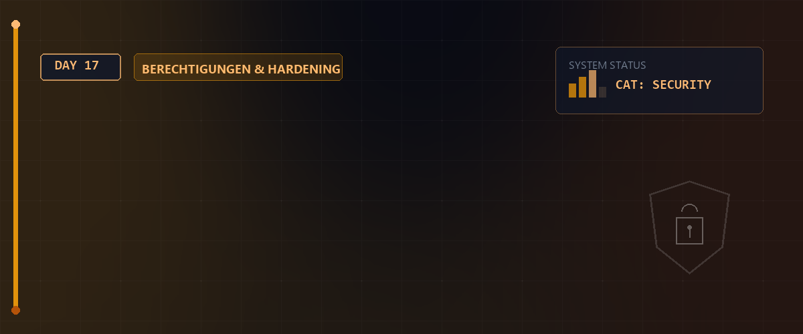

# 🌐 Netzwerk-Routing & NTP-Zeitsynchronisation — Tag 17



> **Entwickler & Administrator:** Tobias Boyke  
> **Status:** 🚀 Kern-Lerninhalte & LPIC-1 Vorbereitung  
> **Kompatibilität:**   

---

## 📑 Inhaltsverzeichnis
- [📖 Einführung & LPIC-Fokus](#-einführung--lpic-fokus)
- [🛠️ Netzwerk-Routing & Gateway-Aufbau](#️-netzwerk-routing--gateway-aufbau)
  - [1. IP-Forwarding aktivieren](#1-ip-forwarding-aktivieren)
  - [2. nftables NAT-Masquerading](#2-nftables-nat-masquerading)
  - [3. Client statisches Routing](#3-client-statisches-routing)
- [⏰ NTP-Zeitsynchronisation & Server-Management](#-ntp-zeitsynchronisation--server-management)
  - [1. timedatectl zur Zeitsteuerung](#1-timedatectl-zur-zeitsteuerung)
  - [2. chronyd (Rocky/RedHat Standard)](#2-chronyd-rockyredhat-standard)
  - [3. systemd-timesyncd (Debian Standard)](#3-systemd-timesyncd-debian-standard)
- [🎮 Das optionale OmniTUI Showcase-Tool](#-das-optionale-omnitui-showcase-tool)
- [🧠 LPIC-1 Relevanz & Wissenstest](#-lpic-1-relevanz--wissenstest)
- [🔗 Zurück zur Übersicht](#-zurück-zur-übersicht)

---

## 📖 Einführung & LPIC-Fokus

Am **Tag 17** vertiefen wir die Grundlagen der Netzwerkadministration und Systemzeitsteuerung, die für die **LPIC-1 Zertifizierung** essenziell sind:
1. **Netzwerk-Routing (LPIC-1 Thema 109):** Aufbau eines Linux-Gateways (Router) zwischen zwei isolierten LAN-Segmenten (Netz A `/27` und Netz B `/27`) und dem Internet (WAN), inklusive IP-Forwarding und Firewall-NAT-Masquerading.
2. **NTP Zeitsynchronisation (LPIC-1 Thema 108):** Abgleich der Systemuhr gegen weltweite Referenzzeitquellen über das Network Time Protocol. Wir befassen uns mit den modernen Linux-Werkzeugen `timedatectl`, `chronyd` und `systemd-timesyncd`.

---

## 🛠️ Netzwerk-Routing & Gateway-Aufbau

Linux kann als vollwertiger Router arbeiten, um Pakete zwischen Schnittstellen weiterzuleiten und private IP-Adressen (LAN) über Network Address Translation (NAT) im Internet (WAN) zu maskieren.

### 1. IP-Forwarding aktivieren
Standardmäßig verwirft Linux Pakete, die nicht für den lokalen Host bestimmt sind. Das Kernel-Routing aktivieren wir über das virtuelle Dateisystem `/proc` oder dauerhaft via `sysctl`:

```bash
# Temporäre Aktivierung (sofort wirksam)
sudo sysctl -w net.ipv4.ip_forward=1

# Persistente Aktivierung (nach Systemstart aktiv)
echo "net.ipv4.ip_forward = 1" | sudo tee /etc/sysctl.d/99-ip-forward.conf
```

### 2. nftables NAT-Masquerading
Um private Subnetze ins Internet zu routen, muss der Router die Absender-IPs maskieren (Source-NAT / Masquerading). Dies geschieht über die moderne **`nftables`** Engine:

```bash
# /etc/nftables.conf auf dem Router
flush ruleset
table ip nat {
    chain postrouting {
        type nat hook postrouting priority 100; policy accept;
        oifname "ens160" masquerade  # ens160 ist die WAN-Schnittstelle
    }
}
```

### 3. Client statisches Routing
Clients in den isolierten Netzen benötigen eine Zuweisung ihres Standard-Gateways (der IP des Routers im jeweiligen Subnetz), um Anfragen außerhalb ihres Netzes weiterzuleiten:

```bash
# Beispiel für manuelle statische Route unter Linux
sudo ip route add default via 172.16.7.33 dev ens192
```

---

## ⏰ NTP-Zeitsynchronisation & Server-Management

Eine präzise Systemzeit ist entscheidend für sicherheitsrelevante Logfiles, Authentifizierungsprotokolle (Kerberos, TLS) und Datenbanktransaktionen.

### 1. timedatectl zur Zeitsteuerung
Das `systemd`-Werkzeug **`timedatectl`** dient zur Abfrage und Konfiguration der Systemuhr und Zeitzone:

```bash
# Systemzeit-Status anzeigen (inkl. NTP-Synchronisationsstatus)
timedatectl status

# Zeitsynchronisation über systemd aktivieren
sudo timedatectl set-ntp true

# Zeitzone ändern
sudo timedatectl set-timezone Europe/Berlin
```

> [!IMPORTANT]  
> **LPIC-1 RELEVANTES PRÜFUNGSWISSEN - Hardware- vs. Systemzeit (`hwclock`):**  
> Linux verwaltet zwei verschiedene Uhren:  
> 1. **Systemuhr (System Clock / Software Clock):** Wird vom Kernel betrieben und läuft im RAM. Geht verloren bei Stromausfall/Ausschalten.  
> 2. **Hardwareuhr (Hardware Clock / Real Time Clock / RTC):** Batteriebetriebene Uhr auf dem Mainboard, die auch bei ausgeschaltetem PC weiterläuft.  
> * **Der Befehl `hwclock`:**  
>   * **`hwclock --show`** (oder **`-r`**): Zeigt die aktuelle Zeit der Hardwareuhr an.  
>   * **`hwclock --hctosys`** (oder **`-s`**): Synchronisiert die Systemzeit *aus* der Hardwarezeit (Hardware-to-System). Wird beim Booten ausgeführt.  
>   * **`hwclock --systohc`** (oder **`-w`**): Schreibt die aktuelle Systemzeit *in* die Hardwareuhr (System-to-Hardware). Wird beim Herunterfahren ausgeführt.  
>   * **`/etc/adjtime`**: Konfigurationsdatei, in der das System Kalibrierungsdaten und Zeitdrift-Informationen der Hardwareuhr persistent abspeichert.  

> [!IMPORTANT]  
> **LPIC-1 RELEVANTES PRÜFUNGSWISSEN - Zeitzonen-Konfiguration:**  
> * **Speicherort der Zeitzonen:** Sämtliche weltweit verfügbaren Zeitzonen-Dateien liegen unter **`/usr/share/zoneinfo/`** (z.B. `/usr/share/zoneinfo/Europe/Berlin`).  
> * **Aktive Zeitzone:** Die aktive System-Zeitzone wird durch die Datei **`/etc/localtime`** bestimmt, welche ein **symbolischer Link** auf die entsprechende Datei in `/usr/share/zoneinfo/` sein muss.  
>   * *Manueller Zeitzonenwechsel:* `ln -sf /usr/share/zoneinfo/Europe/Berlin /etc/localtime`  
> * **`/etc/timezone`**: Auf Debian-basierten Systemen enthält diese Datei zusätzlich den Namen der aktiven Zeitzone als Text (z.B. `Europe/Berlin`).  

### 2. chronyd (Rocky/RedHat Standard)
Der moderne Standard-Zeitsynchronisationsdienst unter RedHat- und Rocky Linux-Systemen ist **`chrony`**.

> [!WARNING]  
> **Große Zeitabweichungen verhindern automatischen NTP-Abgleich:**  
> Wenn die Systemzeit um mehr als **1000 Sekunden** von der realen Zeit abweicht, weigert sich der `chronyd`-Daemon standardmäßig aus Sicherheitsgründen, die Uhr abrupt zu stellen. In diesem Fall müssen Sie die Zeit einmalig manuell korrigieren oder in der `/etc/chrony.conf` die Direktive `makestep 1.0 3` definieren. Diese erlaubt es chrony in den ersten 3 Updates, die Uhr sprunghaft anzupassen, falls die Abweichung größer als 1 Sekunde ist.

* **Konfigurationsdatei:** `/etc/chrony.conf`
* **Zeitserver eintragen:**
  ```text
  server de.pool.ntp.org iburst
  ```
  *(Das Flag `iburst` sorgt beim Dienststart für vier schnelle Anfragen zur schnellen Zeitsynchronisation).*

* **Überwachung mit chronyc:**
  ```bash
  # NTP-Quellen anzeigen
  chronyc sources -v
  
  # Synchronisations-Qualität und Zeitdrift anzeigen
  chronyc tracking
  ```

### 3. systemd-timesyncd (Debian Standard)
Debian- und Arch-Systeme nutzen häufig den leichtgewichtigen, rein Client-seitigen Dienst **`systemd-timesyncd`**.
* **Konfigurationsdatei:** `/etc/systemd/timesyncd.conf`
* **Zeitserver eintragen:**
  ```text
  [Time]
  NTP=de.pool.ntp.org
  FallbackNTP=pool.ntp.org
  ```
* **Status abfragen:**
  ```bash
  timedatectl show-timesync --all
  ```

> [!IMPORTANT]  
> **LPIC-1 RELEVANTES PRÜFUNGSWISSEN - Klassisches NTP & Abfrage:**  
> * Neben `chrony` und `timesyncd` existiert der klassische NTP-Daemon **`ntpd`** (Konfiguration unter `/etc/ntp.conf`).  
> * Zur Statusüberprüfung des klassischen Daemons wird das Werkzeug **`ntpq`** verwendet:  
>   * **`ntpq -p`**: Listet alle konfigurierten NTP-Server (Peers) inklusive Status, Verzögerung (delay) und Abweichung (offset) auf.

---

## 🎮 Das optionale OmniTUI Showcase-Tool

Zur Automatisierung aller oben beschriebenen Schritte (und weit darüber hinaus) hat **Tobias Boyke** ein **100% optionales, extrem umfangreiches und grafisch optimiertes Konsolenwerkzeug** namens **OmniTUI** entwickelt.

Das Tool ist ein vollständig menügeführtes Frontend auf Basis von **Whiptail**, das sämtliche Aufgaben von der Systemprüfung, der Einrichtung des Routers, des DNS-Caching-Resolvers, über ZSH-Branding, Desktop-Ricing bis hin zu NTP-Synchronisationen und Backups komfortabel automatisiert.

> [!TIP]
> Die komplette Dokumentation zum TUI-Tool, der System-Architektur sowie eine Beschreibung aller 16 auswählbaren TUI-Funktionen finden Sie im dedizierten Handbuch:  
> 📖 **[OmniTUI Handbuch (OMNITUI_README.md)](file:///c:/Users/Tobia/Desktop/cSharpRepo/Linux-Essentials/Day_17/OMNITUI_README.md)**

---

## 🧠 LPIC-1 Relevanz & Wissenstest

Dieses Modul deckt wesentliche Aspekte der LPIC-Prüfungsinhalte ab und festigt Ihr Wissen zur Systemadministration:

<details>
<summary><b>Fragen zu DNS-Konfiguration & Live-Override (Klicken zum Ausklappen)</b></summary>

1. **Welches System-Tool steuert unter Linux die dynamische DNS-Konfiguration und wie überschreibt man diese dauerhaft für ein Interface?**
   <details><summary>Antwort</summary>Unter modernen Distributionen übernimmt der **NetworkManager** die Konfiguration via **`nmcli`**. Ein dauerhafter Override erfolgt mit:
   `sudo nmcli connection modify <Interface> ipv4.dns "1.1.1.1 1.0.0.1" ipv4.ignore-auto-dns yes` gefolgt von `sudo nmcli connection up <Interface>`.</details>

2. **Warum reicht ein Eintrag in `/etc/resolv.conf` bei aktivem systemd-resolved oft nicht dauerhaft aus?**
   <details><summary>Antwort</summary>Weil `/etc/resolv.conf` in modernen Systemen oft ein symbolischer Link auf `/run/systemd/resolve/stub-resolv.conf` oder `/run/systemd/resolve/resolv.conf` ist und vom `systemd-resolved`-Dienst oder dem `NetworkManager` bei jedem DHCP-Event oder Systemstart automatisch überschrieben wird. Ein dauerhafter Override muss daher in der resolved-Konfiguration (`/etc/systemd/resolved.conf`) oder im NetworkManager vorgenommen werden.</details>

</details>

<details>
<summary><b>Fragen zu NTP-Zeitsynchronisation (Klicken zum Ausklappen)</b></summary>

3. **Welcher moderne Zeitsynchronisations-Dienst ist der Standard unter Rocky/RedHat-Systemen und mit welchem CLI-Tool wird er konfiguriert?**
   <details><summary>Antwort</summary>Der Standard ist **`chronyd`** (der Chrony-Daemon). Er wird über das Kommandozeilenwerkzeug **`chronyc`** (z. B. `chronyc sources -v`) überwacht und gesteuert.</details>

4. **Mit welchem Befehl lässt sich die NTP-Zeitsynchronisation im Linux-System aktivieren oder deaktivieren?**
   <details><summary>Antwort</summary>Dies geschieht mit dem Befehl **`sudo timedatectl set-ntp true`** (bzw. `false` zum Deaktivieren). Der Status kann danach über `timedatectl` abgefragt werden.</details>

</details>

<details>
<summary><b>Fragen zu Kernel Tuning & Cron-Schnittstellen (Klicken zum Ausklappen)</b></summary>

5. **Was bewirkt der Sysctl-Befehl `sysctl -w net.ipv4.tcp_congestion_control=bbr`?**
   <details><summary>Antwort</summary>Dieser Befehl ändert den TCP-Staukontroll-Algorithmus (Congestion Control) des Kernels im laufenden Betrieb auf **BBR** (Bottleneck Bandwidth and Round-trip propagation time). BBR ermittelt die optimale Bandbreite und RTT der Leitung und verhindert Datenstau, was die Verbindungsgeschwindigkeit im Subnetz drastisch erhöht.</details>

6. **Wie lautet die Cron-Syntax, um ein Skript jeden Montag um exakt 04:30 Uhr morgens auszuführen?**
   <details><summary>Antwort</summary>Die Syntax lautet:
   `30 4 * * 1 /pfad/zum/skript.sh`  
   *(30 = Minute, 4 = Stunde, * = Tag des Monats, * = Monat, 1 = Wochentag [Montag])*</details>

</details>

---

## 🔗 Zurück zur Übersicht

* **Tag 16 (Routing & NAT):** [⬅️ Netzwerk-Routing & Forwarding](../Day_16/README.md)
* **Master-Repository:** [🌌 Zurück zum Master-Repository](../README.md)

---
*Erstellt & gepflegt von Tobias Boyke, Juni 2026.*
