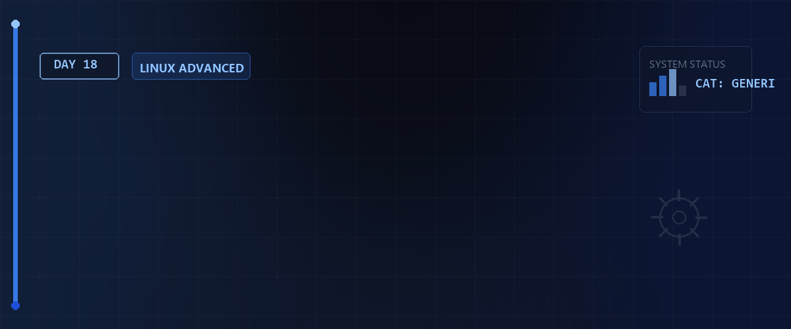

# 🖥️ System-Hardware & Kernel-Module — Tag 18



> **Entwickler & Administrator:** Tobias Boyke  
> **Status:** 🚀 100% Dokumentiert & LPIC-1 Fokussiert  
> **Kompatibilität:**   

---

## 📑 Inhaltsverzeichnis
- [🔍 1. Hardware-Informationen auslesen](#-1-hardware-informationen-auslesen)
  - [A. CPU & Systemspeicher](#a-cpu--systemspeicher)
  - [B. PCI- & USB-Geräte](#b-pci---usb-geräte)
  - [C. Blockgeräte & Partitionen](#c-blockgeräte--partitionen)
- [📦 2. Kernel-Module verwalten](#-2-kernel-module-verwalten)
  - [A. Was sind Kernel-Module?](#a-was-sind-kernel-module)
  - [B. Module anzeigen (lsmod & modinfo)](#b-module-anzeigen-lsmod--modinfo)
  - [C. Module dynamisch laden und entladen (modprobe vs. insmod/rmmod)](#c-module-dynamisch-laden-und-entladen-modprobe-vs-insmodrmmod)
- [📂 3. Offene Dateien & Netzwerk-Sockets (lsof)](#-3-offene-dateien--netzwerk-sockets-lsof)
  - [A. Dateien auflisten](#a-dateien-auflisten)
  - [B. Netzwerk-Verbindungen überwachen](#b-netzwerk-verbindungen-überwachen)
- [🧠 LPIC-1 Relevanz & Wissenstest](#-lpic-1-relevanz--wissenstest)
- [🔗 Zurück zur Übersicht](#-zurück-zur-übersicht)

---

## 🔍 1. Hardware-Informationen auslesen

Unter Linux wird fast jede Hardware-Komponente über das virtuelle Dateisystem `/sys` und `/proc` abgebildet. Spezielle Befehle bereiten diese rohen Kernel-Informationen benutzerfreundlich auf.

### A. CPU & Systemspeicher

* **`lscpu`**: Zeigt eine detaillierte Zusammenfassung der CPU-Architektur (Kerne, Threads, Cache-Größen, Virtualisierungs-Flags).
* **`/proc/cpuinfo`**: Die virtuelle Datei, aus der `lscpu` seine Daten bezieht. Kann direkt mit `cat` oder `grep` ausgelesen werden.

```bash
# CPU-Details auslesen
lscpu

# Nur das CPU-Modell aus der procfs-Datei filtern
grep "model name" /proc/cpuinfo
```

---

### B. PCI- & USB-Geräte

* **`lspci`**: Listet alle PCI-Busse und die daran angeschlossenen Geräte (z.B. Grafikkarten, Netzwerkkarten, SATA-Controller) auf.
  * **`-v` (Verbose):** Zeigt detaillierte Ressourcen (IRQs, Speicheradressen) an.
  * **`-vv` / `-vvv`:** Noch ausführlichere Diagnoseinformationen.
* **`lsusb`**: Listet alle USB-Controller und angeschlossenen USB-Geräte auf.
  * **`-v`:** Zeigt detaillierte USB-Deskriptoren.

```bash
# Einfache Auflistung der PCI-Geräte
lspci

# Detaillierte Infos zu einer bestimmten Netzwerkkarte anzeigen
lspci -v | grep -A 8 -i ethernet

# USB-Geräte im Baumstruktur-Format anzeigen
lsusb -t
```

---

### C. Blockgeräte & Partitionen

* **`lsblk`**: Zeigt alle verfügbaren Blockgeräte (Festplatten, SSDs, NVMe, USB-Sticks) in einer Baumstruktur an.
* **`fdisk -l`**: Listet die Partitionstabellen aller Blockgeräte auf (benötigt root-Rechte).

```bash
# Übersicht aller Blockgeräte
lsblk

# Blockgeräte inklusive Dateisystemen und UUIDs anzeigen
lsblk -f

# Partitionstabellen auflisten
sudo fdisk -l
```

> [!NOTE]  
> Blockgeräte werden unter Linux im Verzeichnis `/dev` repräsentiert (z.B. `/dev/sda` für die erste SATA-Platte, `/dev/nvme0n1` für die erste NVMe-SSD).

---

## 📦 2. Kernel-Module verwalten

### A. Was sind Kernel-Module?

Der Linux-Kernel ist zwar monolithisch, aber modular aufgebaut. Treiber und Kernel-Erweiterungen müssen nicht fest einkompiliert sein, sondern können als **Kernel Objects (`.ko`-Dateien)** dynamisch während des Betriebs geladen oder entladen werden.

### B. Module anzeigen (`lsmod` & `modinfo`)

* **`lsmod`**: Zeigt alle aktuell geladenen Kernel-Module, deren Speicherverbrauch und Abhängigkeiten an (liest `/proc/modules`).
* **`modinfo <Modulname>`**: Zeigt Informationen über ein Modul (Autor, Lizenz, Dateipfad, Abhängigkeiten und Parameter) an.

```bash
# Geladene Module anzeigen
lsmod

# Informationen über das Modul "kvm" (Virtualisierung) abrufen
modinfo kvm
```

---

### C. Module dynamisch laden und entladen (`modprobe`)

* **`modprobe` (Empfohlen):** Lädt oder entlädt Module und löst deren Abhängigkeiten zu anderen Modulen automatisch auf.
* **`insmod` / `rmmod` (Veraltet/Manuell):** Lädt/entlädt eine spezifische `.ko`-Datei, löst aber keine Abhängigkeiten auf (bricht ab, falls Abhängigkeiten fehlen).

```bash
# Modul (und alle benötigten Abhängigkeiten) laden
sudo modprobe loop

# Modul wieder entladen (inklusive ungenutzter Abhängigkeiten)
sudo modprobe -r loop
```

> [!IMPORTANT]  
> **LPIC-1 PRÜFUNGSWISSEN - modprobe vs. insmod:**  
> Während `insmod` den absoluten Pfad zur `.ko`-Datei benötigt (z.B. `insmod /lib/modules/.../kernel/drivers/.../loop.ko`), benötigt `modprobe` lediglich den logischen Namen des Moduls (`modprobe loop`) und sucht dieses in `/lib/modules/$(uname -r)/`.

---

## 📂 3. Offene Dateien & Netzwerk-Sockets (`lsof`)

Das Kommando `lsof` (List Open Files) ist eines der mächtigsten Diagnosewerkzeuge unter Linux, da nach der Unix-Philosophie "alles eine Datei" ist (auch Verzeichnisse, Geräte und Netzwerk-Sockets).

### A. Dateien auflisten

```bash
# Alle offenen Dateien des Systems auflisten (sehr lang!)
lsof

# Alle von einem bestimmten Benutzer geöffneten Dateien anzeigen
lsof -u student

# Prüfen, welcher Prozess eine bestimmte Datei blockiert
lsof /var/log/messages
```

### B. Netzwerk-Verbindungen überwachen

Mit dem Parameter `-i` filtert `lsof` nach Netzwerk-Sockets.

```bash
# Alle aktiven TCP- und UDP-Verbindungen auflisten
sudo lsof -i

# Sockets auf einem bestimmten Port anzeigen (z.B. Port 22 für SSH)
sudo lsof -i :22

# Nur TCP-Verbindungen anzeigen, die im Status LISTEN sind
sudo lsof -iTCP -sTCP:LISTEN
```

---

## 🧠 LPIC-1 Relevanz & Wissenstest

<details>
<summary><b>Fragen zu Hardware & Kernel-Modulen (Klicken zum Ausklappen)</b></summary>

1. **Welches Kommando zeigt die geladenen Kernelmodule und deren gegenseitige Abhängigkeiten an?**
   <details><summary>Antwort</summary>Das Kommando <code>lsmod</code> zeigt die Liste der geladenen Module und deren Abhängigkeiten (Used by) an.</details>

2. **Was ist der Unterschied zwischen `insmod` und `modprobe` beim Laden eines Moduls?**
   <details><summary>Antwort</summary><code>modprobe</code> löst Abhängigkeiten automatisch auf und benötigt nur den Modulnamen. <code>insmod</code> lädt ein Modul starr über den direkten Dateipfad und scheitert, wenn Abhängigkeiten nicht bereits geladen sind.</details>

3. **Welche virtuelle Datei enthält detaillierte Informationen über die System-CPU?**
   <details><summary>Antwort</summary>Die Datei <code>/proc/cpuinfo</code>.</details>

4. **Wie lautet der Befehl, um ein Kernel-Modul inklusive seiner Abhängigkeiten sicher zu entfernen?**
   <details><summary>Antwort</summary><code>sudo modprobe -r <Modulname></code></details>

5. **Mit welchem Befehl lässt sich feststellen, welcher Prozess eine bestimmte Datei geöffnet hat?**
   <details><summary>Antwort</summary>Mit dem Befehl <code>lsof <Dateipfad></code>.</details>

</details>

---

## 🔗 Zurück zur Übersicht

* **Tag 17 (Firewall & Netzwerksicherheit):** [⬅️ Tag 17](../Day_17/README.md)
* **Tag 19 (Partitionierung, Dateisysteme & Mounten):** [➡️ Tag 19](../Day_19/README.md)
* **Master-Repository:** [🌌 Zurück zum Master-Repository](../README.md)

---
*Erstellt & gepflegt von Tobias Boyke, Juni 2026.*
