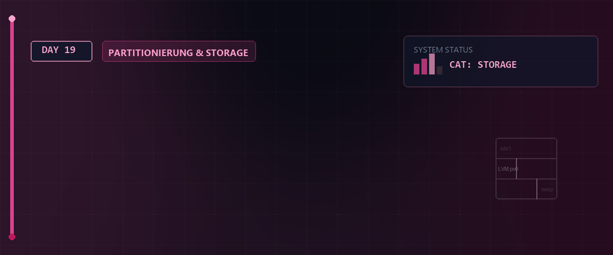

# 💾 Partitionierung, Dateisysteme & Mounten — Tag 19



> **Entwickler & Administrator:** Tobias Boyke  
> **Status:** 🚀 100% Dokumentiert & LPIC-1 Fokussiert  
> **Kompatibilität:**   

---

## 📑 Inhaltsverzeichnis
- [🏗️ 1. Partitionierung unter Linux](#️-1-partitionierung-unter-linux)
  - [A. Partitionstabellen: MBR vs. GPT](#a-partitionstabellen-mbr-vs-gpt)
  - [B. Partitionierungswerkzeuge (fdisk, gdisk, parted)](#b-partitionierungswerkzeuge-fdisk-gdisk-parted)
  - [C. Partitionsnummerierung](#c-partitionsnummerierung)
- [💽 2. Dateisysteme erstellen & identifizieren](#-2-dateisysteme-erstellen--identifizieren)
  - [A. Dateisystem erzeugen (mkfs)](#a-dateisystem-erzeugen-mkfs)
  - [B. UUID & Label auslesen (blkid)](#b-uuid--label-auslesen-blkid)
- [🔌 3. Mounten und Einhängen von Dateisystemen](#-3-mounten-und-einhängen-von-dateisystemen)
  - [A. Temporäres Einhängen (mount & umount)](#a-temporäres-einhängen-mount--umount)
  - [B. Mount Bind (--bind)](#b-mount-bind--bind)
  - [C. Permanente Konfiguration (/etc/fstab)](#c-permanente-konfiguration-etcfstab)
  - [D. Einhängepunkte verifizieren (/proc/mounts & /etc/mtab)](#d-einhängepunkte-verifizieren-procmounts--etcmtab)
- [🧠 4. Swapspace verwalten](#-4-swapspace-verwalten)
  - [A. Was ist Swap?](#a-was-sind-swap)
  - [B. Swapon & Swapoff](#b-swapon--swapoff)
- [🔑 Keywords](#-keywords)
- [🧠 LPIC-1 Relevanz & Wissenstest](#-lpic-1-relevanz--wissenstest)
- [🔗 Zurück zur Übersicht](#-zurück-zur-übersicht)

---

## 🏗️ 1. Partitionierung unter Linux

Bevor ein Datenträger verwendet werden kann, muss er partitioniert werden. Dadurch wird der physische Speicher in logische Abschnitte unterteilt.

### A. Partitionstabellen: MBR vs. GPT

1. **Master Boot Record (MBR):**
   * **Alter Standard (Legacy):** Unterstützt Festplatten bis maximal **2 TB**.
   * **Limitierung:** Maximal **4 primäre Partitionen**.
   * **Erweiterung:** Eine der primären Partitionen kann als **erweiterte Partition** definiert werden, die wiederum mehrere **logische Partitionen** enthalten kann.

2. **GUID Partition Table (GPT):**
   * **Moderner Standard (UEFI):** Unterstützt Festplatten weit über 2 TB.
   * **Flexibilität:** Standardmäßig bis zu **128 primäre Partitionen** ohne logische Verschachtelung.
   * **Sicherheit:** Redundante Speicherung der Partitionstabelle am Anfang und Ende der Platte.

---

### B. Partitionierungswerkzeuge (`fdisk`, `gdisk`, `parted`)

* **`fdisk`**: Interaktives Werkzeug zur Partitionierung von MBR- (und neuerdings GPT-) Festplatten.
* **`gdisk`**: GPT-Pendant zu fdisk, speziell für moderne Partitionstabellen.
* **`cfdisk` / `cgdisk`**: Menügeführte, benutzerfreundlichere TUI-Versionen von fdisk/gdisk.
* **`parted`**: Kommandozeilen-basiertes Tool, das sich gut skripten lässt und sowohl MBR als auch GPT unterstützt.
* **`gparted`**: Die grafische Oberfläche (GUI) zur Partitionierung.

```bash
# Interaktive MBR-Partitionierung einer SATA-Platte
sudo fdisk /dev/sda

# Interaktive GPT-Partitionierung einer SATA-Platte
sudo gdisk /dev/sda

# Partitionstabelle eines Geräts anzeigen (nicht-interaktiv)
sudo parted /dev/sda print
```

---

### C. Partitionsnummerierung

Bei MBR gilt eine feste Regel für die Benennung der Partitionen unter Linux:
* **`1` bis `4`**: Reserviert für primäre Partitionen (oder die erweiterte Partition).
* **`5` und höher**: Logische Partitionen innerhalb der erweiterten Partition (auch wenn z.B. nur eine einzige primäre Partition existiert).

> [!NOTE]  
> Wird die erste Platte `/dev/sda` partitioniert, ist `/dev/sda1` die erste primäre Partition. Die erste logische Partition ist **immer** `/dev/sda5`.

---

## 💽 2. Dateisysteme erstellen & identifizieren

Nach dem Partitionieren muss ein Dateisystem (Formatierung) auf der Partition erstellt werden.

### A. Dateisystem erzeugen (`mkfs`)

Linux unterstützt diverse Dateisysteme wie **ext4**, **XFS**, **btrfs** oder **vfat**. Das universelle Werkzeug hierfür ist `mkfs` (Make Filesystem).

```bash
# Erstellt ein ext4-Dateisystem auf der Partition /dev/sda1
sudo mkfs.ext4 /dev/sda1

# Alternativ über die allgemeine Syntax
sudo mkfs -t ext4 /dev/sda1

# Erstellt ein XFS-Dateisystem (Standard unter Rocky Linux)
sudo mkfs.xfs /dev/sda2
```

### B. UUID & Label auslesen (`blkid`)

Jedes erstellte Dateisystem erhält eine eindeutige Universally Unique Identifier (**UUID**). Diese sollte zur eindeutigen Adressierung verwendet werden.

```bash
# Zeigt UUID und Dateisystemtyp aller Partitionen an
sudo blkid
```

---

## 🔌 3. Mounten und Einhängen von Dateisystemen

Unter Linux werden Dateisysteme in den zentralen Verzeichnisbaum eingehängt (gemountet).

### A. Temporäres Einhängen (`mount` & `umount`)

```bash
# Einhängen der Partition /dev/sda1 in das Verzeichnis /mnt/platte1
sudo mkdir -p /mnt/platte1
sudo mount /dev/sda1 /mnt/platte1

# Aushängen (unmount) des Dateisystems (über Gerät oder Einhängepunkt)
sudo umount /mnt/platte1    # oder: sudo umount /dev/sda1
```

> [!WARNING]  
> Wenn ein Verzeichnis im Terminal von einem Benutzer betreten wurde (`cd /mnt/platte1`), meldet `umount` den Fehler: `device is busy`. Der Einhängepunkt darf nicht aktiv genutzt werden, um ihn auszuhängen!

---

### B. Mount Bind (`--bind`)

Mit der Option `--bind` kann ein bereits eingehängtes Verzeichnis an eine zweite Stelle im Verzeichnisbaum gespiegelt werden.

```bash
# Spiegelt den Inhalt von /run/media/simus/dat nach /mnt/usb_stick
sudo mount --bind /run/media/simus/dat /mnt/usb_stick
```

---

### C. Permanente Konfiguration (`/etc/fstab`)

Damit Partitionen beim Systemstart automatisch gemountet werden, müssen sie in der Datei **`/etc/fstab`** (File System Table) eingetragen werden. Sie besitzt 6 Spalten:

| 1. Gerät / UUID | 2. Mountpoint | 3. Dateisystem | 4. Optionen | 5. Dump | 6. Pass (FSCK) |
| :--- | :--- | :--- | :--- | :---: | :---: |
| `UUID=xxxx-xxxx` | `/mnt/data` | `ext4` | `defaults` | `0` | `2` |

* **Spalte 4 (Optionen):** `defaults` impliziert `rw`, `suid`, `dev`, `exec`, `auto`, `nouser`, `async`.
* **Spalte 5 (Dump):** Backup-Priorität (`0` = aus, `1` = an).
* **Spalte 6 (Pass):** Reihenfolge der Dateisystemprüfung beim Booten (`0` = keine Prüfung, `1` = Root-Dateisystem `/`, `2` = andere Dateisysteme).

```bash
# Alle in der fstab definierten Dateisysteme automatisch einhängen
sudo mount -a
```

---

### D. Einhängepunkte verifizieren

Aktuelle Mount-Informationen können an verschiedenen Stellen ausgelesen werden:
* **`/proc/self/mounts`** und **`/proc/mounts`**: Direkte Kernel-Informationen zu allen aktiven Einhängepunkten.
* **`/etc/mtab`**: Traditionelle Datei, die unter modernen Linux-Distributionen als symbolischer Link auf `/proc/self/mounts` realisiert ist.

---

## 🧠 4. Swapspace verwalten

### A. Was ist Swap?

Swap-Speicher (Auslagerungsspeicher) dient als virtueller Arbeitsspeicher auf der Festplatte, falls der physische RAM vollgeschrieben ist.

### B. `swapon` & `swapoff`

```bash
# Aktive Swap-Bereiche anzeigen
swapon --show  # oder: cat /proc/swaps

# Swap-Bereich aktivieren
sudo swapon /dev/sda2

# Swap-Bereich deaktivieren
sudo swapoff /dev/sda2
```

---

## 🔑 Keywords

| Keyword / Befehl | Erklärung |
| :--- | :--- |
| `fdisk` | Klassisches Partitionierungswerkzeug zur Erstellung und Verwaltung von MBR- und GPT-Partitionstabellen. |
| `mkfs.ext4` | Erstellt ein ext4-Dateisystem (Formatierung) auf einer Partition oder Festplatte. |
| `mount` | Hängt ein Dateisystem oder eine Partition in ein beliebiges Verzeichnis der Verzeichnisstruktur ein. |
| `UUID` | Universally Unique Identifier: Eindeutige Kennung für Partitionen zur stabilen Zuordnung in /etc/fstab. |
| `umount` | Hängt ein eingehängtes Dateisystem sicher aus dem Verzeichnisbaum aus. |

---

## 🧠 LPIC-1 Relevanz & Wissenstest

<details>
<summary><b>Fragen zu Partitionierung, Dateisystemen & Mounten (Klicken zum Ausklappen)</b></summary>

1. **Welche Nummer erhält die erste logische Partition auf einer MBR-Festplatte immer, unabhängig von der Anzahl der primären Partitionen?**
   <details><summary>Antwort</summary>Sie erhält immer die Nummer <code>5</code> (z.B. <code>/dev/sda5</code>).</details>

2. **Wie lautet der Befehl zur Formatierung einer Partition mit dem ext4-Dateisystem?**
   <details><summary>Antwort</summary><code>sudo mkfs.ext4 /dev/sdXX</code> oder <code>sudo mkfs -t ext4 /dev/sdXX</code></details>

3. **Welche Spalte in der `/etc/fstab` bestimmt die Dateisystemprüfpriorität (fsck) beim Booten?**
   <details><summary>Antwort</summary>Die **6. Spalte** (Pass). Das Root-Dateisystem hat dort den Wert <code>1</code>, andere Partitionen <code>2</code>, und nicht zu prüfende Dateisysteme <code>0</code>.</details>

4. **Mit welchem Befehl lässt sich die UUID einer Partition im Terminal auslesen?**
   <details><summary>Antwort</summary>Mit dem Befehl <code>blkid</code> (oder <code>lsblk -f</code>).</details>

5. **Was bewirkt der Befehl `mount -a`?**
   <details><summary>Antwort</summary>Er mountet alle in der Datei <code>/etc/fstab</code> eingetragenen Dateisysteme, die mit der Option <code>auto</code> versehen sind (sofern sie nicht bereits eingehängt sind).</details>

</details>

---

## 🔗 Zurück zur Übersicht

* **Tag 18 (System-Hardware & Kernel-Module):** [⬅️ Tag 18](../Day_18/README.md)
* **Tag 20 (LVM (Logical Volume Manager)):** [➡️ Tag 20](../Day_20/README.md)
* **Master-Repository:** [🌌 Zurück zum Master-Repository](../README.md)

---
*Erstellt & gepflegt von Tobias Boyke, Juni 2026.*
