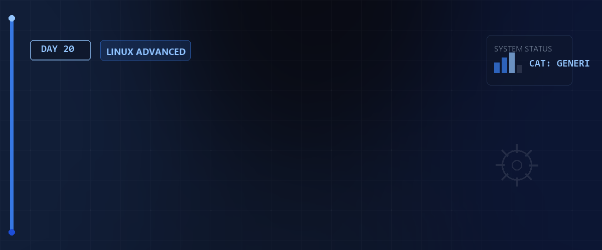
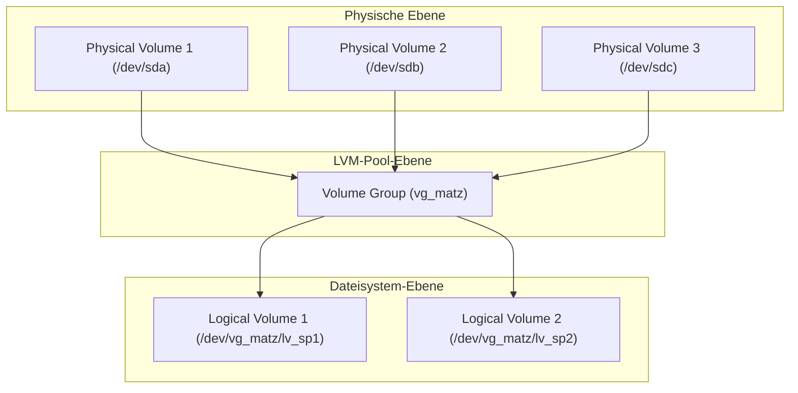

# 📦 LVM (Logical Volume Manager) — Tag 20



> **Entwickler & Administrator:** Tobias Boyke  
> **Status:** 🚀 100% Dokumentiert & LPIC-1 Fokussiert  
> **Kompatibilität:**   

---

## 📑 Inhaltsverzeichnis
- [🏗️ 1. LVM-Architektur & Konzepte](#️-1-lvm-architektur--konzepte)
- [🛠️ 2. LVM Schritt-für-Schritt einrichten](#️-2-lvm-schritt-für-schritt-einrichten)
  - [Schritt 1: Physische Volumes (PV) initialisieren](#schritt-1-physische-volumes-pv-initialisieren)
  - [Schritt 2: Volume Group (VG) erstellen](#schritt-2-volume-group-vg-erstellen)
  - [Schritt 3: Logical Volumes (LV) anlegen](#schritt-3-logical-volumes-lv-anlegen)
  - [Schritt 4: Dateisystem erstellen & mounten](#schritt-4-dateisystem-erstellen--mounten)
- [📈 3. Dynamisches Resizing (Erweitern & Verkleinern)](#-3-dynamisches-resizing-erweitern--verkleinern)
  - [A. Logical Volume & Dateisystem erweitern](#a-logical-volume--dateisystem-erweitern)
  - [B. Logical Volume & Dateisystem verkleinern](#b-logical-volume--dateisystem-verkleinern)
- [🧹 4. Datenträger entfernen & LVM aufräumen](#-4-datenträger-entfernen--lvm-aufräumen)
  - [Schritt-für-Schritt-Workflow](#schritt-für-schritt-workflow)
- [🧠 LPIC-1 Relevanz & Wissenstest](#-lpic-1-relevanz--wissenstest)
- [🔗 Zurück zur Übersicht](#-zurück-zur-übersicht)

---

## 🏗️ 1. LVM-Architektur & Konzepte

Der **Logical Volume Manager (LVM)** abstrahiert die physische Festplattenstruktur. Er fügt eine Virtualisierungsschicht zwischen physischen Datenträgern und den genutzten Dateisystemen ein, was eine flexible Speicherverwaltung zur Laufzeit ermöglicht.



LVM gliedert sich in drei Kernkomponenten:
1. **Physical Volume (PV):** Physische Datenträger oder Partitionen (z.B. `/dev/sda`), die für LVM vorbereitet wurden.
2. **Volume Group (VG):** Ein Speicher-Pool, der aus einem oder mehreren PVs zusammengeschlossen wird (vergleichbar mit einer großen virtuellen Festplatte).
3. **Logical Volume (LV):** Logische Partitionen, die aus der VG herausgeschnitten werden. Auf diesen wird das eigentliche Dateisystem erstellt.

---

## 🛠️ 2. LVM Schritt-für-Schritt einrichten

### Schritt 1: Physische Volumes (PV) initialisieren

Zuerst deklarieren wir physische Festplatten oder Partitionen als LVM-Speicher.

```bash
# Physische Geräte auf LVM-Kompatibilität prüfen
sudo lvmdiskscan

# Drei physische Datenträger als PVs initialisieren
sudo pvcreate /dev/sda /dev/sdb /dev/sdc

# Status der PVs anzeigen
sudo pvdisplay
```

---

### Schritt 2: Volume Group (VG) erstellen

Wir fassen die PVs zu einem gemeinsamen Pool zusammen.

```bash
# Volume Group "vg_matz" aus den drei PVs erstellen
sudo vgcreate vg_matz /dev/sda /dev/sdb /dev/sdc

# Status der Volume Group abfragen
sudo vgdisplay
```

---

### Schritt 3: Logical Volumes (LV) anlegen

Wir schneiden zwei logische Partitionen aus dem Pool heraus.

```bash
# Logical Volume "lv_sp1" mit einer festen Größe von 50 GB erstellen
sudo lvcreate -L 50G -n lv_sp1 vg_matz

# Logical Volume "lv_sp2" mit einer Größe von 10 GB erstellen
sudo lvcreate -L 10G -n lv_sp2 vg_matz

# Logical Volumes anzeigen
sudo lvdisplay
```

---

### Schritt 4: Dateisystem erstellen & mounten

```bash
# Dateisysteme auf den LVs erstellen (ext4 und ext3)
sudo mkfs.ext4 /dev/vg_matz/lv_sp1
sudo mkfs.ext3 /dev/vg_matz/lv_sp2

# Einhängepunkte erstellen und mounten
sudo mkdir -p /mnt/platte1 /mnt/platte2
sudo mount /dev/vg_matz/lv_sp1 /mnt/platte1
sudo mount /dev/vg_matz/lv_sp2 /mnt/platte2
```

---

## 📈 3. Dynamisches Resizing (Erweitern & Verkleinern)

Einer der größten Vorteile von LVM ist die Möglichkeit, Speicherplatz online (im laufenden Betrieb) zu verändern.

### A. Logical Volume & Dateisystem erweitern

Beim Erweitern vergrößern wir zuerst das Logical Volume und passen anschließend das Dateisystem an.

```bash
# Methode 1: LV auf 60 GB vergrößern und das ext4-Dateisystem automatisch mit anpassen
sudo lvresize -r -L 60G /dev/vg_matz/lv_sp1

# Methode 2 (Schritt für Schritt):
sudo lvresize -L +10G /dev/vg_matz/lv_sp1             # LV um 10 GB erweitern
sudo resize2fs /dev/vg_matz/lv_sp1                    # ext-Dateisystem online erweitern
# (Für XFS-Dateisysteme wird 'xfs_growfs /mnt/platte1' verwendet!)
```

---

### B. Logical Volume & Dateisystem verkleinern

> [!CAUTION]  
> Das Verkleinern von Dateisystemen birgt das Risiko von Datenverlust. Das Dateisystem muss **vor** dem Verkleinern zwingend ausgehängt und überprüft werden! XFS-Dateisysteme können **nicht** verkleinert werden!

```bash
# 1. Dateisystem aushängen
sudo umount /mnt/platte2

# 2. Dateisystem auf Fehler prüfen (erforderlich vor resize)
sudo fsck -t ext3 -f /dev/vg_matz/lv_sp2

# 3. Dateisystem verkleinern (z.B. auf 5 GB)
sudo resize2fs -p /dev/vg_matz/lv_sp2 5G

# 4. Logical Volume auf die exakt gleiche Größe schrumpfen
sudo lvresize -L 5G /dev/vg_matz/lv_sp2

# 5. Wieder einhängen
sudo mount /dev/vg_matz/lv_sp2 /mnt/platte2
```

---

## 🧹 4. Datenträger entfernen & LVM aufräumen

Soll eine defekte oder zu kleine Festplatte (z.B. `/dev/sdc`) aus der Volume Group entfernt werden, können die Daten auf andere aktive Datenträger verschoben werden.

### Schritt-für-Schritt-Workflow

```bash
# 1. Alle Daten des PVs /dev/sdc auf die verbleibenden PVs in der VG verschieben
sudo pvmove /dev/sdc

# 2. Das leere PV aus der Volume Group entfernen
sudo vgreduce vg_matz /dev/sdc

# 3. Das Gerät aus der LVM-Verwaltung löschen
sudo pvremove /dev/sdc
```

---

## 🧠 LPIC-1 Relevanz & Wissenstest

<details>
<summary><b>Fragen zu LVM (Klicken zum Ausklappen)</b></summary>

1. **Welche drei Abstraktionsschichten nutzt LVM und in welcher Reihenfolge werden sie aufgebaut?**
   <details><summary>Antwort</summary>
   1. **PV** (Physical Volume - Physische Partition/Festplatte)  
   2. **VG** (Volume Group - Pool aus PVs)  
   3. **LV** (Logical Volume - Nutzkapazität aus der VG)
   </details>

2. **Mit welchem Befehl verschiebt man Daten von einem Physical Volume auf ein anderes innerhalb der gleichen VG?**
   <details><summary>Antwort</summary>Mit dem Befehl <code>sudo pvmove <Quell-PV></code>.</details>

3. **Können XFS-Dateisysteme verkleinert werden?**
   <details><summary>Antwort</summary>Nein. XFS unterstützt das Vergrößern (online via <code>xfs_growfs</code>), kann jedoch nicht verkleinert werden.</details>

4. **Welche Option bei `lvresize` oder `lvextend` sorgt dafür, dass das darunterliegende Dateisystem direkt mit angepasst wird?**
   <details><summary>Antwort</summary>Die Option <code>-r</code> (bzw. <code>--resizefs</code>).</details>

5. **Wie lautet der Befehl, um ein Logical Volume namens `lv_test` in der Volume Group `vg_data` mit einer Größe von 20 GB anzulegen?**
   <details><summary>Antwort</summary><code>sudo lvcreate -L 20G -n lv_test vg_data</code></details>

</details>

---
## 🔗 Zurück zur Übersicht

* **Tag 19 (Partitionierung, Dateisysteme & Mounten):** [⬅️ Tag 19](../Day_19/README.md)
* **Tag 21 (Kryptographie, SSH & Rsync):** [➡️ Tag 21](../Day_21/README.md)
* **Master-Repository:** [🌌 Zurück zum Master-Repository](../README.md)

---
*Erstellt & gepflegt von Tobias Boyke, Juni 2026.*
