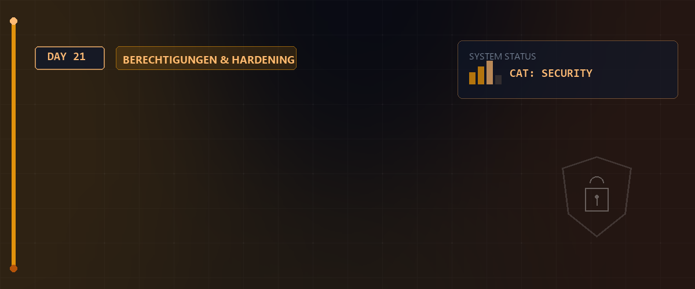

# 🔐 Kryptographie, SSH & Rsync — Tag 21



> **Entwickler & Administrator:** Tobias Boyke  
> **Status:** 🚀 100% Dokumentiert & LPIC-1 Fokussiert  
> **Kompatibilität:**   

---

## 📑 Inhaltsverzeichnis
- [🛡️ 1. IT-Schutzziele & Kryptographie](#️-1-it-schutzziele--kryptographie)
  - [A. Die vier klassischen Schutzziele (CIA-N)](#a-die-vier-klassischen-schutzziele-cia-n)
  - [B. Symmetrische vs. Asymmetrische Kryptographie](#b-symmetrische-vs-asymmetrische-kryptographie)
- [🌐 2. SSH (Secure Shell) & OpenSSH-Suite](#-2-ssh-secure-shell--openssh-suite)
  - [A. SSH-Grundlagen & Angriffsvermeidung](#a-ssh-grundlagen--angriffsvermeidung)
  - [B. SSH-Schlüsselaustausch & known_hosts](#b-ssh-schlüsselaustausch--known_hosts)
  - [C. Passwordless Login mit SSH-Keys](#c-passwordless-login-mit-ssh-keys)
  - [D. SSH-Agent & ssh-add](#d-ssh-agent--ssh-add)
- [🔄 3. Rsync (Remote Synchronization)](#-3-rsync-remote-synchronization)
  - [A. Lokale & entfernte Synchronisation](#a-lokale--entfernte-synchronisation)
  - [B. Wichtige Rsync-Optionen](#b-wichtige-rsync-optionen)
  - [C. Rsync über SSH](#c-rsync-über-ssh)
- [🧠 LPIC-1 Relevanz & Wissenstest](#-lpic-1-relevanz--wissenstest)
- [🔗 Zurück zur Übersicht](#-zurück-zur-übersicht)

---

## 🛡️ 1. IT-Schutzziele & Kryptographie

Eine sichere Kommunikation im Netz basiert auf etablierten Sicherheitszielen und kryptographischen Mechanismen.

### A. Die vier klassischen Schutzziele (CIA-N)

1. **Vertraulichkeit (Confidentiality):** Daten können nur von autorisierten Empfängern gelesen werden (Verschlüsselung).
2. **Integrität (Integrity):** Daten können auf dem Transportweg nicht unbemerkt manipuliert werden (kryptographische Prüfsummen/Hashes).
3. **Authentizität (Authenticity):** Die Kommunikationspartner sind eindeutig identifizierbar (Signaturen/Zertifikate).
4. **Verbindlichkeit / Nicht-Abstreitbarkeit (Non-Repudiation):** Ein Sender kann das Absenden einer Nachricht im Nachhinein nicht leugnen.

---

### B. Symmetrische vs. Asymmetrische Kryptographie

* **Symmetrische Verschlüsselung:**
  * **Prinzip:** Sender und Empfänger nutzen den **gleichen geheimen Schlüssel** zur Ver- und Entschlüsselung.
  * **Vorteil:** Extrem schnell und recheneffizient.
  * **Problem:** Sicherer Schlüsselaustausch vorab erforderlich.
  * **Algorithmen:** AES (Advanced Encryption Standard), ChaCha20.
* **Asymmetrische Verschlüsselung (Public-Key-Kryptographie):**
  * **Prinzip:** Jeder Teilnehmer besitzt ein Schlüsselpaar: Einen **Public Key** (öffentlich, darf jeder kennen) und einen **Private Key** (privat, muss geheim bleiben).
  * Mit dem Public Key verschlüsselte Daten können **nur** mit dem zugehörigen Private Key entschlüsselt werden.
  * Mit dem Private Key signierte Daten können von jedem mit dem Public Key auf Echtheit geprüft werden.
  * **Algorithmen:** RSA, ECDSA, Ed25519.

---

## 🌐 2. SSH (Secure Shell) & OpenSSH-Suite

SSH ist das Standardprotokoll zur verschlüsselten Administration von entfernten Linux-Systemen im Netzwerk.

### A. SSH-Grundlagen & Angriffsvermeidung

SSH sichert die Verbindung gegen verschiedene Angriffe ab:
* **DNS Spoofing:** Verfälschen von DNS-Einträgen, um Verbindungen umzuleiten.
* **IP Spoofing:** Vortäuschen einer vertrauenswürdigen IP-Adresse.
* **Man-in-the-Middle (MitM):** Abfangen und Manipulieren der Kommunikation auf dem Übertragungsweg.

---

### B. SSH-Schlüsselaustausch & `known_hosts`

Bei der ersten Verbindung zu einem SSH-Server sendet dieser seinen öffentlichen Host-Key (Fingerabdruck).
* Der Benutzer wird gefragt, ob er dem Fingerprint vertraut.
* Nach Bestätigung wird der Host-Key in der Datei **`~/.ssh/known_hosts`** des lokalen Benutzers gespeichert.
* **Sicherheitsprüfung:** Der Administrator kann den Fingerprint des Servers direkt auf der Serverkonsole überprüfen:

```bash
# Host-Schlüssel auf dem Server verifizieren
ssh-keygen -l -f /etc/ssh/ssh_host_rsa_key
```

---

### C. Passwordless Login mit SSH-Keys

Zur Absicherung und Automatisierung wird anstelle von Passwörtern ein asymmetrisches Schlüsselpaar (User PPK) verwendet.

```bash
# 1. Schlüsselpaar auf dem lokalen Client generieren (z.B. RSA, 2048 Bit)
ssh-keygen -t rsa -b 2048

# 2. Den öffentlichen Schlüssel (Public Key) auf den Server übertragen
ssh-copy-id user@172.18.0.7
```

> [!NOTE]  
> `ssh-copy-id` trägt den Inhalt von `~/.ssh/id_rsa.pub` automatisch in die Datei **`~/.ssh/authorized_keys`** des Zielbenutzers auf dem Server ein und setzt die korrekten Zugriffsrechte.

---

### D. SSH-Agent & `ssh-add`

Wenn der Private Key mit einer Passphrase geschützt ist, müsste diese bei jedem Verbindungsaufbau eingegeben werden. Der `ssh-agent` speichert den entschlüsselten Schlüssel im RAM der aktuellen Session.

```bash
# Startet den ssh-agent in der aktuellen Shell
eval $(ssh-agent)

# Fügt den privaten Schlüssel dem Agenten hinzu (Passphrase wird einmalig abgefragt)
ssh-add ~/.ssh/id_rsa
```

---

## 🔄 3. Rsync (Remote Synchronization)

`rsync` ist ein hocheffizientes Tool zum Kopieren und Synchronisieren von Dateien und Verzeichnissen.

### A. Lokale & entfernte Synchronisation

Der größte Vorteil von Rsync ist der **Delta-Transfer-Algorithmus**: Es werden nur die Teile von Dateien übertragen, die sich tatsächlich geändert haben.

### B. Wichtige Rsync-Optionen

* **`-a` (Archive):** Aktiviert den Archivmodus (rekursiv, erhält symbolische Links, Rechte, Zeitstempel, Besitzer und Gruppen).
* **`-v` (Verbose):** Ausführliche Statusmeldungen.
* **`-z` (Compress):** Komprimiert Daten während der Übertragung.
* **`-P` (Progress):** Zeigt den Fortschrittsbalken an und erlaubt die Fortsetzung abgebrochener Übertragungen.
* **`--delete`:** Löscht Dateien im Zielverzeichnis, die im Quellverzeichnis nicht mehr existieren (erstellt einen exakten Spiegel).

```bash
# Lokale Synchronisation von zwei Ordnern
rsync -avz /quelle/ /ziel/
```

> [!CAUTION]  
> Achten Sie auf den abschließenden Schrägstrich (`/`) bei der Quelle:  
> * `rsync -a /src /dest` kopiert den Ordner `src` **als Unterverzeichnis** nach `/dest/src`.  
> * `rsync -a /src/ /dest` kopiert den **Inhalt** von `src` direkt nach `/dest`.

### C. Rsync über SSH

Um Daten sicher über Netzwerke hinweg zu synchronisieren, nutzt Rsync SSH als Transportmedium.

```bash
# Synchronisiert ein lokales Verzeichnis verschlüsselt mit einem Remote-Server
rsync -avz -e ssh /local/dir/ user@remotehost:/remote/dir/
```

---

## 🧠 LPIC-1 Relevanz & Wissenstest

<details>
<summary><b>Fragen zu Kryptographie, SSH & Rsync (Klicken zum Ausklappen)</b></summary>

1. **In welcher Datei auf dem SSH-Server werden die öffentlichen Schlüssel der zugelassenen Client-Benutzer hinterlegt?**
   <details><summary>Antwort</summary>In der Datei <code>~/.ssh/authorized_keys</code> des jeweiligen Benutzers.</details>

2. **Welche Datei auf dem Client-Rechner speichert die Host-Keys aller Systeme, zu denen bereits eine Verbindung aufgebaut wurde?**
   <details><summary>Antwort</summary>In der Datei <code>~/.ssh/known_hosts</code> im Home-Verzeichnis des Benutzers.</details>

3. **Welcher Befehl überträgt den lokalen Public Key automatisiert auf einen SSH-Server?**
   <details><summary>Antwort</summary>Der Befehl <code>ssh-copy-id user@host</code>.</details>

4. **Welche Option sorgt bei `rsync` dafür, dass Berechtigungen, Eigentümer und Zeitstempel eins-zu-eins erhalten bleiben?**
   <details><summary>Antwort</summary>Die Option <code>-a</code> (Archive-Modus).</details>

5. **Wie lautet der Befehl, um Rsync anzuweisen, Dateien im Zielverzeichnis zu löschen, die in der Quelle nicht mehr vorhanden sind?**
   <details><summary>Antwort</summary><code>--delete</code> (z.B. <code>rsync -av --delete /src/ /dest/</code>)</details>

</details>

---

## 📚 Ressourcen & Dokumente
Im [Assets](./assets)-Verzeichnis finden Sie weiterführende Informationen:

- [Kryptographie Grundlagen (PDF)](./assets/FullstackAckermann17-2Kryptographie.pdf)
- [IT-Schutzziele & Kryptographie (PDF)](./assets/IT-SchutzzieleKryptographie.pdf)
- [SSH-Grundlagen (PDF)](./assets/Linux_ssh.pdf)
- [Rsync über SSH Kopieranleitung (PDF)](./assets/How%20To%20Copy%20Files%20With%20Rsync%20Over%20SSH%20DigitalOcean.pdf)
- [Rsync Synchronisationsanleitung (PDF)](./assets/Verwenden%20von%20Rsync%20zum%20Synchronisieren%20von%20lokalen%20und%20entfernten%20Verzeichnissen%20DigitalOcean.pdf)

---
## 🔗 Zurück zur Übersicht

* **Tag 20 (LVM (Logical Volume Manager)):** [⬅️ Tag 20](../Day_20/README.md)
* **Tag 22 (SSH-Agent, ProxyJump & Rsync):** [➡️ Tag 22](../Day_22/README.md)
* **Master-Repository:** [🌌 Zurück zum Master-Repository](../README.md)

---
*Erstellt & gepflegt von Tobias Boyke, Juni 2026.*
