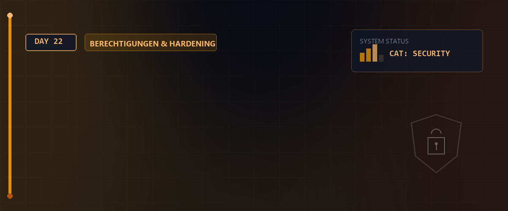

# 🔐 SSH-Agent, ProxyJump & Rsync-Synchronisation — Tag 22



> **Entwickler & Administrator:** Tobias Boyke  
> **Status:** 🚀 100% Dokumentiert & LPIC-1 Fokussiert  
> **Kompatibilität:**   

---

## 📑 Inhaltsverzeichnis
- [🔑 1. SSH-Agent: Private Keys im Arbeitsspeicher verwalten](#-1-ssh-agent-private-keys-im-arbeitsspeicher-verwalten)
  - [A. Funktionsweise & Nutzen des SSH-Agenten](#a-funktionsweise--nutzen-des-ssh-agenten)
  - [B. Praxis-Befehle: Schlüssel laden & entfernen](#b-praxis-befehle-schlüssel-laden--entfernen)
- [🦘 2. Multi-Hop Verbindungen: SSH-Agent-Forwarding vs. ProxyJump](#-2-multi-hop-verbindungen-ssh-agent-forwarding-vs-proxyjump)
  - [A. Agent Forwarding (Klassisch / Sicherheitsrisiko)](#a-agent-forwarding-klassisch--sicherheitsrisiko)
  - [B. ProxyJump (Modern / Best Practice)](#b-proxyjump-modern--best-practice)
  - [C. Praktische Konfiguration unter `~/.ssh/config`](#c-praktische-konfiguration-unter-sshconfig)
- [🔄 3. Rsync: Fortgeschrittene Synchronisation & Automatisierung](#-3-rsync-fortgeschrittene-synchronisation--automatisierung)
  - [A. Rsync Kern-Optionen & Best Practices](#a-rsync-kern-optionen--best-practices)
  - [B. Pull- & Push-Verfahren über SSH](#b-pull---push-verfahren-über-ssh)
  - [C. Automatisierung über Cronjobs](#c-automatisierung-über-cronjobs)
  - [D. Echtzeit-Synchronisation mit Lsyncd (Inotify & Lua-Config)](#d-echtzeit-synchronisation-mit-lsyncd-inotify--lua-config)
- [🧠 LPIC-1 Relevanz & Wissenstest](#-lpic-1-relevanz--wissenstest)
- [🔗 Zurück zur Übersicht](#-zurück-zur-übersicht)

---

## 🔑 1. SSH-Agent: Private Keys im Arbeitsspeicher verwalten

Der `ssh-agent` ist ein Hintergrunddienst (Daemon), der private SSH-Schlüssel entschlüsselt im RAM vorhält. Dadurch entfällt die wiederholte Eingabe der Passphrase bei Verbindungen zu Servern.

### A. Funktionsweise & Nutzen des SSH-Agenten
* **Sicherer Arbeitsspeicher:** Private Schlüssel liegen nicht permanent unverschlüsselt auf dem Speichermedium, sondern werden verschlüsselt abgelegt und durch den `ssh-agent` nur im RAM der laufenden Benutzersitzung temporär entschlüsselt gehalten.
* **Passwortfreies Arbeiten:** Der SSH-Agent übernimmt die kryptografische Signierung von Anfragen des SSH-Clients automatisch im Hintergrund.
* **Schutz vor Diebstahl:** Wenn Sie Ihren PC verlassen, können Sie den Agenten leeren, sodass Unbefugte keinen Zugriff auf die Remote-Systeme erlangen.

### B. Praxis-Befehle: Schlüssel laden & entfernen

```bash
# Starten des SSH-Agenten für die aktuelle Shell-Session
eval $(ssh-agent -s)

# Prüfen, welche Schlüssel derzeit im Agenten geladen sind
ssh-add -l

# Einen bestimmten privaten Schlüssel zum Agenten hinzufügen (Passphrase wird einmalig abgefragt)
ssh-add ~/.ssh/id_ed25519

# Alle geladenen Schlüssel aus dem Agenten löschen (z.B. beim Verlassen des Arbeitsplatzes)
ssh-add -D
```

---

## 🦘 2. Multi-Hop Verbindungen: SSH-Agent-Forwarding vs. ProxyJump

Wenn ein Zielsystem nur über einen dazwischengeschalteten Server (Jump-Host oder Bastion-Host) erreichbar ist, muss der SSH-Schlüssel zur Authentifizierung verwendet werden. Hierfür gibt es zwei Verfahren.

### A. Agent Forwarding (Klassisch / Sicherheitsrisiko)
Beim Agent-Forwarding (`ssh -A`) wird der Zugriff auf den lokalen SSH-Agenten an den Jump-Host durchgereicht.
* **Ablauf:** `ssh -A benutzer@jump-host` -> `ssh benutzer@ziel-host`
> [!WARNING]  
> **Sicherheitsrisiko:** Besitzt ein Angreifer Root-Rechte auf dem Jump-Host, kann er das weitergeleitete Socket des SSH-Agenten unter `/tmp/ssh-*` entführen und die Identität des Clients annehmen, um sich auf nachgelagerte Systeme zu verbinden.

### B. ProxyJump (Modern / Best Practice)
`ProxyJump` ist die moderne, sichere Alternative (ab OpenSSH 7.3). 
* **Ablauf:** Der lokale Client baut einen verschlüsselten SSH-Kanal *durch* den Jump-Host direkt zum Ziel-Host auf (Ende-zu-Ende-Verschlüsselung).
* Der Jump-Host sieht nur verschlüsselten SSH-Traffic und hat zu keinem Zeitpunkt Zugriff auf den SSH-Agenten oder die Private Keys.

### C. Praktische Konfiguration unter `~/.ssh/config`

Für eine transparente Nutzung konfigurieren Sie Ihre lokale SSH-Client-Konfiguration in `~/.ssh/config`:

```plaintext
# Jump-Host definieren
Host srv-rocky
    HostName 172.16.7.33
    User simus
    IdentityFile ~/.ssh/id_ed25519

# Zielsystem über den Jump-Host konfigurieren
Host srv-deb-02
    HostName 172.16.7.65
    User semus
    IdentityFile ~/.ssh/id_ed25519
    ProxyJump srv-rocky
```

Damit genügt folgendes Kommando, um sich direkt und sicher über den Jump-Host zu verbinden:
```bash
ssh srv-deb-02
```

---

## 🔄 3. Rsync: Fortgeschrittene Synchronisation & Automatisierung

`rsync` (Remote Synchronization) ist ein robustes Werkzeug zur inkrementellen Synchronisation von Dateien und Ordnern.

### A. Rsync Kern-Optionen & Best Practices
* **`-a` (Archive):** Erhält Berechtigungen, Eigentümer, Gruppen, Symlinks und Zeitstempel. Kopiert rekursiv.
* **`-v` (Verbose):** Ausführliche Protokollierung.
* **`-P` (Progress / Partial):** Zeigt den Fortschrittsbalken und erlaubt die Wiederaufnahme abgebrochener Übertragungen.
* **`-z` (Compress):** Komprimiert die Daten während der Übertragung (sehr nützlich über das Netzwerk).
* **`--delete`:** Erstellt ein echtes Spiegelbild (löscht Dateien im Ziel, die in der Quelle nicht mehr existieren).
* **`--dry-run`:** Simuliert den Befehl, um fatale Überschreibungen oder Löschungen zu verhindern.

> [!CAUTION]  
> Ein abschließender Schrägstrich `/` an der Quelle synchronisiert den *Inhalt* des Verzeichnisses. Fehlt der `/`, wird das *Verzeichnis selbst* kopiert.
> * `rsync -a /src /dest` -> Erzeugt `/dest/src/`
> * `rsync -a /src/ /dest` -> Kopiert Inhalt direkt in `/dest/`

### B. Pull- & Push-Verfahren über SSH

```bash
# PUSH (Lokale Dokumente auf Remote-Server sichern)
rsync -avzP --delete /home/semus/Dokumente/ semus@172.16.7.33:~/backup/

# PULL (Remote-Dokumente auf lokalen Client herunterladen)
rsync -avzP --delete semus@172.16.7.33:~/backup/ /home/semus/Dokumente/
```

### C. Automatisierung über Cronjobs
Um ein Backup jede Nacht um 01:00 Uhr automatisch auszuführen, wird ein Cronjob angelegt:

```bash
# crontab -e
0 1 * * * rsync -az --delete /home/semus/Dokumente/ semus@172.16.7.33:~/backup/
```

---

### D. Echtzeit-Synchronisation mit Lsyncd (Inotify & Lua-Config)
Für Szenarien, in denen Dateien sofort nach dem Speichern synchronisiert werden müssen (z.B. Load-Balancer-Cluster), verwendet man `lsyncd` (Live Syncing Daemon). Es lauscht über das Linux-Kernel-Feature `inotify` auf Dateisystem-Events und stößt im Hintergrund `rsync`-Prozesse an.

#### 1. Installation (Debian/Mint)
```bash
sudo apt update
sudo apt install lsyncd -y
```

#### 2. Konfiguration erstellen (`/etc/lsyncd/lsyncd.conf.lua`)
Erstellen Sie das Verzeichnis und die Konfigurationsdatei in Lua:
```bash
sudo mkdir -p /etc/lsyncd
sudo nano /etc/lsyncd/lsyncd.conf.lua
```

**Inhalt der Konfiguration:**
```lua
settings {
    nodaemon = false,
    statusFile = "/var/log/lsyncd/lsyncd.status",
    logfile = "/var/log/lsyncd/lsyncd.log",
    statusInterval = 10
}

sync {
    default.rsyncssh,
    source = "/home/semus/Documents/",
    host = "semus@172.16.7.65",
    targetdir = "/home/semus/backup/",
    rsync = {
        archive = true,
        compress = true,
        _extra = { "--delete" }
    },
    delay = 2
}
```

#### 3. Dienst starten und aktivieren
```bash
sudo systemctl enable --now lsyncd
sudo systemctl status lsyncd
```

---

## 🧠 LPIC-1 Relevanz & Wissenstest

<details>
<summary><b>Fragen zu SSH-Agent, ProxyJump & Rsync (Klicken zum Ausklappen)</b></summary>

1. **Welches Signal sendet das Kommando `ssh-add -D` an den SSH-Agenten?**
   <details><summary>Antwort</summary>Es weist den SSH-Agenten an, alle geladenen privaten Schlüssel unwiderruflich aus dem Arbeitsspeicher (RAM) zu entfernen.</details>

2. **Warum ist ProxyJump dem Agent Forwarding aus Sicherheitsperspektive vorzuziehen?**
   <details><summary>Antwort</summary>Weil beim Agent-Forwarding der private Schlüssel über das weitergeleitete Socket des SSH-Agenten auf dem Jump-Host kompromittiert werden kann, falls dort ein Angreifer Root-Rechte hat. ProxyJump stellt eine Ende-zu-Ende verschlüsselte Verbindung her, bei der der Jump-Host nur verschlüsselte Pakete durchleitet.</details>

3. **Welche Konfigurationsanweisung in der Datei `~/.ssh/config` schaltet den ProxyJump für einen Zielhost `target` über den Server `jump` aktiv?**
   <details><summary>Antwort</summary>Die Option <code>ProxyJump jump</code> innerhalb des Host-Blocks von <code>target</code>.</details>

4. **Welches Kernel-Subsystem nutzt `lsyncd` unter Linux, um Dateiänderungen ohne permanentes Filesystem-Polling zu detektieren?**
   <details><summary>Antwort</summary>Das <code>inotify</code>-Framework des Linux-Kernels.</details>

5. **Mit welcher Option führt man eine risikofreie Simulation eines Rsync-Kommandos durch?**
   <details><summary>Antwort</summary>Mit der Option <code>--dry-run</code>.</details>

</details>

---

## 🔗 Zurück zur Übersicht

* **Tag 21 (Kryptographie, SSH & Rsync):** [⬅️ Kryptographie, SSH & Rsync](../Day_21/README.md)
* **Tag 23 (In Planung):** [➡️ Tag 23](../Day_23/README.md)
* **Master-Repository:** [🌌 Zurück zum Master-Repository](../README.md)

---
*Erstellt & gepflegt von Tobias Boyke, Juni 2026.*
