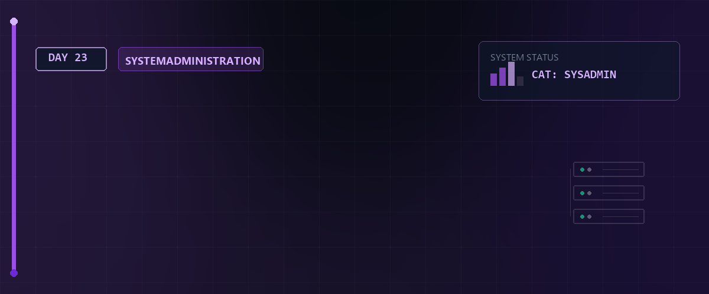

# 📦 Paketverwaltung (Debian vs. Red Hat) & Virtualisierung — Tag 23



> **Entwickler & Administrator:** Tobias Boyke  
> **Status:** 🚀 100% Dokumentiert & LPIC-1 Fokussiert  
> **Kompatibilität:**   

---

## 📑 Inhaltsverzeichnis
- [💿 1. Low-Level Paketverwaltung (dpkg vs. rpm)](#-1-low-level-paketverwaltung-dpkg-vs-rpm)
  - [A. Debian-Architektur (dpkg)](#a-debian-architektur-dpkg)
  - [B. Red Hat-Architektur (rpm)](#b-red-hat-architektur-rpm)
- [🚀 2. High-Level Paketverwaltung (apt vs. dnf)](#-2-high-level-paketverwaltung-apt-vs-dnf)
  - [A. APT (Advanced Package Tool)](#a-apt-advanced-package-tool)
  - [B. DNF (Dandified YUM)](#b-dnf-dandified-yum)
- [🌐 3. Repository-Verwaltung & Spiegelserver](#-3-repository-verwaltung--spiegelserver)
- [🖥️ 4. Linux als Virtualisierungs-Gast betreiben](#-4-linux-als-virtualisierungs-gast-betreiben)
- [🔑 Keywords](#-keywords)
- [🧠 LPIC-1 Relevanz & Wissenstest](#-lpic-1-relevanz--wissenstest)
- [🔗 Zurück zur Übersicht](#-zurück-zur-übersicht)

---

## 💿 1. Low-Level Paketverwaltung (dpkg vs. rpm)

Low-Level Tools installieren lokale Paketdateien (`.deb` oder `.rpm`). Sie können **keine Abhängigkeiten** automatisch aus dem Internet auflösen, sondern melden Fehler, falls benötigte Bibliotheken fehlen.

### A. Debian-Architektur (dpkg)
* **Format:** `.deb` Paketdateien.
* **Kernbefehl:** `dpkg` (Debian Package Manager).

| Aktion | Befehl | Erklärung |
| :--- | :--- | :--- |
| **Installieren** | `sudo dpkg -i paket.deb` | Installiert das lokale Paket (löst Abhängigkeiten *nicht* auf). |
| **Entfernen** | `sudo dpkg -r paketname` | Entfernt das Paket, behält Konfigurationsdateien. |
| **Restlos löschen** | `sudo dpkg -P paketname` | Purge: Entfernt Paket inklusive aller Konfigurationen. |
| **Auflisten** | `dpkg -l` | Listet alle installierten Pakete auf. |
| **Details anzeigen** | `dpkg -s paketname` | Zeigt Status und Metadaten des installierten Pakets. |
| **Dateien suchen** | `dpkg -S /pfad/datei` | Ermittelt, welches Paket die Datei `/pfad/datei` installiert hat. |
| **Inhalt auflisten** | `dpkg -L paketname` | Listet alle installierten Dateien eines Pakets auf. |

### B. Red Hat-Architektur (rpm)
* **Format:** `.rpm` (Red Hat Package Manager).
* **Kernbefehl:** `rpm`.

| Aktion | Befehl | Erklärung |
| :--- | :--- | :--- |
| **Installieren** | `sudo rpm -ivh paket.rpm` | Installiert ein neues Paket (`i` = install, `v` = verbose, `h` = hash marks). |
| **Aktualisieren** | `sudo rpm -Uvh paket.rpm` | Upgrade: Installiert das Paket oder aktualisiert ein bestehendes. |
| **Entfernen** | `sudo rpm -e paketname` | Erasure: Deinstalliert das Paket. |
| **Details abfragen** | `rpm -qi paketname` | Query Info: Zeigt Metadaten des installierten Pakets. |
| **Dateien auflisten** | `rpm -ql paketname` | Query List: Listet alle Dateien auf, die zum Paket gehören. |
| **Zuordnung suchen**| `rpm -qf /pfad/datei` | Query File: Findet das zugehörige Paket für eine Datei. |
| **Integrität prüfen**| `rpm -V paketname` | Verify: Vergleicht installierte Dateien mit der RPM-Datenbank. |

---

## 🚀 2. High-Level Paketverwaltung (apt vs. dnf)

High-Level Paketmanager lösen Abhängigkeiten vollautomatisch auf, laden Pakete aus Repositories (Spiegelservern) herunter und installieren sie.

### A. APT (Advanced Package Tool)
Wird auf Debian, Ubuntu und Linux Mint eingesetzt.
* **Wichtige Dateien:** 
  * `/etc/apt/sources.list` (Hauptdatei für Paketquellen)
  * `/etc/apt/sources.list.d/` (Verzeichnis für zusätzliche Quellen)
* **Befehlsübersicht:**
  ```bash
  # Aktualisiert den lokalen Paketindex (Metadaten)
  sudo apt update
  
  # Installiert ein Paket
  sudo apt install -y curl
  
  # Deinstalliert ein Paket und bereinigt ungenutzte Abhängigkeiten
  sudo apt purge -y curl && sudo apt autoremove -y
  
  # Aktualisiert alle installierten Pakete
  sudo apt upgrade -y
  ```

### B. DNF (Dandified YUM)
Wird auf RHEL, Fedora and Rocky Linux eingesetzt (Nachfolger von `yum`).
* **Wichtige Dateien:** 
  * `/etc/dnf/dnf.conf` bzw. `/etc/yum.conf`
  * `/etc/yum.repos.d/` (Verzeichnis für `.repo` Konfigurationsdateien)
* **Befehlsübersicht:**
  ```bash
  # Sucht nach einem Paket in den Repositories
  dnf search nmap
  
  # Installiert ein Paket
  sudo dnf install -y screen
  
  # Entfernt ein Paket
  sudo dnf remove -y screen
  
  # Cache und Metadaten bereinigen
  sudo dnf clean all
  ```

---

## 🌐 3. Repository-Verwaltung & Spiegelserver

Paketquellen sind in Textdateien definiert, die URL-Pfade zu den Binär- und Quellarchiven enthalten.
* **Debian (`/etc/apt/sources.list`):**
  ```plaintext
  deb http://deb.debian.org/debian/ bookworm main contrib non-free-recovery
  ```
* **Rocky Linux (`/etc/yum.repos.d/rocky.repo`):**
  ```ini
  [baseos]
  name=Rocky Linux $releasever - BaseOS
  baseurl=http://dl.rockylinux.org/$siginf/rocky/$releasever/BaseOS/$basearch/os/
  gpgcheck=1
  enabled=1
  ```
  * `gpgcheck=1`: Erzwingt die Überprüfung der kryptografischen Signatur (GPG-Schlüssel) zur Absicherung gegen Manipulationen.

---

## 🖥️ 4. Linux als Virtualisierungs-Gast betreiben

Ein Linux-System kann feststellen, ob es auf physischer Hardware (Bare-Metal) oder innerhalb einer virtuellen Maschine (KVM, VMware, VirtualBox) läuft.

### VM-Erkennung
* **Kommando:** `systemd-detect-virt`
  * Gibt `none` aus, falls es ein physisches System ist.
  * Gibt z.B. `kvm`, `oracle` (VirtualBox), `vmware` oder `docker` aus.
* **Alternative über DMI (Desktop Management Interface):**
  ```bash
  cat /sys/class/dmi/id/product_name
  ```

### Cloud-init Grundlagen
* `cloud-init` ist der Industriestandard zur automatischen Initialisierung von Cloud-Instanzen (z.B. AWS, OpenStack).
* Ermöglicht die automatische Konfiguration von Netzwerken, SSH-Keys, Hostnames und Benutzern beim ersten Systemstart über Metadaten-Dienste.

---

## 🔑 Keywords

| Keyword / Befehl | Erklärung |
| :--- | :--- |
| `dpkg` | Low-Level-Paketmanager für Debian-basierte Linux-Systeme; verarbeitet lokale .deb-Pakete. |
| `rpm` | Low-Level-Paketmanager für RedHat-basierte Systeme; verarbeitet lokale .rpm-Pakete. |
| `apt` | High-Level-Paketmanager für Debian/Ubuntu, der Abhängigkeiten automatisch über Online-Repositorys auflöst. |
| `dnf` | Moderner High-Level-Paketmanager für RedHat/Rocky Linux (Nachfolger von YUM). |
| `systemd-detect-virt` | Ermittelt, ob das Betriebssystem nativ auf Hardware oder in einer VM/einem Container ausgeführt wird. |

---

## 🧠 LPIC-1 Relevanz & Wissenstest

<details>
<summary><b>Fragen zu Paketverwaltung & VM-Gast (Klicken zum Ausklappen)</b></summary>

1. **Welches RPM-Kommando verifiziert alle Dateien eines installierten Pakets namens `httpd`?**
   <details><summary>Antwort</summary><code>rpm -V httpd</code></details>

2. **Mit welchem dpkg-Kommando findet man heraus, aus welchem Paket die ausführbare Datei `/bin/ls` stammt?**
   <details><summary>Antwort</summary><code>dpkg -S /bin/ls</code></details>

3. **In welchem Verzeichnis werden zusätzliche Repository-Dateien für den DNF/YUM-Paketmanager abgelegt?**
   <details><summary>Antwort</summary><code>/etc/yum.repos.d/</code></details>

4. **Welcher Befehl zeigt unter Systemd an, in welcher Virtualisierungsumgebung das System läuft?**
   <details><summary>Antwort</summary><code>systemd-detect-virt</code></details>

5. **Was ist der funktionale Unterschied zwischen `dpkg -r` und `dpkg -P`?**
   <details><summary>Antwort</summary><code>dpkg -r</code> deinstalliert nur das Paket. <code>dpkg -P</code> (Purge) löscht zusätzlich alle zugehörigen Konfigurationsdateien.</details>

</details>

---

## 🔗 Zurück zur Übersicht

* **Tag 22 (SSH-Agent, ProxyJump & Rsync):** [⬅️ Tag 22](../Day_22/README.md)
* **Tag 24 (System-Logging & Audit):** [➡️ Tag 24](../Day_24/README.md)
* **Master-Repository:** [🌌 Zurück zum Master-Repository](../README.md)

---
*Erstellt & gepflegt von Tobias Boyke, Juni 2026.*
