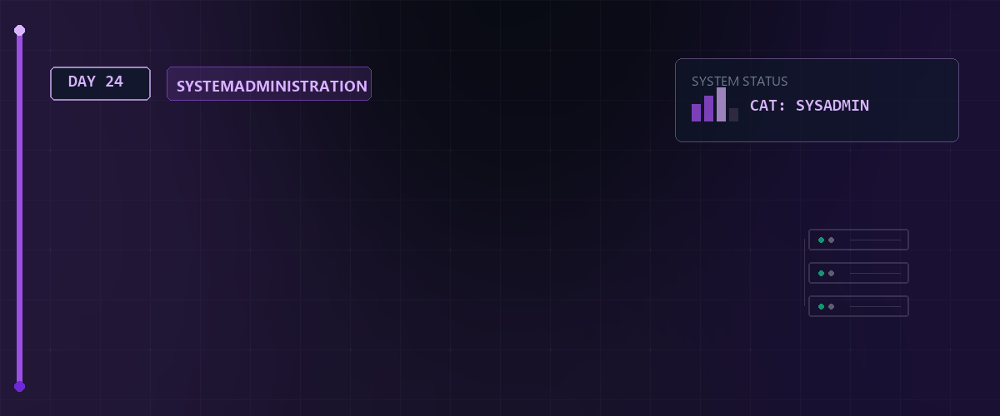

# 📊 System-Logging, Audit & LPI-Prüfungsvorbereitung — Tag 24



> **Entwickler & Administrator:** Tobias Boyke  
> **Status:** 🚀 100% Dokumentiert & LPIC-1 Fokussiert  
> **Kompatibilität:**   

---

## 📑 Inhaltsverzeichnis
- [📰 1. System-Logging mit Rsyslog](#-1-system-logging-mit-rsyslog)
  - [A. Aufbau der `/etc/rsyslog.conf`](#a-aufbau-der-etcrsyslogconf)
  - [B. Facilities (Bereiche) & Priorities (Dringlichkeiten)](#b-facilities-bereiche--priorities-dringlichkeiten)
- [🔍 2. Modernes Logging mit Systemd-Journald](#-2-modernes-logging-mit-systemd-journald)
  - [A. Journalctl: Praktische Filter-Befehle](#a-journalctl-praktische-filter-befehle)
  - [B. Persistenz des Journals konfigurieren](#b-persistenz-des-journals-konfigurieren)
- [🔄 3. Log-Rotation mit Logrotate](#-3-log-rotation-mit-logrotate)
- [🎓 4. LPI-Zertifizierung & Pearson VUE](#-4-lpi-zertifizierung--pearson-vue)
- [🧠 LPIC-1 Relevanz & Wissenstest](#-lpic-1-relevanz--wissenstest)
- [🔗 Zurück zur Übersicht](#-zurück-zur-übersicht)

---

## 📰 1. System-Logging mit Rsyslog

Der `rsyslogd`-Daemon ist der klassische Hintergrunddienst unter Linux zur Erfassung und Weiterleitung von Protokollnachrichten.

### A. Aufbau der `/etc/rsyslog.conf`
Regeln definieren, wohin bestimmte Systemmeldungen geschrieben werden:
```plaintext
# [Kategorie/Bereich].[Priorität]       [Speicherort/Ziel]
mail.err                                /var/log/mail.err
cron.*                                  /var/log/cron.log
*.emerg                                 *
```
* Ein Sternchen `*` als Priorität steht für *alle* Stufen.
* Ein Sternchen `*` als Ziel sendet eine Broadcast-Meldung an alle Terminals angemeldeter Benutzer.

### B. Facilities (Bereiche) & Priorities (Dringlichkeiten)

| Facilities (Kategorien) | Erklärung |
| :--- | :--- |
| `auth` / `authpriv` | Authentifizierung und Sicherheit (Sudo, Logins) |
| `cron` | Zeitgesteuerte Jobs (`cron`, `at`) |
| `daemon` | Hintergrundprokollierung allgemeiner Systemdienste |
| `kern` | Kernel-Nachrichten |
| `mail` | Mailserver-Aktivitäten (Postfix, Sendmail) |
| `local0` - `local7` | Reserviert für benutzerdefinierte Programme |

| Priorities (Stufen) | Level | Erklärung |
| :--- | :---: | :--- |
| `debug` | 7 | Debugging-Ausgaben |
| `info` | 6 | Allgemeine Informationen |
| `notice` | 5 | Normale, aber wichtige Ereignisse |
| `warning` / `warn` | 4 | Warnungen vor potenziellen Fehlern |
| `err` / `error` | 3 | Fehlerbedingungen |
| `crit` | 2 | Kritische Fehlerzustände (z.B. Festplattendefekt) |
| `alert` | 1 | Sofortige Aktion erforderlich (Datenbankschaden) |
| `emerg` / `panic` | 0 | System unbrauchbar |

---

## 🔍 2. Modernes Logging mit Systemd-Journald

`systemd-journald` fängt Protokollnachrichten von Boot-Prozessen, Kernel-Meldungen und Systemdiensten ab. Es speichert diese standardmäßig binär in `/run/log/journal/` (flüchtig im RAM).

### A. Journalctl: Praktische Filter-Befehle
Da die Protokolle binär vorliegen, nutzt man das Tool `journalctl` zur Abfrage:

```bash
# Zeigt alle Meldungen seit dem letzten Systemstart
journalctl -b

# Filtert in Echtzeit (Follow)
journalctl -f

# Filtert nach einem bestimmten systemd-Dienst (z.B. SSH-Server)
journalctl -u sshd.service

# Filtert nach Zeiträumen
journalctl --since "yesterday" --until "2 hours ago"

# Filtert nach Dringlichkeitsstufe (z.B. Fehler und schlimmer)
journalctl -p err

# Kombinierter Profi-Filter (Fehler im SSH-Dienst seit heute Morgen)
journalctl -u sshd.service --since "08:00" -p err
```

### B. Persistenz des Journals konfigurieren
Um das Journal dauerhaft auf der Festplatte zu sichern, muss der Parameter `Storage` in `/etc/systemd/journald.conf` angepasst werden:
```ini
[Journal]
Storage=persistent
```
Damit speichert systemd Protokolle persistent im Verzeichnis `/var/log/journal/`.

---

## 🔄 3. Log-Rotation mit Logrotate

Damit Protokolldateien über die Zeit nicht die Festplatte füllen, werden sie mit `logrotate` periodisch rotiert, komprimiert und schließlich gelöscht.
* **Zentrale Datei:** `/etc/logrotate.conf`
* **Zusatzkonfigurationen:** `/etc/logrotate.d/`

**Beispielkonfiguration `/etc/logrotate.d/apache2`:**
```plaintext
/var/log/apache2/*.log {
    weekly          # Rotiere wöchentlich
    rotate 4        # Behalte maximal 4 alte Archive
    compress        # Komprimiere alte Logs (gzip -> .gz)
    delaycompress   # Komprimiere erst beim übernächsten Durchlauf
    missingok       # Ignoriere Fehler, falls Logdatei fehlt
    notifempty      # Rotiere nicht, wenn Log leer ist
    create 0640 root adm # Erstelle neue, leere Logdatei mit Rechten
}
```

---

## 🎓 4. LPI-Zertifizierung & Pearson VUE

Für eine erfolgreiche Zertifizierung zum **LPIC-1** (Exams 101 & 102) müssen Prüfungen über den offiziellen LPI-Partner **Pearson VUE** gebucht werden.

> [!NOTE]  
> Detaillierte administrative Leitfäden zu Prüfungszentren, On-Screen-Prüfungen (OnVUE), ID-Anforderungen und dem Ablauf am Prüfungstag findest du in der beigefügten PDF-Dokumentation:  
> [📖 Pearson VUE LPI Zertifizierung (PDF)](./assets/Linux_lpi_Zert_PearsV.pdf)

---

## 🧠 LPIC-1 Relevanz & Wissenstest

<details>
<summary><b>Fragen zu Logging, Audit & LPI (Klicken zum Ausklappen)</b></summary>

1. **Welches Kommando liest Kernel-Boot-Meldungen aus dem Ringpuffer des Kernels aus?**
   <details><summary>Antwort</summary><code>dmesg</code></details>

2. **Welcher Filterausdruck in der `/etc/rsyslog.conf` leitet ausschließlich kritische Fehler des Mail-Systems in `/var/log/mail.crit` um?**
   <details><summary>Antwort</summary><code>mail.crit /var/log/mail.crit</code></details>

3. **Wie lautet der Befehl, um mit `journalctl` ausschließlich Fehlermeldungen (Severity `err` oder höher) seit dem heutigen Tag anzuzeigen?**
   <details><summary>Antwort</summary><code>journalctl -p err --since today</code></details>

4. **In welchem Verzeichnis legt `logrotate` standardmäßig seine modularen Log-Rotations-Skripte für installierte Dienste ab?**
   <details><summary>Antwort</summary><code>/etc/logrotate.d/</code></details>

5. **Welcher Service-Name steuert den Systemd-Logging-Daemon im System?**
   <details><summary>Antwort</summary><code>systemd-journald.service</code></details>

</details>

---

## 🔗 Zurück zur Übersicht

* **Tag 23 (Paketverwaltung & VM-Gast):** [⬅️ Tag 23](../Day_23/README.md)
* **Tag 25 (Boot-Prozess & Container):** [➡️ Tag 25](../Day_25/README.md)
* **Master-Repository:** [🌌 Zurück zum Master-Repository](../README.md)

---
*Erstellt & gepflegt von Tobias Boyke, Juni 2026.*
