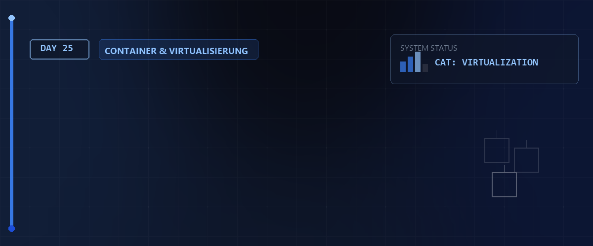

# 🔌 Boot-Prozess, GRUB2, NAT-Forwarding & Docker — Tag 25



> **Entwickler & Administrator:** Tobias Boyke  
> **Status:** 🚀 100% Dokumentiert & LPIC-1 Fokussiert  
> **Kompatibilität:**   

---

## 📑 Inhaltsverzeichnis
- [🥾 1. Boot-Prozess & GRUB2 Bootloader](#-1-boot-prozess--grub2-bootloader)
  - [A. Der Boot-Ablauf im Detail](#a-der-boot-ablauf-im-detail)
  - [B. GRUB2 Konfiguration & Anpassung](#b-grub2-konfiguration--anpassung)
- [🌐 2. IP-Forwarding & NAT-Masquerading](#-2-ip-forwarding--nat-masquerading)
- [🐳 3. Container-Virtualisierung mit Docker](#-3-container-virtualisierung-mit-docker)
  - [A. Installation von Docker-CE (CentOS/Rocky Linux)](#a-installation-von-docker-ce-centosrocky-linux)
  - [B. Container ausführen & absichern](#b-container-ausführen--absichern)
- [📜 4. Shell-History & Kurs-Dateien](#-4-shell-history--kurs-dateien)
- [🔑 Keywords](#-keywords)
- [🧠 LPIC-1 Relevanz & Wissenstest](#-lpic-1-relevanz--wissenstest)
- [🔗 Zurück zur Übersicht](#-zurück-zur-übersicht)

---

## 🥾 1. Boot-Prozess & GRUB2 Bootloader

Der Boot-Vorgang bringt ein Linux-System kontrolliert in den betriebsbereiten Zustand.

### A. Der Boot-Ablauf im Detail
1. **BIOS / UEFI:** Führt Hardwaretests (POST) durch und lädt den Bootloader (z.B. GRUB2) aus dem Master Boot Record (MBR) oder der EFI-Systempartition (ESP).
2. **Bootloader (GRUB2):** Lädt den Linux-Kernel (`vmlinuz`) und die temporäre RAM-Disk (`initramfs`/`initrd`) in den Arbeitsspeicher.
3. **Kernel-Initialisierung:** Der Kernel initialisiert Gerätetreiber und startet den ersten Userspace-Prozess (Init-Prozess, heute fast immer `systemd` mit PID 1).
4. **Systemd-Targets:** `systemd` startet alle benötigten Dienste, um das konfigurierte Standard-Target (z.B. `multi-user.target` oder `graphical.target`) zu erreichen.

> [!NOTE]  
> Ausführliche Details und Hintergrundwissen zum Linux-Startvorgang findest du in der beigefügten PDF:  
> [📖 Linux Booten und GRUB (PDF)](./assets/Linux_Booten_grub.pdf)

### B. GRUB2 Konfiguration & Anpassung
Die Datei `/boot/grub2/grub.cfg` (bzw. `/boot/grub/grub.cfg` bei Debian) wird **niemals direkt editiert**, da sie bei Kernel-Updates überschrieben wird. Modifikationen erfolgen in der Datei `/etc/default/grub`.

#### Parameter anpassen (`/etc/default/grub`):
```plaintext
GRUB_TIMEOUT=5                  # Wartezeit im Menü in Sekunden
GRUB_DEFAULT=0                  # Standardmäßig auszufählender Kernel-Eintrag
GRUB_CMDLINE_LINUX="quiet splash" # Kernel-Boot-Parameter
```

#### Konfiguration generieren:
* **Rocky Linux / RHEL / Fedora:**
  ```bash
  sudo grub2-mkconfig -o /boot/grub2/grub.cfg
  ```
* **Debian / Ubuntu / Linux Mint:**
  ```bash
  sudo update-grub
  ```

---

## 🌐 2. IP-Forwarding & NAT-Masquerading

Soll eine Linux-Maschine als Netzwerk-Router fungieren und Clients den Internetzugriff über ein einziges WAN-Interface erlauben, müssen IP-Forwarding und Network Address Translation (NAT) aktiviert werden.

```bash
# 1. IP-Forwarding im Linux-Kernel aktivieren (temporär)
sudo sysctl -w net.ipv4.ip_forward=1

# Dauerhafte Aktivierung in /etc/sysctl.conf:
# net.ipv4.ip_forward = 1

# 2. NAT-Masquerading über iptables konfigurieren (für das Interface ens160)
sudo iptables -t nat -A POSTROUTING -o ens160 -j MASQUERADE
```

---

## 🐳 3. Container-Virtualisierung mit Docker

Docker ermöglicht das Ausführen von Anwendungen in isolierten Umgebungen (Containern), die sich den Kernel des Wirtssystems teilen.

### A. Installation von Docker-CE (CentOS/Rocky Linux)
Hier sind die exakten administrativen Schritte zur Installation von Docker über die offiziellen Paketquellen:

```bash
# 1. Systemaktualisierung
sudo dnf update -y

# 2. Störende Standardpakete entfernen
sudo dnf remove -y podman buildah runc

# 3. Hilfswerkzeug zur Repository-Verwaltung installieren
sudo dnf install -y dnf-plugins-core

# 4. Offizielle Docker-Paketquelle hinzufügen
sudo dnf config-manager --add-repo https://download.docker.com/linux/centos/docker-ce.repo

# 5. Docker Engine und Compose-Plugin installieren
sudo dnf install -y docker-ce docker-ce-cli containerd.io docker-compose-plugin
```

### B. Container ausführen & absichern
```bash
# Docker-Hintergrunddienst starten & aktivieren
sudo systemctl start docker
sudo systemctl enable docker

# Den aktuellen Benutzer zur Gruppe 'docker' hinzufügen (Rechte gelten nach Neuanmeldung)
sudo usermod -aG docker $USER

# Testcontainer ausführen
docker run hello-world

# Eine Web-App (Juice-Shop) im Docker-Container ausführen (Port-Forwarding auf 127.0.0.1:3000)
docker run --rm -d -p 127.0.0.1:3000:3000 bkimminich/juice-shop
```

---

## 📜 4. Shell-History & Kurs-Dateien

Die komplette Shell-Historie dieses Kurstags inklusive Kommentaren und Befehlsabfolgen ist im folgenden Asset dokumentiert:
* **Shell-History:** [rockyHisGrubDocker20260612-1345.txt](./assets/rockyHisGrubDocker20260612-1345.txt)

---

## 🔑 Keywords

| Keyword / Befehl | Erklärung |
| :--- | :--- |
| `grub2-mkconfig` | Generiert die GRUB2-Bootloader-Konfigurationsdatei (`grub.cfg`) basierend auf Vorlagen neu. |
| `uefi` | Unified Extensible Firmware Interface: Moderner BIOS-Nachfolger für den Hardware-Bootvorgang. |
| `initramfs` | Initial RAM Filesystem: Temporäres Dateisystem im RAM, das Treiber zum Booten des eigentlichen Kernels bereitstellt. |
| `grub.cfg` | Die zentrale GRUB2-Konfigurationsdatei; darf nicht direkt manuell bearbeitet werden. |
| `docker run` | Startet eine isolierte Anwendungsinstanz (Container) auf Basis eines Images. |

---

## 🧠 LPIC-1 Relevanz & Wissenstest

<details>
<summary><b>Fragen zu GRUB2, Boot-Prozess & Containern (Klicken zum Ausklappen)</b></summary>

1. **Welche Datei enthält die globalen Einstellungen für GRUB2, die vom Administrator angepasst werden sollten?**
   <details><summary>Antwort</summary><code>/etc/default/grub</code></details>

2. **Mit welchem Befehl wird unter Red Hat / Rocky Linux die endgültige GRUB2-Konfigurationsdatei neu generiert?**
   <details><summary>Antwort</summary><code>grub2-mkconfig -o /boot/grub2/grub.cfg</code></details>

3. **Welcher Kernel-Parameter in `/proc/sys/net/ipv4/ip_forward` muss den Wert `1` enthalten, um IP-Paketweiterleitung zu erlauben?**
   <details><summary>Antwort</summary><code>net.ipv4.ip_forward</code> (steuerbar via <code>sysctl</code>)</details>

4. **Welcher iptables-Tabelle fügt man NAT-Regeln (wie MASQUERADE) hinzu?**
   <details><summary>Antwort</summary>Der Tabelle <code>nat</code> (über den Parameter <code>-t nat</code>).</details>

5. **Welcher Vorteil bietet Container-Virtualisierung (z.B. Docker) gegenüber klassischen Hypervisoren (z.B. VirtualBox)?**
   <details><summary>Antwort</summary>Container teilen sich den Kernel des Wirtssystems (Host). Dadurch benötigt ein Container kein eigenes Betriebssystem-Boot-Image, ist extrem leichtgewichtig, startet in Sekundenbruchteilen und verbraucht deutlich weniger Arbeitsspeicher.</details>

</details>

---

## 🔗 Zurück zur Übersicht

* **Tag 24 (System-Logging & Audit):** [⬅️ Tag 24](../Day_24/README.md)
* **Tag 26 (Docker, Kubernetes & Containerd):** [➡️ Tag 26](../Day_26/README.md)
* **Master-Repository:** [🌌 Zurück zum Master-Repository](../README.md)

---
*Erstellt & gepflegt von Tobias Boyke, Juni 2026.*
