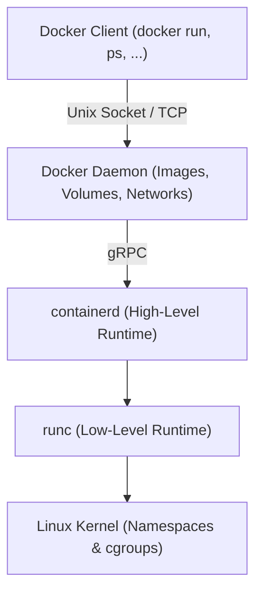
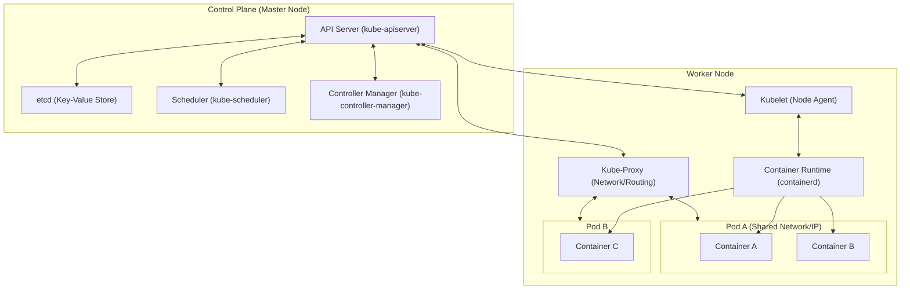

# 🐳 Container-Grundlagen: Docker, Containerd & Kubernetes — Tag 26

> **Entwickler & Administrator:** Tobias Boyke  
> **Status:** 🚀 100% Dokumentiert & LPIC-1/Cloud-Native Fokussiert  
> **Kompatibilität:**   

---

## 📑 Inhaltsverzeichnis
- [🏗️ 1. Container-Runtimes & OCI-Standards](#-1-container-runtimes--oci-standards)
  - [A. OCI (Open Container Initiative)](#a-oci-open-container-initiative)
  - [B. Containerd: Die Core Engine](#b-containerd-die-core-engine)
  - [C. runc: Der Low-Level Executor](#c-runc-der-low-level-executor)
- [🐳 2. Die Docker-Architektur](#-2-die-docker-architektur)
- [⚓ 3. Container-Orchestrierung mit Kubernetes (K8s)](#-3-container-orchestrierung-mit-kubernetes-k8s)
  - [A. Kubernetes Architektur (Control Plane vs. Worker Nodes)](#a-kubernetes-architektur-control-plane-vs-worker-nodes)
  - [B. Deklaratives Modell: Pods, Deployments & Services](#b-deklaratives-modell-pods-deployments--services)
- [🧠 LPIC-1/Cloud-Native Relevanz & Wissenstest](#-lpic-1cloud-native-relevanz--wissenstest)
- [📚 Ressourcen & Dokumente](#-ressourcen--dokumente)
- [🔗 Zurück zur Übersicht](#-zurück-zur-übersicht)

---

## 🏗️ 1. Container-Runtimes & OCI-Standards

In modernen Cloud-Native-Umgebungen sind Container nicht mehr fest an Docker gebunden. Sie basieren auf standardisierten Spezifikationen und modularen Runtimes.

### A. OCI (Open Container Initiative)
Die OCI wurde 2015 von Docker und anderen Branchenführern gegründet, um offene Industriestandards für Container zu etablieren:
1. **Runtime Specification:** Definiert, wie ein entpacktes Container-Dateisystem (Rootfs) ausgeführt wird.
2. **Image Specification:** Definiert das Format und die Schichten (Layers) eines Container-Images.

### B. Containerd: Die Core Engine
* **Was ist es?** Ein CNCF-Projekt, das als High-Level Container Runtime dient.
* **Aufgabe:** Es verwaltet den vollständigen Lebenszyklus eines Containers auf einem Host (Images übertragen, Container starten/stoppen, Netzwerke verwalten).
* **Schnittstelle:** Kubernetes kommuniziert direkt mit `containerd` über das **CRI (Container Runtime Interface)**, ohne den Umweg über den Docker-Daemon zu nehmen.

### C. runc: Der Low-Level Executor
* **Was ist es?** Die OCI-Referenzimplementierung der Runtime Specification.
* **Aufgabe:** Ein leichtgewichtiges CLI-Tool, das direkt mit dem Linux-Kernel kommuniziert (Namespaces, cgroups), um den Container physisch zu starten, und sich danach wieder beendet.

> [!NOTE]  
> **Architektur-Hierarchie:**  
> K8s Kubelet ➡️ CRI ➡️ **containerd** (High-Level) ➡️ **runc** (Low-Level) ➡️ Linux-Kernel (Namespaces & cgroups).

---

## 🐳 2. Die Docker-Architektur

Docker vereint all diese Komponenten unter einer benutzerfreundlichen Oberfläche.

> [!WARNING]  
> Der Docker-Daemon läuft standardmäßig mit **root-Rechten**. Ein Benutzer, der Zugriff auf den Docker-Unix-Socket (`/var/run/docker.sock`) hat, kann über Host-Mounts (z.B. `docker run -v /:/host`) vollen Root-Zugriff auf das Wirtssystem erlangen!

---

## ⚓ 3. Container-Orchestrierung mit Kubernetes (K8s)

Kubernetes ist die De-facto-Standard-Plattform zur automatisierten Bereitstellung, Skalierung und Verwaltung von containerisierten Anwendungen über Server-Cluster hinweg.

### A. Kubernetes Architektur (Control Plane vs. Worker Nodes)

Ein K8s-Cluster ist in zwei Hauptbereiche unterteilt:

#### 1. Control Plane (Master)
* **API Server (`kube-apiserver`):** Der zentrale Einstiegspunkt des Clusters. Kommuniziert via REST API.
* **etcd:** Ein hochverfügbarer, konsistenter Key-Value-Store. Speichert die gesamten Konfigurations- und Zustandsdaten des Clusters.
* **Scheduler (`kube-scheduler`):** Wählt für neu erstellte Pods den optimalen Worker-Node aus.
* **Controller Manager (`kube-controller-manager`):** Überwacht den Zustand des Clusters (Replikation, Node-Status) und gleicht Ist- mit Sollzustand ab.

#### 2. Worker Nodes (Data Plane)
* **Kubelet:** Der lokale Agent auf jedem Node. Er stellt sicher, dass die Container in den Pods wie angewiesen laufen.
* **Kube-Proxy (`kube-proxy`):** Verwaltet die Netzwerkregeln auf den Nodes (z.B. mittels IPVS oder iptables), um Service-Routing zu realisieren.

### B. Deklaratives Modell: Pods, Deployments & Services
In Kubernetes wird Infrastruktur **deklarativ** über YAML-Dateien beschrieben:

* **Pod:** Die kleinste deploybare Einheit in Kubernetes. Ein Pod kapselt einen oder mehrere Container (die sich Netzwerk-Namespace und Volumes teilen).
* **Deployment:** Definiert den Sollzustand für Pods (z.B. "Halte immer 3 Repliken von App X aktiv"). Führt rollierende Updates ohne Downtime aus.
* **Service:** Bietet eine stabile IP-Adresse und DNS-Namen für eine dynamische Gruppe von Pods (Load Balancing).

> [!TIP]  
> Um mit dem Kubernetes-Cluster zu interagieren, verwendet man das Kommandozeilen-Tool **`kubectl`** (z.B. `kubectl get pods` oder `kubectl apply -f deployment.yaml`).

---

## 🧠 LPIC-1/Cloud-Native Relevanz & Wissenstest

<b>Fragen zu Docker, Containerd & Kubernetes (Klicken zum Ausklappen)</b>

1. **Welches Linux-Kernel-Feature sorgt für die Ressourcenbegrenzung (CPU, RAM, I/O) von Containern?**
   

Antwort
Control Groups (kurz: <strong>cgroups</strong>).

2. **Welcher Standard-Pfad repäsentiert den Unix-Socket für die Kommunikation mit Containerd?**
   

Antwort
Standardmäßig <code>/run/containerd/containerd.sock</code>.

3. **In welcher Kubernetes-Komponente der Control Plane wird der gesamte Zustand des Clusters persistent gespeichert?**
   

Antwort
Im Key-Value-Store <strong>etcd</strong>.

4. **Welcher K8s-Komponente auf dem Worker-Node kommuniziert direkt mit dem API-Server und überwacht die lokalen Container?**
   

Antwort
Das <strong>Kubelet</strong>.

5. **Was unterscheidet einen Pod von einem klassischen Docker-Container?**
   

Antwort
Ein Docker-Container ist ein einzelner isolierter Prozess. Ein Pod in Kubernetes kann <strong>mehrere</strong> eng gekoppelte Container beinhalten, die sich dieselbe IP-Adresse, Port-Räume und Speicher-Volumes teilen (z.B. eine Web-App mit einem Log-Forwarder als Sidecar-Container).

---

## 📚 Ressourcen & Dokumente
Im [Assets](./assets)-Verzeichnis finden Sie weiterführende Informationen:

- [Gitkeep Platzhalter](./assets/.gitkeep)

---

## 🔗 Zurück zur Übersicht

* **Tag 25 (Bootprozess & Container):** [⬅️ Tag 25](../Day_25/README.md)
* **Tag 27 (SSH-Härtung & Limits):** [➡️ Tag 27](../Day_27/README.md)
* **Master-Repository:** [🌌 Zurück zum Master-Repository](../README.md)

---
*Erstellt & gepflegt von Tobias Boyke, Juni 2026.*
