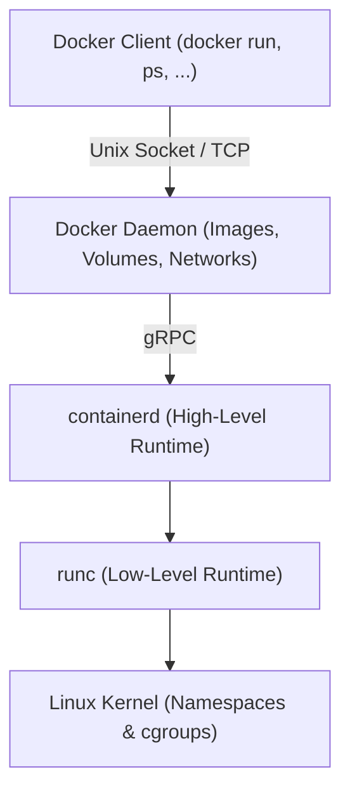
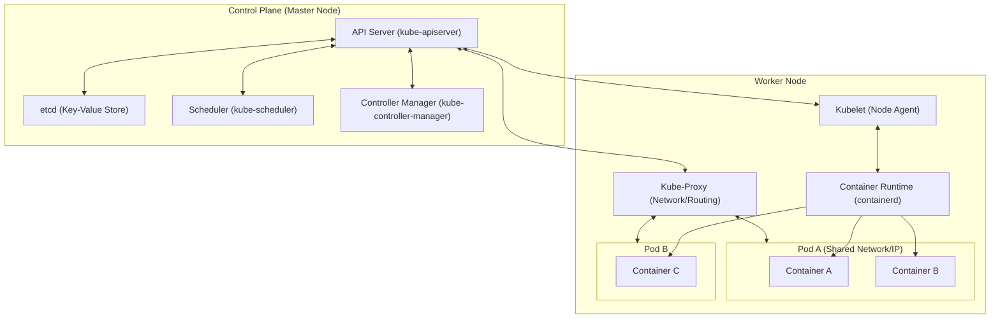

# 🐳 Container-Grundlagen: Docker, Containerd & Kubernetes — Tag 26

> **Entwickler & Administrator:** Tobias Boyke  
> **Status:** 🚀 100% Dokumentiert & LPIC-1/Cloud-Native Fokussiert  
> **Kompatibilität:**   

---

## 📑 Inhaltsverzeichnis
- [📦 1. Virtualisierung vs. Containerisierung](#-1-virtualisierung-vs-containerisierung)
  - [A. Container vs. Virtuelle Maschinen (VMs)](#a-container-vs-virtuelle-maschinen-vms)
  - [B. Wie funktionieren Container unter der Haube?](#b-wie-funktionieren-container-unter-der-haube)
  - [C. Das Schichten-Dateisystem: Union File System (UFS)](#c-das-schichten-dateisystem-union-file-system-ufs)
  - [D. Docker vs. Containerd vs. Kubernetes](#d-docker-vs-containerd-vs-kubernetes)
- [🏗️ 2. Container-Runtimes & OCI-Standards](#-2-container-runtimes--oci-standards)
  - [A. OCI (Open Container Initiative)](#a-oci-open-container-initiative)
  - [B. Containerd: Die Core Engine](#b-containerd-die-core-engine)
  - [C. runc: Der Low-Level Executor](#c-runc-der-low-level-executor)
- [🐳 3. Die Docker-Architektur](#-3-die-docker-architektur)
- [⚓ 4. Container-Orchestrierung mit Kubernetes (K8s)](#-4-container-orchestrierung-mit-kubernetes-k8s)
  - [A. Kubernetes Architektur (Control Plane vs. Worker Nodes)](#a-kubernetes-architektur-control-plane-vs-worker-nodes)
  - [B. Deklaratives Modell: Pods, Deployments & Services](#b-deklaratives-modell-pods-deployments--services)
- [🧩 5. Schlüsselkomponenten des Container-Ökosystems](#-5-schlüsselkomponenten-des-container-ökosystems)
  - [A. Service Discovery (Wie finden sich Container?)](#a-service-discovery-wie-finden-sich-container)
  - [B. Container-Netzwerke (Brücken bauen)](#b-container-netzwerke-brücken-bauen)
  - [C. Scheduler & Orchestratoren (Der Dirigent)](#c-scheduler--orchestratoren-der-dirigent)
  - [D. Zusammenfassung: Das Zusammenspiel im Ökosystem](#d-zusammenfassung-das-zusammenspiel-im-ökosystem)
- [🧠 LPIC-1/Cloud-Native Relevanz & Wissenstest](#-lpic-1cloud-native-relevanz--wissenstest)
- [🔑 Keywords](#-keywords)
- [📚 Ressourcen & Dokumente](#-ressourcen--dokumente)
- [🔗 Zurück zur Übersicht](#-zurück-zur-übersicht)

---

## 📦 1. Virtualisierung vs. Containerisierung

### A. Container vs. Virtuelle Maschinen (VMs)
Virtuelle Maschinen und Container bieten unterschiedliche Isolationsebenen:
* **Virtuelle Maschinen (VMs):**
  * Isolieren auf **Hardware-Ebene**.
  * Jede VM enthält ein vollständiges Gast-Betriebssystem (Guest OS) inklusive eigenem Kernel, virtuellen Treibern und Anwendungen.
  * Ein Hypervisor (z.B. KVM, VMware, VirtualBox) übersetzt die Aufrufe an die physische Hardware.
  * **Vorteil:** Maximale Sicherheit und Isolation.
  * **Nachteil:** Hoher Ressourcen-Overhead (RAM/Disk für das Gast-OS) und langsame Bootzeiten.
* **Container:**
  * Isolieren auf **Betriebssystem-Ebene (OS-level virtualization)**.
  * Container teilen sich den Kernel des Wirts-Betriebssystems (Host OS).
  * Sie enthalten nur die Anwendung und ihre direkten Abhängigkeiten (Bibliotheken, Binaries).
  * **Vorteil:** Extrem leichtgewichtig, starten in Millisekunden, minimale CPU- und RAM-Auslastung.
  * **Nachteil:** Geringere Isolationstiefe (Sicherheitsrisiko bei Kernel-Sicherheitslücken des Hosts).

### B. Wie funktionieren Container unter der Haube?
Container sind keine "echten" physischen Objekte, sondern isolierte Linux-Prozesse. Docker hat Container nicht erfunden, sondern nutzt tief im Linux-Kernel verankerte Standard-Features aus, um die Isolation zu erzwingen. Sie werden durch drei Hauptmechanismen realisiert:

1. **Namespaces (Namensräume - Isolation):**
   Namespaces isolieren, was ein Prozess **sehen** darf (schneiden den Prozess von anderen Systembereichen ab). Ein Namespace sorgt dafür, dass ein Prozess denkt, er wäre allein auf dem System. Wichtige Namespace-Typen, die Docker anlegt:
   * `pid` (Process ID): Der Container sieht nur seine eigenen Prozesse. Seine Hauptanwendung hat im Container die PID 1 (obwohl sie auf dem Host-System z. B. die PID 4829 hat).
   * `net` (Network): Jeder Container bekommt sein eigenes virtuelles Netzwerk-Interface, Routingtabellen und eigene IP-Adressen.
   * `mnt` (Mount): Der Container hat sein eigenes isoliertes Dateisystem.
   * `uts` (Hostname): Der Container kann einen eigenen Computernamen (Hostname und Domainname) haben.
   * `user`: Ermöglicht es, dass ein Benutzer innerhalb des Containers root (Admin) ist, auf dem echten Host-System aber nur ein unprivilegierter Standard-Nutzer bleibt.
   * `ipc` (Interprocess Communication): Isolierter Shared Memory für Prozesse innerhalb des Containers.

2. **Control Groups (cgroups - Ressourcenkontrolle):**
   cgroups begrenzen, was ein Prozess **nutzen** darf (Ressourcenkontrolle):
   * Begrenzung von CPU-Zeit, RAM-Nutzung, I/O-Bandbreite und Netzwerk-Prioritäten.
   * **Warum?** Ohne cgroups könnte ein einzelner Amok laufender Container den gesamten RAM des Servers auffressen und das System lahmlegen ("Noisy Neighbor"-Problem).
   * **Beispiel:** cgroups limitieren hart die Hardware: *"Dieser Container darf maximal 512 MB RAM und 10% CPU nutzen."*

3. **Chroot / Pivot_root (Dateisystem-Gefängnis):**
   Bestimmt, wo der Container auf der Festplatte eingesperrt ist.
   * Verschiebt das scheinbare Wurzelverzeichnis (`/`) für den Container.
   * Der Container kann physisch nicht aus seinem Ordner ausbrechen, um Systemdateien des echten Servers zu sehen oder zu manipulieren.

### C. Das Schichten-Dateisystem: Union File System (UFS)
Docker-Images nutzen ein Union File System (UFS), das aus mehreren übereinandergestapelten, schreibgeschützten Schichten (**Read-Only Layers**) besteht.
* **Beispiel für Schichten:**
  * `Schicht 1` (Basis): Basis-Betriebssystem (z. B. Rocky Linux)
  * `Schicht 2` (Laufzeit): Node.js Installation
  * `Schicht 3` (Anwendung): Angular-Code
* **Der Read-Write Container Layer (Der Clou):**
  Startet man den Container, legt Docker eine hauchdünne, beschreibbare Schicht ganz oben drauf (Read-Write Container Layer). Alle Änderungen, die der Container im Betrieb vornimmt (z. B. Logdateien schreiben oder Konfigurationen anpassen), landen ausschließlich in dieser obersten Schicht (Copy-on-Write).
* **Vorteil:** Enorme Speicherplatz-Ersparnis, da sich 10 gleichzeitig laufende Container dieselben Basis-Schichten teilen können.

### D. Docker vs. Containerd vs. Kubernetes
Um den Unterschied zwischen Container, Engine und Orchestrator zu verdeutlichen, zeigt folgende Vergleichstabelle die Aufgabenverteilung:

| Feature/Aspekt | Docker | containerd | Kubernetes (K8s) |
| :--- | :--- | :--- | :--- |
| **Rolle** | Benutzerfreundliche Komplettlösung (Developer Tooling) | Core Container Engine (High-Level Runtime) | Container-Orchestrator (Cluster-Management) |
| **Fokus** | Lokale Entwicklung, Image-Builds (`dockerfile`), Ausführung | Effiziente Verwaltung des Container-Lebenszyklus auf einem Host | Skalierung, Hochverfügbarkeit, Load Balancing über viele Server |
| **Image-Builds** | Ja (`docker build`) | Nein | Nein (nutzt bestehende Registry-Images) |
| **Zielgruppe** | Softwareentwickler | Systemintegratoren / Kubernetes-Kubelet | Plattform-Ingenieure / System-Administratoren |
| **API / Schnittstelle** | Docker CLI, REST API | gRPC API | REST API (`kubectl`, YAML-Manifeste) |
| **Clustering** | Docker Swarm (integriert, selten genutzt) | Nein | Standard (vollständiges Cluster-Management) |

---

## 🏗️ 2. Container-Runtimes & OCI-Standards

In modernen Cloud-Native-Umgebungen sind Container nicht mehr fest an Docker gebunden. Sie basieren auf standardisierten Spezifikationen und modularen Runtimes.

### A. OCI (Open Container Initiative)
Die OCI wurde 2015 von Docker und anderen Branchenführern gegründet, um offene Industriestandards für Container zu etablieren:
1. **Runtime Specification:** Definiert, wie ein entpacktes Container-Dateisystem (Rootfs) ausgeführt wird.
2. **Image Specification:** Definiert das Format und die Schichten (Layers) eines Container-Images.

### B. Containerd: Die Core Engine
* **Was ist es?** Ein CNCF-Projekt, das als High-Level Container Runtime dient.
* **Aufgabe:** Es verwaltet den vollständigen Lebenszyklus eines Containers auf einem Host (Images übertragen, Container starten/stoppen, Netzwerke verwalten).
* **Schnittstelle:** Kubernetes kommuniziert direkt mit `containerd` über das **CRI (Container Runtime Interface)**, ohne den Umweg über den Docker-Daemon zu nehmen.

### C. runc: Der Low-Level Executor
* **Was ist es?** Die OCI-Referenzimplementierung der Runtime Specification.
* **Aufgabe:** Ein leichtgewichtiges CLI-Tool, das direkt mit dem Linux-Kernel kommuniziert (Namespaces, cgroups), um den Container physisch zu starten, und sich danach wieder beendet.

> [!NOTE]  
> **Architektur-Hierarchie:**  
> K8s Kubelet ➡️ CRI ➡️ **containerd** (High-Level) ➡️ **runc** (Low-Level) ➡️ Linux-Kernel (Namespaces & cgroups).

---

## 🐳 3. Die Docker-Architektur

Docker vereint all diese Komponenten unter einer benutzerfreundlichen Oberfläche.

> [!WARNING]  
> Der Docker-Daemon läuft standardmäßig mit **root-Rechten**. Ein Benutzer, der Zugriff auf den Docker-Unix-Socket (`/var/run/docker.sock`) hat, kann über Host-Mounts (z. B. `docker run -v /:/host`) vollen Root-Zugriff auf das Wirtssystem erlangen!

**Docker Daemon & Private Schlüssel:**  
Der Hintergrunddienst (Daemon) hat unter anderem die Kernaufgabe, die privaten Schlüssel (z. B. für die verschlüsselte Kommunikation via TLS bei Remote-Verbindungen) im Arbeitsspeicher zu verwalten. Normalerweise liegen diese privaten Schlüssel auf der Festplatte, was bei hohem Remote-Verkehr zu I/O-Engpässen führen kann. Durch die temporäre Haltung im RAM wird dieser Flaschenhals vermieden.

---

## ⚓ 4. Container-Orchestrierung mit Kubernetes (K8s)

Kubernetes ist die De-facto-Standard-Plattform zur automatisierten Bereitstellung, Skalierung und Verwaltung von containerisierten Anwendungen über Server-Cluster hinweg.

### A. Kubernetes Architektur (Control Plane vs. Worker Nodes)

Ein K8s-Cluster ist in zwei Hauptbereiche unterteilt:

#### 1. Control Plane (Master)
* **API Server (`kube-apiserver`):** Der zentrale Einstiegspunkt des Clusters. Kommuniziert via REST API.
* **etcd:** Ein hochverfügbarer, konsistenter Key-Value-Store. Speichert die gesamten Konfigurations- und Zustandsdaten des Clusters.
* **Scheduler (`kube-scheduler`):** Wählt für neu erstellte Pods den optimalen Worker-Node aus.
* **Controller Manager (`kube-controller-manager`):** Überwacht den Zustand des Clusters (Replikation, Node-Status) und gleicht Ist- mit Sollzustand ab.

#### 2. Worker Nodes (Data Plane)
* **Kubelet:** Der lokale Agent auf jedem Node. Er stellt sicher, dass die Container in den Pods wie angewiesen laufen.
* **Kube-Proxy (`kube-proxy`):** Verwaltet die Netzwerkregeln auf den Nodes (z.B. mittels IPVS oder iptables), um Service-Routing zu realisieren.

### B. Deklaratives Modell: Pods, Deployments & Services
In Kubernetes wird Infrastruktur **deklarativ** über YAML-Dateien beschrieben:

* **Pod:** Die kleinste deploybare Einheit in Kubernetes. Ein Pod kapselt einen oder mehrere Container (die sich Netzwerk-Namespace und Volumes teilen).
* **Deployment:** Definiert den Sollzustand für Pods (z.B. "Halte immer 3 Repliken von App X aktiv"). Führt rollierende Updates ohne Downtime aus.
* **Service:** Bietet eine stabile IP-Adresse und DNS-Namen für eine dynamische Gruppe von Pods (Load Balancing).

> [!TIP]  
> Um mit dem Kubernetes-Cluster zu interagieren, verwendet man das Kommandozeilen-Tool **`kubectl`** (z.B. `kubectl get pods` oder `kubectl apply -f deployment.yaml`).

---

## 🧩 5. Schlüsselkomponenten des Container-Ökosystems

Docker ist nicht nur ein eigenständiges Werkzeug, sondern Teil eines modularen, verteilten Ökosystems, das verschiedene Aufgaben auf spezialisierte Komponenten aufteilt.

### A. Service Discovery (Wie finden sich Container?)
* **Das Problem:** In dynamischen Cloud-Umgebungen ändern Container durch automatische Skalierung, Ausfälle oder Neustarts ständig ihre IP-Adressen.
* **Die Lösung:** Ein zentrales System ("Telefonbuch"), das als Registry dient.
* **Funktionsweise:** Neue Container registrieren sich beim Start automatisch. Andere Container fragen diesen zentralen Dienst ab, um die aktuellen Verbindungsdaten der benötigten Services zu ermitteln.
* **Bekannte Tools:** `etcd` (in Kubernetes integriert), `Consul`, `ZooKeeper`.

### B. Container-Netzwerke (Brücken bauen)
* **Aufgabe:** Ermöglicht die nahtlose Kommunikation zwischen Containern, selbst wenn diese auf physisch getrennten Servern laufen.
* **Overlay-Netzwerke:** Erstellen ein logisches, flaches Netz über alle beteiligten Server hinweg. Für die Container verhält es sich so, als wären sie alle am selben lokalen Switch angeschlossen.
* **Sicherheit:** Ermöglicht die Isolation auf Netzwerk-Ebene. Beispielsweise kann ein Datenbank-Container so konfiguriert werden, dass er nur mit dem Backend-Container kommunizieren darf, jedoch keinerlei direkten Zugriff aus dem Internet erlaubt.

### C. Scheduler & Orchestratoren (Der Dirigent)
* **Aufgabe:** Automatisierte Lastverteilung und Ressourcenverwaltung über einen gesamten Server-Cluster hinweg.
* **Funktionsweise:** Der Administrator definiert deklarativ den Sollzustand (z. B. *"Starte 3 Instanzen der Web-App"*). Der Scheduler analysiert CPU/RAM-Auslastung der Server und startet die Container auf den am besten geeigneten Nodes.
* **Features:**
  * **Self-Healing:** Erkennt abgestürzte Container oder Server-Ausfälle und startet diese automatisch neu oder verschiebt sie.
  * **Skalierung:** Passt die Instanzanzahl dynamisch an die Last an.
* **Bekannte Tools:** `Kubernetes` (K8s), `Docker Swarm`, `Nomad`.

### D. Zusammenfassung: Das Zusammenspiel im Ökosystem
* **Docker CE:** Baut Images und führt einzelne Container auf einem Host aus.
* **Networking Tools:** Verbinden Container sicher über Servergrenzen hinweg.
* **Service Discovery:** Ermöglicht es den Containern, sich gegenseitig dynamisch zu finden.
* **Scheduler (Kubernetes):** Verwaltet die Platzierung, Skalierung und Ausfallsicherheit im Cluster.

---

## 🔑 Keywords

| Keyword / Befehl | Erklärung |
| :--- | :--- |
| `OCI` | Open Container Initiative: Standardisierungsgremium für offene Container-Spezifikationen (Images und Runtimes). |
| `containerd` | Modulare High-Level Container-Runtime zur Verwaltung des vollständigen Container-Lebenszyklus auf einem Host. |
| `runc` | Leichtgewichtige Low-Level OCI-Runtime, die direkt Kernel-Features (Namespaces, cgroups) nutzt, um Container auszuführen. |
| `Union File System (UFS)` | Schichtenbasiertes Dateisystem; kombiniert Read-Only Layers mit einem beschreibbaren Container-Layer (Copy-on-Write). |
| `Service Discovery` | Dynamisches Registrierungs- und Abfragesystem ("Telefonbuch"), damit sich Container im Netzwerk finden. |
| `Overlay-Netzwerk` | Virtuelles Netzwerk über mehrere Hosts hinweg zur nahtlosen Container-Kommunikation. |
| `Pod` | Kleinste Bereitstellungs-Einheit in Kubernetes; gruppiert einen oder mehrere Container mit gemeinsamer IP und Volumes. |
| `Kubelet` | Der primäre Node-Agent auf jedem Kubernetes-Worker, der den Zustand der lokalen Pods überwacht. |
| `etcd` | Hochverfügbarer Key-Value-Store der Control Plane; speichert die Konfiguration und den Zustand des gesamten K8s-Clusters. |

---

## 🧠 LPIC-1/Cloud-Native Relevanz & Wissenstest

<b>Fragen zu Docker, Containerd & Kubernetes (Klicken zum Ausklappen)</b>

1. **Welches Linux-Kernel-Feature sorgt für die Ressourcenbegrenzung (CPU, RAM, I/O) von Containern?**
   

Antwort
Control Groups (kurz: <strong>cgroups</strong>).

2. **Welcher Standard-Pfad repräsentiert den Unix-Socket für die Kommunikation mit Containerd?**
   

Antwort
Standardmäßig <code>/run/containerd/containerd.sock</code>.

3. **In welcher Kubernetes-Komponente der Control Plane wird der gesamte Zustand des Clusters persistent gespeichert?**
   

Antwort
Im Key-Value-Store <strong>etcd</strong>.

4. **Welcher K8s-Komponente auf dem Worker-Node kommuniziert direkt mit dem API-Server und überwacht die lokalen Container?**
   

Antwort
Das <strong>Kubelet</strong>.

5. **Was unterscheidet einen Pod von einem klassischen Docker-Container?**
   

Antwort
Ein Docker-Container ist ein einzelner isolierter Prozess. Ein Pod in Kubernetes kann <strong>mehrere</strong> eng gekoppelte Container beinhalten, die sich dieselbe IP-Adresse, Port-Räume und Speicher-Volumes teilen (z.B. eine Web-App mit einem Log-Forwarder als Sidecar-Container).

6. **Welcher Mechanismus in Docker sorgt für die Isolation des Dateisystems auf Festplattenebene?**
   

Antwort
Der Systemaufruf <code>chroot</code> bzw. das modernere <code>pivot_root</code>, welche das Wurzelverzeichnis des Containers verschieben.

7. **Wie spart Docker durch das Union File System (UFS) Speicherplatz bei der Ausführung mehrerer Instanzen desselben Images?**
   

Antwort
Alle Instanzen teilen sich dieselben schreibgeschützten Schichten (Read-Only Layers). Erst beim Schreiben wird eine hauchdünne, beschreibbare Schicht (Read-Write Layer) oben aufgelegt (Copy-on-Write-Prinzip).

---

## 📚 Ressourcen & Dokumente
Im [Assets](./assets)-Verzeichnis finden Sie weiterführende Informationen:

- [Unterrichtsfolgen: Container-Virtualisierung mit Docker, Schlüsselkomponenten (PDF)](./assets/Linux_Grdl_DockerKomp.pdf)

---
## 🔗 Zurück zur Übersicht

* **Tag 25 (Boot-Prozess & Container):** [⬅️ Tag 25](../Day_25/README.md)
* **Tag 27 (SSH Härtung & Limits):** [➡️ Tag 27](../Day_27/README.md)
* **Master-Repository:** [🌌 Zurück zum Master-Repository](../README.md)

---
*Erstellt & gepflegt von Tobias Boyke, Juni 2026.*
