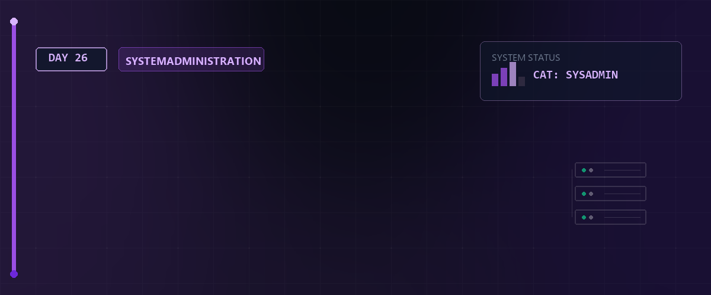
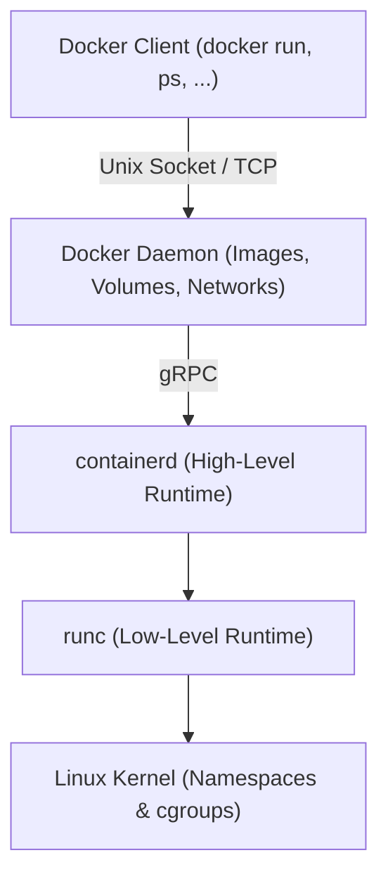
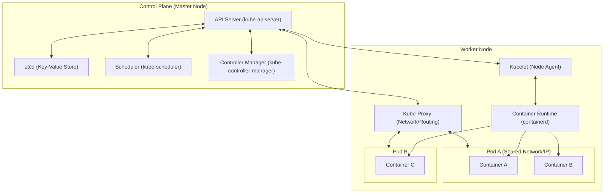
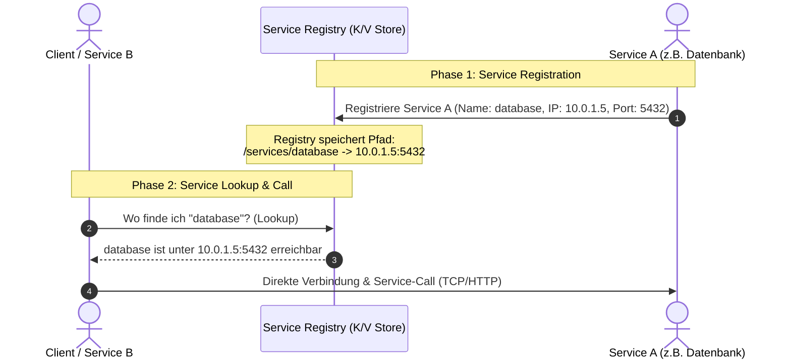
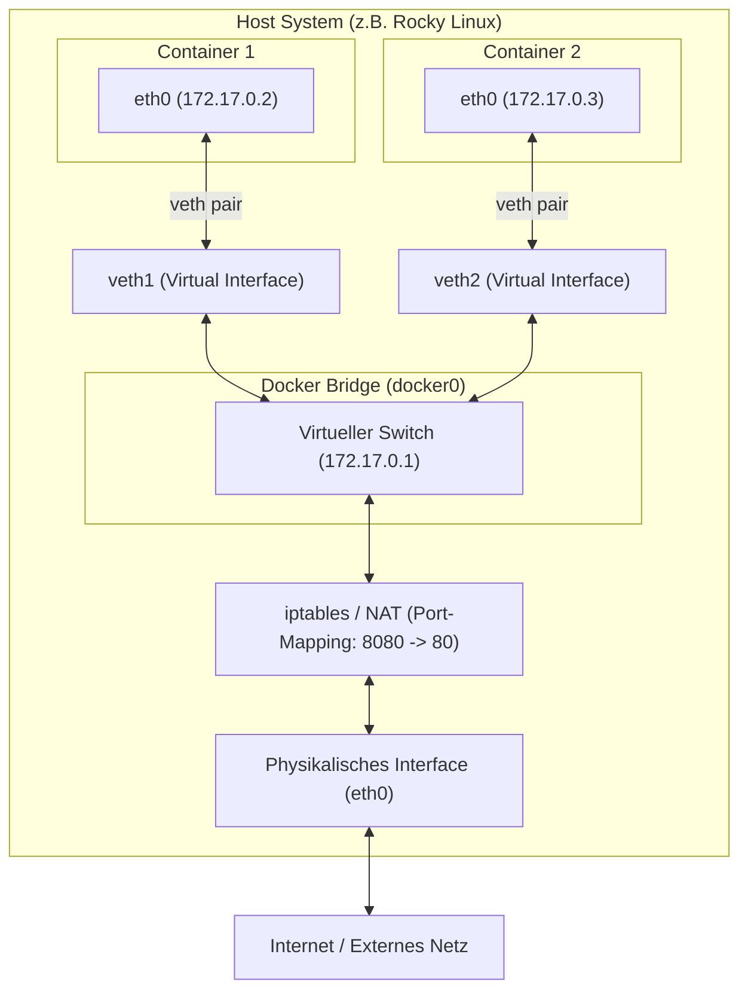
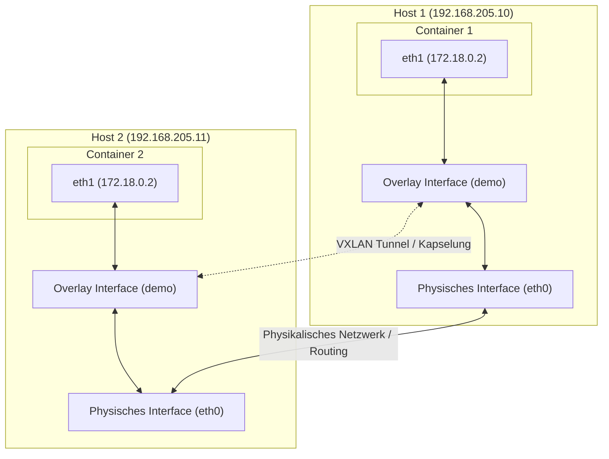
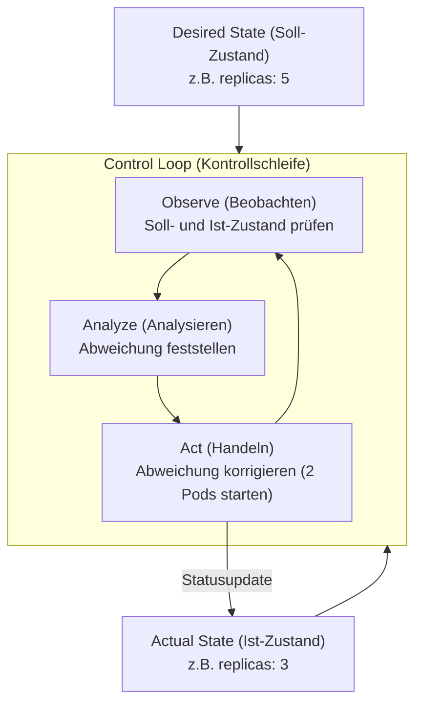

# 🐳 Container-Grundlagen: Docker, Containerd & Kubernetes — Tag 26

> **Entwickler & Administrator:** Tobias Boyke  
> **Status:** 🚀 100% Dokumentiert & LPIC-1/Cloud-Native Fokussiert  
> **Kompatibilität:**   

---

## 📑 Inhaltsverzeichnis
- [📦 1. Virtualisierung vs. Containerisierung](#-1-virtualisierung-vs-containerisierung)
  - [A. Container vs. Virtuelle Maschinen (VMs)](#a-container-vs-virtuelle-maschinen-vms)
  - [B. Wie funktionieren Container unter der Haube?](#b-wie-funktionieren-container-unter-der-haube)
  - [C. Das Schichten-Dateisystem: Union File System (UFS)](#c-das-schichten-dateisystem-union-file-system-ufs)
  - [D. Docker vs. Containerd vs. Kubernetes](#d-docker-vs-containerd-vs-kubernetes)
- [🏗️ 2. Container-Runtimes & OCI-Standards](#-2-container-runtimes--oci-standards)
  - [A. OCI (Open Container Initiative)](#a-oci-open-container-initiative)
  - [B. Containerd: Die Core Engine](#b-containerd-die-core-engine)
  - [C. runc: Der Low-Level Executor](#c-runc-der-low-level-executor)
- [🐳 3. Die Docker-Architektur](#-3-die-docker-architektur)
- [⚓ 4. Container-Orchestrierung mit Kubernetes (K8s)](#-4-container-orchestrierung-mit-kubernetes-k8s)
  - [A. Kubernetes Architektur (Control Plane vs. Worker Nodes)](#a-kubernetes-architektur-control-plane-vs-worker-nodes)
  - [B. Deklaratives Modell: Pods, Deployments & Services](#b-deklaratives-modell-pods-deployments--services)
- [🧩 5. Schlüsselkomponenten des Container-Ökosystems](#-5-schlüsselkomponenten-des-container-ökosystems)
  - [A. Service Discovery & Key-Value Stores (Das Echtzeit-Telefonbuch)](#a-service-discovery--key-value-stores-das-echtzeit-telefonbuch)
  - [B. Container-Netzwerke (Brücken bauen & isolieren)](#b-container-netzwerke-brücken-bauen--isolieren)
  - [C. Scheduler & Orchestratoren (Die Dirigenten)](#c-scheduler--orchestratoren-die-dirigenten)
  - [D. Zusammenfassung: Das Zusammenspiel im Ökosystem](#d-zusammenfassung-das-zusammenspiel-im-ökosystem)
- [🧠 LPIC-1/Cloud-Native Relevanz & Wissenstest](#-lpic-1cloud-native-relevanz--wissenstest)
- [🔑 Keywords](#-keywords)
- [📚 Ressourcen & Dokumente](#-ressourcen--dokumente)
- [🔗 Zurück zur Übersicht](#-zurück-zur-übersicht)

---

## 📦 1. Virtualisierung vs. Containerisierung

### A. Container vs. Virtuelle Maschinen (VMs)
Virtuelle Maschinen und Container bieten unterschiedliche Isolationsebenen:
* **Virtuelle Maschinen (VMs):**
  * Isolieren auf **Hardware-Ebene**.
  * Jede VM enthält ein vollständiges Gast-Betriebssystem (Guest OS) inklusive eigenem Kernel, virtuellen Treibern und Anwendungen.
  * Ein Hypervisor (z.B. KVM, VMware, VirtualBox) übersetzt die Aufrufe an die physische Hardware.
  * **Vorteil:** Maximale Sicherheit und Isolation.
  * **Nachteil:** Hoher Ressourcen-Overhead (RAM/Disk für das Gast-OS) und langsame Bootzeiten.
* **Container:**
  * Isolieren auf **Betriebssystem-Ebene (OS-level virtualization)**.
  * Container teilen sich den Kernel des Wirts-Betriebssystems (Host OS).
  * Sie enthalten nur die Anwendung und ihre direkten Abhängigkeiten (Bibliotheken, Binaries).
  * **Vorteil:** Extrem leichtgewichtig, starten in Millisekunden, minimale CPU- und RAM-Auslastung.
  * **Nachteil:** Geringere Isolationstiefe (Sicherheitsrisiko bei Kernel-Sicherheitslücken des Hosts).

### B. Wie funktionieren Container unter der Haube?
Container sind keine "echten" physischen Objekte, sondern isolierte Linux-Prozesse. Docker hat Container nicht erfunden, sondern nutzt tief im Linux-Kernel verankerte Standard-Features aus, um die Isolation zu erzwingen. Sie werden durch drei Hauptmechanismen realisiert:

1. **Namespaces (Namensräume - Isolation):**
   Namespaces isolieren, was ein Prozess **sehen** darf (schneiden den Prozess von anderen Systembereichen ab). Ein Namespace sorgt dafür, dass ein Prozess denkt, er wäre allein auf dem System. Wichtige Namespace-Typen, die Docker anlegt:
   * `pid` (Process ID): Der Container sieht nur seine eigenen Prozesse. Seine Hauptanwendung hat im Container die PID 1 (obwohl sie auf dem Host-System z. B. die PID 4829 hat).
   * `net` (Network): Jeder Container bekommt sein eigenes virtuelles Netzwerk-Interface, Routingtabellen und eigene IP-Adressen.
   * `mnt` (Mount): Der Container hat sein eigenes isoliertes Dateisystem.
   * `uts` (Hostname): Der Container kann einen eigenen Computernamen (Hostname und Domainname) haben.
   * `user`: Ermöglicht es, dass ein Benutzer innerhalb des Containers root (Admin) ist, auf dem echten Host-System aber nur ein unprivilegierter Standard-Nutzer bleibt.
   * `ipc` (Interprocess Communication): Isolierter Shared Memory für Prozesse innerhalb des Containers.

2. **Control Groups (cgroups - Ressourcenkontrolle):**
   cgroups begrenzen, was ein Prozess **nutzen** darf (Ressourcenkontrolle):
   * Begrenzung von CPU-Zeit, RAM-Nutzung, I/O-Bandbreite und Netzwerk-Prioritäten.
   * **Warum?** Ohne cgroups könnte ein einzelner Amok laufender Container den gesamten RAM des Servers auffressen und das System lahmlegen ("Noisy Neighbor"-Problem).
   * **Beispiel:** cgroups limitieren hart die Hardware: *"Dieser Container darf maximal 512 MB RAM und 10% CPU nutzen."*

3. **Chroot / Pivot_root (Dateisystem-Gefängnis):**
   Bestimmt, wo der Container auf der Festplatte eingesperrt ist.
   * Verschiebt das scheinbare Wurzelverzeichnis (`/`) für den Container.
   * Der Container kann physisch nicht aus seinem Ordner ausbrechen, um Systemdateien des echten Servers zu sehen oder zu manipulieren.

### C. Das Schichten-Dateisystem: Union File System (UFS)
Docker-Images nutzen ein Union File System (UFS), das aus mehreren übereinandergestapelten, schreibgeschützten Schichten (**Read-Only Layers**) besteht.
* **Beispiel für Schichten:**
  * `Schicht 1` (Basis): Basis-Betriebssystem (z. B. Rocky Linux)
  * `Schicht 2` (Laufzeit): Node.js Installation
  * `Schicht 3` (Anwendung): Angular-Code
* **Der Read-Write Container Layer (Der Clou):**
  Startet man den Container, legt Docker eine hauchdünne, beschreibbare Schicht ganz oben drauf (Read-Write Container Layer). Alle Änderungen, die der Container im Betrieb vornimmt (z. B. Logdateien schreiben oder Konfigurationen anpassen), landen ausschließlich in dieser obersten Schicht (Copy-on-Write).
* **Vorteil:** Enorme Speicherplatz-Ersparnis, da sich 10 gleichzeitig laufende Container dieselben Basis-Schichten teilen können.

### D. Docker vs. Containerd vs. Kubernetes
Um den Unterschied zwischen Container, Engine und Orchestrator zu verdeutlichen, zeigt folgende Vergleichstabelle die Aufgabenverteilung:

| Feature/Aspekt | Docker | containerd | Kubernetes (K8s) |
| :--- | :--- | :--- | :--- |
| **Rolle** | Benutzerfreundliche Komplettlösung (Developer Tooling) | Core Container Engine (High-Level Runtime) | Container-Orchestrator (Cluster-Management) |
| **Fokus** | Lokale Entwicklung, Image-Builds (`dockerfile`), Ausführung | Effiziente Verwaltung des Container-Lebenszyklus auf einem Host | Skalierung, Hochverfügbarkeit, Load Balancing über viele Server |
| **Image-Builds** | Ja (`docker build`) | Nein | Nein (nutzt bestehende Registry-Images) |
| **Zielgruppe** | Softwareentwickler | Systemintegratoren / Kubernetes-Kubelet | Plattform-Ingenieure / System-Administratoren |
| **API / Schnittstelle** | Docker CLI, REST API | gRPC API | REST API (`kubectl`, YAML-Manifeste) |
| **Clustering** | Docker Swarm (integriert, selten genutzt) | Nein | Standard (vollständiges Cluster-Management) |

---

## 🏗️ 2. Container-Runtimes & OCI-Standards

In modernen Cloud-Native-Umgebungen sind Container nicht mehr fest an Docker gebunden. Sie basieren auf standardisierten Spezifikationen und modularen Runtimes.

### A. OCI (Open Container Initiative)
Die OCI wurde 2015 von Docker und anderen Branchenführern gegründet, um offene Industriestandards für Container zu etablieren:
1. **Runtime Specification:** Definiert, wie ein entpacktes Container-Dateisystem (Rootfs) ausgeführt wird.
2. **Image Specification:** Definiert das Format und die Schichten (Layers) eines Container-Images.

### B. Containerd: Die Core Engine
* **Was ist es?** Ein CNCF-Projekt, das als High-Level Container Runtime dient.
* **Aufgabe:** Es verwaltet den vollständigen Lebenszyklus eines Containers auf einem Host (Images übertragen, Container starten/stoppen, Netzwerke verwalten).
* **Schnittstelle:** Kubernetes kommuniziert direkt mit `containerd` über das **CRI (Container Runtime Interface)**, ohne den Umweg über den Docker-Daemon zu nehmen.

### C. runc: Der Low-Level Executor
* **Was ist es?** Die OCI-Referenzimplementierung der Runtime Specification.
* **Aufgabe:** Ein leichtgewichtiges CLI-Tool, das direkt mit dem Linux-Kernel kommuniziert (Namespaces, cgroups), um den Container physisch zu starten, und sich danach wieder beendet.

> [!NOTE]  
> **Architektur-Hierarchie:**  
> K8s Kubelet ➡️ CRI ➡️ **containerd** (High-Level) ➡️ **runc** (Low-Level) ➡️ Linux-Kernel (Namespaces & cgroups).

---

## 🐳 3. Die Docker-Architektur

Docker vereint all diese Komponenten unter einer benutzerfreundlichen Oberfläche.

> [!WARNING]  
> Der Docker-Daemon läuft standardmäßig mit **root-Rechten**. Ein Benutzer, der Zugriff auf den Docker-Unix-Socket (`/var/run/docker.sock`) hat, kann über Host-Mounts (z. B. `docker run -v /:/host`) vollen Root-Zugriff auf das Wirtssystem erlangen!

**Docker Daemon & Private Schlüssel:**  
Der Hintergrunddienst (Daemon) hat unter anderem die Kernaufgabe, die privaten Schlüssel (z. B. für die verschlüsselte Kommunikation via TLS bei Remote-Verbindungen) im Arbeitsspeicher zu verwalten. Normalerweise liegen diese privaten Schlüssel auf der Festplatte, was bei hohem Remote-Verkehr zu I/O-Engpässen führen kann. Durch die temporäre Haltung im RAM wird dieser Flaschenhals vermieden.

---

## ⚓ 4. Container-Orchestrierung mit Kubernetes (K8s)

Kubernetes ist die De-facto-Standard-Plattform zur automatisierten Bereitstellung, Skalierung und Verwaltung von containerisierten Anwendungen über Server-Cluster hinweg.

### A. Kubernetes Architektur (Control Plane vs. Worker Nodes)

Ein K8s-Cluster ist in zwei Hauptbereiche unterteilt:

#### 1. Control Plane (Master)
* **API Server (`kube-apiserver`):** Der zentrale Einstiegspunkt des Clusters. Kommuniziert via REST API.
* **etcd:** Ein hochverfügbarer, konsistenter Key-Value-Store. Speichert die gesamten Konfigurations- und Zustandsdaten des Clusters.
* **Scheduler (`kube-scheduler`):** Wählt für neu erstellte Pods den optimalen Worker-Node aus.
* **Controller Manager (`kube-controller-manager`):** Überwacht den Zustand des Clusters (Replikation, Node-Status) und gleicht Ist- mit Sollzustand ab.

#### 2. Worker Nodes (Data Plane)
* **Kubelet:** Der lokale Agent auf jedem Node. Er stellt sicher, dass die Container in den Pods wie angewiesen laufen.
* **Kube-Proxy (`kube-proxy`):** Verwaltet die Netzwerkregeln auf den Nodes (z.B. mittels IPVS oder iptables), um Service-Routing zu realisieren.

### B. Deklaratives Modell: Pods, Deployments & Services
In Kubernetes wird Infrastruktur **deklarativ** über YAML-Dateien beschrieben:

* **Pod:** Die kleinste deploybare Einheit in Kubernetes. Ein Pod kapselt einen oder mehrere Container (die sich Netzwerk-Namespace und Volumes teilen).
* **Deployment:** Definiert den Sollzustand für Pods (z.B. "Halte immer 3 Repliken von App X aktiv"). Führt rollierende Updates ohne Downtime aus.
* **Service:** Bietet eine stabile IP-Adresse und DNS-Namen für eine dynamische Gruppe von Pods (Load Balancing).

> [!TIP]  
> Um mit dem Kubernetes-Cluster zu interagieren, verwendet man das Kommandozeilen-Tool **`kubectl`** (z.B. `kubectl get pods` oder `kubectl apply -f deployment.yaml`).

---

## 🧩 5. Schlüsselkomponenten des Container-Ökosystems

Docker ist nicht nur ein eigenständiges Werkzeug, sondern Teil eines modularen, verteilten Ökosystems, das verschiedene Aufgaben auf spezialisierte Komponenten aufteilt. Die folgenden Abschnitte beschreiben diese Kernkomponenten im Detail, basierend auf den Unterrichtsmaterialien.

---

### A. Service Discovery & Key-Value Stores (Das Echtzeit-Telefonbuch)

#### 1. Das Problem dynamischer IP-Adressen in der Cloud
In einer klassischen Server-Umgebung haben Systeme meist feste IP-Adressen (z. B. `192.168.1.50` für einen dedizierten Datenbankserver). In Cloud-Native- und Microservice-Umgebungen sind IP-Adressen jedoch **ephemer (flüchtig)**. Container werden ständig neu gestartet, hoch- oder herunterskaliert oder stürzen ab. Bei jedem dieser Vorgänge erhält der Container eine neue, zufällige IP-Adresse. **Hardcoding von IP-Adressen im Quellcode ist somit unmöglich.**

#### 2. Das Prinzip von Service Discovery
Service Discovery löst dieses Problem durch ein automatisches, hochverfügbares Erkennungssystem, das als Echtzeit-Telefonbuch fungiert. Es läuft in zwei Schritten ab:
* **Service Registration (Anmeldung):** Sobald ein neuer Container startet, trägt er sich (oder ein Hilfswerkzeug) selbst mit seinem logischen Namen, seiner IP-Adresse und seinem Port in ein zentrales Verzeichnis ein.
* **Service Discovery (Abfrage):** Wenn Container A (z. B. das Backend) mit Container B (z. B. der Datenbank) kommunizieren möchte, fragt Container A das Verzeichnis nach dem logischen Namen (z. B. `noten-service`) ab und erhält die aktuell gültige IP-Adresse.

#### 3. Eigenschaften der verteilten Konfigurationsspeicher (Key-Value Stores)
Service-Discovery-Tools speichern diese Daten in verteilten Schlüssel-Wert-Datenbanken (Distributed Key-Value Stores). Diese zeichnen sich aus durch:
* **Einfache Pfad-Struktur:** Keine komplexen relationalen Tabellen (SQL), sondern eine hierarchische Pfad-Struktur (z. B. `/services/database -> 10.0.1.5:5432`).
* **Verteilte Hochverfügbarkeit (Distributed):** Sie laufen als Cluster auf mehreren Servern parallel. Fällt ein Server aus, bleiben die Daten erhalten (Ausfallsicherheit).
* **Strikte Konsistenz:** Sie garantieren über Konsensus-Algorithmen (z. B. Raft), dass alle Knoten im Cluster exakt denselben Zustand des Telefonbuchs kennen.

#### 4. Wichtige Zusatzfunktion: Health Checking
Um das Telefonbuch aktuell zu halten, führt das Service-Discovery-System kontinuierlich Gesundheitsprüfungen (Health Checks) durch. Es pingt Container in regelmäßigen Abständen an oder ruft eine vordefinierte Test-URL auf. Antwortet ein Container nicht mehr (z. B. wegen eines Absturzes), wird er **sofort aus dem Telefonbuch gelöscht**, um Fehlverbindungen durch andere Microservices zu verhindern.

#### 5. Bekannte Service-Discovery-Tools im Vergleich
* 🟢 **etcd:** Extrem schlank, in Go geschrieben. Fokussiert auf hohe Sicherheit und Konsistenz. Dient als zentrales Konfigurations- und Zustandsarchiv (Control Plane) von Kubernetes.
* 🔴 **Consul (HashiCorp):** Eine All-in-One-Lösung. Bringt integrierte Service-Discovery, ein ausgereiftes Web-Interface für Administratoren und ein hochentwickeltes Health Checking direkt mit.
* 🟡 **ZooKeeper (Apache):** Der klassische, sehr robuste Veteran aus dem Big-Data- bzw. Hadoop-Umfeld. Benötigt jedoch eine Java-Laufzeitumgebung (JRE) und gilt im modernen Docker-Umfeld als relativ schwerfällig.

---

### B. Container-Netzwerke (Brücken bauen & isolieren)

Das Netzwerk-Management unterscheidet sich grundlegend, je nachdem, ob Container auf einem einzelnen Host oder über mehrere Hosts hinweg kommunizieren müssen.

#### 1. Single-Host-Netzwerke (Standard-Infrastruktur)
Wird Docker auf einem einzelnen Server (z. B. Rocky Linux) installiert, baut es automatisch eine virtuelle Netzwerkinfrastruktur auf:
* **Docker-Bridge (`docker0`):** Ein virtueller Switch innerhalb des Wirts-Systems. Jeder neue Container wird standardmäßig an diese Bridge angeschlossen.
* **Virtuelle Interfaces (`veth`):** Virtuelle Ethernet-Paare, die wie ein unsichtbares Netzwerkkabel funktionieren. Ein Ende ist im Container (`eth0`), das andere Ende ist in der `docker0`-Bridge auf dem Host eingesteckt.
* **IP-Zuweisung:** Jeder Container erhält eine private IP-Adresse (standardmäßig im Bereich `172.17.x.x`). Container auf demselben Host können sich direkt über diese IPs anpingen und kommunizieren.
* **Weg nach draußen: Port-Mapping & NAT (Network Address Translation):** Die internen IPs (`172.17.x.x`) sind von außen komplett unsichtbar. Um einen Container im physischen Netzwerk erreichbar zu machen, nutzt Docker die Linux-Firewall (`iptables`) für ein Port-Mapping.  
  * *Beispiel:* Ein Frontend-Container lauscht auf Port `80` und wird auf den Host-Port `8080` gemappt. Externe Anfragen an `http://host-ip:8080` werden per NAT blitzschnell an Port `80` des Containers weitergeleitet.

#### 2. Die Multi-Host-Herausforderung & Overlay-Netzwerke
Wenn Anwendungen wachsen und sich auf mehrere Server verteilen (z. B. User-Service auf Host A und Noten-Service auf Host B), stößt das Single-Host-Netzwerk an seine Grenzen:
* **Das Problem:** Beide Server besitzen eine eigene `docker0`-Bridge und vergeben unabhängig voneinander IP-Adressen. Es kommt zu **IP-Kollisionen** (beide Hosts vergeben z. B. `172.17.0.2`), und die Container können sich nicht direkt erreichen, da die Switches nichts voneinander wissen.
* **Die Lösung: Overlay-Netzwerke (Virtuelle Tunnel):** Ein Overlay-Netzwerk spannt ein logisches, flaches Netz über alle physischen Hosts hinweg. Für die Container sieht es so aus, als wären sie alle am selben lokalen Switch angeschlossen, unabhängig davon, auf welchem Server sie laufen.
* **Funktionsweise (Kapselung / Encapsulation):** Sendet Container A (Host 1) ein Paket an Container B (Host 2), verpackt das Overlay-Netzwerktool dieses in ein ganz normales Datenpaket des physischen Netzes. Dieses wandert durch das reale Firmennetzwerk zum Ziel-Host, wird dort entpackt und an den Ziel-Container übergeben. Ein weit verbreitetes Standard-Protokoll hierfür ist **VXLAN**.

#### 3. Bekannte Networking-Tools im Vergleich
* **docker-overlay:** Die integrierte, native Overlay-Netzwerklösung von Docker, wenn man den *Docker Swarm Mode* verwendet. Sehr einfach einzurichten.
* **Flannel (CoreOS):** Ein sehr schlankes und populäres Overlay-Netzwerk, das häufig in Einsteiger-Kubernetes-Clustern verwendet wird und meist auf UDP oder VXLAN zur Kapselung setzt.
* **Calico:** Das Hochleistungs-Tool für Produktionsumgebungen. Neben dem Tunneling bietet es mächtige **Network Policies** (Sicherheitsregeln auf Layer-3/4-Ebene). Damit kann granular verboten werden, dass z. B. ein Frontend-Container direkt mit der Datenbank spricht, selbst wenn sich beide im selben logischen Overlay-Netzwerk befinden.

---

### C. Scheduler & Orchestratoren (Die Dirigenten)

Bei großen Microservice-Architekturen (z. B. 50 verschiedene Services, teilweise repliziert, mit unterschiedlichen Ressourcen-Anforderungen) ist eine manuelle Verwaltung via SSH und `docker run` unmöglich. Hier übernehmen Orchestratoren die Kontrolle.

#### 1. Was macht ein Scheduler? (Der Logistik-Manager)
Der Scheduler ist der Logistik-Manager des Clusters. Er entscheidet autonom, auf welchem konkreten physischen Worker-Node ein neuer Container gestartet wird. Seine Entscheidung basiert auf folgenden Kriterien:
* **Ressourcen-Anforderungen:** Benötigt ein Container z. B. 4 GB RAM, platziert der Scheduler ihn nur auf einem Server, der diese Kapazität aktuell frei hat.
* **Data Locality (Daten-Nähe):** Platziert Container möglichst nah an den Datenquellen (z. B. auf demselben Host wie die Datenbank) für minimale Latenzen.
* **Anti-Affinität:** Sorgt aktiv dafür, dass z. B. drei Kopien eines Web-Services auf drei *verschiedenen* Servern laufen. Fällt ein Server aus, bleibt die Anwendung über die verbleibenden zwei Knoten hochverfügbar.

#### 2. Kernfeatures moderner Orchestratoren
Ein Orchestrator steuert den gesamten Lebenszyklus der Container über einen Verbund von Servern (Cluster):
* **Self-Healing (Selbstheilung):** Stürzt ein Container oder ein ganzer physischer Server ab, bemerkt dies der Orchestrator sofort. Er startet die betroffenen Container automatisch auf einem gesunden Server neu.
* **Declarative State (Deklarativer Soll-Zustand):** Der Administrator definiert den gewünschten Zustand in einer Datei (z. B. *"Halte 5 Instanzen des Frontends aktiv"*). Der Orchestrator gleicht in einer permanenten **Kontrollschleife (Control Loop)** den Ist-Zustand (Actual State) an diesen Soll-Zustand (Desired State) an (Observe ➡️ Analyze ➡️ Act).
* **Automated Rollouts & Rollbacks:** Updates werden schrittweise eingespielt (Rolling Update, z. B. ein Container nach dem anderen). Tritt ein Fehler auf, bricht der Orchestrator ab und führt ein automatisches Rollback zur stabilen Vorgängerversion durch.

#### 3. Die bekanntesten Orchestratoren im Vergleich
* 🐳 **Kubernetes (K8s):** Der unangefochtene Industriestandard, ursprünglich von Google entwickelt. Extrem mächtig, hochgradig flexibel und für jede Skalierung geeignet, allerdings für Einsteiger sehr komplex zu erlernen.
* 🐝 **Docker Swarm:** Die native, direkt in Docker integrierte Orchestrierungslösung. Sie nutzt dieselbe Syntax wie `docker-compose` und ist ideal für kleinere bis mittlere Setups mit minimalem Konfigurationsaufwand.
* 🐎 **Nomad (HashiCorp):** Eine schlanke und flexible Alternative. Der Vorteil von Nomad liegt darin, dass es nicht nur Container, sondern auch klassische Java-Anwendungen oder reine Binärdateien direkt auf Servern orchestrieren kann.

---

### D. Zusammenfassung: Das Zusammenspiel im Ökosystem

Das Zusammenspiel der Komponenten im Cloud-Native-Ökosystem lässt sich wie folgt zusammenfassen:
1. **Container Runtime (z. B. containerd, runc):** Führt die Container physisch auf einem einzelnen Host aus.
2. **Docker CE:** Bietet das Tooling für Entwickler, um Images zu bauen und lokal zu testen.
3. **Networking Tools (z. B. Calico, Flannel):** Verbinden die Container sicher und isoliert über physische Servergrenzen hinweg.
4. **Service Discovery (z. B. etcd, Consul):** Ermöglicht es den Containern, sich gegenseitig dynamisch im Netzwerk zu finden (Echtzeit-Telefonbuch).
5. **Scheduler & Orchestrator (z. B. Kubernetes):** Fungiert als Dirigent, der die Platzierung, Skalierung, Updates und Ausfallsicherheit (Self-Healing) im gesamten Serververbund autonom verwaltet.

---

## 🔑 Keywords

| Keyword / Befehl | Erklärung |
| :--- | :--- |
| `OCI` | Open Container Initiative: Standardisierungsgremium für offene Container-Spezifikationen (Images und Runtimes). |
| `containerd` | Modulare High-Level Container-Runtime zur Verwaltung des vollständigen Container-Lebenszyklus auf einem Host. |
| `runc` | Leichtgewichtige Low-Level OCI-Runtime, die direkt Kernel-Features (Namespaces, cgroups) nutzt, um Container auszuführen. |
| `Union File System (UFS)` | Schichtenbasiertes Dateisystem; kombiniert Read-Only Layers mit einem beschreibbaren Container-Layer (Copy-on-Write). |
| `Service Discovery` | Dynamisches Registrierungs- und Abfragesystem ("Telefonbuch"), damit sich Container im Netzwerk finden. |
| `Overlay-Netzwerk` | Virtuelles Netzwerk über mehrere Hosts hinweg zur nahtlosen Container-Kommunikation. |
| `Pod` | Kleinste Bereitstellungs-Einheit in Kubernetes; gruppiert einen oder mehrere Container mit gemeinsamer IP und Volumes. |
| `Kubelet` | Der primäre Node-Agent auf jedem Kubernetes-Worker, der den Zustand der lokalen Pods überwacht. |
| `etcd` | Hochverfügbarer Key-Value-Store der Control Plane; speichert die Konfiguration und den Zustand des gesamten K8s-Clusters. |

---

## 🧠 LPIC-1/Cloud-Native Relevanz & Wissenstest

<b>Fragen zu Docker, Containerd & Kubernetes (Klicken zum Ausklappen)</b>

1. **Welches Linux-Kernel-Feature sorgt für die Ressourcenbegrenzung (CPU, RAM, I/O) von Containern?**
   

Antwort
Control Groups (kurz: <strong>cgroups</strong>).

2. **Welcher Standard-Pfad repräsentiert den Unix-Socket für die Kommunikation mit Containerd?**
   

Antwort
Standardmäßig <code>/run/containerd/containerd.sock</code>.

3. **In welcher Kubernetes-Komponente der Control Plane wird der gesamte Zustand des Clusters persistent gespeichert?**
   

Antwort
Im Key-Value-Store <strong>etcd</strong>.

4. **Welcher K8s-Komponente auf dem Worker-Node kommuniziert direkt mit dem API-Server und überwacht die lokalen Container?**
   

Antwort
Das <strong>Kubelet</strong>.

5. **Was unterscheidet einen Pod von einem klassischen Docker-Container?**
   

Antwort
Ein Docker-Container ist ein einzelner isolierter Prozess. Ein Pod in Kubernetes kann <strong>mehrere</strong> eng gekoppelte Container beinhalten, die sich dieselbe IP-Adresse, Port-Räume und Speicher-Volumes teilen (z.B. eine Web-App mit einem Log-Forwarder als Sidecar-Container).

6. **Welcher Mechanismus in Docker sorgt für die Isolation des Dateisystems auf Festplattenebene?**
   

Antwort
Der Systemaufruf <code>chroot</code> bzw. das modernere <code>pivot_root</code>, welche das Wurzelverzeichnis des Containers verschieben.

7. **Wie spart Docker durch das Union File System (UFS) Speicherplatz bei der Ausführung mehrerer Instanzen desselben Images?**
   

Antwort
Alle Instanzen teilen sich dieselben schreibgeschützten Schichten (Read-Only Layers). Erst beim Schreiben wird eine hauchdünne, beschreibbare Schicht (Read-Write Layer) oben aufgelegt (Copy-on-Write-Prinzip).

---

## 📚 Ressourcen & Dokumente

Im Ordner [assets](./assets) finden Sie weiterführende Unterrichtsunterlagen, Foliensätze und Referenzen zu diesem Thema:

### 📔 PDF-Präsentationen
* 📄 **[Unterrichtsfolgen: Container-Virtualisierung mit Docker, Schlüsselkomponenten & docker-compose](./assets/Linux_Grdl_DockerKomp.pdf)**
* 📄 **[Unterrichtsfolgen: Service Discovery, Networking, Scheduling & Orchestration](./assets/Linux_Docker_ServDiscov_Netw_Sched_Orches.pdf)**

### 🔗 Externe Quellen & Dokumente (DigitalOcean & Docker)
* 🌐 **[DigitalOcean: The Docker Ecosystem - An Introduction to Common Components](https://www.digitalocean.com/community/tutorials/the-docker-ecosystem-an-introduction-to-common-components)**
* 🌐 **[DigitalOcean: The Docker Ecosystem - An Overview of Containerization](https://www.digitalocean.com/community/tutorials/the-docker-ecosystem-an-overview-of-containerization)**
* 🌐 **[DigitalOcean: The Docker Ecosystem - Service Discovery and Distributed Configuration Stores](https://www.digitalocean.com/community/tutorials/the-docker-ecosystem-service-discovery-and-distributed-configuration-stores)**
* 🌐 **[DigitalOcean: The Docker Ecosystem - Networking and Communication](https://www.digitalocean.com/community/tutorials/the-docker-ecosystem-networking-and-communication)**
* 🌐 **[DigitalOcean: The Docker Ecosystem - Scheduling and Orchestration](https://www.digitalocean.com/community/tutorials/the-docker-ecosystem-scheduling-and-orchestration)**
* 🐳 **[Offizielle Docker-Dokumentation](https://docs.docker.com/)**

---
## 🔗 Zurück zur Übersicht

* **Tag 25 (Boot-Prozess & Container):** [⬅️ Tag 25](../Day_25/README.md)
* **Tag 27 (SSH Härtung & Limits):** [➡️ Tag 27](../Day_27/README.md)
* **Master-Repository:** [🌌 Zurück zum Master-Repository](../README.md)

---
*Erstellt & gepflegt von Tobias Boyke, Juni 2026.*
