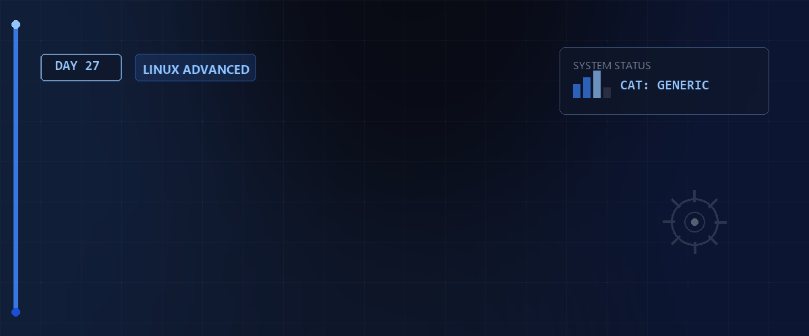
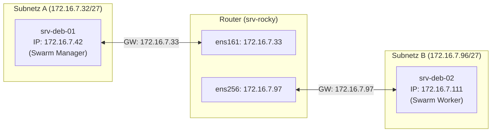

# 🌐 Docker Swarm & C#-Projekt-Redundanz: TicketsPlease — Tag 27



> **Entwickler & Administrator:** Tobias Boyke  
> **Status:** 🚀 100% Dokumentiert & LPIC-1/Cloud-Native und Swarm Fokussiert  
> **Kompatibilität:**   

---

## 📑 Inhaltsverzeichnis
- [🐳 1. Docker-Evolution von Tag 25/26 zu Tag 27](#-1-docker-evolution-von-tag-2526-zu-tag-27)
  - [A. Rückblick: Vom Single-Host zu Container-Runtimes](#a-rückblick-vom-single-host-zu-container-runtimes)
  - [B. Tag 27 Fokus: Native Hochverfügbarkeit mit Docker Swarm](#b-tag-27-fokus-native-hochverfügbarkeit-mit-docker-swarm)
- [🏗️ 2. Das Projekt TicketsPlease & Swarm-Zielsetzung](#️-2-das-projekt-ticketsplease--swarm-zielsetzung)
  - [A. Projektbeschreibung & Architektur](#a-projektbeschreibung--architektur)
  - [B. Swarm-Laborumgebung & IP-Layout](#b-swarm-laborumgebung--ip-layout)
- [📄 3. Konfigurationsdateien im Detail](#-3-konfigurationsdateien-im-detail)
  - [A. Dockerfile (Multi-Stage Build .NET 10.0)](#a-dockerfile-multi-stage-build-net-100)
  - [B. stack.yml (Produktion & Swarm-Orchestrierung)](#b-stackyml-produktion--swarm-orchestrierung)
  - [C. docker-compose.yml (Lokale Entwicklung)](#c-docker-composeyml-lokale-entwicklung)
- [🛠️ 4. Schritt-für-Schritt Swarm-Deployment](#️-4-schritt-für-schritt-swarm-deployment)
  - [Schritt 1: Firewall-Anpassung auf dem srv-rocky Router](#schritt-1-firewall-anpassung-auf-dem-srv-rocky-router)
  - [Schritt 2: Swarm-Init auf dem Manager-Node](#schritt-2-swarm-init-auf-dem-manager-node)
  - [Schritt 3: Worker-Node dem Swarm-Cluster hinzufügen](#schritt-3-worker-node-dem-swarm-cluster-hinzufügen)
  - [Schritt 4: Overlay-Netzwerk deklarieren](#schritt-4-overlay-netzwerk-deklarieren)
  - [Schritt 5: Secrets verwalten & Stack deployen](#schritt-5-secrets-verwalten--stack-deployen)
- [🔬 5. Hochverfügbarkeit, Härtung & Swarm-Verifizierung](#-5-hochverfügbarkeit-härtung--swarm-verifizierung)
  - [A. Redundanz & Update-Verhalten testen](#a-redundanz--update-verhalten-testen)
  - [B. Placement Constraints & Datenpersistenz](#b-placement-constraints--datenpersistenz)
  - [C. Sicherheits-Härtung (Secrets statt Klartext)](#c-sicherheits-härtung-secrets-statt-klartext)
- [🔑 Keywords](#-keywords)
- [🧠 LPIC-1/Cloud-Native Relevanz & Wissenstest](#-lpic-1cloud-native-relevanz--wissenstest)
- [🔗 Zurück zur Übersicht](#-zurück-zur-übersicht)

---

## 🐳 1. Docker-Evolution von Tag 25/26 zu Tag 27

### A. Rückblick: Vom Single-Host zu Container-Runtimes
* **[Tag 25](../Day_25/README.md):** Wir lernten die Grundlagen virtueller Namespaces, cgroups und den Betrieb einzelner Container auf einem Wirtssystem kennen.
* **[Tag 26](../Day_26/README.md):** Wir verstanden die tieferliegenden Runtimes (`containerd`, `runc`), die OCI-Spezifikationen und die Architektur von Kubernetes.

### B. Tag 27 Fokus: Native Hochverfügbarkeit mit Docker Swarm
Heute führen wir diese Wissenssammlung zusammen. Wir deployen eine reale, ältere C#-Webanwendung ([TicketsPlease](https://github.com/BitLC-NE-2025-2026/TicketsPlease)) redundant in dem gestern konfigurierten Multi-Host Docker Swarm. Swarm bietet uns native Orchestrierung (Load Balancing, Replikate und Ausfallsicherheit) direkt im Docker-Ökosystem.

---

## 🏗️ 2. Das Projekt TicketsPlease & Swarm-Zielsetzung

### A. Projektbeschreibung & Architektur
Das Projekt **TicketsPlease** besteht aus einer .NET Web-API/Web-App und einer MSSQL-Datenbank.
Um das Projekt für den Docker Swarm hochverfügbar und ausfallsicher zu machen, implementieren wir:
1. **Multi-Stage Build (`Dockerfile`):** Upgrade auf **.NET 10.0 SDK & Runtime** für minimale Image-Größen.
2. **Replikation:** Skalierung des Web-Services auf 2 Replikate im Cluster.
3. **Datenbank-Konsistenz:** Die MSSQL-Datenbank wird mittels Placement Constraints strikt auf den Swarm-Manager eingeschränkt, um Dateninkonsistenzen zu verhindern.
4. **Overlay-Netzwerk:** Verschlüsselte bzw. isolierte Cluster-interne Kommunikation der Container über getrennte Subnetze hinweg.

### B. Swarm-Laborumgebung & IP-Layout
Wir verwenden die vertraute Topologie aus [Tag 16](../Day_16/README.md):



---

## 📄 3. Konfigurationsdateien im Detail

Die vollständigen technischen Details der Docker-Dateien sind in der zentralen [docker.md](./assets/docker.md) abgelegt. Hier sind die Kernkonfigurationen:

### A. Dockerfile (Multi-Stage Build .NET 10.0)
Das `Dockerfile` trennt Build- und Laufzeitumgebung, um die Angriffsfläche und Image-Größe zu minimieren.

```dockerfile
# Basisabbild fuer den Build Prozess mit .NET 10.0 SDK
FROM mcr.microsoft.com/dotnet/sdk:10.0 AS build
WORKDIR /src

# Kopieren der Projektdateien fuer den Restore Vorgang
COPY ["src/TicketsPlease.Web/TicketsPlease.Web.csproj", "src/TicketsPlease.Web/"]
COPY ["src/TicketsPlease.Infrastructure/TicketsPlease.Infrastructure.csproj", "src/TicketsPlease.Infrastructure/"]
COPY ["src/TicketsPlease.Application/TicketsPlease.Application.csproj", "src/TicketsPlease.Application/"]
COPY ["src/TicketsPlease.Domain/TicketsPlease.Domain.csproj", "src/TicketsPlease.Domain/"]

# Wiederherstellen der NuGet Pakete
RUN dotnet restore "src/TicketsPlease.Web/TicketsPlease.Web.csproj"

# Kopieren des restlichen Quellcodes
COPY . .
WORKDIR "/src/src/TicketsPlease.Web"

# Kompilieren der Anwendung im Release Modus
RUN dotnet build "TicketsPlease.Web.csproj" -c Release -o /app/build

# Veroeffentlichen der Anwendung
FROM build AS publish
RUN dotnet publish "TicketsPlease.Web.csproj" -c Release -o /app/publish

# Laufzeitumgebung mit .NET 10.0 ASP.NET Core
FROM mcr.microsoft.com/dotnet/aspnet:10.0 AS final
WORKDIR /app
EXPOSE 8080

# Kopieren der veroeffentlichten Dateien aus dem Publish Layer
COPY --from=publish /app/publish .

# Startpunkt der Anwendung definieren
ENTRYPOINT ["dotnet", "TicketsPlease.Web.dll"]
```

---

### B. stack.yml (Produktion & Swarm-Orchestrierung)
Diese stack-Datei wird auf dem Swarm-Manager ausgeführt und steuert die Container-Verteilung auf die verschiedenen Worker-Nodes.

```yaml
version: '3.8'

services:
  web:
    # Verwendet die physische IP des Managers für den Image-Download durch Worker-Nodes
    image: 172.16.7.42:5000/ticketsplease:latest
    ports:
      # Mappt den Host-Port 8080 auf den Container-Port 8080
      - "8080:8080"
    environment:
      ASPNETCORE_ENVIRONMENT: "Production"
      # Connection String nutzt den Swarm Service-Namen tickets_db für DNS-Auflösung
      ConnectionStrings__DefaultConnection: "Server=tickets_db;Database=TicketsPlease;User Id=sa;Password=${MSSQL_SA_PASSWORD};TrustServerCertificate=True;"
    networks:
      - my-overlay-net
    depends_on:
      - db
    deploy:
      # Startet zwei Replikate der Webanwendung für Hochverfügbarkeit
      replicas: 2
      update_config:
        parallelism: 1
        delay: 10s
      restart_policy:
        # Bedingung any erzwingt den Neustart auch bei Exit Code 0
        condition: any
        delay: 5s

  db:
    image: mcr.microsoft.com/mssql/server:2022-latest
    environment:
      ACCEPT_EULA: "Y"
      MSSQL_SA_PASSWORD: "${MSSQL_SA_PASSWORD}"
    networks:
      - my-overlay-net
    volumes:
      # Bindet das persistente Volume für Datenbankdateien ein
      - mssql-data:/var/opt/mssql
    deploy:
      placement:
        constraints:
          # Beschränkt die Datenbankausführung ausschließlich auf den Manager-Node
          - node.role == manager

networks:
  my-overlay-net:
    # Deklariert das existierende attachable Overlay-Netzwerk
    external: true

volumes:
  mssql-data:
```

---

### C. docker-compose.yml (Lokale Entwicklung)
Für schnelle Tests außerhalb des Swarm-Clusters wurde eine lokale `docker-compose.yml` eingerichtet, welche Images direkt aus dem Quellcode baut:

```yaml
version: '3.8'

services:
  web:
    build:
      context: .
      dockerfile: Dockerfile
    ports:
      - "8080:8080"
    environment:
      - ASPNETCORE_ENVIRONMENT=Development
      - ConnectionStrings__DefaultConnection=Server=db;Database=TicketsPlease;User Id=sa;Password=YourStrongPass123!;TrustServerCertificate=True;
    depends_on:
      - db

  db:
    image: mcr.microsoft.com/mssql/server:2022-latest
    ports:
      - "1433:1433"
    environment:
      - ACCEPT_EULA=Y
      - MSSQL_SA_PASSWORD=YourStrongPass123!
    volumes:
      - mssql-data:/var/opt/mssql

volumes:
  mssql-data:
```

---

## 🛠️ 4. Schritt-für-Schritt Swarm-Deployment

### Schritt 1: Firewall-Anpassung auf dem srv-rocky Router
Damit der Swarm-Traffic die Subnetze A und B passieren kann, passen wir `nftables` auf dem Router an:

```bash
# In der forward-Chain von /etc/nftables.conf hinzufügen
ip saddr 172.16.7.32/27 ip daddr 172.16.7.96/27 tcp dport { 2377, 7946 } accept
ip saddr 172.16.7.32/27 ip daddr 172.16.7.96/27 udp dport { 7946, 4789 } accept
ip saddr 172.16.7.96/27 ip daddr 172.16.7.32/27 tcp dport { 2377, 7946 } accept
ip saddr 172.16.7.96/27 ip daddr 172.16.7.32/27 udp dport { 7946, 4789 } accept
```
*Port-Details:*
* `2377/TCP` — Swarm-Management
* `7946/TCP/UDP` — Gossip-Protokoll (Status & Nodes)
* `4789/UDP` — VXLAN Overlay-Datenverkehr

### Schritt 2: Swarm-Init auf dem Manager-Node
Initialisieren Sie den Cluster auf `srv-deb-01`:
```bash
sudo docker swarm init --advertise-addr 172.16.7.42
```

### Schritt 3: Worker-Node dem Swarm-Cluster hinzufügen
Führen Sie den generierten Join-Befehl auf `srv-deb-02` aus:
```bash
sudo docker swarm join --token <TOKEN> 172.16.7.42:2377
```

### Schritt 4: Overlay-Netzwerk deklarieren
Erstellen Sie das Overlay-Netzwerk auf dem Manager:
```bash
sudo docker network create \
  --driver overlay \
  --attachable \
  --subnet 10.0.9.0/24 \
  my-overlay-net
```

### Schritt 5: Secrets verwalten & Stack deployen
1. Setzen Sie die Umgebungsvariable für das MSSQL-Passwort:
   ```bash
   export MSSQL_SA_PASSWORD="DeinSicheresPasswort2026!"
   ```
2. Starten Sie den Stack:
   ```bash
   sudo -E docker stack deploy -c stack.yml ticketsplease
   ```

---

## 🔬 5. Hochverfügbarkeit, Härtung & Swarm-Verifizierung

### A. Redundanz & Update-Verhalten testen
Durch `replicas: 2` startet Swarm zwei Instanzen des Web-Frontends. Fällt eine Node aus (z. B. Absturz von `srv-deb-02`), routet der interne Swarm Load Balancer den Traffic vollautomatisch an die verbleibende Instanz weiter, während das Kubelet-Äquivalent im Swarm-Manager versucht, den ausgefallenen Container auf einem gesunden Host neu zu starten (Self-Healing).

### B. Placement Constraints & Datenpersistenz
Da SQL-Server seine Daten in ein lokales, benanntes Volume (`mssql-data`) auf der Festplatte schreibt, würde eine Migration des Datenbank-Containers auf den Worker-Node zu partiellem Datenverlust führen. Mit:
```yaml
deploy:
  placement:
    constraints:
      - node.role == manager
```
erzwingen wir, dass die Datenbank ausschließlich auf dem Manager-Knoten läuft, wo sich die persistenten Daten befinden.

### C. Sicherheits-Härtung (Secrets statt Klartext)
Das Hardcoding von Zugangsdaten im Repository ist ein Sicherheitsrisiko. In `stack.yml` haben wir das Datenbank-Passwort durch die dynamische Variable `${MSSQL_SA_PASSWORD}` ersetzt. So wird das Passwort erst zur Laufzeit aus der Umgebung des deployenden Administrators ausgelesen und gelangt nicht in das Versionskontrollsystem.

---

## 🔑 Keywords

| Keyword / Befehl | Erklärung |
| :--- | :--- |
| `docker swarm` | Der native Orchestrierungsmodus von Docker für Cluster-Verwaltung. |
| `docker stack deploy` | Deployt eine komplette Anwendung (mehrere Services) deklarativ auf dem Swarm. |
| `replicas` | Anzahl der identischen Container-Instanzen, die parallel laufen sollen. |
| `placement constraints` | Einschränkungen, die festlegen auf welchen Nodes bestimmte Services laufen dürfen. |
| `Multi-Stage Build` | Optimierte Dockerfile-Struktur zur Trennung von SDK-Build und schmaler Runtime. |

---

## 🧠 LPIC-1/Cloud-Native Relevanz & Wissenstest

<details>
<summary><b>Fragen zu Docker Swarm & Orchestrierung (Klicken zum Ausklappen)</b></summary>

1. **Welche Container-Instanz empfängt bei einem Service mit `replicas: 2` die Anfragen, wenn der Host-Port 8080 aufgerufen wird?**
   <details><summary>Antwort</summary>Der Docker Swarm Routing Mesh verteilt die Anfragen über ein integriertes Load-Balancing (Virtual IP) gleichmäßig (Round-Robin) auf alle gesunden Replikate.</details>

2. **Warum darf die Datenbank in diesem Setup nicht frei auf Worker-Nodes migrieren?**
   <details><summary>Antwort</summary>Weil das Volume <code>mssql-data</code> lokal an das Dateisystem des Managers gebunden ist. Ein Worker-Node hätte keinen Zugriff auf diese Datenbankdateien.</details>

3. **Welchen Port nutzt Docker Swarm für Cluster-Management-Verbindungen (Control Plane)?**
   <details><summary>Antwort</summary>Port **<code>2377 / TCP</code>**.</details>

</details>

---

## 🔗 Zurück zur Übersicht

* **Tag 26 (Container, Containerd & K8s):** [⬅️ Tag 26](../Day_26/README.md)
* **Tag 28 (LPIC-1 Simulation & MTAs):** [➡️ Tag 28](../Day_28/README.md)
* **Master-Repository:** [🌌 Zurück zum Master-Repository](../README.md)

---
*Erstellt & gepflegt von Tobias Boyke, Juni 2026.*
