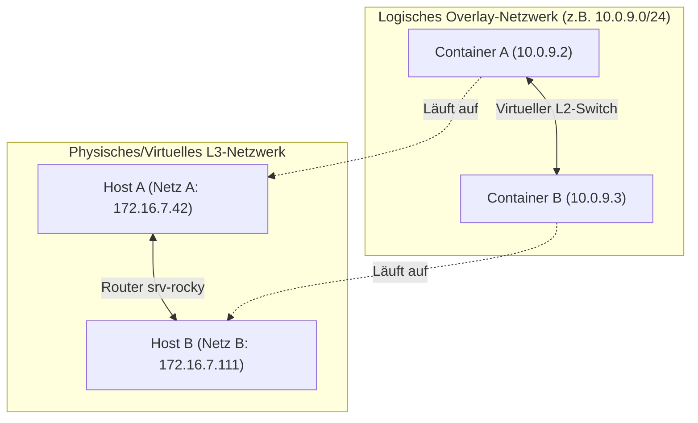
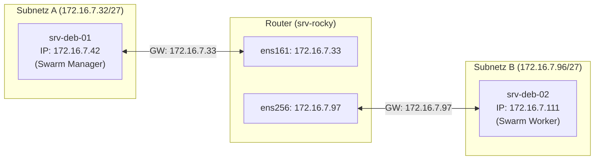

# 🌐 Docker Multi-Host-Networking: Overlay-Netzwerke in Subnetzen — Tag 27


> **Entwickler & Administrator:** Tobias Boyke  
> **Status:** 🚀 100% Dokumentiert & LPIC-1/Cloud-Native Fokussiert  
> **Kompatibilität:**   

---

## 📑 Inhaltsverzeichnis
- [📖 1. Grundlagen von Multi-Host-Netzwerken](#-1-grundlagen-von-multi-host-netzwerken)
  - [A. Die Multi-Host-Herausforderung](#a-die-multi-host-herausforderung)
  - [B. Die Lösung: Overlay-Netzwerke & VXLAN](#b-die-lösung-overlay-netzwerke--vxlan)
  - [C. Docker Swarm als Steuerungsebene (Control Plane)](#c-docker-swarm-als-steuerungsebene-control-plane)
  - [D. Port-Freigaben & Netzwerk-Voraussetzungen](#d-port-freigaben--netzwerk-voraussetzungen)
- [🏗️ 2. Netzwerk-Topologie & VM-Szenario](#️-2-netzwerk-topologie--vm-szenario)
- [🛠️ 3. Step-by-Step Tutorial: Overlay-Netzwerk realisieren](#️-3-step-by-step-tutorial-overlay-netzwerk-realisieren)
  - [Schritt 1: Firewall-Anpassung auf dem Router (srv-rocky)](#schritt-1-firewall-anpassung-auf-dem-router-srv-rocky)
  - [Schritt 2: Firewall-Anpassungen auf den Nodes (Optional)](#schritt-2-firewall-anpassungen-auf-den-nodes-optional)
  - [Schritt 3: Docker-Daemon auf beiden Nodes vorbereiten](#schritt-3-docker-daemon-auf-beiden-nodes-vorbereiten)
  - [Schritt 4: Docker Swarm auf dem Manager initialisieren](#schritt-4-docker-swarm-auf-dem-manager-initialisieren)
  - [Schritt 5: Worker-Node dem Swarm-Cluster hinzufügen](#schritt-5-worker-node-dem-swarm-cluster-hinzufügen)
  - [Schritt 6: Erstellung des attachable Overlay-Netzwerks](#schritt-6-erstellung-des-attachable-overlay-netzwerks)
  - [Schritt 7: Test-Container auf beiden Nodes starten](#schritt-7-test-container-auf-beiden-nodes-starten)
  - [Schritt 8: Kommunikation & Namensauflösung verifizieren](#schritt-8-kommunikation--namensauflösung-verifizieren)
- [🔬 4. Deep-Dive Diagnose & Traffic-Analyse](#-4-deep-dive-diagnose--traffic-analyse)
  - [A. VXLAN-Kapselung mit tcpdump nachweisen](#a-vxlan-kapselung-mit-tcpdump-nachweisen)
  - [B. MTU-Overhead & Paket-Fragmentierung](#b-mtu-overhead--paket-fragmentierung)
- [🔑 Keywords](#-keywords)
- [🧠 LPIC-1/Cloud-Native Relevanz & Wissenstest](#-lpic-1cloud-native-relevanz--wissenstest)
- [🔗 Zurück zur Übersicht](#-zurück-zur-übersicht)

---

## 📖 1. Grundlagen von Multi-Host-Netzwerken

### A. Die Multi-Host-Herausforderung
Wenn Container auf einem einzelnen Host laufen, nutzen sie standardmäßig das **Bridge-Netzwerk** (`docker0`). Dabei vergibt die Docker Engine lokale IP-Adressen (z. B. `172.17.0.x`), die über Network Address Translation (NAT) ins physische Netz geleitet werden. 

Verteilt man Container jedoch auf **mehrere Rechner (Hosts) in unterschiedlichen Subnetzen** (wie in unserem VM-Netzwerk aus [Tag 16](../Day_16/README.md)), entstehen gravierende Probleme:
* **IP-Kollisionen:** Jeder Docker-Daemon vergibt unabhängig dieselben internen IP-Bereiche.
* **Mangelnde Erreichbarkeit:** Die privaten Brücken-IPs (`172.17.x.x`) sind für andere Hosts nicht routingfähig.
* **Manuelles Port-Mapping-Chaos:** Man müsste alle Ports auf die Host-IPs mappen und das Routing manuell konfigurieren.

---

### B. Die Lösung: Overlay-Netzwerke & VXLAN
Ein **Overlay-Netzwerk** legt ein logisches, virtuelles Layer-2-Netzwerk (ein gemeinsames Switch-Segment) über eine bestehende physische oder virtuelle Layer-3-Infrastruktur (IP-Routing). 



Die Kapselung erfolgt in der Regel über **VXLAN** (Virtual Extensible LAN):
1. Sendet Container A ein Paket an Container B, fängt das Overlay-Interface des Hosts den Frame ab.
2. Der gesamte Ethernet-Frame von Container A wird in ein Standard-IP-UDP-Paket verpackt (**Encapsulation**).
3. Das Paket wird über das normale physische Netz an die IP von Host B geroutet.
4. Der Docker-Daemon auf Host B entpackt das Paket (**Decapsulation**) und stellt den originalen Frame an Container B zu.

---

### C. Docker Swarm als Steuerungsebene (Control Plane)
Damit die Hosts wissen, welcher Container auf welchem Rechner läuft und wie die VXLAN-Tunnel aufgebaut werden müssen, ist eine **Steuerungsebene (Control Plane)** nötig.
* Früher benötigte man dafür externe Key-Value-Stores (wie Consul oder etcd).
* Seit Docker 1.12 ist dies nativ über den **Docker Swarm Mode** integriert.
* Der Swarm-Manager verwaltet das Overlay-Netzwerk und synchronisiert den Zustand (Container-Standorte, IPs) über ein verschlüsseltes **Gossip-Protokoll** mit allen Nodes.

---

### D. Port-Freigaben & Netzwerk-Voraussetzungen
Für ein funktionierendes Swarm- und Overlay-Netzwerk müssen folgende Ports zwischen den beteiligten Hosts offen sein:

| Port / Protokoll | Richtung | Beschreibung | Nutzungsebene |
| :--- | :--- | :--- | :--- |
| **`2377 / TCP`** | Eingehend | Cluster-Management-Kommunikation | Control Plane |
| **`7946 / TCP` & `UDP`** | Bidirektional | Node-to-Node-Gossip (Knotenerkennung, Status) | Control Plane |
| **`4789 / UDP`** | Bidirektional | VXLAN-Datenverkehr (Kapselung der Container-Pakete) | Data Plane |

> [!IMPORTANT]  
> **Achtung beim VXLAN-Port:** Der Port `4789/UDP` darf auf dem Übertragungsweg nicht blockiert oder verändert werden. Manche Firewalls oder Cloud-Provider filtern diesen Port standardmäßig aus Sicherheitsgründen.

---

## 🏗️ 2. Netzwerk-Topologie & VM-Szenario

Wir setzen das Szenario in unserer virtuellen Laborumgebung aus [Tag 16](../Day_16/README.md) um. Die Kommunikation zwischen den Hosts wird über das Linux-Gateway `srv-rocky` geroutet:



| VM-Name | Betriebssystem | Rolle im Swarm | Schnittstelle | Physische IP | Standard-Gateway | Subnetz |
| :--- | :--- | :--- | :--- | :--- | :--- | :--- |
| **`srv-deb-01`** | Debian 12/13 | **Manager** | `ens192` | `172.16.7.42` | `172.16.7.33` | Netz A |
| **`srv-deb-02`** | Debian 12/13 | **Worker** | `ens192` | `172.16.7.111` | `172.16.7.97` | Netz B |
| **`srv-rocky`** | Rocky Linux 9 | **Router** | `ens161`<br>`ens256` | `172.16.7.33`<br>`172.16.7.97` | - | Netz A & B |

---

## 🛠️ 3. Step-by-Step Tutorial: Overlay-Netzwerk realisieren

### Schritt 1: Firewall-Anpassung auf dem Router (`srv-rocky`)
Da unser Gateway standardmäßig den Datenverkehr zwischen den Schnittstellen blockiert (falls restriktive Regeln aktiv sind), müssen wir die Swarm- und VXLAN-Ports explizit in `nftables` freigeben.

1. Verbinden Sie sich per SSH mit `srv-rocky`.
2. Editieren Sie das Firewall-Regelwerk `/etc/nftables.conf`:
   ```bash
   sudo nano /etc/nftables.conf
   ```
3. Fügen Sie in der `forward`-Chain Regeln hinzu, um den Port-Traffic zwischen `ens161` (Netz A) und `ens256` (Netz B) zu erlauben:
   ```nftables
   # Innerhalb von chain forward:
   chain forward {
       type filter hook forward priority 0; policy drop;
       ct state established,related accept
       
       # Erlaubt Swarm- und VXLAN-Traffic zwischen Netz A und Netz B
       ip saddr 172.16.7.32/27 ip daddr 172.16.7.96/27 tcp dport { 2377, 7946 } accept
       ip saddr 172.16.7.32/27 ip daddr 172.16.7.96/27 udp dport { 7946, 4789 } accept
       ip saddr 172.16.7.96/27 ip daddr 172.16.7.32/27 tcp dport { 2377, 7946 } accept
       ip saddr 172.16.7.96/27 ip daddr 172.16.7.32/27 udp dport { 7946, 4789 } accept

       # Genereller Traffic aus den Netzen (falls bereits durch Tag 16 konfiguriert)
       iifname "ens161" accept
       iifname "ens256" accept
   }
   ```
4. Laden Sie das nftables-Regelwerk neu:
   ```bash
   sudo nft -f /etc/nftables.conf
   ```

---

### Schritt 2: Firewall-Anpassungen auf den Nodes (Optional)
Falls auf den Debian-Hosts `srv-deb-01` und `srv-deb-02` eine lokale Firewall wie `ufw` aktiv ist, müssen die Ports dort ebenfalls freigegeben werden:

```bash
# Auf beiden Debian-Hosts ausführen, falls ufw aktiv ist:
sudo ufw allow 2377/tcp
sudo ufw allow 7946/tcp
sudo ufw allow 7946/udp
sudo ufw allow 4789/udp
sudo ufw reload
```

---

### Schritt 3: Docker-Daemon auf beiden Nodes vorbereiten
Stellen Sie sicher, dass Docker auf beiden Hosts installiert ist und läuft:

```bash
# Auf srv-deb-01 und srv-deb-02 ausführen
sudo systemctl enable --now docker

# Status prüfen
sudo systemctl status docker
```

---

### Schritt 4: Docker Swarm auf dem Manager initialisieren
Wir initialisieren den Swarm-Cluster auf `srv-deb-01` (Netz A).

```bash
# Auf srv-deb-01 (Manager) ausführen
sudo docker swarm init --advertise-addr 172.16.7.42
```

> [!NOTE]  
> Der Parameter `--advertise-addr` gibt an, über welche IP-Adresse dieser Node seine Steuerungsdaten für andere Nodes im Cluster bereitstellt. Da der Manager in Netz A liegt, wählen wir `172.16.7.42`.

**Erwartete Ausgabe:**
```text
Swarm initialized: current node (lqk8...) is now a manager.

To add a worker to this swarm, run the following command:

    docker swarm join --token SWMTKN-1-49abc... 172.16.7.42:2377

To add a manager to this swarm, run 'docker swarm join-token manager' and follow the instructions.
```

---

### Schritt 5: Worker-Node dem Swarm-Cluster hinzufügen
Kopieren Sie den gesamten `docker swarm join`-Befehl aus der Ausgabe des Managers und führen Sie ihn auf dem Worker-Node in Netz B aus.

```bash
# Auf srv-deb-02 (Worker) ausführen
sudo docker swarm join --token SWMTKN-1-49abc... 172.16.7.42:2377
```

**Erwartete Ausgabe auf dem Worker:**
```text
This node joined a swarm as a worker.
```

**Verifizierung auf dem Manager (`srv-deb-01`):**
Überprüfen Sie, ob beide Knoten erfolgreich im Cluster registriert sind:
```bash
sudo docker node ls
```

**Ausgabe:**
```text
HOSTNAME      STATUS    AVAILABILITY   MANAGER STATUS   ENGINE VERSION
srv-deb-01    Ready     Active         Leader           26.x.x
srv-deb-02    Ready     Active                          26.x.x
```

---

### Schritt 6: Erstellung des attachable Overlay-Netzwerks
Standardmäßig können Overlay-Netzwerke in Docker Swarm nur von *Swarm Services* (deklarativen Diensten) genutzt werden. Da wir jedoch normale, eigenständige Container (`docker run`) miteinander verbinden wollen, müssen wir das Flag `--attachable` setzen.

Führen Sie diesen Befehl auf dem **Manager-Node (`srv-deb-01`)** aus:
```bash
sudo docker network create \
  --driver overlay \
  --attachable \
  --subnet 10.0.9.0/24 \
  my-overlay-net
```

**Verifizierung der Netzwerkerstellung:**
```bash
sudo docker network ls
```

**Ausgabe auf dem Manager:**
```text
NETWORK ID     NAME             DRIVER    SCOPE
...
a1b2c3d4e5f6   my-overlay-net   overlay   swarm
```

> [!IMPORTANT]  
> **Optimierung von Docker:** Wenn Sie `docker network ls` sofort auf dem Worker (`srv-deb-02`) ausführen, wird das Netzwerk dort **noch nicht** angezeigt. Docker überträgt die Netzwerkdefinition erst auf die Worker-Nodes, wenn dort ein Container gestartet wird, der dieses Netzwerk explizit benötigt (Lazy-Loading / On-Demand-Provisionierung).

---

### Schritt 7: Test-Container auf beiden Nodes starten

Nun starten wir auf jedem Host einen Container und weisen ihn unserem neuen Overlay-Netzwerk zu.

**1. Auf dem Manager (`srv-deb-01`):**
```bash
sudo docker run -d \
  --name container-a \
  --network my-overlay-net \
  alpine sleep 3600
```

**2. Auf dem Worker (`srv-deb-02`):**
```bash
sudo docker run -d \
  --name container-b \
  --network my-overlay-net \
  alpine sleep 3600
```
*(Sobald dieser Befehl auf dem Worker abgesetzt wird, registriert er das Netzwerk `my-overlay-net` lokal und stellt die Verbindung her).*

---

### Schritt 8: Kommunikation & Namensauflösung verifizieren

Durch das Overlay-Netzwerk können die Container nun direkt über ihren Namen kommunizieren. Docker stellt dafür einen internen DNS-Server bereit.

**1. Ping von Container A (Netz A) zu Container B (Netz B):**
```bash
sudo docker exec -it container-a ping -c 4 container-b
```

**Erwartete Ausgabe:**
```text
PING container-b (10.0.9.3): 56 data bytes
64 bytes from 10.0.9.3: seq=0 ttl=64 time=0.852 ms
64 bytes from 10.0.9.3: seq=1 ttl=64 time=0.912 ms
64 bytes from 10.0.9.3: seq=2 ttl=64 time=0.884 ms
64 bytes from 10.0.9.3: seq=3 ttl=64 time=0.901 ms

--- container-b ping statistics ---
4 packets transmitted, 4 packets received, 0% packet loss
round-trip min/avg/max = 0.852/0.887/0.912 ms
```

**2. IP-Adressen und Schnittstellen im Container prüfen:**
```bash
sudo docker exec -it container-a ip addr
```
Sie sehen dort neben dem Loopback-Interface zwei Ethernet-Karten:
* `eth0`: Angeschlossen an das Overlay-Netzwerk (IP: `10.0.9.2`).
* `eth1`: Angeschlossen an das standardmäßige `docker_gwbridge` (wird von Docker genutzt, damit der Container Zugriff auf das Internet/Host-Netzwerk hat).

---

## 🔬 4. Deep-Dive Diagnose & Traffic-Analyse

### A. VXLAN-Kapselung mit `tcpdump` nachweisen
Um zu beweisen, dass die Container-Datenpakete tatsächlich gekapselt durch einen VXLAN-Tunnel (UDP 4789) über den Router `srv-rocky` geleitet werden, fangen wir den Netzwerkverkehr auf dem Router ab.

1. Öffnen Sie ein Terminal auf dem Router `srv-rocky`.
2. Starten Sie `tcpdump` auf dem Interface, das zu Netz A führt (`ens161`):
   ```bash
   sudo tcpdump -i ens161 port 4789 -n -vv
   ```
3. Lösen Sie auf `srv-deb-01` im `container-a` einen Ping an `container-b` aus.
4. Beobachten Sie die Ausgabe auf `srv-rocky`:

```text
12:34:56.123456 IP (tos 0x0, ttl 64, id 1234, offset 0, flags [DF], proto UDP (17), length 134)
    172.16.7.42.39482 > 172.16.7.111.4789: [no cksum] VXLAN, flags [I] (0x08), vni 4096
    IP (tos 0x0, ttl 64, id 5678, offset 0, flags [none], proto ICMP (1), length 84)
        10.0.9.2 > 10.0.9.3: ICMP echo request, id 12, seq 0, length 64
```

> [!TIP]  
> **Analyse der Kapselung:**  
> Das Paket kommt von der physischen IP `172.16.7.42` (Host A) und geht an die physische IP `172.16.7.111` (Host B) auf Port **`4789` (UDP)**. Darin eingebettet ist die virtuelle VXLAN Network Identifier (**VNI 4096**). Im Payload befindet sich das eigentliche, unverschlüsselte ICMP-Paket der Container-IPs `10.0.9.2 > 10.0.9.3`.

---

### B. MTU-Overhead & Paket-Fragmentierung
Da die VXLAN-Kapselung zusätzliche Header-Daten hinzufügt, verringert sich die nutzbare Paketgröße für die Container:
* **VXLAN-Overhead:** 50 Bytes (20 Bytes IP + 8 Bytes UDP + 8 Bytes VXLAN + 14 Bytes innerer Ethernet-Header).
* Wenn die physische Netzwerkschnittstelle eine Standard-MTU von **1500 Bytes** hat, darf die MTU im Overlay-Netzwerk maximal **1450 Bytes** betragen.
* Docker konfiguriert die MTU auf den virtuellen Overlay-Schnittstellen der Container automatisch auf `1450`, um IP-Fragmentierung zu verhindern.

---

## 🔑 Keywords

| Keyword / Befehl | Erklärung |
| :--- | :--- |
| `docker swarm init` | Initialisiert einen Docker Swarm-Cluster auf dem aktuellen Node (wird zum Manager). |
| `docker swarm join` | Fügt einen Rechner als Worker oder Manager zu einem bestehenden Swarm-Cluster hinzu. |
| `overlay` | Docker-Netzwerktreiber zur Realisierung von virtuellen Multi-Host-Netzwerken. |
| `--attachable` | Erlaubt es eigenständigen Containern (`docker run`), sich mit einem Swarm-Overlay-Netzwerk zu verbinden. |
| `VXLAN` | Virtual Extensible LAN: Kapselungsprotokoll (UDP 4789) zur Tunnelung von L2-Frames über L3-Netzwerke. |
| `VNI` | VXLAN Network Identifier: 24-Bit-ID zur Unterscheidung verschiedener virtueller Overlay-Netzwerke. |
| `Gossip-Protokoll` | Dezentrales Kommunikationsprotokoll (Port 7946) zur Synchronisation des Clusterzustands im Swarm. |
| `docker node ls` | Listet alle aktiven Knoten des Swarm-Clusters auf (nur auf dem Manager ausführbar). |

---

## 🧠 LPIC-1/Cloud-Native Relevanz & Wissenstest

<details>
<summary><b>Fragen zu Docker Multi-Host-Networking (Klicken zum Ausklappen)</b></summary>

1. **Welches Protokoll und welcher Port werden standardmäßig für die Datenübertragung (Data Plane) in einem Docker-Overlay-Netzwerk genutzt?**
   <details><summary>Antwort</summary>Das Protokoll **VXLAN** über den Port **`4789 / UDP`**.</details>

2. **Warum können Sie einen Container, den Sie mit `docker run --network mein-netz ...` starten, standardmäßig nicht mit einem neu erstellten Swarm-Overlay-Netzwerk verbinden?**
   <details><summary>Antwort</summary>Weil ein Overlay-Netzwerk standardmäßig nur für Swarm-Dienste (`docker service`) reserviert ist. Damit normale Container sich verbinden können, muss das Netzwerk explizit mit der Option **`--attachable`** erstellt worden sein.</details>

3. **Welchen Standard-MTU-Wert weisen Container-Schnittstellen in einem Docker-Overlay-Netzwerk auf und warum weicht dieser vom Ethernet-Standard ab?**
   <details><summary>Antwort</summary>Der Standardwert liegt bei **1450 Bytes**. Dies liegt an den **50 Bytes Overhead** der VXLAN-Kapselung (IP, UDP, VXLAN- und Ethernet-Header), die auf die ursprüngliche MTU des Hosts (meist 1500 Bytes) aufgeschlagen werden. Dadurch wird Paketfragmentierung verhindert.</details>

4. **Welche Aufgabe hat das Gossip-Protokoll auf Port 7946 (TCP/UDP) im Docker Swarm?**
   <details><summary>Antwort</summary>Es dient der Erkennung von Knoten (Node Discovery), der Durchführung von Gesundheitsprüfungen (Health Checks) und der Synchronisierung von Netzwerkinformationen zwischen den Clustermitgliedern im Hintergrund.</details>

5. **Ein Administrator stellt fest, dass `docker network ls` auf einem neu hinzugefügten Swarm-Worker das erstellte Overlay-Netzwerk nicht auflistet. Ist das ein Fehler?**
   <details><summary>Antwort</summary>Nein, das ist das normale Optimierungsverhalten (Lazy-Loading) von Docker. Das Netzwerk wird erst dann auf den Worker-Node repliziert und dort sichtbar, wenn ein Container auf diesem Node gestartet wird, der das Netzwerk benötigt.</details>

6. **Welcher Port wird für das Cluster-Management (API-Server des Swarm-Managers) verwendet?**
   <details><summary>Antwort</summary>Der Port **`2377 / TCP`**.</details>

</details>

---

## 🔗 Zurück zur Übersicht

* **Tag 26 (Docker, Kubernetes & Containerd):** [⬅️ Tag 26](../Day_26/README.md)
* **Tag 28 (Kryptographie & MTAs):** [➡️ Tag 28](../Day_28/README.md)
* **Master-Repository:** [🌌 Zurück zum Master-Repository](../README.md)

---
*Erstellt & gepflegt von Tobias Boyke, Juni 2026.*
