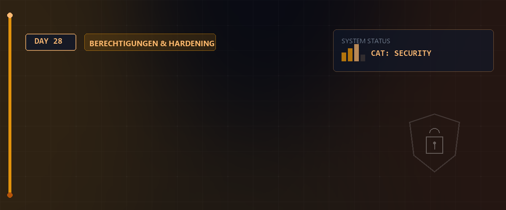
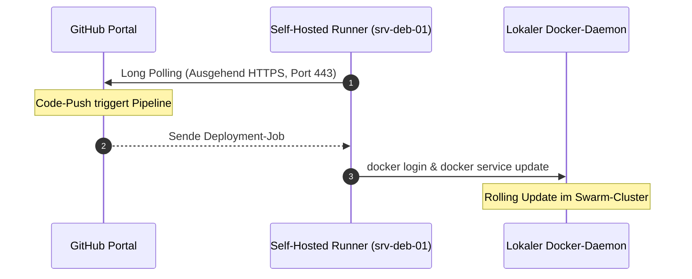

# 📊 Docker Swarm Monitoring & GitHub Actions CI/CD — Tag 28



> **Entwickler & Administrator:** Tobias Boyke  
> **Status:** 🚀 100% Dokumentiert & LPIC-1/Cloud-Native Fokussiert  
> **Kompatibilität:**   

---

## 📑 Inhaltsverzeichnis
- [🚀 1. Private-LAN Deployment mit GitHub Self-Hosted Runner](#-1-private-lan-deployment-mit-github-self-hosted-runner)
  - [A. Warum Self-Hosted Runner im privaten Netz?](#a-warum-self-hosted-runner-im-privaten-netz)
  - [B. Schritt-für-Schritt: Runner auf dem Swarm-Manager installieren](#b-schritt-für-schritt-runner-auf-dem-swarm-manager-installieren)
- [📊 2. Prometheus, Grafana & Node Exporter Monitoring](#-2-prometheus-grafana--node-exporter-monitoring)
  - [A. System-Metriken (Node Exporter) vs. Container-Metriken (cAdvisor)](#a-system-metriken-node-exporter-vs-container-metriken-cadvisor)
  - [B. Konfigurations-Dateistruktur](#b-konfigurations-dateistruktur)
- [📄 3. Konfigurationsdateien im Detail](#-3-konfigurationsdateien-im-detail)
  - [A. docker-stack-monitoring.yml (Vollständiger Production-Stack)](#a-docker-stack-monitoringyml-vollständiger-production-stack)
  - [B. prometheus.yml (Scrape-Konfiguration)](#b-prometheusyml-scrape-konfiguration)
  - [C. grafana-datasource.yml (Datasource Provisioning)](#c-grafana-datasourceyml-datasource-provisioning)
  - [D. deploy-github-actions.yml (Runner-Pipeline)](#d-deploy-github-actionsyml-runner-pipeline)
- [🛠️ 4. Schritt-für-Schritt Setup: Monitoring & CI/CD etablieren](#️-4-schritt-für-schritt-setup-monitoring--cicd-etablieren)
  - [Schritt 1: Ordnerstruktur & Berechtigungen vorbereiten](#schritt-1-ordnerstruktur--berechtigungen-vorbereiten)
  - [Schritt 2: Monitoring-Stack deployen](#schritt-2-monitoring-stack-deployen)
  - [Schritt 3: Verifizierung & Grafana Dashboard Import](#schritt-3-verifizierung--grafana-dashboard-import)
- [🔑 Keywords](#-keywords)
- [🧠 LPIC-1/Cloud-Native Relevanz & Wissenstest](#-lpic-1cloud-native-relevanz--wissenstest)
- [🔗 Zurück zur Übersicht](#-zurück-zur-übersicht)

---

## 🚀 1. Private-LAN Deployment mit GitHub Self-Hosted Runner

### A. Warum Self-Hosted Runner im privaten Netz?
Standard-GitHub Runner können Server in einem geschlossenen, privaten LAN (z. B. hinter einer NAT-Firewall) nicht per SSH erreichen, da private IPs (wie `172.16.7.x`) nicht routingfähig sind. 

Der **Self-Hosted Runner** löst das Problem elegant:
1. Er wird direkt als Service auf dem **Swarm-Manager** (`srv-deb-01`) installiert.
2. Er baut eine **ausgehende HTTPS-Verbindung** (Long Polling via Port 443) zu GitHub auf.
3. Es müssen **keine Ports** (wie Port 22 SSH) im Router freigegeben werden.
4. Jobs werden lokal auf dem Server ausgeführt, wodurch der lokale Docker-Daemon direkt angesprochen werden kann.



### B. Schritt-für-Schritt: Runner auf dem Swarm-Manager installieren

1. Gehen Sie auf GitHub in Ihr Repository: **Settings ➡️ Actions ➡️ Runners ➡️ New self-hosted runner ➡️ Linux**.
2. Verbinden Sie sich per SSH mit Ihrem Swarm-Manager `srv-deb-01` und führen Sie die Befehle aus:

```bash
# 1. Runner-Verzeichnis erstellen und betreten
mkdir actions-runner && cd actions-runner

# 2. Installer-Paket herunterladen
curl -o actions-runner-linux-x64-2.316.0.tar.gz -L https://github.com/actions/runner/releases/download/v2.316.0/actions-runner-linux-x64-2.316.0.tar.gz

# 3. Archiv entpacken
tar xzf ./actions-runner-linux-x64-2.316.0.tar.gz
```

3. Konfigurieren Sie den Runner (kopieren Sie den Token aus Ihren GitHub-Settings):
```bash
./config.sh --url https://github.com/DEIN-USERNAME/DEIN-REPO --token DEIN-TOKEN-AUS-GITHUB
```
*(Drücken Sie bei den Abfragen nach Name und Ordner einfach Enter für die Standardeinstellungen).*

4. Installieren und starten Sie den Runner als neustartsicheren **systemd-Service**:
```bash
sudo ./svc.sh install
sudo ./svc.sh start
```
5. In GitHub unter **Runners** sehen Sie nun Ihren Server als **Idle** markiert.

---

## 📊 2. Prometheus, Grafana & Node Exporter Monitoring

### A. System-Metriken (Node Exporter) vs. Container-Metriken (cAdvisor)
Ein vollständiges Cloud-Native-Monitoring benötigt zwei Informationsquellen:
* **cAdvisor (Container-Ebene):** Läuft global auf jedem Node und liest containerisierte Statistiken (`cgroups`) aus. Zeigt CPU-/RAM-Auslastung einzelner Container (z. B. wie viel RAM verbraucht das C#-Frontend).
* **Node Exporter (Host-Ebene):** Läuft global auf jedem Node und liest die Systemdaten der virtuellen Maschine aus (`/proc` und `/sys`). Zeigt physische Daten wie Plattenbelegung, Netzwerkschnittstellen-Durchsatz der VM (`ens192`) und Kernel-Statistiken.

### B. Konfigurations-Dateistruktur
Grafana soll ohne manuelle Eingriffe (Grafana-UI-Klicks) einsatzbereit sein. Dazu provisionieren wir die Prometheus-Datenquelle als Code direkt beim Containerstart.

```text
Day_28/
├── README.md
└── assets/
    ├── docker-stack-monitoring.yml   # Docker Stack-Definition
    ├── prometheus.yml                # Prometheus-Scrape Targets
    ├── grafana-datasource.yml        # Automatische Datenquellen-Konfig
    └── deploy-github-actions.yml     # Self-Hosted CI/CD Definition
```

---

## 📄 3. Konfigurationsdateien im Detail

Alle Konfigurationsdateien sind im Ordner [assets](./assets) hinterlegt.

### A. docker-stack-monitoring.yml (Vollständiger Production-Stack)
Siehe [docker-stack-monitoring.yml](./assets/docker-stack-monitoring.yml).

```yaml
version: '3.8'

services:
  prometheus:
    image: prom/prometheus:latest
    volumes:
      - prometheus-config:/etc/prometheus
      - prometheus-data:/prometheus
    command:
      - '--config.file=/etc/prometheus/prometheus.yml'
      - '--storage.tsdb.path=/prometheus'
    ports:
      - "9090:9090"
    networks:
      - monitoring-net
    deploy:
      placement:
        constraints:
          - node.role == manager

  grafana:
    image: grafana/grafana:latest
    ports:
      - "3000:3000"
    volumes:
      - grafana-data:/var/lib/grafana
      # Mountet die Datenquelle automatisch (Configuration as Code)
      - ./grafana-datasource.yml:/etc/grafana/provisioning/datasources/datasource.yaml:ro
    networks:
      - monitoring-net
    environment:
      - GF_SECURITY_ADMIN_PASSWORD=admin
    deploy:
      placement:
        constraints:
          - node.role == manager

  cadvisor:
    image: gcr.io/cadvisor/cadvisor:v0.47.2
    command:
      - '--docker_only=true'
    volumes:
      - /:/rootfs:ro
      - /var/run:/var/run:ro
      - /var/run/docker.sock:/var/run/docker.sock:ro
      - /sys:/sys:ro
      - /var/lib/docker/:/var/lib/docker:ro
      - /dev/disk/:/dev/disk:ro
    networks:
      - monitoring-net
    deploy:
      mode: global

  node-exporter:
    image: prom/node-exporter:latest
    volumes:
      - /proc:/host/proc:ro
      - /sys:/host/sys:ro
      - /:/rootfs:ro
    command:
      - '--path.procfs=/host/proc'
      - '--path.sysfs=/host/sys'
      - '--collector.filesystem.mount-points-exclude=^/(sys|proc|dev|host|etc)($$|/)'
    networks:
      - monitoring-net
    deploy:
      mode: global
```

### B. prometheus.yml (Scrape-Konfiguration)
Siehe [prometheus.yml](./assets/prometheus.yml). Weist Prometheus an, cAdvisor und Node-Exporter aller Nodes über das Overlay-Netzwerk abzufragen.

```yaml
global:
  scrape_interval: 15s

scrape_configs:
  - job_name: 'prometheus'
    static_configs:
      - targets: ['localhost:9090']

  - job_name: 'cadvisor'
    dns_sd_configs:
      - names:
          - 'tasks.cadvisor'
        type: 'A'
        port: 8080

  - job_name: 'node-exporter'
    dns_sd_configs:
      - names:
          - 'tasks.node-exporter'
        type: 'A'
        port: 9100
```

### C. grafana-datasource.yml (Datasource Provisioning)
Siehe [grafana-datasource.yml](./assets/grafana-datasource.yml).

```yaml
apiVersion: 1

datasources:
  - name: Prometheus
    type: prometheus
    access: proxy
    url: http://prometheus:9090
    isDefault: true
    editable: false
```

### D. deploy-github-actions.yml (Runner-Pipeline)
Siehe [deploy-github-actions.yml](./assets/deploy-github-actions.yml).
Wichtig ist hier die Anweisung `runs-on: self-hosted`.

```yaml
name: CI/CD Deployment to Docker Swarm (Self-Hosted)

on:
  push:
    branches:
      - main

env:
  REGISTRY: ghcr.io
  IMAGE_NAME: ${{ github.repository }}

jobs:
  build-and-push:
    runs-on: ubuntu-latest
    permissions:
      contents: read
      packages: write

    steps:
      - name: Checkout repository
        uses: actions/checkout@v4

      - name: Log in to the Container registry
        uses: docker/login-action@v3
        with:
          registry: ${{ env.REGISTRY }}
          username: ${{ github.actor }}
          password: ${{ secrets.GITHUB_TOKEN }}

      - name: Build and push Docker image
        uses: docker/build-push-action@v5
        with:
          context: .
          file: Dockerfile
          push: true
          tags: ${{ env.REGISTRY }}/${{ env.IMAGE_NAME }}:latest

  deploy-to-swarm:
    needs: build-and-push
    # Ausführung lokal auf dem Swarm-Manager
    runs-on: self-hosted

    steps:
      - name: Trigger Rolling Update on Swarm
        run: |
          echo "${{ secrets.GITHUB_TOKEN }}" | docker login ghcr.io -u ${{ github.actor }} --password-stdin
          docker service update --image ${{ env.REGISTRY }}/${{ env.IMAGE_NAME }}:latest ticketsplease_web
```

---

## 🛠️ 4. Schritt-für-Schritt Setup: Monitoring & CI/CD etablieren

### Schritt 1: Ordnerstruktur & Berechtigungen vorbereiten
Prometheus und Grafana benötigen die Konfigurationen an festen Orten. Auf dem Manager-Node ausführen:
```bash
# Volumes initialisieren
sudo docker volume create monitoring_prometheus-config
sudo docker volume create monitoring_prometheus-data
sudo docker volume create monitoring_grafana-data

# Konfiguration kopieren
sudo cp assets/prometheus.yml /var/lib/docker/volumes/monitoring_prometheus-config/_data/prometheus.yml
```

### Schritt 2: Monitoring-Stack deployen
Starten Sie den Stack auf dem Swarm-Manager (`srv-deb-01`):
```bash
sudo docker stack deploy -c assets/docker-stack-monitoring.yml monitoring
```

### Schritt 3: Verifizierung & Grafana Dashboard Import
1. Öffnen Sie `http://172.16.7.42:3000` (User: `admin` / Passwort: `admin`).
2. Unter **Connections ➡️ Datasources** sehen Sie, dass die Verbindung zu Prometheus durch unsere `grafana-datasource.yml` bereits vollautomatisch eingerichtet wurde!
3. Gehen Sie auf **Dashboards ➡️ New ➡️ Import**.
   * Importieren Sie die Dashboard-ID **`1860`** (für den Node Exporter / Host-Systemstatus).
   * Importieren Sie die Dashboard-ID **`11600`** (für cAdvisor / Container-Status).
4. Sie sehen nun Live-Grafiken aller Hosts und Container des Swarm-Clusters!

> [!TIP]
> **Fehlerbehebung für leere Dashboards (No Data) bei ID 11600:**
> Falls das Dashboard für den Container-Status leer bleibt, liegt das meist an fehlenden Container-Metadaten (Name, Image) im cAdvisor.
> 1. **Docker Socket einbinden:** cAdvisor benötigt zwingend Zugriff auf `/var/run/docker.sock:/var/run/docker.sock:ro`. Ohne diesen kann cAdvisor cgroup-IDs nicht in echte Containernamen übersetzen. Da das Dashboard 11600 nach `image!=""` filtert, bleibt es ohne diesen Mount leer.
> 2. **cgroups v2 Kompatibilität:** Auf modernen Systemen (Debian 12, Rocky Linux 9, Arch) nutzt Linux standardmäßig cgroups v2. Fügen Sie cAdvisor den Parameter `--docker_only=true` (in den Compose `command`-Optionen) hinzu, um zu verhindern, dass cAdvisor versucht, das gesamte Host-Systemd-Verzeichnis zu scannen, was zu Fehlern und leeren Metriken führt.
> 3. **Stack aktualisieren:** Nach der Anpassung der `docker-stack-monitoring.yml` den Stack neu deployen (`docker stack deploy -c assets/docker-stack-monitoring.yml monitoring`), damit die Änderungen aktiv werden.

---

## 🔑 Keywords

| Keyword / Befehl | Erklärung |
| :--- | :--- |
| `Self-Hosted Runner` | Ein lokaler GitHub-Runner Agent, der ausgehende Verbindungen nutzt, um Pipelines im LAN auszuführen. |
| `Node Exporter` | Prometheus-Agent zur Messung von CPU, RAM und Plattenplatz des echten Wirts-Betriebssystems. |
| `cAdvisor` | Container-Analyse Tool von Google, misst cgroup-Werte einzelner Docker-Container. |
| `Provisioning` | Automatisches Laden von Konfigurationsdaten (wie Datasources) per Code beim Containerstart. |

---

## 🧠 LPIC-1/Cloud-Native Relevanz & Wissenstest

<details>
<summary><b>Fragen zu Advanced Swarm Monitoring & CD (Klicken zum Ausklappen)</b></summary>

1. **Warum ist ein Self-Hosted Runner sicherer als das Öffnen von Port 22 am Internet-Router für externe Deployments?**
   <details><summary>Antwort</summary>Weil keine eingehenden Verbindungen in das private Netz zugelassen werden müssen. Der Runner holt sich Aufträge über eine ausgehende TLS-Verbindung ab (Sicherheitsprinzip: Zero Inbound Ports).</details>

2. **Welche Informationen liefert der Node Exporter, die cAdvisor nicht erfassen kann?**
   <details><summary>Antwort</summary>cAdvisor sieht nur die zugewiesenen Ressourcen-Slices der Container. Der Node Exporter misst hostweite physische Werte wie Dateisysteme (z. B. verbleibender Plattenplatz auf <code>/dev/sda1</code>) und Hardwaretemperaturen.</details>

3. **Was passiert, wenn wir Grafana-Datasources nicht über das Provisioning (YAML) einbinden?**
   <details><summary>Antwort</summary>Die Konfiguration müsste bei jedem Containerstart oder Update manuell im Grafana-UI vorgenommen werden, was dem DevOps-Grundsatz "Infrastruktur als Code (IaC)" widerspricht.</details>

</details>

---

## 🔗 Zurück zur Übersicht

* **Tag 27 (Docker Swarm & C#-Redundanz):** [⬅️ Tag 27](../Day_27/README.md)
* **Tag 29 (LPIC-1 Simulation 101):** [➡️ Tag 29](../Day_29/README.md)
* **Master-Repository:** [🌌 Zurück zum Master-Repository](../README.md)

---
*Erstellt & gepflegt von Tobias Boyke, Juni 2026.*
