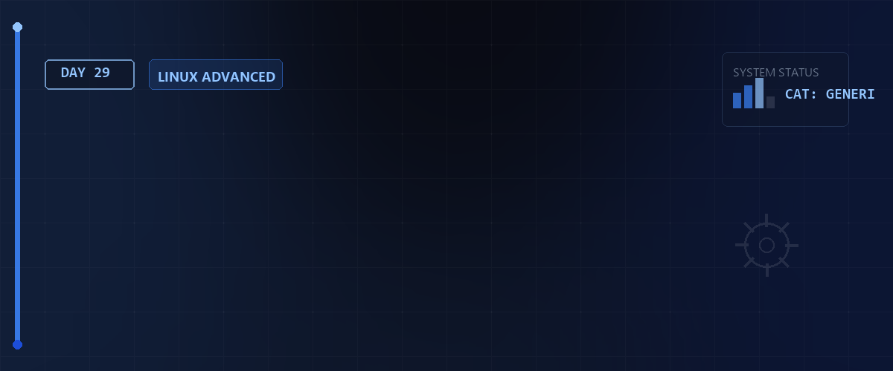

# 🐧 LPIC-1 Simulation 101 — Tag 29

> **Entwickler & Administrator:** Tobias Boyke  
> **Status:** 🚀 100% Dokumentiert & LPIC-1 Fokussiert  
> **Kompatibilität:**   

---

## 📑 Inhaltsverzeichnis
- [📖 Themenübersicht](#-themenübersicht)
- [🧠 LPIC-1 Relevanz & Wissenstest](#-lpic-1-relevanz--wissenstest)
- [🔗 Zurück zur Übersicht](#-zurück-zur-übersicht)

---

## 📖 Themenübersicht

## 📝 1. Fokus und Aufbau von Exam 101
Die LPIC-1 Prüfung 101-500 deckt die Systemarchitektur, die Linux-Installation, die Paketverwaltung sowie GNU/Unix-Befehle und Dateisysteme ab.
* Zeit: 90 Minuten für 60 Fragen.
* Bestehensgrenze: Ca. 500 von 800 Punkten.

## 💡 2. Die wichtigsten Prüfungsschwerpunkte
* **GNU- und Unix-Befehle:** Filterung (`grep`, `sed`, `awk`), Dateimanagement und Pipelining.
* **Systemarchitektur:** Kernel-Module, Bootloader-Interaktionsmöglichkeiten und systemd-Initialisierung.
* **Paketverwaltung:** Detaillierte Kenntnis der Befehle für `dpkg`, `apt`, `rpm` und `dnf`.
* **Dateisysteme & FHS:** Mount-Optionen, `/etc/fstab` Syntax und LVM-Verwaltung.

---

## 🧠 LPIC-1 Relevanz & Wissenstest

<b>Fragen zu LPIC-1 Simulation 101 (Klicken zum Ausklappen)</b>

1. **Aus wie vielen Fragen besteht die LPIC-1 Prüfung (101-500) und wie viel Zeit hat man?**
   

Antwort
Die Prüfung besteht aus 60 Fragen (Single-Choice, Multiple-Choice und Lückentexte), für die man 90 Minuten Zeit hat.

2. **Was ist der Unterschied zwischen Kaltstart- (Coldplug) und Warmstart-Geräten (Hotplug)?**
   

Antwort
**Coldplug-Geräte** müssen vor dem Systemstart eingebaut sein (z.B. CPU, RAM). **Hotplug-Geräte** können im laufenden Betrieb angeschlossen und erkannt werden (z.B. USB-Festplatten).

3. **Wie lässt sich ein Root-Passwort über den GRUB2-Bootloader zurücksetzen?**
   

Antwort
Indem man den Booteintrag editiert, `init=/bin/bash` (oder `systemd.unit=rescue.target`) an die Kernel-Zeile anhängt, bootet und das Dateisystem beschreibbar remountet (`mount -o remount,rw /`).

4. **Welcher Befehl aktualisiert die Datenbank für den Schnellfindungs-Befehl `locate`?**
   

Antwort
Der Befehl `updatedb` (wird meist als root ausgeführt).

5. **Welche drei Zeitstempel besitzt jede Datei im Linux-Dateisystem?**
   

Antwort
**Access Time** (atime - letzter Lesezugriff), **Modification Time** (mtime - letzte Inhaltsänderung) und **Change Time** (ctime - letzte Metadatenänderung wie Rechte/Besitzer).

---

## 🔗 Zurück zur Übersicht

* **Tag 28 (Kryptographie & MTAs):** [⬅️ Tag 28](../Day_28/README.md)
* **Tag 30 (LPIC-1 Simulation 102):** [➡️ Tag 30](../Day_30/README.md)
* **Master-Repository:** [🌌 Zurück zum Master-Repository](../README.md)

---
*Erstellt & gepflegt von Tobias Boyke, Juni 2026.*
