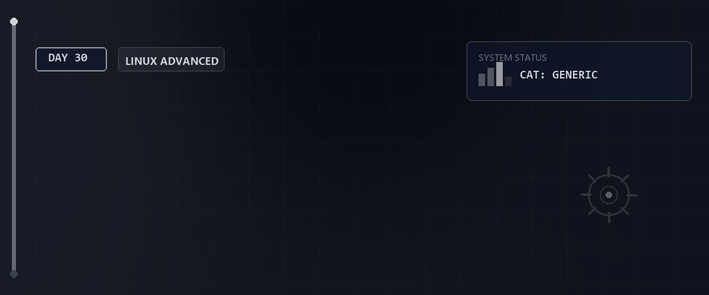

# 🐧 LPIC-1 Simulation 102 — Tag 30

> **Entwickler & Administrator:** Tobias Boyke  
> **Status:** 🚀 100% Dokumentiert & LPIC-1 Fokussiert  
> **Kompatibilität:**   

---

## 📑 Inhaltsverzeichnis
- [📖 Themenübersicht](#-themenübersicht)
- [🧠 LPIC-1 Relevanz & Wissenstest](#-lpic-1-relevanz--wissenstest)
- [🔗 Zurück zur Übersicht](#-zurück-zur-übersicht)

---

## 📖 Themenübersicht

## 📝 1. Fokus und Aufbau von Exam 102
Die LPIC-1 Prüfung 102-500 deckt Shell-Scripting, Benutzeroberflächen, administrative Kernaufgaben (Benutzer, Cronjobs), Systemdienste, Netzwerke und Sicherheit ab.

## 💡 2. Die wichtigsten Prüfungsschwerpunkte
* **Shell-Scripting:** Kontrollstrukturen, Schleifen, Exit-Codes und Variablen.
* **Netzwerk-Konfiguration:** IP-Adressierung, Routing, DNS, `nmcli`, `ip` und Socket-Statistiken (`ss`).
* **Sicherheit:** SSH-Härtung, TCP-Wrapper, ulimits und Dateiberechtigungen.
* **SQL-Grundlagen:** Einfache SELECT-Abfragen, Tabellen-Joins und Datenmanipulation.

---

## 🧠 LPIC-1 Relevanz & Wissenstest

<b>Fragen zu LPIC-1 Simulation 102 (Klicken zum Ausklappen)</b>

1. **Welche Themenbereiche umfasst das LPIC-1 Exam 102 hauptsächlich?**
   

Antwort
Shells und Scripting, Benutzeroberflächen & Desktops, administrative Aufgaben, grundlegende Systemdienste, Netzwerke und Systemsicherheit.

2. **Mit welchem Befehl ermittelt man den aktuellen Status des Cron-Hintergrunddienstes?**
   

Antwort
Mit `systemctl status crond` (Rocky/RedHat) oder `systemctl status cron` (Debian/Ubuntu).

3. **Wie lässt sich der Netzwerk-Traffic auf einem Interface auf Paketebene mitschreiben?**
   

Antwort
Mit dem Tool `tcpdump` (z. B. `tcpdump -i eth0`).

4. **In welcher Datei wird die Namensauflösung-Reihenfolge (z.B. erst lokale hosts, dann DNS) definiert?**
   

Antwort
In der Datei `/etc/nsswitch.conf`.

5. **Wie verhindert man temporär, dass ein Benutzer sich am System einloggen kann?**
   

Antwort
Entweder durch das Sperren des Accounts mit `usermod -L [user]` oder durch das Setzen der Shell auf `/sbin/nologin` in der `/etc/passwd`.

---

## 🔗 Zurück zur Übersicht

* **Tag 29 (LPIC-1 Simulation 101):** [⬅️ Tag 29](../Day_29/README.md)
* **Master-Repository:** [🌌 Zurück zum Master-Repository](../README.md)

---
*Erstellt & gepflegt von Tobias Boyke, Juni 2026.*
