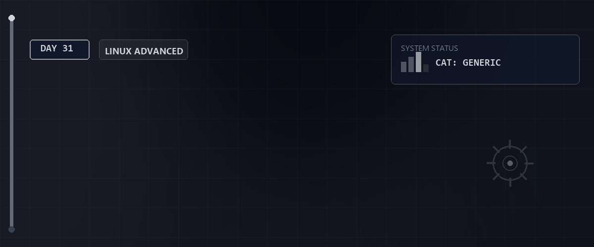

# ✉️ E-Mail-Server mit Postfix und Docker — Tag 31

> **Entwickler & Administrator:** Tobias Boyke  
> **Status:** 🚀 100% Dokumentiert & LPIC-1 Fokussiert  
> **Kompatibilität:**  

---

## 📑 Inhaltsverzeichnis
- [📖 Themenübersicht](#-themenübersicht)
- [🔑 Keywords](#-keywords)
- [🧠 LPIC-1 Relevanz & Wissenstest](#-lpic-1-relevanz--wissenstest)
- [🔗 Zurück zur Übersicht](#-zurück-zur-übersicht)

---

## 📖 Themenübersicht

An Tag 31 stand die Einrichtung und Konfiguration eines **Mail Transfer Agents (MTA)** mit **Postfix** im Fokus. In einem Multi-Host-Szenario auf Basis von Rocky Linux und Debian-Clients wurde die serverübergreifende Mail-Zustellung konfiguriert und das SMTP-Protokoll direkt über die CLI (Telnet/Netcat) verifiziert.

### 📝 1. Postfix-Konfiguration (`main.cf`)
Die zentrale Konfigurationsdatei von Postfix befindet sich unter `/etc/postfix/main.cf`. Die wichtigsten Parameter für ein funktionierendes Labornetzwerk:
* **`myhostname` / `mydomain`**: Definiert die Identität des Mailservers (z. B. `rocky1A.netzA.local`).
* **`inet_interfaces = all`**: Erlaubt Postfix das Lauschen auf allen Netzwerkschnittstellen (standardmäßig lauscht es oft nur auf `localhost`).
* **`mydestination`**: Bestimmt, für welche Domänen der Server eingehende E-Mails endgültig entgegennimmt.
* **`mynetworks`**: Regelt die Absendersicherheit und legt fest, welche IP-Subnetze (z. B. das lokale Netz A `172.16.7.0/24`) E-Mails über diesen Server relayen dürfen.

### 💡 2. Manuelle SMTP-Kommunikation zur Validierung
Um das Mail-Routing zu testen, kann eine SMTP-Session manuell per Telnet über Port 25 initiiert werden:
1. Verbindung öffnen: `telnet rocky2B.netzB.local 25`
2. Begrüßung: `EHLO rocky1A.netzA.local`
3. Absender festlegen: `MAIL FROM:<root@netzA.local>`
4. Empfänger festlegen: `RCPT TO:<root@netzB.local>`
5. E-Mail-Inhalt schreiben: `DATA` (beendet durch ein einzelnes `.` auf einer neuen Zeile)
6. Session beenden: `QUIT`

Der erfolgreiche Empfang wird auf dem Zielsystem durch Auslesen des lokalen Postfachs geprüft:  
`sudo tail -n 50 /var/mail/root`

---

## 🔑 Keywords

| Keyword / Befehl | Erklärung |
| :--- | :--- |
| `postfix` | Der am weitesten verbreitete, modulare Mail Transfer Agent (MTA) unter Linux. |
| `main.cf` | Hauptkonfigurationsdatei von Postfix für globale Einstellungen und Richtlinien. |
| `master.cf` | Definiert die Prozesse und Dienste, die von Postfix gestartet werden (z. B. smtpd, cleanup). |
| `mailq` / `postqueue -p` | Zeigt die aktuelle E-Mail-Warteschlange (Mail Queue) an. |
| `postsuper -d ALL` | Löscht alle E-Mails aus der Warteschlange. |
| `ss -tulpn | grep :25` | Überprüft, ob der SMTP-Daemon auf Port 25 lauscht. |
| `/var/mail/` | Standard-Verzeichnis zur Speicherung lokaler Benutzer-E-Mails (im Mbox-Format). |

---

## 🧠 LPIC-1 Relevanz & Wissenstest

<b>Fragen zu Postfix und SMTP (Klicken zum Ausklappen)</b>

1. **Welcher Parameter in der `/etc/postfix/main.cf` steuert, wer Mails über das Relay des Servers versenden darf?**
   

Antwort
Der Parameter `mynetworks` (z. B. `mynetworks = 127.0.0.0/8, 172.16.7.0/24`).

2. **Mit welchem Befehl lässt sich die Syntax der Postfix-Konfiguration auf Fehler überprüfen?**
   

Antwort
Mit dem Befehl `sudo postfix check`.

3. **Wie lautet der SMTP-Statuscode für eine erfolgreiche Verbindung nach dem Aufbau?**
   

Antwort
Code `220` (Server bereit).

4. **Welche SMTP-Kommandos leiten den Inhalt der E-Mail ein und senden sie ab?**
   

Antwort
`DATA` leitet den Inhalt ein, und ein einzelner Punkt `.` auf einer eigenen Zeile sendet die Mail ab.

5. **Wo landen standardmäßig E-Mails für den Benutzer `root` im lokalen Mailbox-Format?**
   

Antwort
In der Datei `/var/mail/root` (oder `/var/spool/mail/root`).

---

## 🔗 Zurück zur Übersicht

* **Tag 30 (LPIC-1 Simulation 102):** [⬅️ Tag 30](../Day_30/README.md)
* **Tag 32 (Linux Grundlagen & Regex-Training):** [➡️ Tag 32](../Day_32/README.md)
* **Master-Repository:** [🌌 Zurück zum Master-Repository](../README.md)

---
*Erstellt & gepflegt von Tobias Boyke, Juni 2026.*
