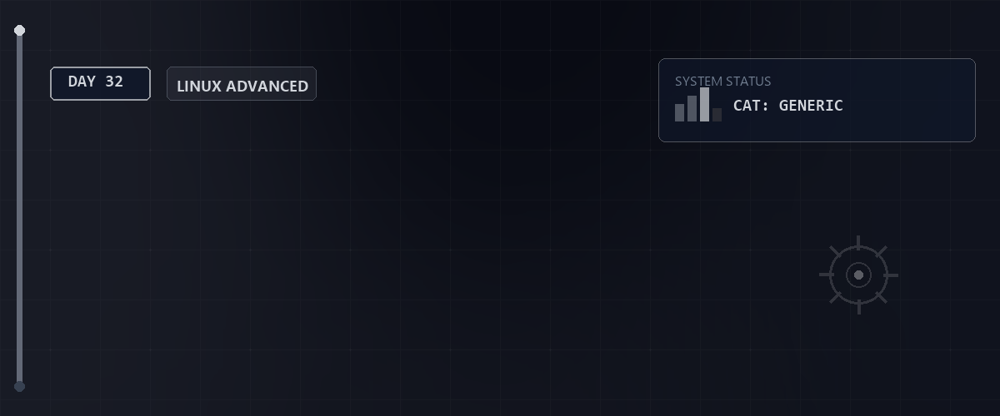

# 🧠 Linux Grundlagen, Rechte & Regex-Training — Tag 32

> **Entwickler & Administrator:** Tobias Boyke  
> **Status:** 🚀 100% Dokumentiert & LPIC-1 Fokussiert  
> **Kompatibilität:**  

---

## 📑 Inhaltsverzeichnis
- [📖 Themenübersicht](#-themenübersicht)
- [🔑 Keywords](#-keywords)
- [🧠 LPIC-1 Relevanz & Wissenstest](#-lpic-1-relevanz--wissenstest)
- [🔗 Zurück zur Übersicht](#-zurück-zur-übersicht)

---

## 📖 Themenübersicht

Tag 32 stand ganz im Zeichen des intensiven **Wissenstrainings** und der **Praxis-Validierung**. Anhand strukturierter Fragenkataloge wurden die Systemgrundlagen (Dateirechte, Prozesse, Cron/At, LVM-Storage) wiederholt und komplexe Aufgaben zur fortgeschrittenen Textstromanalyse mittels Regulärer Ausdrücke (Regex) gelöst.

### 📝 1. Systemadministration & Storage-Wiederholung
Der Tag deckte essenzielle Administrations-Fragen ab:
* **Hardware & Kernel:** Abfrage geladener Module (`lsmod`), Laden neuer Module (`modprobe`), Anzeigen von Blockgeräten (`lsblk`) und deren Partitionstabellen (`fdisk -l` / `parted -l`).
* **Benutzer & Sicherheit:** Rechteverwaltung (`chmod`, `chown`), Umask-Berechnungen sowie die Datei-Speicherorte für Benutzer (`/etc/passwd`), Kennwort-Hashes (`/etc/shadow`) und Gruppen (`/etc/group`).
* **LVM (Logical Volume Manager):** Die Schichtenarchitektur von Physical Volumes (PV), Volume Groups (VG) und Logical Volumes (LV) sowie die dynamische Vergrößerung.
* **NetworkManager:** Steuerung der Verbindungen und statischen Adressen mittels des modernen CLI-Tools `nmcli`.

### 💡 2. Reguläre Ausdrücke (Regex) in der Praxis
Es wurden gezielte Aufgaben zur Filterung von Systemdateien (z. B. `/etc/services`, `/etc/passwd`) und Schnittstellenausgaben gelöst:
* **IP-Adressen extrahieren:** Selektion von IPv4- und IPv6-Adressen aus Ausgaben von `ifconfig`, `ip addr` und `nmcli connection show` über reguläre Suchmuster.
* **Schnittstellennamen selektieren:** Filtern der aktiven Device-Namen aus Befehlsausgaben.
* **Filterung strukturierter Daten:** Extrahieren von Benutzern mit einer UID >= 1000 oder Gruppen mit einer GID >= 1000.
* **Port-Analysen aus `/etc/services`:** Port-Nummern basierend auf ihrer Stellenanzahl (z. B. exakt 3-stellige, 2- oder 5-stellige Ports) filtern, sortieren und statistisch nach Transportprotokollen (TCP/UDP) zählen.

---

## 🔑 Keywords

| Keyword / Befehl | Erklärung |
| :--- | :--- |
| `lsblk` | Listet alle Blockgeräte (Festplatten, Partitionen) übersichtlich in einer Baumstruktur auf. |
| `modprobe` | Lädt oder entfernt Kernel-Module intelligent inklusive aller Abhängigkeiten. |
| `fdisk` / `gparted` | Werkzeuge zur Partitionierung unter MBR (fdisk) oder GPT (parted/gparted). |
| `/etc/fstab` | Konfigurationsdatei für das statische, automatische Einhängen von Dateisystemen beim Booten. |
| `pvcreate` / `vgcreate` / `lvcreate` | LVM-Befehle zur Erstellung der physischen, Gruppen- und logischen Speicher-Layer. |
| `nmcli connection modify` | Konfiguration von Netzwerkschnittstellen (z. B. statische IP, Gateway und DNS). |
| `grep -E` (ERE) | Nutzt erweiterte reguläre Ausdrücke für präzises Pattern Matching (z. B. `[0-9]{3}/tcp`). |

---

## 🧠 LPIC-1 Relevanz & Wissenstest

<b>Fragen zu Systemgrundlagen & Regex-Praxis (Klicken zum Ausklappen)</b>

1. **Ab welcher Partitionsnummer beginnen logische Partitionen bei einer MBR-Partitionierung?**
   

Antwort
Logische Partitionen beginnen im MBR-Schema immer ab der Nummer **5** (die Nummern 1-4 sind für primäre oder die erweiterte Partition reserviert).

2. **Welcher Befehl zeigt alle offenen Dateien und die Prozesse, die sie nutzen, an?**
   

Antwort
Der Befehl `lsof` (List Open Files).

3. **Wie lautet der Befehl, um ein Logical Volume `lv_data` in der Volume Group `vg_system` um 10 Gigabyte zu vergrößern und das Dateisystem online anzupassen?**
   

Antwort
`lvextend -r -L +10G /dev/vg_system/lv_data` (die Option `-r` bzw. `--resizefs` vergrößert das darunterliegende Dateisystem automatisch mit).

4. **Mit welchem Regex-Pattern filtert man in der `/etc/services` Zeilen heraus, die exakt eine dreistellige Portnummer auf TCP enthalten?**
   

Antwort
Beispielsweise mit `grep -E '\b[0-9]{3}/tcp\b'` oder `grep -E '[[:space:]][0-9]{3}/tcp'` (unter Ausschluss von Kommentaren).

5. **Welche 6 Spalten enthält eine Standardzeile in der `/etc/fstab`?**
   

Antwort
1. Device/UUID, 2. Mountpoint, 3. Filesystem-Typ, 4. Mount-Optionen, 5. Dump-Option (Backup), 6. Pass-Option (Dateisystemprüfung beim Booten).

---

## 🔗 Zurück zur Übersicht

* **Tag 31 (E-Mail-Server & Postfix):** [⬅️ Tag 31](../Day_31/README.md)
* **Tag 33 (DNS & BIND-Konfiguration):** [➡️ Tag 33](../Day_33/README.md)
* **Master-Repository:** [🌌 Zurück zum Master-Repository](../README.md)

---
*Erstellt & gepflegt von Tobias Boyke, Juni 2026.*
