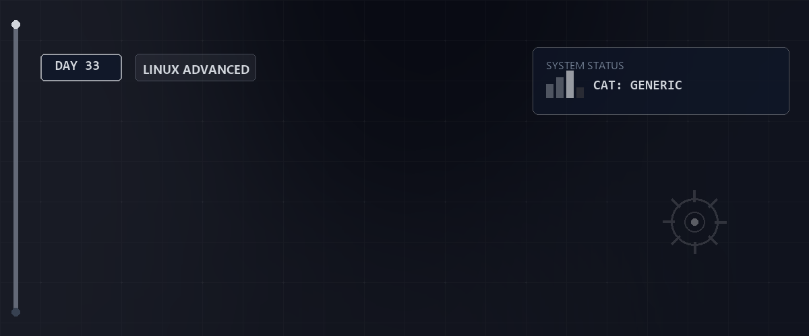

# 🌐 DNS-Infrastruktur mit BIND — Tag 33



> **Entwickler & Administrator:** Tobias Boyke  
> **Status:** 🚀 100% Dokumentiert & LPIC-1 Fokussiert  
> **Kompatibilität:**  

---

## 📑 Inhaltsverzeichnis
- [📖 Themenübersicht](#-themenübersicht)
- [🛠️ Schritt-für-Schritt-Anleitung](#️-schritt-für-schritt-anleitung)
  - [Schritt 1: Installation & Basis-Konfiguration](#schritt-1-installation--basis-konfiguration)
  - [Schritt 2: Forward-Zone erstellen](#schritt-2-forward-zone-erstellen)
  - [Schritt 3: Reverse-Zone erstellen](#schritt-3-reverse-zone-erstellen)
  - [Schritt 4: Rechte, Syntax-Validierung & Dienststart](#schritt-4-rechte-syntax-validierung--dienststart)
  - [Schritt 5: Firewall & Routing-Sicherung](#schritt-5-firewall--routing-sicherung)
  - [Schritt 6: DNS-Konfiguration auf den Clients umstellen](#schritt-6-dns-konfiguration-auf-den-clients-umstellen)
  - [Schritt 7: Diagnostics & Funktionstest](#schritt-7-diagnostics--funktionstest)
- [🔑 Keywords](#-keywords)
- [🧠 LPIC-1 Relevanz & Wissenstest](#-lpic-1-relevanz--wissenstest)
- [🔗 Zurück zur Übersicht](#-zurück-zur-übersicht)

---

## 📖 Themenübersicht

An Tag 33 wurde der Rocky Linux Router `srv-rocky` (IPs: `172.16.7.33` / `172.16.7.97`) als zentraler, autoritativer und caching **DNS-Server** für das gesamte Labornetzwerk mithilfe des Industriestandards **BIND (named)** implementiert.

Die Domänen-Struktur wurde wie folgt aufgeteilt, um Netz-Überschneidungen zu verhindern und Best Practices zu wahren:
* **Domäne:** `tobias.lan`
* **Subdomain Netz A (`netz1.tobias.lan`):** Labornetz-Bereich `172.16.7.32/27` (Hosts: `srv-deb-01`, `ws-cachy`)
* **Subdomain Netz B (`netz2.tobias.lan`):** Labornetz-Bereich `172.16.7.96/27` (Hosts: `srv-deb-02`, `ws-manjaro`)

Zusätzlich wurden informative **TXT-Records** integriert, um Rollen (z. B. Swarm-Knoten, Gateways) und Metadaten (wie SPF für E-Mail-Sicherheit) direkt in der DNS-Zone bereitzustellen.

---

## 🛠️ Schritt-für-Schritt-Anleitung

### Schritt 1: Installation & Basis-Konfiguration
Führe die Installation direkt auf dem Rocky Linux Router `srv-rocky` aus:
```bash
# BIND und DNS-Utilities installieren
sudo dnf install -y bind bind-utils
```

Bearbeite die Datei `/etc/named.conf` und passe den `options`-Block sowie die Zonen-Integrationen an:
```plaintext
options {
    // Auf allen IPv4-Schnittstellen lauschen
    listen-on port 53 { any; };
    listen-on-v6 port 53 { none; };
    directory       "/var/named";
    dump-file       "/var/named/data/cache_dump.db";
    statistics-file "/var/named/data/named_stats.txt";
    memstatistics-file "/var/named/data/named_mem_stats.txt";
    secroots-file   "/var/named/data/named.secroots";
    recursing-file  "/var/named/data/named.recursing";

    // Abfragen nur aus Localhost sowie Netz A und Netz B zulassen
    allow-query     { localhost; 172.16.7.32/27; 172.16.7.96/27; };

    // Rekursion für externe Namensauflösung aktivieren
    recursion yes;

    // Weiterleitung nicht-lokaler Anfragen an das externe Gateway
    forwarders {
        172.21.0.9;
    };

    dnssec-validation yes;
    managed-keys-directory "/var/named/dynamic";
    geoip-directory "/usr/share/GeoIP";
    pid-file "/run/named/named.pid";
    session-keyfile "/run/named/session.key";

    include "/etc/crypto-policies/back-ends/bind.config";
};

logging {
        channel default_debug {
                file "data/named.run";
                severity dynamic;
        };
};

zone "." IN {
        type hint;
        file "named.ca";
};

// Definition der Forward-Zone
zone "tobias.lan" IN {
        type master;
        file "zones/db.tobias.lan";
        allow-update { none; };
};

// Definition der Reverse-Zone
zone "7.16.172.in-addr.arpa" IN {
        type master;
        file "zones/db.172.16.7";
        allow-update { none; };
};

include "/etc/named.rfc1912.zones";
include "/etc/named.root.key";
```

### Schritt 2: Forward-Zone erstellen
Erstelle das Zonen-Verzeichnis und definiere die Hostauflösung sowie die TXT-Metadaten in `/var/named/zones/db.tobias.lan`:
```bash
sudo mkdir -p /var/named/zones
sudo nano /var/named/zones/db.tobias.lan
```

Inhalt der Datei:
```plaintext
$TTL    86400
@       IN      SOA     srv-rocky.tobias.lan. root.tobias.lan. (
                              2026062402        ; Serial (JJJJMMDDRR)
                                  604800        ; Refresh
                                   86400        ; Retry
                                 2419200        ; Expire
                                   86400 )      ; Negative Cache TTL
;
; Name Server Definition
@       IN      NS      srv-rocky.tobias.lan.
srv-rocky    IN      A       172.16.7.33

; --- Globale Domänen-TXT-Einträge ---
@       IN      TXT     "v=spf1 ip4:172.16.7.33 ip4:172.16.7.97 -all"
@       IN      TXT     "owner=Tobias Boyke"
@       IN      TXT     "description=Tobias BitLC Lab Network"

; --- Netz A (Subdomain: netz1.tobias.lan / Bereich 172.16.7.32/27) ---
srv-deb-01.netz1.tobias.lan.   IN      A       172.16.7.42
srv-deb-01.netz1.tobias.lan.   IN      TXT     "role=Docker-Swarm-Manager; app=TicketsPlease-Web"

ws-cachy.netz1.tobias.lan.     IN      A       172.16.7.47
ws-cachy.netz1.tobias.lan.     IN      TXT     "os=CachyOS; role=Developer-Workstation"

; --- Netz B (Subdomain: netz2.tobias.lan / Bereich 172.16.7.96/27) ---
srv-deb-02.netz2.tobias.lan.   IN      A       172.16.7.111
srv-deb-02.netz2.tobias.lan.   IN      TXT     "role=Docker-Swarm-Worker; app=TicketsPlease-Web-Replica"

ws-manjaro.netz2.tobias.lan.   IN      A       172.16.7.106
ws-manjaro.netz2.tobias.lan.   IN      TXT     "os=Manjaro; role=Testing-Client"

; --- Infrastruktur-TXT-Einträge ---
srv-rocky.tobias.lan.          IN      TXT     "role=Central-Router-Gateway"
```

### Schritt 3: Reverse-Zone erstellen
Erstelle die Datei `/var/named/zones/db.172.16.7` zur Übersetzung von IP-Adressen in Hostnamen:
```bash
sudo nano /var/named/zones/db.172.16.7
```

Inhalt der Datei:
```plaintext
$TTL    86400
@       IN      SOA     srv-rocky.tobias.lan. root.tobias.lan. (
                              2026062401        ; Serial
                                  604800        ; Refresh
                                   86400        ; Retry
                                 2419200        ; Expire
                                   86400 )      ; Negative Cache TTL

@       IN      NS      srv-rocky.tobias.lan.

; --- Router / Gateways ---
33      IN      PTR     srv-rocky.tobias.lan.
97      IN      PTR     srv-rocky.tobias.lan.

; --- Netz A ---
42      IN      PTR     srv-deb-01.netz1.tobias.lan.
47      IN      PTR     ws-cachy.netz1.tobias.lan.

; --- Netz B ---
111     IN      PTR     srv-deb-02.netz2.tobias.lan.
106     IN      PTR     ws-manjaro.netz2.tobias.lan.
```

### Schritt 4: Rechte, Syntax-Validierung & Dienststart
Stelle sicher, dass der BIND-Benutzer (`named`) die Zonendateien lesen darf, validiere das Regelwerk und starte den Daemon:
```bash
# Besitzerrechte auf den System-User named übertragen
sudo chown -R named:named /var/named/zones

# 1. Hauptkonfiguration prüfen
sudo named-checkconf /etc/named.conf

# 2. Forward-Zonendatei prüfen
sudo named-checkzone tobias.lan /var/named/zones/db.tobias.lan

# 3. Reverse-Zonendatei prüfen
sudo named-checkzone 7.16.172.in-addr.arpa /var/named/zones/db.172.16.7

# BIND-Dienst aktivieren und starten
sudo systemctl enable --now named
```

### Schritt 5: Firewall & Routing-Sicherung
Auf RHEL-basierten Systemen blockiert `firewalld` in der Standard-Zone `public` DNS-Anfragen, die über andere interne Schnittstellen geroutet werden. Weise die Interfaces der internen Zone zu und schalte den Dienst frei:
```bash
# Interfaces ens161 (Netz A) und ens256 (Netz B) der internen Zone zuweisen
sudo firewall-cmd --zone=internal --add-interface=ens161 --permanent
sudo firewall-cmd --zone=internal --add-interface=ens256 --permanent

# DNS in der internen Zone dauerhaft erlauben
sudo firewall-cmd --zone=internal --add-service=dns --permanent

# Firewall-Konfiguration neu laden
sudo firewall-cmd --reload
```

### Schritt 6: DNS-Konfiguration auf den Clients umstellen
Führe auf den jeweiligen Linux-Clients (z. B. `srv-debian-02` im Netz B) die folgenden NetworkManager-Befehle aus, um den Router als DNS-Server einzutragen:
```bash
# 1. Verbindungsauswahl anzeigen, um den Schnittstellennamen (NAME) zu ermitteln
sudo nmcli connection show

# 2. DNS-Server auf das zuständige Router-Interface setzen (für Netz B: 172.16.7.97)
sudo nmcli connection modify "<NAME>" ipv4.dns "172.16.7.97"
sudo nmcli connection modify "<NAME>" ipv4.dns-search "tobias.lan"

# 3. Zuweisung fremder DNS-Server über DHCP unterdrücken
sudo nmcli connection modify "<NAME>" ipv4.ignore-auto-dns yes

# 4. Verbindung neu laden
sudo nmcli connection up "<NAME>"
```

### Schritt 7: Diagnostics & Funktionstest
Überprüfe auf den Clients die korrekte Funktion der Namensauflösung:
```bash
# 1. resolv.conf kontrollieren
cat /etc/resolv.conf
# Ausgabe sollte zeigen: nameserver 172.16.7.97 und search tobias.lan

# 2. Lokalen Hostnamen auswerten (Forward Lookup)
dig srv-deb-01.netz1.tobias.lan
# Ausgabe muss status: NOERROR und flag "aa" (Authoritative Answer) enthalten

# 3. TXT-Eintrag (Rolle) abfragen
dig srv-deb-01.netz1.tobias.lan TXT

# 4. Reverse Lookup testen
dig -x 172.16.7.42
# Ausgabe muss den PTR-Record srv-deb-01.netz1.tobias.lan zurückliefern

# 5. Externen DNS-Forwarder testen
dig google.de
```

---

## 🔑 Keywords

| Keyword / Befehl | Erklärung |
| :--- | :--- |
| `bind` / `named` | Berkeley Internet Name Domain, der Standard-DNS-Server-Dienst unter Linux/Unix. |
| `A-Record` | Address Record: Weist einem Hostnamen eine IPv4-Adresse zu. |
| `PTR-Record` | Pointer Record: Verweist in einer Reverse-Zone von einer IP-Adresse auf einen Hostnamen. |
| `SOA-Record` | Start of Authority: Enthält administrative Metadaten der DNS-Zone (z. B. Seriennummer, TTLs). |
| `TXT-Record` | Text Record: Ermöglicht das Hinterlegen frei definierbarer Textinformationen (z. B. SPF für E-Mail-Sicherheit). |
| `named-checkconf` | Validierungswerkzeug zur Überprüfung der Syntax von `/etc/named.conf`. |
| `named-checkzone` | Prüft die Syntax und Konsistenz einer spezifischen Zonendatei (z. B. `db.tobias.lan`). |
| `dig` / `nslookup` | Kommandozeilenwerkzeuge zur Durchführung manueller DNS-Abfragen. |

---

## 🧠 LPIC-1 Relevanz & Wissenstest

<details>
<summary><b>Fragen zu DNS-Konfiguration und Troubleshooting (Klicken zum Ausklappen)</b></summary>

1. **In welcher Datei wird auf einem Linux-Client der zu befragende DNS-Server eingetragen?**
   <details><summary>Antwort</summary>In der Datei `/etc/resolv.conf` (z. B. über den Eintrag `nameserver 172.16.7.33`).</details>

2. **Warum sollte bei einer Zonen-Aktualisierung die Seriennummer (Serial) im SOA-Record erhöht werden?**
   <details><summary>Antwort</summary>Damit Secondary-DNS-Server erkennen, dass sich die Zone geändert hat, und einen Zonentransfer (AXFR/IXFR) initiieren.</details>

3. **Welcher Befehl überprüft die Syntax der Zonendatei `db.tobias.lan` für die Domäne `tobias.lan`?**
   <details><summary>Antwort</summary>`named-checkzone tobias.lan /var/named/zones/db.tobias.lan`</details>

4. **Wie fragt man mit dem Befehl `dig` gezielt einen bestimmten Nameserver (z. B. `172.16.7.33`) ab?**
   <details><summary>Antwort</summary>Durch Voranstellen des `@`-Zeichens vor die Server-IP: `dig @172.16.7.33 srv-deb-01.netz1.tobias.lan`</details>

5. **Welche Option im options-Block der `named.conf` leitet ungelöste DNS-Anfragen an andere DNS-Server weiter?**
   <details><summary>Antwort</summary>Die Option `forwarders { [IP-Adresse]; };` in Kombination mit `recursion yes;`.</details>

</details>

---

## 🔗 Zurück zur Übersicht

* **Tag 32 (Linux Grundlagen & Regex-Training):** [⬅️ Tag 32](../Day_32/README.md)
* **Master-Repository:** [🌌 Zurück zum Master-Repository](../README.md)

---
*Erstellt & gepflegt von Tobias Boyke, Juni 2026.*
