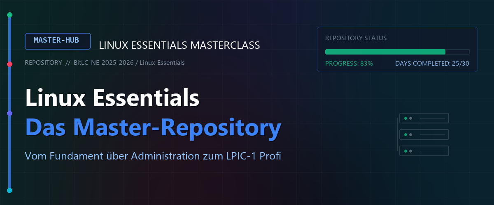
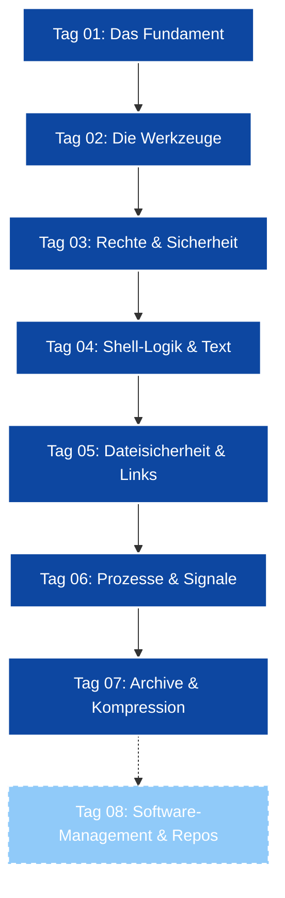

# 🌌 Linux Essentials - Das Master-Repository

Willkommen im zentralen Hub für die Linux-Essentials-Serie. Dieses Repository dient als strukturierte Wissensbasis und Kursbegleiter für den Weg zum Linux-Profi.

---

## 🗺 Kurs-Roadmap & Lernpfad

---

## 📂 Kursmodule (ToC)

Hier findest du die detaillierten Unterlagen zu den einzelnen Schulungstagen:

### 📅 Woche 1: Grundlagen

| Modul | Status | Fokus-Themen | Link |
| :--- | :---: | :--- | :--- |
| **Tag 01** | ✅ | Shell-Einführung, FHS, Historie | [📖 README](./Day_01/readme.md) |
| **Tag 02** | ✅ | Hilfe-Systeme, Hardware, Fortg. Datei-OPs | [📖 README](./Day_02/README.md) |
| **Tag 03** | ✅ | CUPS, Shell-Konfig, Aliases, Redirects | [📖 README](./Day_03/README.md) |
| **Tag 04** | ✅ | Wildcards, Text-Tools (tr, cut), Logik | [📖 README](./Day_04/README.md) |
| **Tag 05** | ✅ | Rechte (chmod), Links, umask, Shell-History | [📖 README](./Day_05/README.md) |

### 📅 Woche 2: Administration

| Modul | Status | Fokus-Themen | Link |
| :--- | :---: | :--- | :--- |
| **Tag 06** | ✅ | Administration, Prozesse, Spezialrechte | [📖 README](./Day_06/README.md) |
| **Tag 07** | ✅ | Archive (tar), Kompression, Meson Compile | [📖 README](./Day_07/README.md) |
| **Tag 08** | ✅ | Shell Scripting & Automatisierung | [📖 README](./Day_08/README.md) |
| **Tag 09** | ✅ | Reguläre Ausdrücke (Regex) I - BRE vs. ERE, IPv4/IPv6, TUI-Automatisierung | [📖 README](./Day_09/README.md) |
| **Tag 10** | ✅ | Reguläre Ausdrücke (Regex) II - Dienste-Auswertung & Bash-Loops | [📖 README](./Day_10/README.md) |

### 📅 Woche 3: Speicher & Dateisysteme

| Modul | Status | Fokus-Themen | Link |
| :--- | :---: | :--- | :--- |
| **Tag 11** | ✅ | Text-Editoren (vi / vim) - Modi, Navigation & Last-Line-Befehle | [📖 README](./Day_11/README.md) |
| **Tag 12** | ✅ | Zeitgesteuerte Ausführung (cron, crontab, wall, at) | [📖 README](./Day_12/README.md) |
| **Tag 13** | ✅ | Fortg. Shell Scripting (Massen-User, Whiptail TUI) | [📖 README](./Day_13/README.md) |
| **Tag 14** | ✅ | LPIC-1 Leistungsabfrage & Multi-OS VM Setups | [📖 README](./Day_14/README.md) |
| **Tag 15** | ✅ | Netzwerk-Grundlagen (IP-Adressierung, Subnetze & VLANs) | [📖 README](./Day_15/README.md) |

### 📅 Woche 4-6: Fortgeschrittene Themen (WIP)

| Modul | Status | Fokus-Themen | Link |
| :--- | :---: | :--- | :--- |
| **Tag 16** | ✅ | Netzwerk-Routing & Forwarding (VMware, nftables, NAT) | [📖 README](./Day_16/README.md) |
| **Tag 17** | ✅ | Netzwerk-Routing & NTP-Zeitsynchronisation (chrony, timedatectl) | [📖 README](./Day_17/README.md) |
| **Tag 18** | ✅ | System-Hardware & Kernel-Module (lspci, lsblk, modprobe, lsof) | [📖 README](./Day_18/README.md) |
| **Tag 19** | ✅ | Partitionierung (MBR/GPT), Dateisysteme (mkfs) & Mounten | [📖 README](./Day_19/README.md) |
| **Tag 20** | ✅ | LVM (Logical Volume Manager) - PV, VG, LV & Resizing | [📖 README](./Day_20/README.md) |
| **Tag 21** | ✅ | Kryptographie, SSH (Keys/Agent) & Rsync über SSH | [📖 README](./Day_21/README.md) |
| **Tag 22** | ✅ | SSH-Agent, ProxyJump & Rsync-Synchronisation (lsyncd/inotify) | [📖 README](./Day_22/README.md) |
| **Tag 23** | ✅ | Paketverwaltung (dpkg, apt, rpm, dnf) & VM-Gast-Erkennung | [📖 README](./Day_23/README.md) |
| **Tag 24** | ✅ | System-Logging (Rsyslog, Journald), Logrotate & LPI/Pearson VUE | [📖 README](./Day_24/README.md) |
| **Tag 25** | ✅ | Boot-Prozess (BIOS/UEFI, GRUB2) & Docker-Container-Virtualisierung | [📖 README](./Day_25/README.md) |
| **Tag 26** | ✅ | Container-Grundlagen (Docker, Containerd & Kubernetes) | [📖 README](./Day_26/README.md) |
| **Tag 27 - 30** | ⏳ | In Planung | [📖 README](./Day_27/README.md) |

---

## 🧠 Zentrale Wissensbasis (Reference)

Hier sind die essenziellen Informationen zusammengefasst, die über alle Kurstage hinweg relevant sind.

<b>📜 Distributionen & Architektur</b> (Klicken zum Ausklappen)

### Linux Hauptfamilien

| Familie | Fokus | Paketmanager | Vertreter | Hauptmerkmale |
| :--- | :--- | :--- | :--- | :--- |
| **Debian** | Stabilität & Community | APT / dpkg | Ubuntu, Mint, Kali | Enormer Paketpool, Basis für benutzerfreundliche Derivate. |
| **Red Hat** | Enterprise | DNF / rpm | RHEL, **Rocky Linux**, Fedora | Industriestandard, Fokus auf Serverstabilität & 10 Jahre Support. |
| **Arch** | Minimalismus (KISS) | Pacman | Manjaro, EndeavourOS | Rolling-Release (stets aktuell), manuelle Installation. |
| **SUSE** | Business & Enterprise | Zypper / rpm | openSUSE, SLE | Starke administrative Kontrollwerkzeuge (YaST). |

### Release- und Kernelmodelle

* **LTS (Long Term Support):** Fokus auf Langzeitstabilität. Pakete bleiben versionsstabil, Sicherheitsfixes werden zurückportiert (Backporting).
* **RR (Rolling Release):** Kontinuierliche Updates. Software wird sofort nach Erscheinen bereitgestellt. Höheres Risiko für Inkompatibilitäten.
* **Monolithischer Kernel:** Linux ist monolithisch: Treiber und Kernelfunktionen laufen im privilegierten Kernel-Adressraum für maximale Geschwindigkeit. Module (`.ko` - Kernel Objects) können jedoch dynamisch geladen und entladen werden (`modprobe`).

> [!NOTE]  
> **Rocky Linux** wurde von Gregory Kurtzer ins Leben gerufen, nachdem das klassische, stabile CentOS zugunsten von CentOS Stream eingestellt wurde. Es garantiert eine 1:1-Binärkompatibilität mit Red Hat Enterprise Linux (RHEL).

<b>🏗 Filesystem Hierarchy Standard (FHS)</b> (Klicken zum Ausklappen)

Das Linux-Verzeichnissystem folgt einem strikten Standard (FHS). Jedes Verzeichnis hat einen fest definierten Zweck:

| Verzeichnis | Inhalt und Funktion |
| :--- | :--- |
| `/` | **Wurzelverzeichnis (Root).** Die höchste Ebene, unter der alle anderen Verzeichnisse eingehängt sind. |
| `/bin` / `/sbin` | **Essenzielle Binärdateien.** Systembefehle für alle User (`/bin`) bzw. administrative Befehle für root (`/sbin`). |
| `/boot` | **Bootloader-Dateien.** Enthält den Linux-Kernel (`vmlinuz`), die Initial RAM Disk (`initramfs`) und GRUB-Konfigurationen. |
| `/dev` | **Gerätedateien.** Repräsentiert physikalische und virtuelle Hardware (z.B. `/dev/sda` = 1. Festplatte, `/dev/null` = Bit-Loch). |
| `/etc` | **Systemweite Konfigurationsdateien.** Statische Textdateien zur Systemsteuerung (z.B. `/etc/passwd`, `/etc/hosts`). Keine Binärdateien! |
| `/home` | **Benutzerverzeichnisse.** Persönliche Daten der normalen Systembenutzer (z.B. `/home/student`). |
| `/root` | **Home-Verzeichnis des Administrators.** Persönliches Heimatverzeichnis exklusiv für den Superuser `root`. |
| `/lib` / `/lib64` | **Systembibliotheken.** Essenzielle Shared Libraries (`.so`-Dateien) und Kernel-Module, die von `/bin` und `/sbin` benötigt werden. |
| `/media` / `/mnt` | **Einhängepunkte (Mounts).** `/media` für automatische Wechselmedien (USB, CD); `/mnt` für temporäre manuelle Mounts. |
| `/opt` | **Zusatzsoftware.** Für große, in sich geschlossene Anwendungspakete von Drittanbietern. |
| `/proc` / `/sys` | **Virtuelle Dateisysteme (procfs & sysfs).** Liegen rein im RAM. Schnittstelle zum Kernel und zur Hardware. |
| `/tmp` | **Temporäre Dateien.** Wird periodisch (oder bei jedem Systemstart) automatisch gelöscht. |
| `/usr` | **Anwenderprogramme.** Sekundäre Hierarchie für schreibgeschützte Benutzerdaten (`/usr/bin`, `/usr/lib`). |
| `/usr/local` | **Lokale Installationen.** Software, die manuell am Paketmanager vorbei installiert wurde (Schutz vor Überschreiben). |
| `/var` | **Variable Systemdaten.** Daten, die sich im laufenden Betrieb ständig ändern (Logfiles in `/var/log`, Druckspooler, Caches). |

> [!IMPORTANT]  
> **LPIC-1 FHS-PRÜFUNGSWISSEN:**  
> * `/proc` und `/sys` belegen **0 Byte** auf der Festplatte! Sie sind reine RAM-Dateisysteme.  
> * Das Verzeichnis `/etc` darf **niemals** ausführbare Programme (Binaries) enthalten.  
> * Um ein Überlaufen der Festplatte durch massive Logfiles zu verhindern, sollte `/var` in Produktivumgebungen auf einer separaten Partition liegen.

> [!CAUTION]  
> Da das Verzeichnis `/tmp` bei jedem Neustart gelöscht wird, sollten dort niemals Skripte oder Protokolle dauerhaft abgelegt werden. Nutzen Sie dafür `/var/tmp` oder Ihr Home-Verzeichnis!

<b>🛡 Dateirechte, Besitz & Spezialrechte</b> (Klicken zum Ausklappen)

Linux schützt Dateien über das klassische Benutzer-Gruppen-Andere-Modell (UGO).

### Zugriffsrechte (chmod)
Rechte können **symbolisch** (z.B. `chmod u+x,g-w datei`) oder **oktal** (numerisch) gesetzt werden:
* **`r` (Read = 4):** Lesen der Datei / Auflisten des Ordners.
* **`w` (Write = 2):** Ändern der Datei / Erstellen & Löschen von Dateien im Ordner.
* **`x` (Execute = 1):** Ausführen der Datei / Betreten des Ordners (`cd`).

**Spezialberechtigungen (Numerisch als 4. vordere Stelle):**
* **`4` (SUID - Set User ID):** Führt die Datei mit Rechten des Dateibesitzers aus. Symbolisch: `rwsr-xr-x`.
* **`2` (SGID - Set Group ID):** Führt die Datei mit Rechten der Gruppe aus. Verzeichnisse vererben ihre Gruppe an neue Dateien. Symbolisch: `rwxr-sr-x`.
* **`1` (Sticky Bit):** Benutzer dürfen nur eigene Dateien löschen. Symbolisch: `rwxrwxrwt` (z.B. für `/tmp`).

### umask (User Mask)
Zieht Berechtigungen bei der Dateierstellung ab. Maximale Standard-Ausgangsbasis: **`666`** für Dateien, **`777`** für Ordner.
* Eine `umask` von `022` führt zu Dateirechten von `644` (`rw-r--r--`) und Ordnerrechten von `755` (`rwxr-xr-x`).
* Anzeige im symbolischen Klartext mit **`umask -S`**.

### Hardlinks vs. Softlinks
* **Hardlink (`ln ziel link`):** Verweist direkt auf die Inode-Nummer der Originaldatei. Kann nicht dateisystemübergreifend erstellt werden und ist für Verzeichnisse verboten.
* **Softlink (`ln -s ziel link`):** Ein Zeiger (Pfad-Referenz) auf das Original. Kann über Partitionen hinweg zeigen und funktioniert für Ordner. Wird beim Löschen des Originals ungültig (Broken Link).

> [!IMPORTANT]  
> **LPIC-1 RELEVANTE SYMBOLIK:**  
> Ein großes **`S`** (bei SUID/SGID) oder großes **`T`** (beim Sticky Bit) in `ls -l` signalisiert, dass das jeweilige Spezialrecht zwar gesetzt ist, das darunterliegende Standard-Ausführrecht **`x` jedoch fehlt**! (z.B. `rwS` statt `rws`).

<b>🤖 Virtualisierung, Container & Netzwerke</b> (Klicken zum Ausklappen)

### Hypervisoren und Container
* **Typ 1 Hypervisor (Bare-Metal):** Läuft direkt auf der physischen Hardware (z.B. Proxmox VE, VMware ESXi). Extrem performant.
* **Typ 2 Hypervisor (Hosted):** Läuft innerhalb eines Wirts-Betriebssystems (z.B. VMware Workstation, VirtualBox).
* **Container (OS-Level Virtualization):** Nutzen Namespaces und Control Groups (cgroups) des Host-Kernels zur Isolation. Es wird kein eigener Kernel gebootet, was Container extrem leichtgewichtig macht (z.B. Docker, Podman).

### Netzwerk & Routing-Grundlagen
* **IP Forwarding:** Erlaubt dem Linux-Kernel, eingehende Pakete an andere Schnittstellen weiterzuleiten (`net.ipv4.ip_forward = 1`).
* **NAT / Masquerading:** Übersetzt private IP-Adressen (z.B. `/27` Subnetze) auf dem WAN-Interface in die öffentliche Router-IP, damit Antworten zurückgeroutet werden können.
* **DNS Resolution:** Gesteuert durch `/etc/resolv.conf` (Nameserver) und `/etc/nsswitch.conf` (Reihenfolge-Steuerung).

> [!TIP]  
> Container teilen sich den Kernel des Wirtssystems. Daher können Sie in einem Linux-Container keine Kernel-Module laden, die nicht bereits auf dem Host-System aktiv sind!

---

## 🛠 Schnellzugriff: Wichtige Befehle

> [!TIP]
> Drücke `Strg + F` in dieser README, um schnell nach Befehlen zu suchen.

### 📂 1. Navigation & Dateiverwaltung
* **`pwd`** (Print Working Directory): Zeigt den absoluten Pfad des aktuellen Standorts an.
* **`ls`** (List): Listet Verzeichnisinhalte auf.
  * `ls -l` = Listenansicht mit Berechtigungen, Inode-Links und Größe.
  * `ls -la` = Zeigt auch versteckte Dateien (Dotfiles) an.
  * `ls -ih` = Zeigt die Inode-Nummern und Dateigrößen in lesbarer Form (`h` = human-readable).
* **`cd`** (Change Directory): Wechselt das Verzeichnis. `cd ~` wechselt ins Home-Verzeichnis, `cd ..` eine Ebene nach oben.
* **`mkdir -p <Pfad>`**: Erstellt verschachtelte Verzeichnisbäume in einem Schritt (z.B. `mkdir -p A/B/C`).
* **`cp`** (Copy): Kopiert Dateien.
  * `cp -r` = Kopiert Verzeichnisse rekursiv.
  * `cp -a` (Archive) = **Sehr wichtig!** Entspricht `-dpR` (kopiert rekursiv unter Erhalt aller Rechte, Besitzer, Zeitstempel und symbolischen Links).
* **`rm`** (Remove): Löscht Dateien.
  * `rm -r` = Löscht Verzeichnisse rekursiv.
  * `rm -f` (Force) = Löscht ohne Sicherheitsnachfragen.
  * `rm -rf` = Rekursives Löschen ohne Nachfrage. **Mit Vorsicht anwenden!**
* **`ln`** (Link): Erstellt Verknüpfungen.
  * `ln ziel link` = Erstellt einen Hardlink (zeigt auf dieselbe Inode).
  * `ln -s ziel link` = Erstellt einen symbolischen Softlink (Symlink).
* **`stat <Datei>`**: Zeigt alle detaillierten Metadaten einer Datei (Inode, genaue Zeitstempel, Oktalrechte).
* **`file <Datei>`**: Analysiert die Magic-Bytes einer Datei und gibt den echten Dateityp unabhängig von der Endung an.

### 🔍 2. Suchen & Textfilterung
* **`find <Pfad> <Filter> -exec <Befehl> {} \;`**: Findet Dateien auf der Festplatte.
  * `find . -name "*.txt"` = Sucht nach Name.
  * `find / -type d` = Sucht nur nach Verzeichnissen.
  * `find / -perm 4755` = Sucht nach Dateien mit gesetztem SUID-Bit.
  * `find /home -user student -exec chown teacher {} \;` = Führt Aktionen direkt aus.
* **`grep -E <Muster> <Datei>`**: Durchsucht Textströme.
  * `grep -i` = Ignoriert Groß-/Kleinschreibung.
  * `grep -v` = Invertiert die Suche (zeigt Zeilen an, die das Muster **nicht** enthalten).
  * `grep -o` = Gibt ausschließlich den gematchten Textteil aus, nicht die ganze Zeile.
  * `grep -E` (oder `egrep`) = Nutzt Extended Regular Expressions (ERE).
  * `grep -F` (oder `fgrep`) = Sucht nach fixen Strings (deaktiviert alle Regex-Metazeichen für maximales Tempo).
* **`tr`** (Translate): Ersetzt oder löscht Zeichen aus der Standardeingabe (`stdin`).
  * `tr -d 'äöü'` = Löscht Zeichen.
  * `tr -s '-'` = Komprimiert mehrfache Bindestriche zu einem einzigen.
* **`cut`** (Spalten schneiden): Extrahiert Spalten aus Texten.
  * `cut -d: -f1,3 /etc/passwd` = Nutzt Doppelpunkt als Trenner (`-d`) und gibt Spalte 1 und 3 aus (`-f`).
* **`sort`**: Sortiert Textzeilen.
  * `sort -n` = Sortiert numerisch (z.B. für Ports/ Zahlen).
  * `sort -r` = Sortiert rückwärts (reverse).
  * `sort -t: -k3` = Definiert Doppelpunkt als Trenner (`-t`) und sortiert nach der 3. Spalte (`-k`).
* **`uniq`**: Filtert aufeinanderfolgende doppelte Zeilen heraus.
  > [!CAUTION]  
  > `uniq` erkennt Duplikate nur, wenn sie direkt nacheinander stehen! Daten müssen **immer** vorher mit `sort` sortiert werden: `sort datei.txt | uniq`.
* **`tail -f <Datei>`**: Gibt die letzten Zeilen einer Datei aus. Mit `-f` (Follow) bleibt die Datei geöffnet und gibt neue Log-Einträge in Echtzeit aus.

### 🚦 3. Prozessverwaltung & Signale
* **`ps`** (Process Status): Zeigt eine Momentaufnahme aller Prozesse.
  * `ps aux` (BSD-Stil) = Zeigt alle Prozesse im System mit CPU- und RAM-Last sowie Status (`STAT`).
  * `ps -ef` (System-V-Stil) = Zeigt alle Prozesse inklusive der Parent-PID (`PPID`) an.
* **`pstree -p`**: Zeigt die Prozess-Hierarchie als Baumstruktur inklusive PIDs an.
* **`kill -<Signal> <PID>`**: Sendet ein Signal an eine Prozess-ID.
  * `kill -15` (SIGTERM) = Standard. Höfliche Aufforderung zum Beenden (erlaubt Aufräumen).
  * `kill -9` (SIGKILL) = Erzwingt das sofortige Beenden durch den Kernel. Kann nicht abgefangen werden.
  * `kill -19` (SIGSTOP) = Pausiert den Prozess sofort.
  * `kill -18` (SIGCONT) = Setzt den pausierten Prozess fort.
* **`pgrep <Name>`** / **`pkill <Name>`**: Sucht PIDs nach Name / sendet Signale an Prozesse nach Name.
* **`nice -n <Wert> <Befehl>`**: Startet einen neuen Prozess mit einer Priorität von `-20` (höchste) bis `19` (niedrigste).
* **`renice -n <Wert> -p <PID>`**: Ändert die Priorität eines bereits laufenden Prozesses zur Laufzeit.
  > [!WARNING]  
  > Nur **root** darf negative Nice-Werte vergeben oder die Priorität eines Prozesses erhöhen!

### ⏰ 4. Automatisierung & Scheduling
* **`crontab`**: Verwaltet zeitgesteuerte Cron-Jobs.
  * `crontab -e` = Crontab bearbeiten.
  * `crontab -l` = Aktive Cron-Jobs auflisten.
  * `crontab -r` = Crontab unwiderruflich löschen.
* **`at <Zeitpunkt>`**: Plant einen einmaligen Job (z.B. `at now + 1 hour`).
  * `atq` = Listet anstehende `at`-Jobs auf.
  * `atrm <ID>` = Löscht anstehenden `at`-Job.
  * `at -c <ID>` = Zeigt den genauen Inhalt und die Variablen des Jobs an.

### 🔌 5. Netzwerke & Diagnostics
* **`ip`**: Modernes All-in-One Netzwerk-Tool.
  * `ip addr show` = Zeigt alle IP-Schnittstellen an.
  * `ip route show` = Zeigt die Routing-Tabelle an.
* **`route -n`**: Zeigt die Kernel-Routingtabelle rein numerisch an (unterbindet langsame DNS-Lookups).
* **`ss`** (Socket Statistics):
  * `ss -tulpen` = Listet alle lauschenden (`-l`) TCP (`-t`) und UDP (`-u`) Ports numerisch (`-n`) mit zugehörigen PIDs (`-p`) auf.
* **`dig <Domain>`** / **`host <Domain>`**: Führt detaillierte DNS-Abfragen an Nameserver aus.
* **`traceroute <Ziel>`** / **`tracepath <Ziel>`**: Verfolgt den genauen Router-Pfad zum Ziel. `tracepath` benötigt keine Root-Rechte.

---

## 📈 System-Status (Dashboard)

* **Aktuelle Umgebung:** Rocky Linux 9.x (Router) & Debian/Cachy/Manjaro (Clients)
* **Shell:** Bash / ZSH + Oh My Zsh & Whiptail TUIs
* **Fortschritt:** 86% (26 von 30 Modulen abgeschlossen)

---

## 📜 Skripting-Zentrale (Neu)

* **Master-Skripte:** [umask_script.sh](./Day_08/assets/umask_script.sh), [MiniNetzAutoBuilder.sh](./Day_16/MiniNetzAutoBuilder.sh), [OmniTUI.sh](./Day_17/OmniTUI.sh)
* **Themen:** Automatisierung, Netzwerk-Routing, Firewall-Sicherung, NTP-Zeitsynchronisation

---

*Dieses Repository wird kontinuierlich gepflegt. Letztes Update: Juni 2026.*
